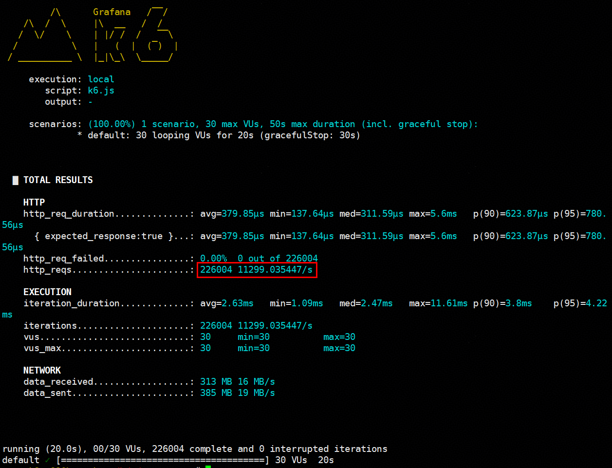

# Cloud Native Scenario KAE-enabled Envoy User Guide<a name="EN-US_TOPIC_0000002552168791"></a>

## Overview<a name="EN-US_TOPIC_0000002511547578"></a>

This document describes how to enable the Kunpeng Accelerator Engine (KAE) for Envoy on servers running the openEuler OS.

Envoy is a high-performance network proxy and communication bus designed for modern cloud native architectures. It is widely used as a data-plane component in service meshes, typically operating in sidecar mode alongside each microservice. Envoy transparently intercepts inbound and outbound traffic between services, enabling core capabilities such as traffic management, security policies, and observability. With support for dynamic configuration, it serves as key infrastructure for service mesh technologies like Istio.

In microservice scenarios, Envoy needs to process a large number of TLS requests, regardless of whether it functions as an ingress gateway or a microservice proxy. Especially in the TLS handshake phase, asymmetric encryption and decryption consume a large number of CPU resources. If microservices are deployed on a large scale, this overhead may become a system performance bottleneck.

To address this, the KAE private key provider of Envoy offloads time-consuming encryption and decryption operations from the CPU to KAE. This accelerates encryption and decryption while releasing CPU computing power for other service workloads.

## Environment Requirements<a name="EN-US_TOPIC_0000002511736266"></a>

This document provides guidance based on specific environments. Before performing operations, ensure that your software and hardware meet the requirements.

**Table 1** Hardware requirement<a id="hardware-requirement"></a>

|Item|Specifications|
|--|--|
|CPU|Kunpeng 920 series processor or Kunpeng 950 processor|


**Table 2** Verified OS and software versions<a id="verified-os-and-software-versions"></a>

|Software|Version|How to Obtain|
|--|--|--|
|OS|openEuler 24.03 LTS SP2|[Link](https://www.openeuler.org/en/download/#openEuler%2024.03%20LTS%20SP2)|
|Docker|20.10.13 or later, with the Docker Compose function supported|[Link](https://download.docker.com/linux/static/stable/aarch64/)|
|KAE|2.0|[Link](https://www.hikunpeng.com/document/detail/en/kunpengaccel/kae/usermanual/kunpengaccel_06_0012.html)|

## Compiling Envoy<a name="EN-US_TOPIC_0000002511738428"></a>

Use the Docker image to compile Envoy. The Envoy compilation depends on Docker Compose. Ensure that the Compose plugin has been installed before the compilation.

**Prerequisites<a name="section9577940124515"></a>**

- Compile Envoy as a common user. Otherwise, an error will be reported. Before the compilation, ensure that the user is a **non-root** user.
- Ensure a smooth network connection for pulling a large number of dependency packages during Envoy compilation.
- Ensure sufficient drive space as the intermediate files generated during Envoy compilation occupy a large amount of space (about 50 GB).
- You can run the following command to customize the proxy and build directory:

    ```
    ENVOY_DOCKER_BUILD_DIR=/path/to/build go_proxy=https://goproxy.cn,direct http_proxy=http://proxy.foo.com:8080 https_proxy=http://proxy.bar.com:8080 ./ci/run_envoy_docker.sh './ci/do_ci.sh release.server_only'
    ```

- For details about the compilation process, see the [official GitHub document](https://github.com/envoyproxy/envoy/tree/main/ci#building-and-running-tests-as-a-developer).

**Procedure<a name="section1721632217462"></a>**

1. Obtain the Envoy source code.

    ```
    git clone https://github.com/envoyproxy/envoy.git 
    ```

2. Compile Envoy to obtain the software binary.

    ```
    cd /path/to/envoy
    ./ci/run_envoy_docker.sh './ci/do_ci.sh release.server_only'
    ```

    After the compilation is complete, you can find the compiled package `release.tar.zst` in the `/<your-build-path>/envoy-docker-build/envoy/arm64/bin` directory (the default directory is `/tmp/envoy-docker-build/envoy/arm64/bin`, which can be configured through the `ENVOY_DOCKER_BUILD_DIR` environment variable).

    

3. Decompress the obtained Envoy package to obtain the Envoy binary file `envoy-contrib`.

    ```
    unzstd release.tar.zst && tar -xvf release.tar
    chmod +x envoy-contrib
    ```

    

## Enabling KAE for Envoy<a name="EN-US_TOPIC_0000002543218379"></a>

After configuring `private_key_provider` to `kae` in the Envoy startup configuration file, start Envoy. Then, KAE is enabled for Envoy.

**Prerequisites<a name="section18439938112415"></a>**

KAE has been installed. If KAE is not installed, install it as instructed in [Environment Requirements](#environment-requirements).

**Procedure<a name="section2828203192514"></a>**

1. Set `private_key_provider` to `kae` in the Envoy startup configuration file.

    The following is an example of the Envoy startup configuration file `envoy-kae.yaml`.

    ```
    static_resources:
      listeners:
      - name: listener_tls
        address:
          socket_address:
            address: 0.0.0.0
            port_value: 10000
        filter_chains:
        - transport_socket:
            name: envoy.transport_sockets.tls
            typed_config:
              "@type": type.googleapis.com/envoy.extensions.transport_sockets.tls.v3.DownstreamTlsContext
              common_tls_context:
                tls_certificates:
                - certificate_chain:
                    filename: "/etc/envoy/tls/tls.crt"
                  private_key_provider:
                    provider_name: kae
                    typed_config:
                      "@type": type.googleapis.com/envoy.extensions.private_key_providers.kae.v3alpha.KaePrivateKeyMethodConfig
                      poll_delay: "0.001s"
                        max_instances: 12
                      private_key:
                        filename: "/etc/envoy/tls/tls.key"
          filters:
          - name: envoy.filters.network.http_connection_manager
            typed_config:
              "@type": type.googleapis.com/envoy.extensions.filters.network.http_connection_manager.v3.HttpConnectionManager
              codec_type: auto
              stat_prefix: ingress_http
              route_config:
                name: local_route
                virtual_hosts:
                - name: backend
                  domains: ["*"]
                  routes:
                  - match: { prefix: "/" }
                    direct_response: { status: 200 }
              http_filters:
              - name: envoy.filters.http.router
                typed_config:
                  "@type": type.googleapis.com/envoy.extensions.filters.http.router.v3.Router
    
    admin:
      access_log_path: "/dev/null"
      address:
        socket_address:
          address: 0.0.0.0
          port_value: 9001
    ```

    > **NOTE:**
    >-   In the preceding configuration file, `poll_delay` indicates the sleep time of KAE polling threads. A smaller value of `poll_delay` indicates faster polling and better performance, but higher CPU usage. Set `poll_delay` based on the site requirements.
    >-   `max_instances` indicates the number of KAE polling threads to be created. The default value is `16`. The actual value is the minimum of the actual and configured numbers of KAE queues. The more the KAE polling threads, the better the performance. You can set its quantity based on the site requirements.
    >-   As HTTPS requests are involved, you need to configure certificates for Envoy. The certificates in the preceding configuration file are stored in the `/etc/envoy/tls/` directory. You can modify the certificate storage directory based on the site requirements.

2. Run the following command to start Envoy:

    ```
    ./envoy-contrib -c /path/to/envoy-kae.yaml
    ```

    After Envoy is started, the following information may be displayed, indicating that the KAE private key provider has been initialized and KAE has been successfully enabled for Envoy.

    

3. (Optional) Perform the [k6 benchmark](https://github.com/grafana/k6/releases) test to measure the performance improvement after KAE is enabled for Envoy.

    1. Start Envoy and run the test command on another terminal. [**Figure 1**](#performance-result-before-kae-is-enabled-for-envoy) shows the performance result.

        ```
        numactl -C 0-7 ./envoy-contrib -c /path/to/envoy-no-kae.yaml
        # Run the following command on another terminal.
        numactl -C 192-255 k6 run --vus 30 --duration 20s  k6.js
        ```

        **Figure 1** Performance result before KAE is enabled for Envoy<a name="fig10843125831516"></a><a id="performance-result-before-kae-is-enabled-for-envoy"></a>
        

    2. Run the following command after KAE is enabled for Envoy. [**Figure 2**](#performance-result-after-kae-is-enabled-for-envoy) shows the performance result.

        ```
        numactl -C 0-7 ./envoy-contrib -c /path/to/envoy-kae.yaml
        # Run the following command on another terminal.
        numactl -C 192-255 k6 run --vus 30 --duration 20s  k6.js
        ```

        **Figure 2** Performance result after KAE is enabled for Envoy<a name="fig189951242151717"></a><a id="performance-result-after-kae-is-enabled-for-envoy"></a>
        

    3. Compare the performance results before and after KAE is enabled for Envoy. The HTTP requests per second (RPS) increase significantly.

    The k6 configuration file `k6.js` is as follows:

    ```
    import http from "k6/http";
    
    export let options = {
     insecureSkipTLSVerify: true,
     noConnectionReuse: true,
     noVUConnectionReuse: true,
    };
    
    export default function() {
     http.get("https://<your envoy ip>:10000/");
    }
    ```

    The following is an example of the Envoy configuration file `envoy-no-kae.yaml` with KAE disabled:

    ```
    static_resources:
      listeners:
      - name: listener_tls
        address:
          socket_address:
            address: 0.0.0.0
            port_value: 10000
        filter_chains:
        - transport_socket:
            name: envoy.transport_sockets.tls
            typed_config:
              "@type": type.googleapis.com/envoy.extensions.transport_sockets.tls.v3.DownstreamTlsContext
              common_tls_context:
                tls_certificates:
                - certificate_chain:
                    filename: "/etc/envoy/tls/tls.crt"
                  private_key:
                    filename: "/etc/envoy/tls/tls.key"
          filters:
          - name: envoy.filters.network.http_connection_manager
            typed_config:
              "@type": type.googleapis.com/envoy.extensions.filters.network.http_connection_manager.v3.HttpConnectionManager
              codec_type: auto
              stat_prefix: ingress_http
              route_config:
                name: local_route
                virtual_hosts:
                - name: backend
                  domains: ["*"]
                  routes:
                  - match: { prefix: "/" }
                    direct_response: { status: 200 }
              http_filters:
              - name: envoy.filters.http.router
                typed_config:
                  "@type": type.googleapis.com/envoy.extensions.filters.http.router.v3.Router
    admin:
      access_log_path: "/dev/null"
      address:
        socket_address:
          address: 0.0.0.0
          port_value: 9001
    ```

## Change History<a name="EN-US_TOPIC_0000002513179182"></a>

|Date|Description|
|--|--|
|2026-03-30|The issue is the first official release.|
