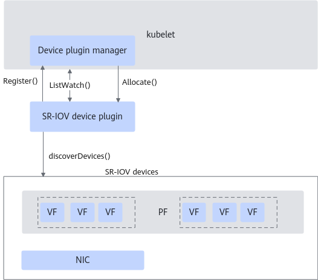
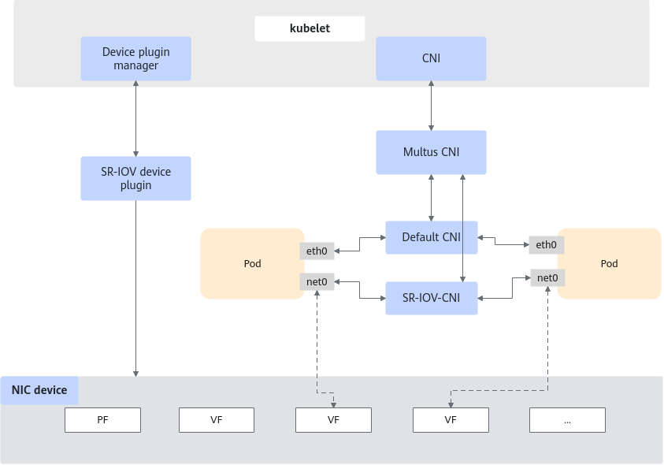
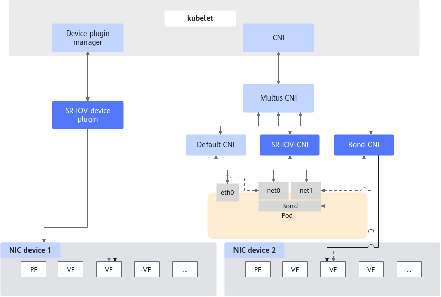
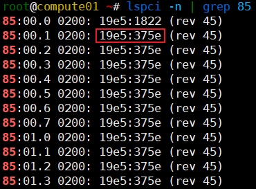

# Kubernetes SR-IOV Device Plugin User Guide

## Introduction<a name="EN-US_TOPIC_0000002549765655"></a>

### Overview<a name="EN-US_TOPIC_0000002518405810"></a>

This document describes how to deploy and use the Kubernetes single root I/O virtualization (SR-IOV) plugin on a server running openEuler to pass through devices on physical machines to containers. Currently, the SR-IOV device plugin, SR-IOV-CNI network plugin, and Bond-CNI plugin are supported.

Common network plugins such as Flannel and Calico often introduce high network latency, adversely affecting microservice IOPS performance. To mitigate this, the virtual function (VF) passthrough technology offers a solution. The SR-IOV-CNI network plugin minimizes latency by directly assigning VFs of physical NICs to containers.

Beyond enabling SR-IOV VF passthrough for containers, the Bond-CNI plugin supports NIC bonding for containers to improve service availability and fault tolerance when network configuration errors or functional anomalies occur.

### Software Architecture<a name="EN-US_TOPIC_0000002518405808"></a>

The SR-IOV device plugin runs on compute nodes in a Kubernetes cluster and is deployed in the Pods defined by DaemonSet.

- The software architecture of the SR-IOV device plugin shows in [**Figure 1**](#software-architecture-of-the-sr-iov-device-plugin) shows 
- The software architecture of the SR-IOV-CNI network plugin shows in [**Figure 2**](#software-architecture-of-the-sr-iov-cni-network-plugin).
- The software architecture of the Bond-CNI plugin shows in [**Figure 3**](#software-architecture-of-the-bond-cni-plugin).
- The functions of each module in the architecture shows in [**Table 1**](#module-functions).

**Figure 1** Software architecture of the SR-IOV device plugin<a name="fig3980193175810"></a><a id="software-architecture-of-the-sr-iov-device-plugin"></a><br>


**Figure 2** Software architecture of the SR-IOV-CNI network plugin<a name="fig182891652499"></a><a id="software-architecture-of-the-sr-iov-cni-network-plugin"></a><br>


**Figure 3** Software architecture of the Bond-CNI plugin<a name="fig86021356104"></a><a id="software-architecture-of-the-bond-cni-plugin"></a><br>


**Table 1** Module functions<a id="module-functions"></a>

|Module|Function|
|--|--|
|kubelet|The kubelet requests these network plugins to configure network interfaces before Pods are started.|
|Device plugin manager|A subcomponent of the kubelet, which manages the lifecycle and status of device plugins. It interacts with device plugins such as SR-IOV device plugin to ensure that devices are available on nodes and allocates devices to corresponding containers during Pod scheduling.|
|Multus CNI|A multi-network plugin management tool that allows a Pod to connect to multiple networks at the same time. It functions as the manager of CNI plugins and calls different network plugins (such as SR-IOV-CNI network plugin and Flannel) to configure network interfaces based on Pod configurations.|
|SR-IOV devices|Passes through a single SR-IOV device to multiple containers.|
|SR-IOV device plugin|Kubernetes SR-IOV device plugin, which is used to identify and manage SR-IOV devices. When an allocation request arrives, it is responsible for determining which device is allocated.|
|SR-IOV-CNI network plugin|Managed by Multus CNI and called by the kubelet, it configures SR-IOV network interfaces for Pods. It interacts with the physical NICs of a node and allocates VFs from the physical NICs to containers.|
|Bond-CNI plugin|Managed by Multus CNI and called by the kubelet, it builds bond network interfaces based on SR-IOV network interfaces of Pods.|

### Specifications<a name="EN-US_TOPIC_0000002549885659"></a>

The Kubernetes SR-IOV device plugin supports Kunpeng 920 series processors and can automatically identify and manage SR-IOV devices in a Kubernetes cluster.

### Constraints<a name="EN-US_TOPIC_0000002549885655"></a>

Before deploying the SR-IOV device plugin, make sure that the Kubernetes cluster and Docker/containerd versions meet the requirements described in this document. This is to ensure proper running and functioning of the plugin.

The SR-IOV device plugin requires that the Kubernetes cluster use Docker or containerd as the container runtime, and the Kubernetes and Docker/containerd versions must meet the requirements listed in [**Table 1**](#version-requirements).

**Table 1** Version requirements<a id="version-requirements"></a>

|Software|Version|How to Obtain|
|--|--|--|
|Kubernetes|1.28.4|[Link](https://github.com/kubernetes/kubernetes/archive/refs/tags/v1.28.4.tar.gz)|
|Kubernetes|1.23.6|[Link](https://github.com/kubernetes/kubernetes/archive/refs/tags/v1.23.6.tar.gz)|
|containerd|1.7.14|[Link](https://github.com/containerd/containerd/releases/download/v1.7.14/containerd-1.7.14-linux-arm64.tar.gz)|
|Docker|20.10.14|Install it using an image repository.|

## Plugin Compilation<a name="EN-US_TOPIC_0000002518245894"></a>

### Compilation Environment Requirements<a name="EN-US_TOPIC_0000002518245896"></a>

This document provides guidance based on the openEuler OS. Before performing operations, ensure that your hardware and software meet the requirements. Ensure that the server can connect to the Internet so that the dependencies can be downloaded. Compile the source code of the SR-IOV device plugin to generate an image, and deploy the image in the cluster.

**Hardware Requirements<a name="section195514534142"></a>**

**Table 1** Hardware environment requirement for compiling the SR-IOV device plugin image<a id="hardware-environment-requirement-for-compiling-the-sr-iov-device-plugin-image"></a>

|Item|Description|
|--|--|
|Processor|Kunpeng 920 series|

**OS and Software Requirements<a name="section377795111612"></a>**

> **NOTICE:**
>Before compiling an image, ensure that the Docker image repository has been configured for subsequent usage.

**Table 2** Verified OS and software versions<a id="verified-os-and-software-versions"></a>

|Software|Version|How to Obtain|
|--|--|--|
|OS|openEuler 22.03 LTS SP4|[Link](https://repo.openeuler.org/openEuler-22.03-LTS-SP4/ISO/aarch64/)|
|OS|openEuler 20.03 LTS SP3|[Link](https://repo.openeuler.org/openEuler-20.03-LTS-SP3/ISO/aarch64/)|
|OS|openEuler 24.03 LTS SP1|[Link](https://repo.openeuler.org/openEuler-24.03-LTS-SP1/ISO/aarch64/)|
|Bond-CNI plugin source code|-|[Link](https://github.com/k8snetworkplumbingwg/bond-cni)|
|Docker|20.10.14|Install it using a Yum repository.|
|Golang|1.21+|Install it by following the instructions on its [official website](https://golang.google.cn/dl/)|

### Obtaining the SR-IOV-CNI Network Plugin<a name="EN-US_TOPIC_0000002549885657"></a>

The deployment of the SR-IOV-CNI network plugin depends on Multus and the SR-IOV device plugin. Before the deployment, run the following commands to obtain the images of the SR-IOV device plugin, SR-IOV-CNI network plugin, and Multus CNI.

```shell
docker pull ghcr.io/k8snetworkplumbingwg/sriov-network-device-plugin:latest
docker pull ghcr.io/k8snetworkplumbingwg/sriov-cni:latest
docker pull ghcr.io/k8snetworkplumbingwg/multus-cni:snapshot
```

If you need to configure a global whereabouts, pull the whereabouts plugin image in advance.

```shell
docker pull ghcr.io/k8snetworkplumbingwg/whereabouts:latest
```

### Obtaining the Bond-CNI Plugin<a name="EN-US_TOPIC_0000002518245898"></a>

Compile the Bond-CNI plugin source code to obtain an executable file.

1. Obtain the [source code](https://github.com/k8snetworkplumbingwg/bond-cni.git).

    ```shell
    git clone https://github.com/k8snetworkplumbingwg/bond-cni.git
    ```

2. Go to the source code directory and compile the source code.

    ```shell
    ./build.sh
    ```

3. After the compilation is complete, copy the binary file `./bin/bond` to the `/opt/cni/bin` directory on the cluster compute node.

    ```shell
    cp ./bin/bond /opt/cni/bin/
    ```

## Plugin Deployment<a name="EN-US_TOPIC_0000002549765651"></a>

### Deployment Environment Requirements<a name="EN-US_TOPIC_0000002549765649"></a>

This document provides guidance based on the Kunpeng server and openEuler OS. Before performing operations, ensure that your hardware and software meet the requirements.

**Hardware Requirements<a name="section1279143142217"></a>**

The plugin must be deployed on the master node, and the container image must be imported to all nodes.

**Table 1** Hardware requirement<a id="hardware-requirement"></a>

|Item|Description|
|--|--|
|Processor|Kunpeng 920 series|

**OS and Software Requirements<a name="section94101941192313"></a>**

**Table 2** OS and software requirements<a id="os-and-software-requirements"></a>

|Item|Version|How to Obtain|
|--|--|--|
|OS|openEuler 22.03 LTS SP4|[Link](https://repo.openeuler.org/openEuler-22.03-LTS-SP4/ISO/aarch64/)|
|OS|openEuler 20.03 LTS SP3|[Link](https://repo.openeuler.org/openEuler-20.03-LTS-SP3/ISO/aarch64/)|
|OS|openEuler 24.03 LTS SP1|[Link](https://repo.openeuler.org/openEuler-24.03-LTS-SP1/ISO/aarch64/)|
|Kubernetes|1.28.4|[Link](https://github.com/kubernetes/kubernetes/archive/refs/tags/v1.28.4.tar.gz)<br>See [Kubernetes Deployment Guide (CentOS & openEuler)](https://www.hikunpeng.com/document/detail/en/kunpengcpfs/ecosystemEnable/Kubernetes/kunpengk8s_04_0001.html).|
|Kubernetes|1.23.6|[Link](https://github.com/kubernetes/kubernetes/archive/refs/tags/v1.23.6.tar.gz)<br>See [Kubernetes Deployment Guide (CentOS & openEuler)](https://www.hikunpeng.com/document/detail/en/kunpengcpfs/ecosystemEnable/Kubernetes/kunpengk8s_04_0001.html).|
|containerd|1.7.14|[Link](https://github.com/containerd/containerd/releases/download/v1.7.14/containerd-1.7.14-linux-arm64.tar.gz)<br>See [Containerd Deployment Guide (CentOS 8.1 and openEuler 20.03)](https://www.hikunpeng.com/document/detail/en/kunpengcpfs/ecosystemEnable/Containerd/kunpengcontainerd_03_0003.html).|
|Docker|20.10.14|Install it using an image repository.|
|SR-IOV device plugin|v3.9.0|[Link](https://github.com/k8snetworkplumbingwg/sriov-network-device-plugin.git)|
|Multus CNI|v4.2.0|[Link](https://github.com/k8snetworkplumbingwg/multus-cni.git)|
|SR-IOV-CNI network plugin|v2.9.0|[Link](https://github.com/k8snetworkplumbingwg/sriov-cni.git)|
|Bond-CNI plugin|master|[Link](https://github.com/k8snetworkplumbingwg/bond-cni.git)|
|whereabouts|v0.9.0|[Link](https://github.com/k8snetworkplumbingwg/whereabouts)|

### Deploying the SR-IOV-CNI Network Plugin<a name="EN-US_TOPIC_0000002549765647"></a>

Before the deployment, ensure that the NIC VF function has been enabled on the host and sufficient VFs have been created. The deployment of the SR-IOV-CNI network plugin depends on Multus and the SR-IOV device plugin. Ensure both components are deployed and configured beforehand.

**Deploying Multus<a name="section19491204763810"></a>**

Multus is the manager of Kubernetes network plugins. It calls different network plugins (such as the SR-IOV-CNI network plugin and Flannel) to configure network interfaces based on Pod configurations. It includes two types of plugins: Thin plugin (used in this section) and Thick plugin. For details, see the [multus-daemonset.yml](https://raw.githubusercontent.com/k8snetworkplumbingwg/multus-cni/master/deployments/multus-daemonset.yml) configuration file.

1. Deploy Multus on the master node of the cluster.

    ```shell
    kubectl apply -f multus-daemonset.yml
    ```

2. Check the deployment status.

    ```shell
    kubectl -n kube-system get pod
    ```

    `multus-ds` must be in the `Running` state, as shown below.

    ```txt
    NAME                             READY   STATUS    RESTARTS      AGE
    kube-multus-ds-ds26q             1/1     Running   0             20d
    kube-multus-ds-pp6mh             1/1     Running   0             20d
    ```

**Deploying the SR-IOV Device Plugin<a name="section103321214448"></a>**

Before deploying the SR-IOV device plugin, you need to modify its configuration file.

`configMap.yaml` describes the devices to be managed by the SR-IOV plugin, that is, the devices that are expected to be passed through.

```yaml
apiVersion: v1
kind: ConfigMap
metadata:
  name: sriovdp-config
  namespace: kube-system
data:
  config.json: |
    {
        "resourceList": [
            {
               "resourceName": "huawei_1822_netdevice",
               "resourcePrefix": "huawei.com",
               "selectors": {
                    "vendors": ["19e5"],
                    "devices": ["375e"],
                    "drivers": ["hinic"],
                    "pfNames" : [ensp133s0]
                },
            },
            {
               "resourceName": "huawei_1823_netdevice",
               "resourcePrefix": "huawei.com",
               "selectors": {
                    "vendors": ["19e5"],
                    "devices": ["375f"],
                    "drivers": ["hisdk3"]
                }
            },
...
```

**Table 1** Parameters in the `configMap.yaml` file<a id="parameters-in-the-configmap-yaml-file"></a>

|Parameter|Description|Constraints|
|--|--|--|
|resourceName|Resource name, which can be customized.|The value must be unique and cannot contain special characters.|
|resourcePrefix|Prefix of the resource name, which can be customized.|The value cannot contain special characters. It can be `<xx>.com`, for example, `huawei.com`.|
|deviceType|Device type.|The value can be `accelerator`, `netDevice` (default), or `auxNetDevice`.|
|selectors|Resource selector.|Only the devices that meet the filter criteria specified by `selectors` can be managed.|
|vendors|Vendor ID of a device. For example, the vendor ID of Huawei is `19e5`. For details about how to query the vendor ID, see [2](#li12442201520150).|-|
|devices|Device ID. For details, see [2](#li12442201520150).|-|
|drivers|Name of the driver used by the device. For details, see [3](#li14503133373).|-|
|pfNames|PF name on the NIC.|If there are network ports, add all of them to prevent VFs from different network ports from being used together.|

1. Check the PCI address of the NIC VF to be used on the node.

    ```shell
    lspci | grep Ethernet
    ```

    

    > **NOTE:**
    >In actual use, there may be more than one NIC VF. You can select the PCI address of one VF because `vendors`, `devices`, and `drivers` of all VFs are the same.

2. <a id="li12442201520150"></a>Based on the command output in the previous step, check whether the PCI address of the VF device to be used is `85:00.1`. Then, check `vendors` and `devices` of the device.

    The value of `vendors` is `19e5`, and the value of `devices` is `375e`.

    ```shell
    lspci -n | grep 85
    ```

    

3. <a id="li14503133373"></a>Check `drivers` corresponding to the device.

    In the command output, find the driver name corresponding to the device whose PCI address is `85:00.1`.

    ```shell
    lspci -k
    ```

    

4. After obtaining the information about `vendors`, `devices`, and `drivers`, fill the information in the `configMap.yaml` file. Each SR-IOV device corresponds to an item in `resourceList`.
5. Deploy the SR-IOV device plugin in DaemonSet mode in the cluster based on the `sriovdp-daemonset.yaml` file.

    ```shell
    git clone https://gitee.com/kunpeng_compute/sriov-network-device-plugin.git
    cd sriov-network-device-plugin
    kubectl apply -f deployments/configMap.yaml
    kubectl apply -f deployments/sriovdp-daemonset.yaml
    ```

6. Check the deployment status.

    ```shell
    kubectl -n kube-system get pod
    ```

    If the deployment is successful, the following information is displayed. The number of `kube-sriov-device-plugins` must be the same as the number of nodes in the cluster.

    ```txt
    NAME                             READY   STATUS              RESTARTS          AGE
    kube-sriov-device-plugin-wkmrd   1/1     Running             0                 14d
    kube-sriov-device-plugin-xvcs3   1/1     Running             0                 14d
    kube-sriov-device-plugin-fgsa2   1/1     Running             0                 14d
    ```

**Deploying the SR-IOV-CNI Network Plugin<a name="section27804182459"></a>**

1. Create a deployment file `sriov-cni-daemonset.yaml` as follows and deploy the plugin in DaemonSet mode in the cluster based on the file.

    ```yaml
    ---
    apiVersion: apps/v1
    kind: DaemonSet
    metadata:
      name: kube-sriov-cni-ds
      namespace: kube-system
      labels:
        tier: node
        app: sriov-cni
    spec:
      selector:
        matchLabels:
          name: sriov-cni
      template:
        metadata:
          labels:
            name: sriov-cni
            tier: node
            app: sriov-cni
        spec:
          tolerations:
          - key: node-role.kubernetes.io/master
            operator: Exists
            effect: NoSchedule
          - key: node-role.kubernetes.io/control-plane
            operator: Exists
            effect: NoSchedule
          containers:
          - name: kube-sriov-cni
            image: ghcr.io/k8snetworkplumbingwg/sriov-cni:latest
            imagePullPolicy: IfNotPresent
            securityContext:
              allowPrivilegeEscalation: true
              privileged: true
              readOnlyRootFilesystem: true
              capabilities:
                drop:
                  - ALL
            resources:
              requests:
                cpu: "100m"
                memory: "50Mi"
              limits:
                cpu: "100m"
                memory: "50Mi"
            volumeMounts:
            - name: cnibin
              mountPath: /host/opt/cni/bin
          volumes:
            - name: cnibin
              hostPath:
                path: /opt/cni/bin
    ```

    Run the following command to deploy the plugin:

    ```shell
    kubectl apply -f deployments/sriov-cni-daemonset.yaml
    ```

2. Create an SR-IOV passthrough network in Multus and create the `sriov-crd.yaml` configuration file to specify SR-IOV network information.

    ```yaml
    apiVersion: "k8s.cni.cncf.io/v1"
    kind: NetworkAttachmentDefinition
    metadata:
      name: sriov-net1
      annotations:
        k8s.v1.cni.cncf.io/resourceName: huawei.com/huawei_1822_netdevice # Modify the value according to the resourceName in the configMap.yaml file.
    spec:
      config: '{
      "type": "sriov",
      "cniVersion": "0.3.1",
      "name": "sriov-network",
      "ipam": {
        "type": "host-local",
        "subnet": "10.56.217.0/24",
        "routes": [{
          "dst": "0.0.0.0/0"
        }],
        "gateway": "10.56.217.1"
      }
    }'
    ```

    Run the following command to deploy the plugin:

    ```shell
    kubectl apply -f deployments/sriov-crd.yaml
    ```

3. After the deployment, check whether all network plugins are running properly.

    ```shell
    kubectl get pods -owide -n kube-system
    ```

    As shown below, all deployed containers are in the `Running` state. Otherwise, check the error information.

    ```txt
    kube-multus-ds-qhqp4             1/1     Running   0             22h    10.175.119.147   compute01   <none>           <none>
    kube-sriov-cni-ds-4kks2          1/1     Running   0             168m   10.244.1.20      compute01   <none>           <none>
    kube-sriov-device-plugin-bnvg9   1/1     Running   0             20h    10.175.119.147   compute01   <none>           <none>
    ```

    Check whether the network configuration is successful by running the following command to view the custom resources in the cluster.

    ```shell
    kubectl get crds
    ```

    The command output must contain `network-attachment-definitions.k8s.cni.cncf.io`, as shown below:

    ```txt
    network-attachment-definitions.k8s.cni.cncf.io    2025-03-05T08:21:27Z
    ```

**(Optional) Deploying the whereabouts Plugin<a name="section1951622914121"></a>**

In the SR-IOV-CNI network plugin example, IP address management is handled using the host-local CNI plugin. However, since the host-local plugin only supports IP address allocation on a single node, it may lead to conflicts across multiple nodes. To enable dynamic IP address assignment cluster-wide, the whereabouts plugin can be configured.

1. Download the whereabouts plugin as instructed in [Deployment Environment Requirements](#deployment-environment-requirements) and go to the directory.

    ```shell
    git clone https://github.com/k8snetworkplumbingwg/whereabouts && cd whereabouts
    ```

2. Deploy the plugin.

    ```shell
    kubectl apply -f doc/crds/daemonset-install.yaml \
          -f doc/crds/whereabouts.cni.cncf.io_ippools.yaml \
          -f doc/crds/whereabouts.cni.cncf.io_overlappingrangeipreservations.yaml
    ```

3. Remove the `sriov-crd.yaml` file that has been deployed, set `ipam.type` to `whereabouts`, change `subnet` to `range`, and modify other parameters as required. After the file is modified, deploy the file again. The following is an example:

    ```yaml
    apiVersion: "k8s.cni.cncf.io/v1"
    kind: NetworkAttachmentDefinition
    metadata:
      name: sriov-net1
      annotations:
        k8s.v1.cni.cncf.io/resourceName: huawei.com/huawei_1822_netdevice # Modify the value according to the resourceName in the configMap.yaml file.
    spec:
      config: '{
      "type": "sriov",
      "cniVersion": "0.3.1",
      "name": "sriov-network",
      "ipam": {
        "type": "whereabouts",
        "range": "10.56.217.0/24",
        "exclude": [],
        "routes": [{
           "dst": "0.0.0.0/0"
        }],
        "range_start": "172.21.217.2",
        "range_end": "172.21.217.255",
        "gateway": "10.56.217.1"
      }
    }'
    ```

### Deploying the Bond-CNI Plugin<a name="EN-US_TOPIC_0000002549765657"></a>

The Bond-CNI plugin needs to be integrated with other multi-NIC and passthrough plugins to bond virtual NICs in Pods. Unlike the SR-IOV-CNI network plugin, PF is used in the configMap of the SR-IOV device to distinguish network devices. Below is the configuration for bond4 mode.

1. Configure VF passthrough for the two NICs on the physical machine.

    Configure VF passthrough for a NIC in the `sriov-crd-01.yaml` file.

    ```yaml
    apiVersion: "k8s.cni.cncf.io/v1"
    kind: NetworkAttachmentDefinition
    metadata:
      name: sriov-net1
      annotations:
        k8s.v1.cni.cncf.io/resourceName: huawei.com/huawei_1822_netdevice_01
    spec:
      config: '{
      "type": "sriov",
      "cniVersion": "0.3.1",
      "name": "sriov-network",
      "spoofchk":"off"
    }'
    ```

    Configure VF passthrough for the other NIC in the `sriov-crd-02.yaml` file.

    ```yaml
    apiVersion: "k8s.cni.cncf.io/v1"
    kind: NetworkAttachmentDefinition
    metadata:
      name: sriov-net2
      annotations:
        k8s.v1.cni.cncf.io/resourceName: huawei.com/huawei_1822_netdevice_02
    spec:
      config: '{
      "type": "sriov",
      "cniVersion": "0.3.1",
      "name": "sriov-network",
      "spoofchk":"off"
    }'
    ```

    Deploy the two files in the cluster.

    ```shell
    kubectl apply -f sriov-crd-01.yaml
    kubectl apply -f sriov-crd-02.yaml
    ```

2. Configure the bond network interface and create the `sriov-crd-bond.yaml` file for configuration.

    `mode` specifies the bonding mode in the configuration file. The common modes are as follows:

    - `balance-rr` (mode=0)
    - `active-backup` (mode=1)
    - `balance-xor` (mode=2)
    - `broadcast` (mode=3)
    - `802.3ad` (mode=4)
    - `balance-tlb` (mode=5)
    - `balance-alb` (mode=6)

    **Only modes 0, 1, and 2 are recommended. Mode 4 is not recommended because its protocol constraints hinder concurrent usage by multiple containers on a single cluster node.** Below is a deployment example:

    ```yaml
    apiVersion: "k8s.cni.cncf.io/v1"
    kind: NetworkAttachmentDefinition
    metadata:
      name: bond-net1
    spec:
      config: '{
      "type": "bond",
      "cniVersion": "0.3.1",
      "name": "bond-net1",
      "mode": "balance-xor",
      "failOverMac": 1,
      "linksInContainer": true,
      "miimon": "100",
      "mtu": 1500,
      "links": [
         {"name": "net1"},
         {"name": "net2"}
      ],
      "ipam": {
        "type": "host-local",
        "subnet": "10.56.217.0/24",
        "routes": [{
          "dst": "0.0.0.0/0"
        }],
        "gateway": "10.56.217.1"
      }
    }'
    ```

    Deploy the file in the cluster.

    ```shell
    kubectl apply -f sriov-crd-bond.yaml
    ```

    Note:

    1. The `failOverMac` attribute of the `active-backup` mode is mandatory and must be set to `1`.
    2. `linksInContainer=true` instructs Bond-CNI to find the required interface in a container. By default, the value `true` is used in a container.
    3. `links` defines the interfaces that will be used for bonding. By default, Multus names the additional interface "net" with a consecutive number.
    4. For the `balance-rr` or `balance-xor` mode, you must set `trust` to `on` for SR-IOV VFs.

        Method 1: Add `"trust": "on"` to the `sriov-crd-01.yaml` and `sriov-crd-02.yaml` configuration files.

        ```yaml
        apiVersion: "k8s.cni.cncf.io/v1"
        kind: NetworkAttachmentDefinition
        metadata:
          name: sriov-net2
          annotations:
            k8s.v1.cni.cncf.io/resourceName: huawei.com/huawei_1822_netdevice_02
        spec:
          config: '{
          "type": "sriov",
          "cniVersion": "0.3.1",
          "name": "sriov-network",
          "spoofchk":"off",
          "trust": "on"
        }'
        ```

        Method 2: Use `ip link` to directly enable trust.

        ```shell
        ip link set dev *<PF interface name>* vf *<VF ID>* 0 trust on
        ```

        After the setting, you can check whether `trust on` is displayed using `ip link show <PF interface name>`, as shown below:

        ```txt
        7: enp65s0f1np1: <BROADCAST,MULTICAST,UP,LOWER_UP> mtu 1500 qdisc mq state UP mode DEFAULT group default qlen 1000
            link/ether 20:fa:db:e2:84:ed brd ff:ff:ff:ff:ff:ff
            vf 0     link/ether 00:00:00:00:00:00 brd ff:ff:ff:ff:ff:ff, spoof checking off, link-state auto, trust on, query_rss off
            vf 1     link/ether 00:00:00:00:00:00 brd ff:ff:ff:ff:ff:ff, spoof checking off, link-state auto, trust off, query_rss off
            vf 2     link/ether 00:00:00:00:00:00 brd ff:ff:ff:ff:ff:ff, spoof checking off, link-state auto, trust off, query_rss off
            vf 3     link/ether 00:00:00:00:00:00 brd ff:ff:ff:ff:ff:ff, spoof checking off, link-state auto, trust off, query_rss off
            vf 4     link/ether 00:00:00:00:00:00 brd ff:ff:ff:ff:ff:ff, spoof checking off, link-state auto, trust off, query_rss off
        ```

## Plugin Usage<a name="EN-US_TOPIC_0000002549765653"></a>

### SR-IOV NIC Passthrough<a name="EN-US_TOPIC_0000002518245900"></a>

When using this feature, add the following fields to the YAML file of the service application Pod.

1. In `annotations` of the Pod, specify the network `k8s.v1.cni.cncf.io/networks: sriov-net1`. `sriov-net1` is configured by the `name` field in the `sriov-crd.yaml` file.

    ```yaml
    apiVersion: v1
    kind: Pod
    metadata:
      name: testpod2
      annotations:
        k8s.v1.cni.cncf.io/networks: sriov-net1
    ```

2. Add the `huawei.com/huawei_1822_netdevice: "1"` field to `resources` of the Pod. This field, specified by the `configMap.yaml` configuration file of the SR-IOV device plugin, follows the format of `resourcePrefix/resourceName: "1"`.

    ```yaml
    resources:
        requests:
           huawei.com/huawei_1822_netdevice: "1"
           cpu: 1
        limits:
           huawei.com/huawei_1822_netdevice: "1"
           cpu: 2
    ```

3. Deploy a container, access the container, and check whether the network interface is successfully generated.

    ```shell
    docker exec -it 8ba9054e6de1 /bin/sh
    ```

    If it is created, you can see the net1 network interface in the output after executing the following command.

    ```shell
    ip a
    ```

    As shown in the following information, the net1 network interface is displayed, and the IP address belongs to the SR-IOV network. In this case, the network interface is created successfully.

    ```txt
    1: lo: <LOOPBACK,UP,LOWER_UP> mtu 65536 qdisc noqueue qlen 1000
        link/loopback 00:00:00:00:00:00 brd 00:00:00:00:00:00
        inet 127.0.0.1/8 scope host lo
           valid_lft forever preferred_lft forever
    3: eth0@if662: <BROADCAST,MULTICAST,UP,LOWER_UP,M-DOWN> mtu 1450 qdisc noqueue 
        link/ether fa:f9:09:1f:dd:12 brd ff:ff:ff:ff:ff:ff
        inet 10.244.1.22/24 brd 10.244.1.255 scope global eth0
           valid_lft forever preferred_lft forever
    602: net1: <BROADCAST,MULTICAST,UP,LOWER_UP> mtu 1500 qdisc mq qlen 1000
        link/ether e6:5d:99:42:04:d6 brd ff:ff:ff:ff:ff:ff
        inet 10.56.217.2/24 brd 10.56.217.255 scope global net1
           valid_lft forever preferred_lft forever
    ```

### SR-IOV NIC Passthrough Bonding<a name="EN-US_TOPIC_0000002518405814"></a>

When using the Bond-CNI plugin, add the following fields to the YAML file of the service application Pod. Use `k8s.v1.cni.cncf.io/networks:` in `annotations` to specify the network to be used, and specify the resource `huawei.com/huawei_bond_device: '1'` in the container declaration.

```yaml
apiVersion: v1
kind: Pod
metadata:
  name: bond-test
  annotations:
    k8s.v1.cni.cncf.io/networks: bond-net1
spec:
  containers:
  - name: nginx-1 
    image: nginx:latest
    imagePullPolicy: IfNotPresent
    command: [ "/bin/sh", "-c", "--" ]
    args: [ "while true; do sleep 300000; done;" ]
    resources:
      requests:
        cpu: "1"
        memory: "16Gi"
        huawei.com/huawei_bond_device: "1"
      limits:
        cpu: "1"
        memory: "16Gi"
        huawei.com/huawei_bond_device: "1"
```

## (Optional) Plugin Uninstallation<a name="EN-US_TOPIC_0000002518405806"></a>

### Uninstalling the SR-IOV Device Plugin<a name="EN-US_TOPIC_0000002549885651"></a>

You can uninstall the SR-IOV device plugin if it is no longer required.

> **NOTE:**
>This section is for reference only if you need to uninstall the SR-IOV device plugin. It is not mandatory for deploying the SR-IOV device plugin.

1. On the master node, run the following commands to go to the source code directory of the SR-IOV device plugin and uninstall it.

    ```shell
    cd /path/to/sriov-network-device-plugin
    kubectl delete -f deployments/configMap.yaml
    kubectl delete -f deployments/sriovdp-daemonset.yaml
    ```

2. After the uninstallation, query the existing Pods in the current cluster.

    ```shell
    kubectl -n kube-system get pod
    ```

    If the Pod named `kube-sriov-device-plugin` has been deleted, the uninstallation is successful. The possible command output is as follows:

    ```txt
    NAME                              READY   STATUS    RESTARTS   AGE
    ```

### Uninstalling the SR-IOV-CNI Network Plugin<a name="EN-US_TOPIC_0000002518245892"></a>

You can uninstall the SR-IOV-CNI network plugin if it is no longer required.

> **NOTE:**
>This section is for reference only if you need to uninstall the SR-IOV-CNI network plugin. It is not mandatory for deploying the SR-IOV-CNI network plugin.

1. Delete YAML files in the reverse sequence of their deployments.

    ```shell
    kubectl delete -f sriov-cni-daemonset.yaml
    kubectl delete -f sriov-crd.yaml
    kubectl delete -f configMap.yaml
    kubectl delete -f sriovdp-daemonset.yaml
    kubectl delete -f multus-daemonset.yml
    ```

2. Check whether the files are successfully deleted.

    ```shell
     kubectl get pods -owide -n kube-system
    ```

    If no Pod such as multus, sriov-cni, and sriov-device exists, the deletion is successful.

### Uninstalling the Bond-CNI Plugin<a name="EN-US_TOPIC_0000002549885653"></a>

You can uninstall the Bond-CNI plugin if it is no longer required.

> **NOTE:**
>This section is for reference only if you need to uninstall the Bond-CNI plugin. It is not mandatory for deploying the Bond-CNI plugin.

1. Delete YAML files in the reverse sequence of their deployments.

    ```shell
    kubectl delete -f sriov-crd-bond.yaml
    kubectl delete -f sriov-crd-01.yaml
    kubectl delete -f sriov-crd-02.yaml
    kubectl delete -f configMap.yaml
    kubectl delete -f sriovdp-daemonset.yaml
    kubectl delete -f multus-daemonset.yml
    rm /opt/cni/bin/bond
    ```

2. Check whether the files are successfully deleted.

    ```shell
     kubectl get pods -owide -n kube-system
    ```

    If no Pod such as multus, sriov-cni, and sriov-device exists, the deletion is successful.
