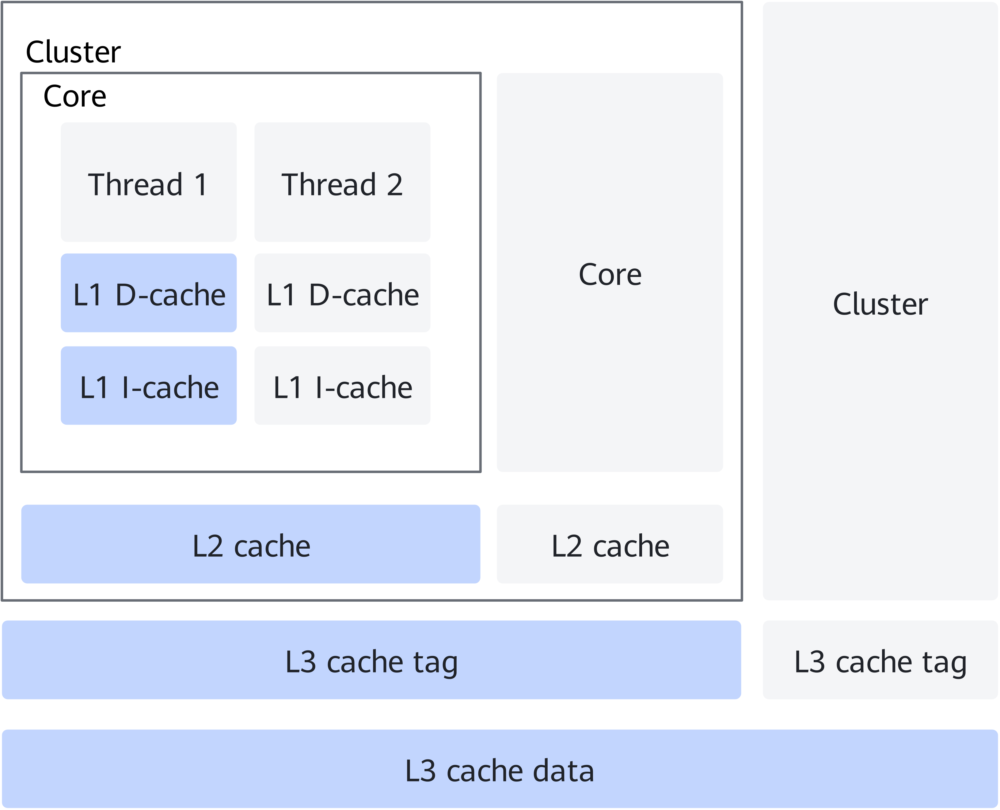
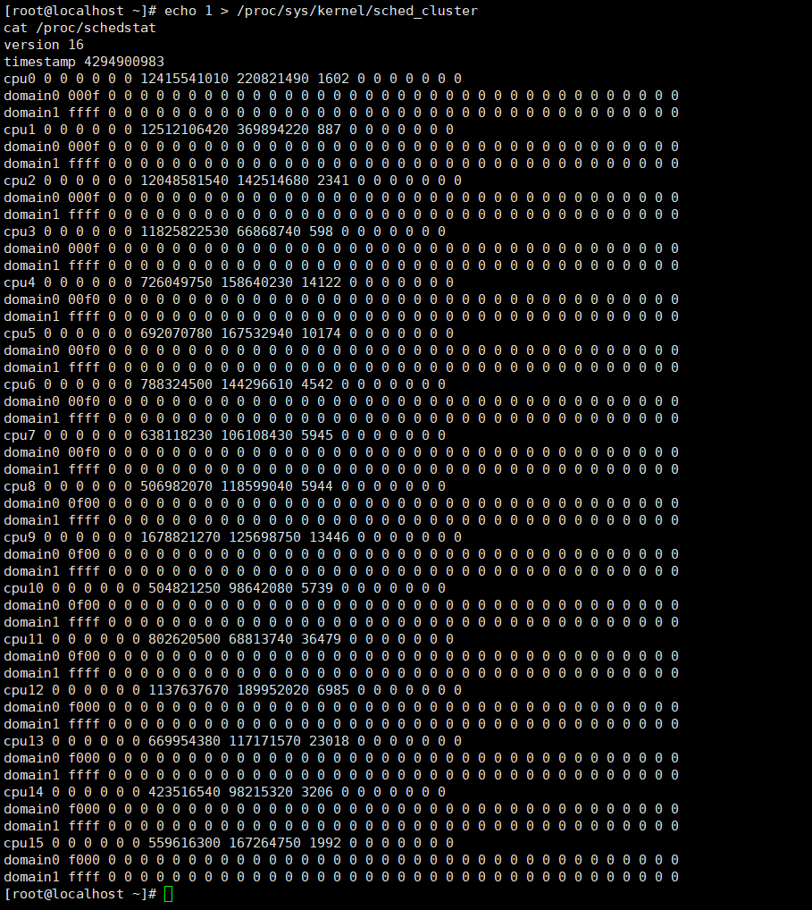

# Cluster Awareness Feature Guide

## Feature Description<a name="EN-US_TOPIC_0000002105902629"></a>

### Introduction<a name="EN-US_TOPIC_0000002105902621"></a>

This document describes how to deploy and enable the cluster awareness feature on a Kunpeng server running the openEuler OS.

As shown in [**Figure 1**](#cluster-and-l3-cache-structure), a cluster is a hardware unit of a CPU, and each cluster contains several cores. Cores in the same cluster share the same L3 cache tag. The time for a core to access the shared L3 cache tag of the corresponding cluster is shorter than that for accessing other L3 caches or memories. Therefore, when a thread is scheduled to a core in a same cluster (instead of another cluster, that is, cross-cluster scheduling), an L3 cache tag corresponding to the cluster can be reused, which reduces the time required for data access. By adding the option for cluster task scheduling tuning of the OS kernel, cross-cluster thread scheduling can be prevented and L3 cache tag resources can be reused, improving the CPU scheduling efficiency and memory bandwidth utilization of multi-thread applications.

**Figure 1** Cluster and L3 cache structure<a name="fig356644616414"></a><a id="cluster-and-l3-cache-structure"></a>


It also leverages hardware resources more efficiently, increases the system throughput, and speeds up responses to requests. In various application scenarios or test scenarios, especially in multi-core and multi-thread application scenarios, enabling cluster scheduling tuning improves the performance by 2% to 20%.

Through the VM vCPU topology configuration, the topology of the physical CPU cluster can be mapped to the VM to help the VM to achieve the same tuning effect as that of the physical CPU.


### Availability<a name="EN-US_TOPIC_0000002070182902"></a>

Before configuring the cluster awareness feature, learn about its version and license support information.

- Version: openEuler 22.03 LTS SP2 or later
- License: none


### Constraints<a name="EN-US_TOPIC_0000002105902633"></a>

openEuler 22.03 LTS SP2 or later is required. The topology information of the physical CPU cluster must be correctly mapped to the VM.


### Application Scenarios<a name="EN-US_TOPIC_0000002070342698"></a>

Apply to the 1:1 core binding scenario. The optimal cluster topology is displayed based on the topology of vCPUs bound to the physical CPUs.


## Feature Usage<a name="EN-US_TOPIC_0000002070182918"></a>

### Environment Requirements<a name="EN-US_TOPIC_0000002152530982"></a>

This document provides guidance based on the openEuler OS. Before performing operations, ensure that your hardware and software meet the requirements.

**Hardware Requirements<a name="section26241127"></a>**

[**Table 1**](#hardware-requirement) lists the hardware requirement.

**Table 1** Hardware requirement<a id="hardware-requirement"></a>

|Item|Description|
|--|--|
|Processor|Kunpeng 920 series|


**OS and Software Requirements<a name="section153345522323"></a>**

[**Table 2**](#os-and-software-requirements) lists the OS and software requirements.

**Table 2** OS and software requirements<a id="os-and-software-requirements"></a>

|Item|Version|How to Obtain|
|--|--|--|
|OS|openEuler 22.03 LTS SP2 or later|[Link](https://mirrors.huaweicloud.com/openeuler/openEuler-22.03-LTS-SP4/ISO/aarch64/openEuler-22.03-LTS-SP4-everything-aarch64-dvd.iso)|


### Enablement and Verification<a name="EN-US_TOPIC_0000002105902617"></a>

Configure the VM XML file to map the CPU cluster topology information of the physical host to the VM, and enable the cluster-aware scheduler on the VM to enable this feature. Observe the scheduling group status of each vCPU before and after the feature is enabled to check whether the feature is successfully enabled.

1. Configure the CPU topology in the VM XML file.

    For example, if the vCPUs on the VM with the specification of 16 vCPUs and 32 GB memory are bound to four clusters (16 cores) in 1:1 mode, the optimal configuration is as follows:

    ```
    <topology sockets='1' dies='1' clusters='4' cores='4' threads='1'/>
    ```

2. Run the following commands in the guest OS to ensure that the cluster-aware scheduler is disabled and observe the scheduling group of each vCPU:

    ```
    echo 0 > /proc/sys/kernel/sched_cluster
    cat /proc/schedstat
    ```

    After the preceding command is executed, the CPU scheduling group information is displayed, as shown in the following figure.

    

3. In the guest OS, enable the cluster-aware scheduler and observe the scheduling group of each vCPU.

    ```
    echo 1 > /proc/sys/kernel/sched_cluster
    cat /proc/schedstat
    ```

    After the preceding command is executed, the CPU scheduling group information is displayed, as shown in the following figure.

    

    Compared with step 2, a scheduling group (`domain`) is added to each vCPU after the feature is enabled.
