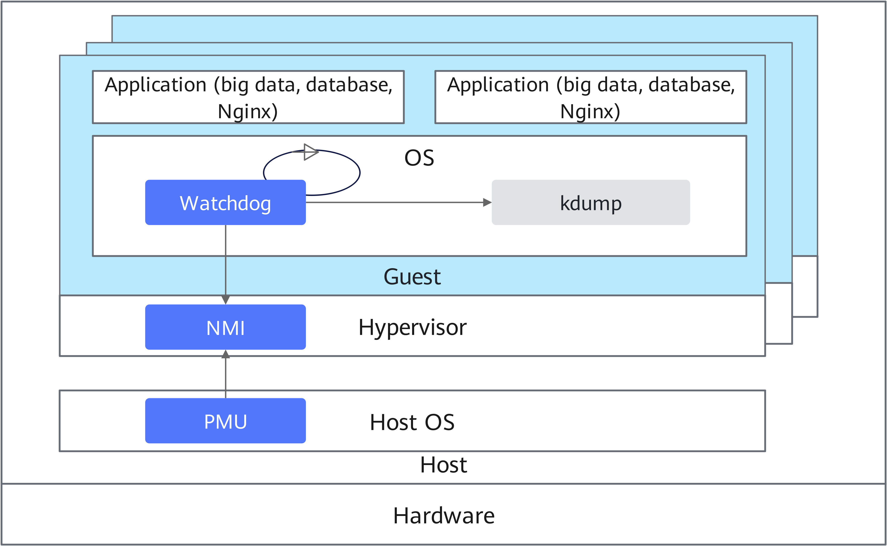

# VM Lockup Detection Feature Guide

## Feature Description<a name="EN-US_TOPIC_0000002070338474"></a>

### Introduction<a name="EN-US_TOPIC_0000002105898409"></a>

This document details the deployment and activation of the VM lockup detection feature on Kunpeng servers using the openEuler OS.

A robust lockup detection mechanism is critical in virtualized environments to prevent VMs from stalling in infinite loops while maintaining system manageability. By leveraging non-maskable interrupts (NMIs), this mechanism monitors interrupt responses in real time to detect lockups within VMs, ensuring recovery from unresponsive states caused by lockups.

Linux systems traditionally rely on watchdog mechanisms for lockup detection, which use timer interrupts to identify system hangs. However, timer interrupts may be blocked during certain execution phases (such as interrupt handling or atomic contexts) limiting effectiveness of the watchdog. The NMI watchdog overcomes this limitation by utilizing NMIs, which remain functional even in atomic contexts, providing more reliable detection of system hangs.

**Figure 1** Architecture of the VM lockup detection feature<a name="fig762914904419"></a><a id="architecture-of-the-vm-lockup-detection-feature"></a><br>


**Principles<a name="section18127132914911"></a>**

The NMI watchdog serves as a dedicated mechanism for identifying hard lockups in Linux systems. It monitors kernel responsiveness by triggering NMIs and verifying their processing.

openEuler offers two NMI watchdog implementations for AArch64 platforms:

- **SDEI watchdog (default)**

    Utilizing the Software Delegated Exception Interface (SDEI) of AArch64, this solution registers callbacks in non-secure environments to handle system events. The SDEI watchdog operates as an NMI watchdog variant within openEuler.

- **PMC (PMU) watchdog**

    This alternative employs Pseudo-NMI technology, configuring Performance Monitoring Interrupts (PMIs) to simulate NMI behavior. By disabling the SDEI watchdog, it ensures high-priority NMIs in VMs. Known as Performance Monitoring Unit (PMU) watchdog, it logs errors and initiates system resets when hard lockups occur.

> **NOTICE:**
>For AArch64 systems:
>-   openEuler defaults to the SDEI watchdog, but if this mechanism cannot initialize in virtualized environments, the system does not automatically fall back to the NMI watchdog based on Performance Monitoring Counter (PMC) or PMU. You need to manually disable the SDEI watchdog through kernel parameters.
>-   To enable the PMC/PMU watchdog, explicitly disable the SDEI watchdog by including `disable_sdei_nmi_watchdog` in the boot parameters. Full parameter details are available in [Activation](#activation).


### Availability<a name="EN-US_TOPIC_0000002070178706"></a>

Version requirements: The feature is validated on VMs hosted on Kunpeng 920 series-based servers, running openEuler 22.03 LTS SP2 with libvirt 6.2.0 and QEMU 6.2.0.


### Constraints<a name="EN-US_TOPIC_0000002105898393"></a>

The feature requires hardware that meets either of the following conditions:

- NMI capability (not available in virtualized environments)
- PMC or PMU support


### Application Scenarios<a name="EN-US_TOPIC_0000002070338458"></a>

This feature applies to public and private clouds.


## Feature Usage<a name="EN-US_TOPIC_0000002070178682"></a>

### Environment Requirements<a name="EN-US_TOPIC_0000002155880797"></a>

This document provides guidance based on the openEuler OS. Before performing operations, ensure that your hardware and software meet the requirements.

**Hardware Requirements<a name="section26241127"></a>**

[**Table 1**](#hardware-requirement) lists the hardware requirement.

**Table 1** Hardware requirement<a id="hardware-requirement"></a>

|Item|Description|
|--|--|
|Processor|Kunpeng 920 series|


**OS and Software Requirements<a name="section153345522323"></a>**

[**Table 2**](#os-and-software-requirements) lists the OS and software requirements.

**Table 2** OS and software requirements<a id="os-and-software-requirements"></a>

|Item|Version|How to Obtain|
|--|--|--|
|OS|openEuler 22.03 LTS SP2. The OS version requirement applies to both physical and virtual machines.|[Link](https://mirrors.pku.edu.cn/openeuler/openEuler-22.03-LTS-SP2/ISO/aarch64/openEuler-22.03-LTS-SP2-everything-aarch64-dvd.iso)|
|libvirt|6.2.0 or later|Install it using Yum.|
|QEMU|6.2.0 or later|Install it using Yum.|


### Activation<a name="EN-US_TOPIC_0000002105898413" id="activation"></a>

Hardware support for NMIs is required to activate NMI watchdog on AArch64 platforms. Virtualized environments lack standard NMI support but offer pseudo-NMI functionality, which requires the following setup before system boot:

1. Add the following configuration to the `GRUB_CMDLINE_LINUX` parameter in the `/etc/default/grub` boot configuration file of the VM OS:

    ```
    nmi_watchdog=1 pmu_nmi_enable hardlockup_cpu_freq=auto irqchip.gicv3_pseudo_nmi=1 disable_sdei_nmi_watchdog hardlockup_enable=1
    ```

2. After setting the parameters, update the GRUB configuration.

    ```
    grub2-mkconfig -o /boot/efi/EFI/openEuler/grub.cfg
    ```

3. Reboot the system for configuration to take effect.

    ```
    reboot
    ```

> **NOTICE:**
>-   Only the described configuration is supported in virtualized environments.
>-   The `irqchip.gicv3_pseudo_nmi=1` parameter is strictly necessary for the pseudo-NMI-based NMI watchdog.
>-   Kernel compilation must include `CONFIG_ARM64_PSEUDO_NMI` (enabled by default) for pseudo-NMI functionality.


### Verification<a name="EN-US_TOPIC_0000002105898401"></a>

To confirm the successful loading of the NMI watchdog based on PMC (PMU) after activation, run the following command within the VM:

```
dmesg | grep "NMI watchdog"
```

The output varies based on the watchdog type:

- For a successfully loaded SDEI watchdog, the following information is displayed:

    ```
    SDEI NMI watchdog: SDEI Watchdog registered successfully
    ```

- In virtualized environments, the SDEI watchdog is loaded by default but will fail. The following information is displayed:

    ```
    SDEI NMI watchdog: Disable SDEI NMI Watchdog in VM
    ```

- For a successfully loaded NMI watchdog based on PMC (PMU), which is the sole viable option in virtualized environments, the following information is displayed:

    ```
    NMI watchdog: Enabled. Permanently consumes one hw-PMU counter.
    ```


### Configuration<a name="EN-US_TOPIC_0000002094732684"></a>

The triggering threshold of the NMI watchdog can be adjusted from its default 10-second hard lockup detection interval.

```
echo 10 > /proc/sys/kernel/watchdog_thresh
```

This command modifies the threshold after OS boot. The valid threshold range is 0 to 60. Note that this change will not persist after a system reboot.


## Acronyms and Abbreviations<a name="EN-US_TOPIC_0000002070338482"></a>

|**Acronym/Abbreviation**|**Full Spelling**|
|--|--|
|NMI|non-maskable interrupt|
|PMC|Performance Monitoring Counter|
|PMU|Performance Monitoring Unit|
|SDEI|Software Delegated Exception Interface|
