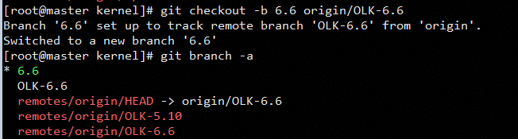

# GICv4.1 Oversubsription Optimizaiton Feature Guide

## Feature Description<a name="EN-US_TOPIC_0000002515732510"></a>

### Overview<a name="EN-US_TOPIC_0000002547452333"></a>

This document describes how to deploy and enable the GIC overcommitment optimization feature on a Kunpeng server running the openEuler OS.

Generic interrupt controller v4.1 (GICv4.1) is an advanced interrupt controller architecture for Arm servers. It supports virtual locality-specific peripheral interrupts (vLPIs), hardware-accelerated virtual machine (VM) interrupt injection, and interrupt priority management, significantly improving interrupt processing efficiency and scalability in virtualization scenarios. When physical machine (PM) resources are limited and VM overcommitment is used, the GIC needs to use the VMOVP instructions to maintain the mapping between vCPUs and physical CPUs. The VMOVP instructions are executed on the GIC hardware in serial mode, which deteriorates the VM service performance.

Kunpeng BoostKit provides a GICv4.1 overcommitment optimization solution. This solution allows the GIC to skip VMOVP instructions when vCPUs are migrated between CPUs that share the same virtual processing element (vPE) table, thus improving VM service performance in overcommitment scenarios.

### Other Information<a name="EN-US_TOPIC_0000002515892420"></a>

Before configuring the GICv4.1 overcommitment optimization feature, learn the specifications, supported versions, license requirement, constraints, and application scenarios of this feature.

**Specifications<a name="section186211624175715"></a>**

Supported VM specifications include but are not limited to 2 vCPUs with 8 GB memory, 4 vCPUs with 8 GB memory, 4 vCPUs with 16 GB memory, 8 vCPUs with 16 GB memory, 16 vCPUs with 32 GB memory, and 32 vCPUs with 64 GB memory.

**Availability<a name="section1625164615574"></a>**

- Versions: Only libvirt 9.10.0 and QEMU 8.2.0 are supported.
- License requirement: none.

**Constraints<a name="section3897196125818"></a>**

- OS

    openEuler 24.03 LTS SP3 is supported.

**Application Scenarios<a name="section49961711506"></a>**

In VM overcommitment scenarios where GICv4.1 is enabled, the vCPU ranges of multiple VMs are mapped to the same physical CPU range, improving VM service performance.

## Installation and Usage<a name="EN-US_TOPIC_0000002547372339"></a>

### Environment Requirements<a name="EN-US_TOPIC_0000002547452335"></a>

This document provides guidance based on the openEuler OS. Before performing operations, ensure that your hardware and software meet the requirements.

**Hardware Requirements<a name="section26241127"></a>**

[**Table 1**](#hardware-requirement) lists the hardware requirement.

**Table 1** Hardware requirement<a id="hardware-requirement"></a>

|Item|Description|
|--|--|
|Processor|New Kunpeng 920 processor model|

**OS and Software Requirements<a name="section153345522323"></a>**

[**Table 2**](#os-and-software-requirements) lists the OS and software requirements.

**Table 2** OS and software requirements<a id="os-and-software-requirements"></a>

|Item|Version|How to Obtain|
|--|--|--|
|OS|openEuler 24.03 LTS SP3|[Link](https://mirrors.huaweicloud.com/openeuler/openEuler-24.03-LTS-SP3/ISO/aarch64/openEuler-24.03-LTS-SP3-everything-aarch64-dvd.iso)|
|Kernel|OLK6.6|[Link](https://gitcode.com/openeuler/kernel)|
|libvirt|9.10.0|Install it using Yum on openEuler 24.03 LTS SP3 when the network connection is normal.|
|QEMU|8.2.0|[Link](https://gitlab.com/qemu-project/qemu)|
|0001-KVM-arm64-Optimize-VMOVP.patch|-|[Link](https://gitcode.com/boostkit/cloud-virtual/blob/master/kernel/kernel-6.6.0/[GICv4.1%20Oversubscription%20Optimization]0001-KVM-arm64-Optimize-VMOVP.patch)<br>Click the link, and choose `Clone/Download` to obtain the patch content.|

### Compiling and Installing the Kernel<a name="EN-US_TOPIC_0000002515892418"></a>

The GICv4.1 overcommitment optimization feature supports only kernel 6.6. The openEuler community has provided kernel 6.6. You only need to perform the operations in this section to compile and install the kernel.

> **NOTICE:**
>The feature installation involves system file modification. By default, all operations during the installation are performed by the **root** user. If you are a non-**root** user, ensure that you have corresponding permissions.

1. Install dependencies.

    ```shell
    yum install rpm-build openssl-devel bc rsync gcc gcc-c++ flex bison m4 git glib2-devel spice-protocol zlib-devel libffi-devel libgcrypt-devel libnfs-devel libiscsi-devel libseccomp-devel libaio-devel libcap-ng-devel librados2-devel librbd1-devel libfdt-devel libpng-devel spice-server-devel numactl-devel dwarves elfutils-libelf-devel ncurses-devel cmake make
    ```

2. Download the openEuler kernel.

    ```shell
    git clone https://gitcode.com/openeuler/kernel.git
    ```

3. Switch to the 6.6 branch.

    ```shell
    cd kernel
    git checkout -b 6.6 origin/OLK-6.6
    ```

    

4. Download the GICv4.1 overcommitment optimization patch.

    ```shell
    cd ..
    git clone https://gitcode.com/boostkit/cloud-virtual.git
    ```

5. Apply the kernel patch.

    ```shell
    cp cloud-virtual/kernel/kernel-6.6.0/[GICv4.1 versubscription ptimization]0001-KVM-arm64-Optimize-VMOVP.patch kernel/
    cd kernel
    git am --reject [GICv4.1 versubscription ptimization]0001-KVM-arm64-Optimize-VMOVP.patch
    ```

6. Compile the kernel.

    ```shell
    make openeuler_defconfig
    make binrpm-pkg -j$(getconf _NPROCESSORS_ONLN)
    ```

7. Install the kernel.

    ```shell
    rpm -ivh rpmbuild/RPMS/aarch64/kernel-6.6.0_[kernel_salt].aarch64.rpm
    grub2-mkconfig -o /boot/efi/EFI/openEuler/grub.cfg
    ```

    > **NOTE:**
    >`kernel_salt` is a random salt value generated during kernel compilation. You can set it by running the `make menuconfig` command. If it is not set, you can find the corresponding RPM package based on the command output. 
    >During the installation, the message "dracut-install: Failed to find module 'virtio_gpu'" may be displayed, but the kernel has been successfully installed. 
    >If the message "package kernel-$(uname -r) (which is newer than kernel-....aarch64) is already installed" is displayed, run the `rpm -ivh rpmbuild/RPMS/aarch64/kernel-6.6.0_[kernel_salt].aarch64.rpm --force` command to forcibly install the kernel.

### Enabling GICv4.1

This feature is valid only when GICv4.1 is enabled in VM overcommitment scenarios. GICv4.1 incorporates interrupt direct injection capabilities like vLPI passthrough for devices and vSGI passthrough. These features dramatically decrease VM-exit and VM-entry occurrences in heavily loaded VMs, resulting in enhanced VM performance.

1. Modify BIOS settings. 
   Choose `BIOS` > `Advanced` > `Processor Configuration` > `GIC Version` and set `GIC Version` to `4.1`.
   

2. Modify the kernel cmdline startup parameters. 
Add `kvm-arm.vgic_v4_enable=1` to cmdline. Restart the server.


3. Verify that GICv4.1 is enabled. 

