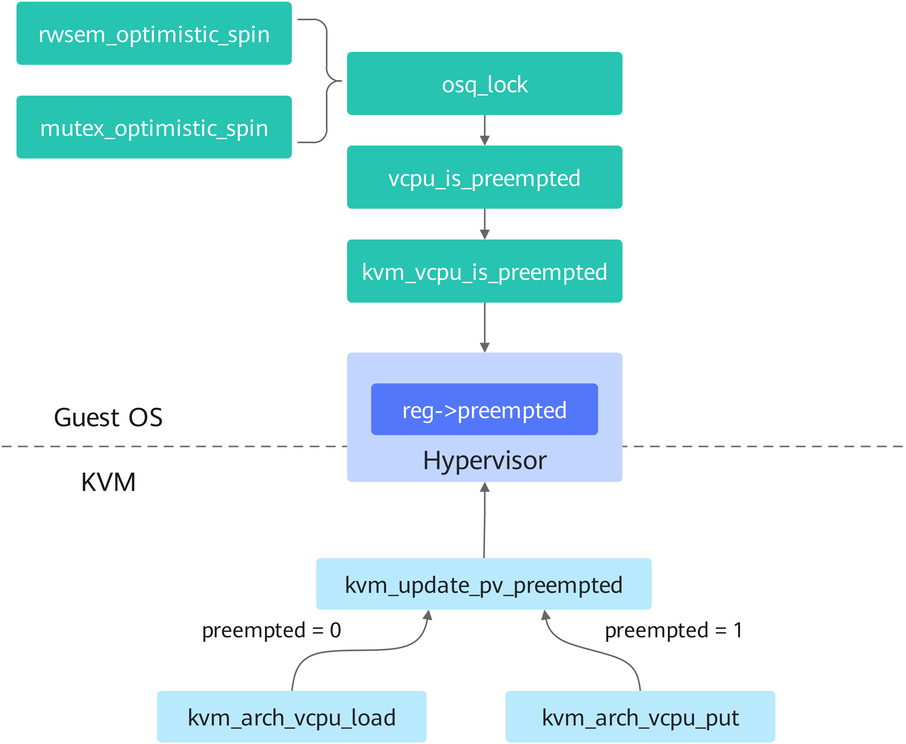

# VM Lock Optimization Feature Guide

## Feature Description<a name="EN-US_TOPIC_0000002106021525"></a>

### Introduction<a name="EN-US_TOPIC_0000002070181886"></a>

This document describes the working principles, application scenarios, environment requirements, and enablement procedure of the virtual machine (VM) lock optimization feature.

The VM lock mechanism safeguards VM resources by restricting access to a single user or process at any given time. However, in overcommitment scenarios, contention among multiple VMs for the same lock often degrades performance.

The lock optimization feature addresses this issue. When requesting a lock, the guest OS checks shared memory to determine whether the target vCPU is already preempted by another VM. If so, the lock request is canceled. Otherwise, the VM enters a waiting state.

The lock optimization feature uses shared memory to relay vCPU preemption status from the hypervisor to VMs. A spinning vCPU aborts its wait state upon detecting that the lock holder has been preempted, minimizing conflict-induced errors and improving system stability.

**Figure 1** Principles of VM lock optimization<a name="fig2050617656"></a><a id="principles-of-vm-lock-optimization"></a>



1. Upon VM kernel boot, the memory address tracking the preempted state of each vCPU is transferred to the hypervisor via a hypercall.
2. The hypervisor invokes `kvm_arch_vcpu_load` to load the vCPU context and resets its preempted state to 0 when scheduling a vCPU to run.
3. When the hypervisor halts a vCPU or switches to another, it calls `kvm_arch_vcpu_put` to save the vCPU context and marks its preempted state as 1.
4. Inside the VM, if a vCPU requesting a lock (such as mutex, rwsem, and osq_lock) detects that the lock-holding vCPU has been scheduled to stop (preempted state is 1), it exits the spin wait state.

The preempted state value tracks whether the vCPU has been preempted on the host. A value of 0 indicates that the hypervisor is actively scheduling the vCPU, while 1 signifies the vCPU has been stopped by the hypervisor.


### Availability<a name="EN-US_TOPIC_0000002105901569"></a>

Version requirements:

- openEuler 20.03 LTS SP1 or later is supported.
- For non-openEuler kernels, the patches listed in [**Table 3**](#patch-requirements-for-non-openeuler-kernels) must be applied. The feature is enabled by default after the patches are applied.


### Constraints<a name="EN-US_TOPIC_0000002070341630"></a>

The VM lock optimization feature does not support live migration.

The VM lock optimization feature operates exclusively at the OS kernel level. Its activation status has no impact on libvirt or QEMU, eliminating the need for any supplementary configuration on either platform.


### Application Scenarios<a name="EN-US_TOPIC_0000002105901593"></a>

- The VM lock optimization feature applies to overcommitment scenarios core-bound vCPUs, where multiple vCPU threads contend for resources on shared physical cores.
- Using a coordinated frontend-backend approach, the feature tracks vCPU thread preemption to refine scheduling and lock efficiency. It improves performance in CPU scheduling operations such as `mutex_spin_on_owner`, `mutex_can_spin_on_owner`, `rtmutex_spin_on_owner`, `osq_lock`, and `available_idle_cpu`.


## Feature Usage<a name="EN-US_TOPIC_0000002070341634"></a>

### Environment Requirements<a name="EN-US_TOPIC_0000002154855905"></a>

This document provides guidance based on the openEuler OS. Before performing operations, ensure that your hardware and software meet the requirements.

**Hardware Requirements<a name="section26241127"></a>**

[**Table 1**](#hardware-requirement) lists the hardware requirement.

**Table 1** Hardware requirement<a id="hardware-requirement"></a>

|Item|Description|
|--|--|
|Processor|Kunpeng 920 series|


**OS and Software Requirements<a name="section153345522323"></a>**

[**Table 2**](#os-and-software-requirements) lists the OS and software requirements.

**Table 2** OS and software requirements<a id="os-and-software-requirements"></a>

|Item|Version|How to Obtain|
|--|--|--|
|OS|openEuler 20.03 LTS SP1<br>The minimum OS version requirement applies to both physical and virtual machines.|[Link](https://mirrors.huaweicloud.com/openeuler/openEuler-20.03-LTS-SP1/ISO/aarch64/openEuler-20.03-LTS-SP1-aarch64-dvd.iso)|
|libvirt|6.2.0 or later|Install it using Yum.|
|QEMU|4.1.0 or later|Install it using Yum.|


**Table 3** Patch requirements for non-openEuler kernels<a id="patch-requirements-for-non-openeuler-kernels"></a>

|No.|Patch|How to Obtain|
|--|--|--|
|1|KVM: arm64: Document PV-sched interface|[Link](https://gitee.com/openeuler/kernel/commit/b74edaf629bdd6bb66d8852b783812560b29079c)|
|2|KVM: arm64: Implement PV_SCHED_FEATURES call|[Link](https://gitee.com/openeuler/kernel/commit/a0b95bdf6a0b2d5a96a28b1f728a6abad51dbaec)|
|3|KVM: arm64: Support pvsched preempted via shared structure|[Link](https://gitee.com/openeuler/kernel/commit/76732c97a3ecc07a4237f0348f661ccff6b9d3eb)|
|4|KVM: arm64: Add interface to support vCPU preempted check|[Link](https://gitee.com/openeuler/kernel/commit/63042c58affca22fb14736455d38d2a6e97ca9dc)|
|5|KVM: arm64: Support the vCPU preemption check|[Link](https://gitee.com/openeuler/kernel/commit/cf6d95e33dfa0344abea230ed48a1fad69591f36)|
|6|KVM: arm64: Add SMCCC PV-sched to kick cpu|[Link](https://gitee.com/openeuler/kernel/commit/7a645f6e24eeda4736975b6e85dc797a57fe8900)|
|7|KVM: arm64: Implement PV_SCHED_KICK_CPU call|[Link](https://gitee.com/openeuler/kernel/commit/efed88dd593493653466917a7e95868ec38bef41)|
|8|KVM: arm64: Add interface to support PV qspinlock|[Link](https://gitee.com/openeuler/kernel/commit/12e1ed766c347d47f85736fece113c7578ace94f)|


> **NOTICE:**
>This feature depends on support from both physical and virtual machines. For non-openEuler kernels, the specified patches must be installed on both sides.


### Feature Enablement<a name="EN-US_TOPIC_0000002105901585"></a>

This feature supports openEuler 20.03 LTS SP1 and later versions. It is enabled by default on these systems.

To enable this feature on a non-openEuler kernel, you need to apply the related patches. For details, see [**Table 3**](#patch-requirements-for-non-openeuler-kernels). After the patches are integrated, the feature is enabled by default after system boot.


### Feature Verification<a name="EN-US_TOPIC_0000002070181858"></a>

After setting up libvirt and QEMU, launch a VM. Once the VM is running, run the following command within it:

```
dmesg | grep PV
```

If the feature is running properly, the command output contains the following information:

```
arm-pv: using PV sched preempted
```

This feature works automatically without user intervention, optimizing vCPU scheduling efficiency in the VM.


## Acronyms and Abbreviations<a name="EN-US_TOPIC_0000002106021549"></a>

|**Acronym/Abbreviation**|**Full Spelling**|
|--|--|
|KVM|kernel-based virtual machine|
