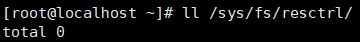
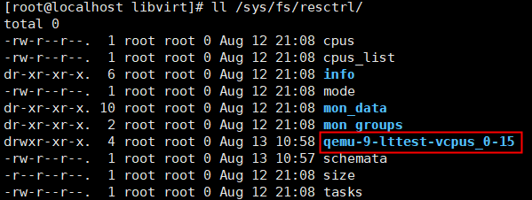
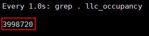

# MPAM-enabled libvirt User Guide<a name="EN-US_TOPIC_0000002521088818"></a>

## Feature Description<a name="EN-US_TOPIC_0000002518685864"></a>

This document describes how to configure the memory bandwidth and cache lines of a VM on a Kunpeng server, and provides the libvirt installation guide and VM XML configuration guide.

VMs running on the same NUMA node share public resources, such as memory bandwidth and cache lines. When the shared resources are insufficient, resource contention may occur among VMs, causing performance deterioration. Customers want to limit the resource usage of VMs by configuring the upper limits of VM memory bandwidth and cache size, preventing interference between multiple tenants and improving the availability of cloud hosts. Memory System Resource Partitioning and Monitoring (MPAM) provides the function of limiting the maximum memory bandwidth and cache line quantity of a process. You can adapt this feature for libvirt so that you can configure the DDR bandwidth and cache size of a VM using the XML file.

**Specifications<a name="section186211624175715"></a>**

Supported VM specifications include but are not limited to 2 vCPUs with 8 GB memory, 4 vCPUs with 8 GB memory, 4 vCPUs with 16 GB memory, 8 vCPUs with 16 GB memory, 16 vCPUs with 32 GB memory, and 32 vCPUs with 64 GB memory.

**Version Requirements<a name="section1625164615574"></a>**

- Versions: openEuler 24.03 LTS SP2/openEuler 24.03 LTS SP3, QEMU 8.2.0, and libvirt 9.10.0-18.oe2403sp2 or later
- License requirement: none.

**Constraints<a name="section3897196125818"></a>**

The application environment must meet the hardware and software requirements.

**Application Scenarios<a name="section49961711506"></a>**

libvirt supports DDR bandwidth configuration, which is mainly used for VM memory bandwidth isolation and QoS control. MPAM can be used to allocate VMs to different bandwidth/cache partitions to implement rate or priority control. In this way, high-priority VMs (such as real-time services) can deliver stable performance, and low-priority VMs do not interfere in critical loads.

## Feature Installation and Usage<a name="EN-US_TOPIC_0000002518685868"></a>

### Environment Requirements<a name="EN-US_TOPIC_0000002518525978"></a>

This document provides guidance based on the openEuler OS. Before performing operations, ensure that your hardware and software meet the requirements.

**Hardware Requirements<a name="section26241127"></a>**

[**Table 1**](#hardware-requirement) lists the hardware requirement.

**Table 1** Hardware requirement<a id="hardware-requirement"></a>

|Item|Description|
|--|--|
|Processor|New Kunpeng 920 processor model or Kunpeng 950 processor|


**OS and Software Requirements<a name="section153345522323"></a>**

[**Table 2**](#os-and-software-requirements) lists the OS and software requirements.

**Table 2** OS and software requirements<a id="os-and-software-requirements"></a>

|Item|Version|How to Obtain|
|--|--|--|
|OS|openEuler 24.03 LTS SP2<br>openEuler 24.03 LTS SP3|[Link](https://mirrors.huaweicloud.com/openeuler/openEuler-24.03-LTS-SP2/ISO/aarch64/openEuler-24.03-LTS-SP2-everything-aarch64-dvd.iso)<br>[Link](https://mirrors.huaweicloud.com/openeuler/openEuler-24.03-LTS-SP3/ISO/aarch64/openEuler-24.03-LTS-SP3-everything-aarch64-dvd.iso)|
|libvirt|9.10.0|Install it using a Yum repository.|
|QEMU|8.2.0|Install it using a Yum repository.|
|LMbench|3-4|Install it using a Yum repository.|


### Enabling MPAM<a name="EN-US_TOPIC_0000002518685866"></a>

To enable MPAM, you need to modify the kernel startup parameter and mount the resctrl file system.

1. Modify the kernel startup parameter.
    1. Open the `grub.cfg` file.

        ```
        vi /boot/efi/EFI/openEuler/grub.cfg
        ```

    2. Press `i` to enter the insert mode and add `arm64.mpam` to the kernel startup parameter.

        

    3. Press `Esc` to exit the insert mode. Type `:wq!` and press `Enter` to save the file and exit.

2. Restart the physical machine and check whether the `/sys/fs/resctrl` directory is available.

    ```
    reboot
    ll /sys/fs/resctrl
    ```

    

3. Mount the resctrl file system.

    ```
    mount -t resctrl resctrl /sys/fs/resctrl/
    ```

4. Check whether the mounting is successful. If the `resctrl` directory contains the content shown in the following figure, the mounting is successful.

    ```
    ll /sys/fs/resctrl
    ```

    

### Installing libvirt<a name="EN-US_TOPIC_0000002550125719"></a>

Currently, the MPAM feature can be adapted only for libvirt 9.10.0. Ensure that the version of libvirt to be compiled and installed is the target one. If the version of libvirt is not 9.10.0, uninstall it and its dependencies before the installation.

**Prerequisites<a name="section610117391219"></a>**

Configure an online Yum repository. For details, see [Configuring a Yum Source](https://www.hikunpeng.com/document/detail/en/kunpengcpfs/ecosystemEnable/Libvirt/kunpengcpfs_libvirt_03_0005.html).

**Procedure<a name="section830916587214"></a>**

Install libvirt.

```
yum install -y libvirt
```


### Configuring the VM XML File<a name="EN-US_TOPIC_0000002550005731"></a>

You can configure VM cache and memory bandwidth in an XML file. The MPAM feature can limit the number of cache lines and the maximum memory bandwidth used by a process based on XML configuration parameters.

**Configuring the Cache<a name="section362983302918"></a>**

The following shows the XML file for configuring the cache. For details about the parameters, see [Table 1](#parameter-description)

```
<cputune>
    <cachetune vcpus='0-15'>
      <cache id='0' level='3' type='both' size='2560' unit='KiB'/>
      <cache id='0' level='3' type='priority' size='2'/>
    </cachetune>
</cputune>
```

**Table 1** Parameter description<a id="parameter-description"></a>

|Parameter|Description|
|--|--|
|vcpus|List of vCPUs to be limited.|
|id|NUMA ID or cluster ID, which is related to the chip implementation.|
|level|Cache level. Currently, only L3 is supported.|
|type|Parameter type. Valid values include `both`, `code`, `data`, and `priority`, corresponding to `L3`, `L3CODE`, `L3DATA`, and `L3PRI` in MPAM, respectively. For the Kunpeng 950 processor, `max` and `min` are added, corresponding to `L3MAX` and `L3MIN` in MPAM, respectively.|
|size|If `type` is set to `priority`, this parameter indicates the priority value, ranging from 0 to 3. If `type` is set to `min`, the value of this parameter ranges from 0 to 100. If `type` is set to `max`, the value of this parameter ranges from 1 to 100. When `type` is set to other values, `size` and `unit` together determine the cache line size. For details about how to manually configure the cache line size, see [Example of Manually Configuring the Cache Line](#section2711453414).|
|unit|This parameter is left blank when `type` is set to `priority`, `max`, or `min`. If `type` is set to other values, this parameter specifies the unit of the cache line size. The value can be `KiB` (default), `B`, `MiB`, or `GiB`. For details about how to manually configure the cache line size, see [Example of Manually Configuring the Cache Line](#section2711453414).|


**Example of Manually Configuring the Cache Line<a id="section2711453414"></a>**

The following example describes how to manually configure the cache line size, with `size` set to `2` and `unit` set to `MiB`.

The configured cache line size must be an integer multiple of the size of a single cache line on the physical machine (the latter can be obtained by dividing the L3 cache size of a single NUMA node in the `/sys/fs/resctrl/size` file by the number of L3 cache mask bits of a single NUMA node in the `/sys/fs/resctrl/schemata` file). As shown in the following figures, the L3 cache size of a single NUMA node is 58,720,256 bytes, and the number of mask bits is 28. Therefore, the size of a single cache line is 58,720,256 divided by 28, that is, 2,097,152 bytes (2 MiB).


**Configuring the Memory Bandwidth<a name="section16870222133515"></a>**

The following shows the XML configuration of memory bandwidth. For details about the parameters, see [**Table 2**](#parameter-description-1)

```
<cputune>
    <memorytune vcpus='0-15'>
      <node id='0' bandwidth='60' min_bandwidth='10' hardlimit='0' priority='2'/>
    </memorytune>
</cputune>
```

**Table 2** Parameter description<a id="parameter-description-1"></a>

|Parameter|Description|
|--|--|
|vcpus|List of vCPUs to be limited.|
|id|NUMA ID.|
|bandwidth|(Mandatory) Corresponds to `MB` of MPAM. The value ranges from 1 to 100.|
|min_bandwidth|(Optional) Corresponds to `MBMIN` of MPAM. The value ranges from 0 to 100.|
|hardlimit|(Optional) Corresponds to `MBHDL` of MPAM. The value can be `0` or `1`.|
|priority|(Optional) Corresponds to `MBPRI` of MPAM. The value ranges from 0 to 7.|


> **NOTE:**
>For more information about MPAM parameters, see [MPAM Parameters](https://gitee.com/openeuler/kernel/blob/c3f8f5c91794b44b7d65a27371a536a1bc86905e/Documentation/arch/arm64/mpam.md#331-pri-%E4%BC%98%E5%85%88%E7%BA%A7%E8%AE%BE%E7%BD%AE).


## Feature Verification<a name="EN-US_TOPIC_0000002550125721"></a>

LMbench is a tool for testing memory performance, including memory bandwidth and access latency. There is no restriction on the tool version. Install LMbench before performing the MPAM function test.

**Prerequisites<a name="section930415406507"></a>**

A VM has been created. Supported VM specifications include but are not limited to 2 vCPUs with 8 GB memory, 4 vCPUs with 8 GB memory, 4 vCPUs with 16 GB memory, 8 vCPUs with 16 GB memory, 16 vCPUs with 32 GB memory, and 32 vCPUs with 64 GB memory.

**Installing LMbench<a name="section10264710191217"></a>**

> **NOTICE:**
>To install software on a VM, you need to configure a Yum repository on the VM in advance.

This section uses LMbench 3-4 as an example. This version is provided in the Yum repository. Run the following command on the VM to install the tool:

```
yum install -y lmbench
```

**Limiting the Memory Bandwidth<a name="section6695756134"></a>**

1. Edit the VM XML file. Replace *<vm name>* with the actual VM name.

    ```
    virsh edit <vm name>
    ```

2. Use the following XML configurations to limit the memory bandwidth of node 0 to 60%.

    ```
    <domain type='kvm'>
    ......
      <cputune>
        <memorytune vcpus='0-31'>
          <node id='0' bandwidth='60'/>
        </memorytune>
      </cputune>
    ......
    </domain>
    ```

3. Start the VM.

    ```
    virsh start <vm name>
    ```

4. Check whether the corresponding MPAM control group is created in `/sys/fs/resctrl`. The control group name is determined based on the VM ID, name, and restricted vCPUs.
    1. Check whether the corresponding control group exists.

        ```
        ll /sys/fs/resctrl
        ```

        

    2. Check whether the content of the `schemata` file of this control group matches the XML configurations.

        ```
        cat /sys/fs/resctrl/<group name>/schemata
        ```

        

5. Enter the VM, use LMbench to test the bandwidth, and check whether the bandwidth changes in different configurations.

    > **NOTE:**
    >-   The upper limit of memory bandwidth varies with VM specifications. MPAM limits bandwidth based on the theoretical upper limit, not the actual limit that can be reached by a VM. This test focuses on the change trend.
    >-   The concurrency (`-P`) and memory page size parameters in the following commands need to be adjusted based on the VM specifications. The value of `-P` should be the same as the number of vCPUs.

    The following uses a VM with 32 vCPUs and 64 GB memory as an example.

    1. Bind the VM to NUMA node 0, set the memory bandwidth limitation to `50`, and start and enter the VM. Then run the test command to test the memory bandwidth.

        ```
        <cputune>
            <vcpupin vcpu='0' cpuset='0'/>
            <vcpupin vcpu='1' cpuset='1'/>
            ......
            <vcpupin vcpu='30' cpuset='30'/>
            <vcpupin vcpu='31' cpuset='31'/>
            <memorytune vcpus='0-31'>
              <node id='0' bandwidth='50'/>
            </memorytune>
        </cputune>
        <numatune>
            <memnode cellid='0' mode='strict' nodeset='0'/>
        </numatune>
        ```

        ```
        /opt/lmbench/bin/bw_mem -P 32 -N 5 512M rd
        ```

        

    2. Repeat the preceding operations, change the memory bandwidth limitation to `80`, and restart the VM. Then run the same test command to test the memory bandwidth again. Check whether the memory bandwidth increases significantly.

        ```
        virsh shutdown <vm name>
        virsh start <vm name>
        ```

        

**Limiting the L3 Cache<a name="section46953561317"></a>**

> **NOTICE:**
>To limit the L3 cache using libvirt and ensure exclusive access to cache lines, you need to adjust the cache line usage of other control groups (including the default control group) to free up enough cache lines.

1. Modify the L3 cache data of the default control group to set the cache lines corresponding to the two highest-order mask bits as idle.

    ```
    echo "L3:1=3ffffff" > /sys/fs/resctrl/schemata
    ```

2. Edit the VM XML file.

    ```
    virsh edit <vm name>
    ```

3. Use the following XML configurations to limit the L3 cache of node 0 to 4 MiB, which corresponds to two cache lines of the physical machine.

    ```
    <domain type='kvm'>
    ......
      <cputune>
        <cachetune vcpus='0-15'>
          <cache id='0' level='3' type='both' size='4' unit='MiB'/>
          <cache id='0' level='3' type='priority' size='2'/>
        </cachetune>
      </cputune>
    ......
    </domain>
    ```

4. Start the VM.

    ```
    virsh start <vm name>
    ```

5. Check whether the corresponding MPAM control group is created in `/sys/fs/resctrl`. The control group name is determined based on the VM ID, name, and restricted vCPUs.
    1. Check whether the corresponding control group exists.

        ```
        ll /sys/fs/resctrl
        ```

        

    2. Check whether the content of the `schemata` file of this control group matches the XML configurations.

        ```
        cat /sys/fs/resctrl/<group name>/schemata
        ```

        

6. View the statistics of the control group, and check whether the limitation takes effect and whether the data size (in bytes) is under the limit set in the XML file.

    ```
    cd /sys/fs/resctrl/<group name>/mon_data/mon_L3_01
    watch -n 1 grep . *
    ```

    


## Troubleshooting<a name="EN-US_TOPIC_0000002518525980"></a>

**Symptom<a name="section758133012554"></a>**

After the libvirtd service is started, an error message is displayed during VM startup, stating "error: can't connect to virtlogd: Failed to connect socket to '/var/run/libvirt/virtlogd-sock': Connection refused."

**Key Process and Cause Analysis<a name="section145813300553"></a>**

None

**Conclusion and Solution<a name="section96942184217"></a>**

Run the following commands to rectify the fault:

```
sudo systemctl enable --now virtlogd.socket
sudo systemctl enable --now libvirtd.service
sudo pkill virtlogd
sudo pkill libvirtd
sudo systemctl restart virtlogd.socket
sudo systemctl restart libvirtd
```
