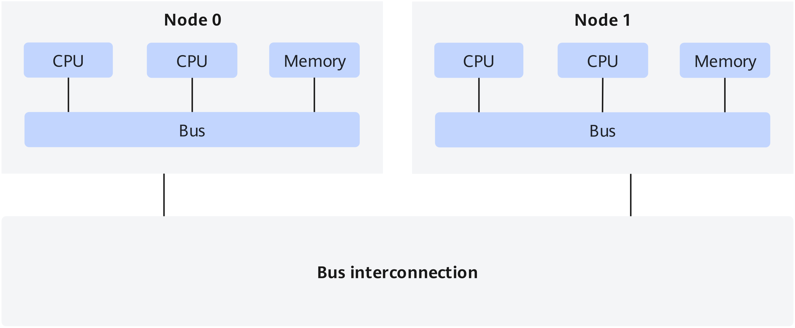
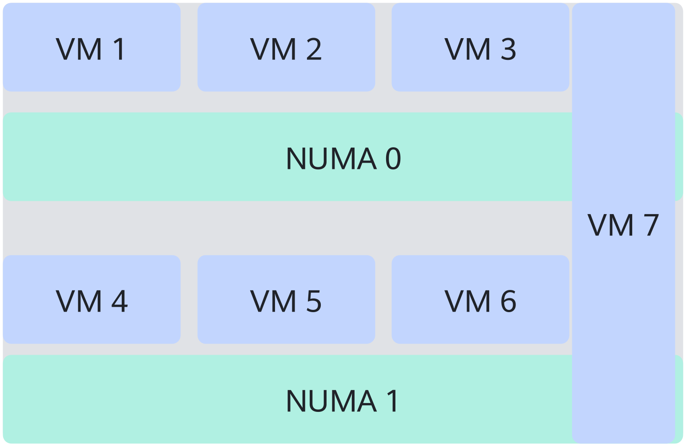
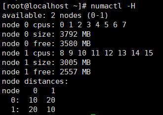

# NUMA Awareness Feature Guide

## Feature Description<a name="EN-US_TOPIC_0000002070343122"></a>

**Introduction<a name="section117054563113"></a>**

NUMA awareness is an optimization policy utilizing the non-uniform memory access (NUMA) architecture to improve the performance of a multiprocessor system.

In the NUMA architecture, the processor and memory are divided into multiple nodes, for example, node 0 and node 1 in the following figure. Each node contains the local memory and the corresponding processors. For a processor (for example, a CPU in the node 0), accessing a memory (a local memory) in a same node is faster than accessing a memory (a remote memory) in another node. The core principle of NUMA awareness is to detect the NUMA topology to reduce cross-node memory access, reduce latency, and improve performance.

**Figure 1** NUMA architecture<a name="fig1860217228139"></a><a id="numa-architecture"></a>



After Guest NUMA is configured for a VM, the VM can identify the vCPU NUMA status so that the VM can optimize memory resource usage based on the Guest NUMA topology. For example, the host CPU and memory used by VM 7 in the following figure are distributed on two NUMA nodes. Without NUMA awareness, the VM may experience a large number of cross-NUMA node memory accesses, affecting the performance. When Guest NUMA is configured, the NUMA topology of the host is transferred to the VM, reducing cross-NUMA memory access.



**Version Requirements<a name="section160134962811"></a>**

- Versions: openEuler 20.03 LTS SP1 or later, and QEMU 2.6.0 or later
- License: none

**Constraints<a name="section149451330182917"></a>**

The NUMA awareness feature is used to detect the host NUMA architecture in the VM. The impact on performance depends on application characteristics. If the service software cannot identify NUMA or is not optimized for NUMA, cross-NUMA memory access occurs and the performance deteriorates.

**Application Scenarios<a name="section195951573305"></a>**

Apply to the 1:1 core binding scenario. The optimal NUMA topology is displayed based on the topology of vCPUs bound to the physical CPUs.

**Principles<a name="section179511734103018"></a>**

NUMA awareness feature configuration implements memory block binding and vCPU binding so that VMs can detect the NUMA architecture of the host machine and optimize performance.


## Feature Usage<a name="EN-US_TOPIC_0000002070343110"></a>

### XML Configuration<a name="EN-US_TOPIC_0000002070183306"></a>

When configuring the NUMA awareness feature, you can specify the location of virtual NUMA node (vNode) memory on the host to implement memory block binding and vCPU binding so that the vCPU and memory on the vNode are on the same physical NUMA node. The following provides the VM XML configuration for reference.

```
  <memory unit='KiB'>8388608</memory>
  <currentMemory unit='KiB'>8388608</currentMemory>
  <vcpu placement='static'>16</vcpu>
  <cputune>
    <vcpupin vcpu='0' cpuset='24'/>
    <vcpupin vcpu='1' cpuset='25'/>
    <vcpupin vcpu='2' cpuset='26'/>
    <vcpupin vcpu='3' cpuset='27'/>
    <vcpupin vcpu='4' cpuset='28'/>
    <vcpupin vcpu='5' cpuset='29'/>
    <vcpupin vcpu='6' cpuset='30'/>
    <vcpupin vcpu='7' cpuset='31'/>
    <vcpupin vcpu='8' cpuset='32'/>
    <vcpupin vcpu='9' cpuset='33'/>
    <vcpupin vcpu='10' cpuset='34'/>
    <vcpupin vcpu='11' cpuset='35'/>
    <vcpupin vcpu='12' cpuset='36'/>
    <vcpupin vcpu='13' cpuset='37'/>
    <vcpupin vcpu='14' cpuset='38'/>
    <vcpupin vcpu='15' cpuset='39'/>
    <emulatorpin cpuset='24-39'/>
  </cputune>
  <numatune>
    <memnode cellid='0' mode='strict' nodeset='0'/>
    <memnode cellid='1' mode='strict' nodeset='1'/>
  </numatune>
  <cpu mode='host-passthrough' check='none'>
    <topology sockets='1' dies='1' clusters='4' cores='4' threads='1'/>
    <numa>
      <cell id='0' cpus='0-7' memory='4194304' unit='KiB'/>
      <cell id='1' cpus='8-15' memory='4194304' unit='KiB'/>
    </numa>
  </cpu>
```

The configuration procedure is as follows:

1. Map one vCPU to each physical host CPU, that is, 1:1 core binding.

    In the following configuration, the VM memory is set to 8 GB, the number of vCPUs is set to 16, and vCPUs 0 to 15 are bound to the host CPUs 24 to 39, respectively.

    ```
      <memory unit='KiB'>8388608</memory>
      <currentMemory unit='KiB'>8388608</currentMemory>
      <vcpu placement='static'>16</vcpu>
      <cputune>
        <vcpupin vcpu='0' cpuset='24'/>
        <vcpupin vcpu='1' cpuset='25'/>
        <vcpupin vcpu='2' cpuset='26'/>
        <vcpupin vcpu='3' cpuset='27'/>
        <vcpupin vcpu='4' cpuset='28'/>
        <vcpupin vcpu='5' cpuset='29'/>
        <vcpupin vcpu='6' cpuset='30'/>
        <vcpupin vcpu='7' cpuset='31'/>
        <vcpupin vcpu='8' cpuset='32'/>
        <vcpupin vcpu='9' cpuset='33'/>
        <vcpupin vcpu='10' cpuset='34'/>
        <vcpupin vcpu='11' cpuset='35'/>
        <vcpupin vcpu='12' cpuset='36'/>
        <vcpupin vcpu='13' cpuset='37'/>
        <vcpupin vcpu='14' cpuset='38'/>
        <vcpupin vcpu='15' cpuset='39'/>
        <emulatorpin cpuset='24-39'/>
      </cputune>
    ```

2. Configure the VM NUMA.

    Configure two NUMA nodes for the VM: node 0 and node 1.

    ```
      <numatune>
        <memnode cellid='0' mode='strict' nodeset='0'/>
        <memnode cellid='1' mode='strict' nodeset='1'/>
      </numatune>
    ```

3. Configure the internal structure of NUMA.

    Each of the two NUMA nodes has 4 GB memory. The node 0 contains CPUs 0 to 7, and node 1 contains CPUs 8 to 15.

    ```
      <cpu mode='host-passthrough' check='none'>
        <topology sockets='1' dies='1' clusters='4' cores='4' threads='1'/>
        <numa>
          <cell id='0' cpus='0-7' memory='4194304' unit='KiB'/>
          <cell id='1' cpus='8-15' memory='4194304' unit='KiB'/>
        </numa>
      </cpu>
    ```


### Feature Verification<a name="EN-US_TOPIC_0000002105903009"></a>

After the preceding configuration is complete, log in to the VM and run the following command to view the number of NUMA nodes:

```
numactl -H
```

As shown in the following figure, the number of NUMA nodes is 2. The node 0 contains CPUs 0 to 7, and the node 1 contains CPUs 8 to 15, which is the same as the VM XML configuration. Each of the two NUMA nodes has about 4 GB memory. The system consumes a portion of memory, so the memory size shown in the figure is slightly different from that configured in the VM XML file.




## Acronyms and Abbreviations<a name="EN-US_TOPIC_0000002105903033"></a>

|**Acronym/Abbreviation**|**Full Spelling**| |
|--|--|--|
|NUMA|non-uniform memory access| |
