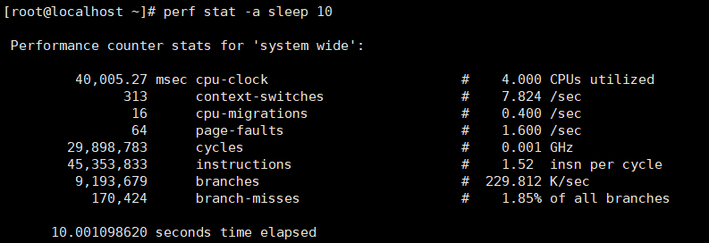

# PMU Virtualization Feature Guide

## Feature Description<a name="EN-US_TOPIC_0000002278901521"></a>

This document describes how to deploy and enable the performance monitoring unit (PMU) virtualization feature on the openEuler OS running on Kunpeng 920 series processors.

The PMU is a hardware performance event collection system provided by Arm processors. It is used to record and count various microarchitecture events. With PMU virtualization enabled, users can leverage the perf tool to monitor PMU events within VMs, facilitating comprehensive performance analysis and optimization.

**Version Requirements<a name="section152361333185213"></a>**

- Physical machine OS: openEuler 22.03 LTS SP4 or openEuler 24.03 LTS SP1
- VM OS: openEuler 22.03 LTS SP4 or openEuler 24.03 LTS SP1
- License: none

**Application Scenarios<a name="section342793714538"></a>**

This feature enables PMU events to be collected on a VM, which helps analyze and optimize the performance of the VM OS and service software.

## Feature Usage<a name="EN-US_TOPIC_0000002243915872"></a>

### Environment Requirements<a name="EN-US_TOPIC_0000002278874913"></a>

Before using the feature, ensure that the hardware and software requirements are met.

**Hardware Requirements<a name="en-us_topic_0000001217080138_section10273165810425"></a>**

**Table 1** Hardware requirement<a id="hardware-requirement"></a>

|Item|Specifications|
|--|--|
|Processor|Kunpeng 920 series|

**OS and Software Requirements<a name="section1240364411598"></a>**

**Table 2** OS and software requirements<a id="os-and-software-requirements"></a>

|Software Name|Version|How to Obtain|
|--|--|--|
|OS of the physical machine and VM|Verified versions:<br>openEuler 22.03 LTS SP4<br>openEuler 24.03 LTS SP1|openEuler 22.03 LTS SP4: [Link](https://mirrors.huaweicloud.com/openeuler/openEuler-22.03-LTS-SP4/ISO/aarch64/openEuler-22.03-LTS-SP4-everything-aarch64-dvd.iso)<br>openEuler 24.03 LTS SP1: [Link](https://mirrors.huaweicloud.com/openeuler/openEuler-24.03-LTS-SP1/ISO/aarch64/openEuler-24.03-LTS-SP1-everything-aarch64-dvd.iso)|
|QEMU|6.2.0 for openEuler 22.03 LTS SP4<br>8.2.0 for openEuler 24.03 LTS SP1|Install it using a Yum repository.|
|libvirt|6.2.0 for openEuler 22.03 LTS SP4<br>9.10.0 for openEuler 24.03 LTS SP1|Install it using a Yum repository.|

### Enablement and Verification<a name="EN-US_TOPIC_0000002243756076"></a>

#### Installing the VM Runtime<a name="EN-US_TOPIC_0000002278954429"></a>

> **NOTE:**
>
>- Before the installation, you need to configure the Yum repository and prepare the system image file required for VM installation. During the installation, modify the path information as required.
>- If the VM uses openEuler 24.03 LTS SP1, add the `--osinfo detect=on,require=off` option to the end of the VM creation command.

1. Install QEMU and libvirt.

    ```shell
    yum -y install qemu libvirt edk2-aarch64.noarch virt-install
    ```

2. Create a VM. The following describes how to create a 20 GB drive image file in QCOW2 format.

    ```shell
    virt-install --name=<vmname> --vcpus=32 --ram=65536 --disk path=/home/images/img.qcow2,format=qcow2,size=20,bus=virtio --location /home/openEuler-22.03-LTS-SP4-everything-aarch64-dvd.iso --network network=default --nographics
    ```

#### Testing VM PMU Event Collection<a name="EN-US_TOPIC_0000002244115250"></a>

> **NOTE:**
>Before installing the perf tool, you need to configure the Yum repository on the VM.

1. Start a VM and log in to it.

    ```shell
    virsh start <vmname> --console
    ```

2. Install the perf tool.

    ```shell
    yum -y install perf
    ```

3. Collect basic VM kernel events for 10 seconds. If the following information is displayed, the PMU virtualization feature has been enabled.

    ```shell
    perf stat -a sleep 10
    ```

    
