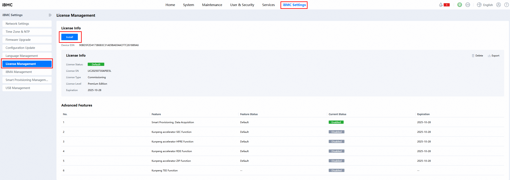
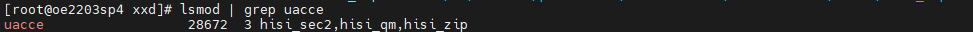
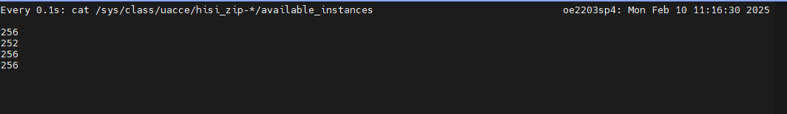
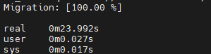

# Virtualization Scenario KAE Accelerated Live Migration Feature Guide<a name="EN-US_TOPIC_0000002552288801"></a>

## Feature Description<a name="EN-US_TOPIC_0000002550131443"></a>

### Introduction<a name="EN-US_TOPIC_0000002518691586"></a>

This document describes how to use the KAE compression and decompression functions on a Kunpeng server running the openEuler OS to accelerate virtual machine (VM) live migration.

VM live migration allows a VM to be migrated from one physical host to another without interrupting the VM running. To reduce the data volume transmitted during migration, compression technologies (for example, zlib library) are usually used on the source physical host to compress memory pages before transmission, and then the memory pages are decompressed on the target physical host, thereby speeding up the VM live migration.

The Kunpeng Accelerator Engine (KAE) contains the KAEZip compression module, which can significantly reduce processor consumption and improve processor efficiency. KAEZlib is a standard zlib interface provided by the KAE compression module. It uses the Kunpeng hardware acceleration module to implement the Deflate algorithm and works with the lossless user-mode driver framework. Therefore, KAE can replace the open-source compression library zlib to accelerate VM live migration.

Before configuring the KAE-accelerated VM live migration feature, learn the specifications, supported version, license requirement, constraints, and application scenarios of this feature.

**Specifications<a name="section186211624175715"></a>**

Supported VM specifications include but are not limited to 2 vCPUs with 8 GB memory, 4 vCPUs with 8 GB memory, 4 vCPUs with 16 GB memory, 8 vCPUs with 16 GB memory, 16 vCPUs with 32 GB memory, and 32 vCPUs with 64 GB memory.

> **NOTICE:**
>When the open-source compression library zlib is enabled during the Redis pressure test, live migration is restricted in scenarios with the following VM specifications and number of live migration threads:
>-   VMs of 2 vCPUs and 8 GB, and live migration threads fewer than 32.
>-   VMs of 4 vCPUs and 8 GB, and live migration threads fewer than or equal to 4.
>-   VMs of 4 vCPUs and 16 GB, and live migration threads fewer than or equal to 4.
>-   VMs of 8 vCPUs and 16 GB, 16 vCPUs and 32 GB, and 32 vCPUs and 64 GB, and live migration threads fewer than or equal to 3.

**Version Requirements<a name="section1625164615574"></a>**

- Version: For Arm-based KVM and QEMU virtualization platforms, only libvirt 10.0.0 and later versions, and QEMU 6.2.0 are supported.
- License: KAE license.

- The application environment must meet the hardware and software environment requirements supported by KAE.
- For details, see [**Table 2**](#os-and-software-requirements).

**Application Scenarios<a name="section49961711506"></a>**

VM live migration applies to load balancing, hardware maintenance, and disaster recovery (DR) high availability (HA) scenarios. It dynamically adjusts VM distribution to prevent a single physical host from being overloaded and improve resource utilization. VMs can be migrated without interrupting services to facilitate the maintenance or upgrade of the source host. In addition, when a host is faulty or its performance deteriorates, VMs can be quickly migrated to ensure service continuity.


## Installation and Usage<a name="EN-US_TOPIC_0000002550011437"></a>

### Environment Requirements<a name="EN-US_TOPIC_0000002518691580"></a>

This section provides guidance based on the openEuler OS. Before performing operations, ensure that hardware and software of the target and source physical hosts meet the requirements.

**Hardware Requirements<a name="section26241127"></a>**

[**Table 1**](#hardware-requirement) lists the hardware requirement.

**Table 1** Hardware requirement<a id="hardware-requirement"></a>

|Item|Description|
|--|--|
|Processor|New Kunpeng 920 processor model|


**OS and Software Requirements<a name="section153345522323"></a>**

[**Table 2**](#os-and-software-requirements) lists the OS and software requirements.

**Table 2** OS and software requirements<a id="os-and-software-requirements"></a>

|Item|Version|How to Obtain|
|--|--|--|
|OS|openEuler 22.03 LTS SP4<br>The feature supports openEuler 22.03 LTS SP1/SP2/SP3/SP4. This document describes how to enable and verify the feature on openEuler 22.03 LTS SP4.|[Link](https://mirrors.huaweicloud.com/openeuler/openEuler-22.03-LTS-SP4/ISO/aarch64/openEuler-22.03-LTS-SP4-everything-aarch64-dvd.iso)|
|libvirt|10.0.0 or later|[Link](https://gitee.com/openeuler/libvirt)|
|QEMU|6.2.0|[Link](https://gitlab.com/qemu-project/qemu)|
|Redis|6.0.20|[Link](http://download.redis.io/releases/redis-6.0.20.tar.gz)|
|KAE|2.0|[Link](https://gitee.com/kunpengcompute/KAE)|


**iBMC and BIOS Version Requirements<a name="section4793193042413"></a>**

This feature has no specific requirements for the iBMC and BIOS versions.

[**Table 3**](#verified-ibmc-and-bios-versions) lists the verified iBMC and BIOS versions.

**Table 3** Verified iBMC and BIOS versions<a id="verified-ibmc-and-bios-versions"></a>

|Item|Version|
|--|--|
|iBMC|55.00.01.03, 5.05.12.08|
|BIOS|12.70, 11.78|


### Installing libvirt<a name="EN-US_TOPIC_0000002550131445"></a>

Only libvirt 10.0.0 and later versions support data compression and decompression using the zlib library during VM live migration.

> **NOTICE:**
>-   The feature installation involves system file modification. By default, all operations during the installation are performed by the `root` user. If you are a non-`root` user, ensure that you have corresponding permissions.
>-   If the libvirt of an earlier version exists, a shared library conflict may occur when the libvirt of a later version is directly installed. Therefore, uninstall the libvirt of the earlier version first.
>-   Configure the Yum repository in advance.

1. Install the libvirt 10.0.0 dependencies.

    ```
    yum install -y meson gnutls-devel yajl-devel libtirpc-devel libxslt glib2-devel libxml2-devel glusterfs-api dnsmasq git gcc patch make autoconf automake libtool
    ```

2. Perform the compilation and installation.

    ```
    meson setup build -Dsystem=true -Ddriver_qemu=enabled -Ddriver_lxc=enabled -Ddocs=disabled
    ninja -C build install
    ```

3. Set the library search path of the dynamic linker.

    Configure `/etc/ld.so.conf` and add the path for searching for the link to the compilation and installation library.

    ```
    /usr/local/lib64
    ```

4. Save the file and update the dynamic linker cache.

    Run the following command to update the dynamic linker cache:

    ```
    ldconfig
    ```


### Applying for, Installing, and Verifying the KAE License<a name="EN-US_TOPIC_0000002550131449"></a>

Before using the KAE acceleration library, install a license first, only after which can the OS identify the KAE devices.

**Applying for a KAE Certificate<a name="section153345522323"></a>**

For details about how to apply for and install a license, see [Huawei Server iBMC License User Guide](https://support.huawei.com/enterprise/en/management-software/ibmc-pid-8060757?category=operation-maintenance).

> **NOTICE:**
>Before the installation, ensure that the environment meets the hardware and software requirements supported by KAE.

**Installing the KAE Certificate<a name="section1058518317346"></a>**

Log in to the iBMC of a server. If a license has been installed, as shown in the following figure, click `Delete`. Then, click `Install` to upload the downloaded license file. After the installation is complete, load the license and restart the server.



**Verifying the KAE Certificate<a name="section5308183216347"></a>**

If the following information is displayed in the `lspci` command output, the license starts to take effect.

```
lspci | grep HPRE
79:00.0 Network and computing encryption device: Huawei Technologies Co., Ltd. HiSilicon HPRE Engine (rev 21)
b9:00.0 Network and computing encryption device: Huawei Technologies Co., Ltd. HiSilicon HPRE Engine (rev 21)
lspci | grep ZIP
75:00.0 Processing accelerators: Huawei Technologies Co., Ltd. HiSilicon ZIP Engine (rev 21)
b5:00.0 Processing accelerators: Huawei Technologies Co., Ltd. HiSilicon ZIP Engine (rev 21)
lspci | grep SEC
76:00.0 Network and computing encryption device: Huawei Technologies Co., Ltd. HiSilicon SEC Engine (rev 21)
b6:00.0 Network and computing encryption device: Huawei Technologies Co., Ltd. HiSilicon SEC Engine (rev 21)
```


### Installing the KAE Software<a name="EN-US_TOPIC_0000002550011441"></a>

After the KAE license is installed, install the KAE software to use the KAEZlib compression module.

The KAE driver mentioned in this document is of the KAE 2.0 version. The source package contains the KAE kernel driver, UADK framework, KAEOpensslEngine, and KAEZlib modules. You can use a script to install all of the software or only install the KAE kernel driver, UADK framework, and KAEZlib. After the installation, check whether the installation is successful.

> **NOTICE:**
>-   The system environment must meet the environment requirements before installation.
>-   The `root` account is required for KAE installation.
>-   Both `root` and non-`root` accounts can run KAE. A non-`root` account needs to obtain permissions for related devices (`/dev/hisi_*`) and files (`/var/log/kae.*`).
>-   The KAE driver must be installed on both the source and target physical hosts.
>-   For details, see [KAE User Guide](https://www.hikunpeng.com/document/detail/en/kunpengaccel/kae/usermanual/kunpengaccel_16_0002.html).

1. Download the KAE 2.0 source package from the [website](https://gitee.com/kunpengcompute/KAE/tree/kae2/) or use `git clone` to download it.

    ```
    git clone https://gitee.com/kunpengcompute/KAE.git -b kae2
    ```

2. Install the dependencies.

    ```
    yum install -y meson gnutls-devel yajl-devel libtirpc-devel libxslt glib2-devel libxml2-devel kernel-devel automake libtool autoconf numactl-devel
    ```

3. Install the kernel driver.

    1. Go to the directory of the KAE source package. You are advised to run the `clearup` command first.

        ```
        sh build.sh cleanup
        ```

    2. Install the KAE driver and KAEZlib library.

        ```
        sh build.sh driver
        sh build.sh uadk
        sh build.sh zlib
        ```

        Alternatively, install all KAE modules (KAE driver, UADK, KAEZlib, and OpenSSLEngine).

        ```
        sh build.sh all
        ```

    > **NOTE:**
    >If the installation fails and a message is displayed indicating that header files are missing, install the related dependencies and run the installation command again.

4. Check whether the installation is successful.

    1. Check whether the KAE driver is installed.

        Check whether the accelerator engine file system exists in the corresponding directory.

        ```
        ll /sys/class/uacce/
        ```

        If the following information is displayed, the driver has been installed:

        

    2. Use `lsmod` to check whether the driver is installed.

        ```
        lsmod | grep uacce
        ```

        If the following information is displayed, the driver has been installed:

        

    3. Check whether UADK is installed.

        ```
        ll /usr/local/lib/libwd*
        ```

        

    4. Check whether the KAEZlib library is installed.

        ```
        ll /usr/local/kaezip/lib/
        ```

        

        ```
        ldd /usr/local/kaezip/lib/libz.so.1.2.11
        ```

        

    > **NOTE:**
    >-   If no device file is queried after the device is restarted and a driver is installed, a possible cause is that the OS has a built-in accelerator driver. You can unload the driver and then reload it. Alternatively, add the command for reloading the driver to the startup script `re.local`. The following uses hisi_sec2 as an example.
    >    ```
    >    rmmod hisi_sec2 
    >    modprobe hisi_sec
    >    ```
    >-   If the device file still cannot be queried after the `sh build.sh cleanup` command is executed, check whether the license is successfully installed. If no license is available, the driver cannot be installed.
    >-   If the installation fails, delete the installed files and reinstall the software.
    >    ```
    >    sh build.sh cleanup
    >    ```


### Modifying libvirt and QEMU Configurations<a name="EN-US_TOPIC_0000002518691584"></a>

To enable libvirt to monitor VMs and use KAEZlib for acceleration during live migration, modify related configurations in libvirt and QEMU. The configuration modification needs to be performed on both the source and target physical hosts.

**Modifying Live Migration Configurations<a name="section1807451083"></a>**

Modify the `/etc/libvirt/libvirtd.conf` file to enable libvirt to monitor the VM status during live migration. Let libvirt listen to port 16509 on all network interfaces through TCP.

```
listen_tls = 0
listen_tcp = 1
tcp_port = "16509"
listen_addr = "0.0.0.0"
auth_tcp = "none"
```

> **NOTICE:**
>-   The preceding configurations are usually used in development and test environments or scenarios that do not require high security. If higher security is required, you need to configure the listening address, identity authentication, and encryption protocol.
>-   Disable the firewall or enable port 16509 on the firewall.

**Adding KAE Device Configurations<a name="section4954121010912"></a>**

1. Check the model of the `/dev/hisi_zip-<xx>` device.

    ```
    ll /sys/class/uacce/
    ```

    

2. Modify the `/etc/libvirt/qemu.conf` file.

    Modify the `/etc/libvirt/qemu.conf` file to allow libvirt/QEMU to use the KAEZlib device. The value of `hisi_zip-<xx>` must be the same as that in step 1.

    ```
    cgroup_device_acl = [
        "/dev/null", "/dev/full", "/dev/zero",
        "/dev/random", "/dev/urandom",
        "/dev/ptmx", "/dev/kvm",
        "/dev/hisi_zip-10",
        "/dev/hisi_zip-11",
        "/dev/hisi_zip-8",
        "/dev/hisi_zip-9"
    ]
    ```

3. After the configuration is modified, restart the libvirt service.

    ```
    systemctl stop libvirtd.socket libvirtd-ro.socket libvirtd-admin.socket libvirtd-tls.socket libvirtd-tcp.socket
    systemctl stop libvirtd
    systemctl daemon-reload
    systemctl start libvirtd-tcp.socket
    ```


### Setting Up the Network Bridge<a name="EN-US_TOPIC_0000002518531690"></a>

The KAE-accelerated live migration test uses the Linux network bridge.

> **NOTICE:**
>-   If the source physical host is directly connected to the target physical host, you do not need to configure the gateway.
>-   The network bridge name of the source physical host must be the same as that of the target one.
>-   The source and target physical hosts must be in the same network segment.
>-   The IP address of the VM must be in the same network segment as that of the network bridge.

1. Create a network bridge interface.

    ```
    brctl addbr <Network_bridge_name>
    ```

2. Bind the NIC.

    If the NIC has an IP address, clear the IP address.

    ```
    ip addr flush dev <NIC_name>
    ```

    Bind the NIC to the network bridge.

    ```
    ip link set <NIC_name> master <Network_bridge_name>
    ```

3. Start the interface.

    ```
    sudo ip link set <Network_bridge_name> up
    sudo ip link set <NIC_name> up
    ```

4. Check whether the binding is successful.

    ```
    brctl show
    ```

    If the binding is successful, the following information is displayed:

    

    > **NOTICE:**
    >bridge-utils must be installed.

5. Configure the IP address and gateway of the network bridge.

    ```
    ip addr add <IP_address> dev <Network_bridge_name>
    ip route add default via <Gateway_IP_address> dev <NIC_name>
    ```

6. Modify the VM XML file to bind the network bridge.

    ```
    <interface type='bridge'>
      <mac address='<MAC_address>'/>
      <source bridge='<Network_bridge_name>'/>
      <model type='virtio'/>
      <address type='pci' domain='0x0000' bus='0x0b' slot='0x00' function='0x0'/>
    </interface>
    ```

    The commands for configuring the IP address and gateway of the VM are as follows:

    ```
    ip addr add <IP_address> dev <Virtual_NIC_name>
    ip route add default via <Gateway_IP_address> dev <Virtual_NIC_name>
    ```

7. Test the connectivity.

    On the target physical host, run the following command to check whether the VM network is normal. If the network connection is normal, the network is successfully set up.

    ```
    ping <Virtual_NIC_IP_address>
    ```


### Enabling KAEZlib<a name="EN-US_TOPIC_0000002550011439"></a>

Using the KAEZlib library during VM live migration requires to add the KAEZlib path to the VM XML file.

1. Check the XML configuration of the VM.

    ```
    virsh edit <VM_name>
    ```

2. Modify the XML file of the VM to replace the open-source zlib library with KAEZlib.

    ```
    <qemu:commandline xmlns:qemu='http://libvirt.org/schemas/domain/qemu/1.0'>
        <qemu:env name='LD_LIBRARY_PATH' value='/usr/local/kaezip/lib:/usr/local/lib:$LD_LIBRARY_PATH'/>
    </qemu:commandline>
    ```

> **NOTE:**
>VMs do not require the configuration of huge pages. VMs configured with huge pages require additional adaptation for their live migration.


## KAE-accelerated Live Migration Test<a name="EN-US_TOPIC_0000002518531688"></a>

In the KAE-accelerated live migration test, redis-benchmark is used to perform the `set` operation of the pressure test on the VM to simulate the service scenario, and collect the live migration time with KAEZlib enabled.

> **NOTICE:**
>-   In a non-shared storage environment, it is required to copy the image file and NVRAM file of the VM to the target physical host before performing live migration.
>-   SELinux needs to be disabled.
>    ```
>    setenforce 0
>    ```

### Installing Redis<a name="EN-US_TOPIC_0000002550131447"></a>

In the VM live migration, the memory dirty page rate impacts the live migration efficiency. To simulate a scenario with a high dirty page refresh rate, use redis-benchmark to increase the pressure on the Redis server in the VM during VM live migration. The Redis version is 6.0.20. For details about how to compile and install Redis, see the document about [installing Redis 6.0.20 by compiling the source code](https://www.hikunpeng.com/document/detail/en/kunpengdbs/ecosystemEnable/Redis/kunpengredis_02_0004.html).

> **NOTE:**
>IP address of the virtual NIC needs to be specified in the `/etc/redis.conf` file of Redis.
>```
>bind <Virtual_NIC_IP_address>
>```


### Live Migration Test<a name="EN-US_TOPIC_0000002518531692"></a>

1. Start the VM.

    ```
    virsh start <VM_name>
    ```

2. Check whether the KAE is in use.

    After the VM is started, check the number of KAE hardware queues. If the number decreases, the KAE device is in use.

    ```
    watch -n 0.1 "cat /sys/class/uacce/hisi_zip-*/available_instances"
    ```

    

3. Start the Redis server.

    ```
    redis-server /etc/redis.conf --port 6379 &
    ```

4. Increase the pressure on the Redis client.

    On the target physical host, use 20 threads and 1,000 connections to perform 10 million `set` operations on the Redis server.

    ```
    redis-benchmark -h <VM_IP_address> -n 10000000 -c 1000 -r 10000000  -t set -p 6379 --threads 20
    ```

5. Live migrate the VM.

    ```
    time virsh migrate --parallel --parallel-connections <Number_of_live_migration_threads> --compressed --comp-methods zlib --live --verbose --domain <VM_name> qemu+ssh://<IP_address_of_target_physical_host_network_bridge>/system --migrateuri tcp://<IP_address_of_target_physical_host_network_bridge> --unsafe
    ```

6. Collect time consumption statistics.

    `real` indicates the total time consumed for the VM live migration.

    
