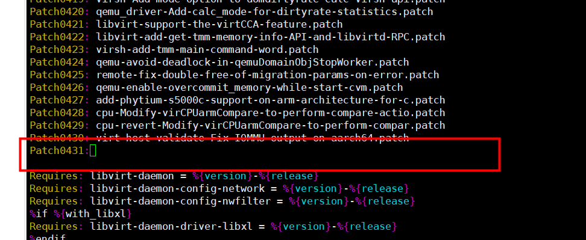
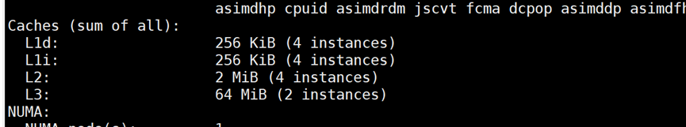
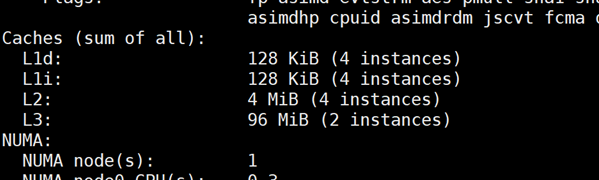
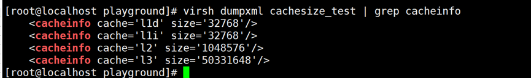

# Virtualization Scenario Topology Awareness User Guide

## Feature Description<a name="EN-US_TOPIC_0000002550128075"></a>

This document describes how to deploy and enable the topology awareness feature in virtualization scenarios on a Kunpeng server running the openEuler OS.

In an Arm-based virtual machine (VM) environment, a group of preset values are displayed by default when you view the cache size. These default values cannot accurately reflect the actual cache size used by the VM. In this case, the optimization of applications and OSs in the VM may be affected. To solve this problem, this feature provides a method of specifying the cache size in the VM XML configuration of libvirt or the QEMU command for starting VMs. By using this feature, the size of the cache used by a VM can be accurately reflected, and more accurate cache structure information is available for further optimizing the application performance in the VM. This feature is provided through the QEMU and libvirt patches.

**Version Requirements<a name="section152361333185213"></a>**

- Physical machine: openEuler 22.03 LTS SP4
- Virtual machine: openEuler 22.03 LTS SP4
- License requirement: none

**Application Scenarios<a name="section342793714538"></a>**

This feature enhances the accuracy of the cache structure information in VMs and improves the performance of a single service for gaming.

## Feature Usage<a name="EN-US_TOPIC_0000002550008067"></a>

### Environment Requirements<a name="EN-US_TOPIC_0000002518688214"></a>

Before using the feature, ensure that the hardware and software requirements are met.

**Hardware Requirements<a name="en-us_topic_0000001217080138_section10273165810425"></a>**

[**Table 1**](#hardware-requirement) lists the hardware requirement.

**Table 1** Hardware requirement<a id="hardware-requirement"></a>

|Item|Specifications|
|--|--|
|Processor|Kunpeng 920 series|

**OS and Software Requirements<a name="section1240364411598"></a>**

[**Table 2**](#os-and-software-requirements) lists the OS and software requirements.

**Table 2** OS and software requirements<a id="os-and-software-requirements"></a>

|Software|Version|How to Obtain|
|--|--|--|
|OS of the physical machine and VM|Verified version: openEuler 22.03 LTS SP4|[Link](https://mirrors.huaweicloud.com/openeuler/openEuler-22.03-LTS-SP4/ISO/aarch64/openEuler-22.03-LTS-SP4-everything-aarch64-dvd.iso)|
|QEMU|6.2.0|Code repository: [Link](https://gitee.com/src-openeuler/qemu/tree/openEuler-22.03-LTS-SP4/)<br>Patch: [Link](https://gitee.com/openeuler/qemu/pulls/1449)|
|libvirt|6.2.0|Code repository: [Link](https://gitee.com/src-openeuler/libvirt/tree/openEuler-22.03-LTS-SP4/)<br>Patch: [Link](https://gitee.com/openeuler/libvirt/pulls/315)|

### Enablement and Verification<a name="EN-US_TOPIC_0000002518528304"></a>

#### Installing libvirt and QEMU<a name="EN-US_TOPIC_0000002550008069"></a>

Configure the VM XML file or configure the QEMU command to start the VM to send the cache structure information to the VM. Before and after the feature is enabled, observe the cache structure information in the VM to check whether the feature is enabled successfully. Before the configuration, compile the RPM packages to install libvirt and QEMU.

1. <a id="li13594163933816"></a>Obtain the libvirt and QEMU code repositories.

    Run the following command to obtain libvirt for openEuler 22.03 LTS SP4:

    ```shell
    git clone https://gitee.com/src-openeuler/libvirt.git -b openEuler-22.03-LTS-SP4
    ```

    Run the following command to obtain QEMU for openEuler 22.03 LTS SP4:

    ```shell
    git clone https://gitee.com/src-openeuler/qemu.git -b openEuler-22.03-LTS-SP4
    ```

2. Obtain the libvirt and QEMU patches.
    - Check whether the code repositories in [step 1](#li13594163933816) have corresponding patches. If yes, you do not need to download the patches and you can directly go to [step 4](#li101064218395).

        libvirt patch name:

        ```txt
        libvirt-Support-specifying-the-cache-size-presented-.patch
        ```

        QEMU patch name:

        ```txt
        qapi-qom-Define-cache-enumeration-and-properties-for.patch
        hw-core-machine-smp-Initialize-caches_bitmap-before-.patch
        qemu-Support-specifying-the-cache-size-presented-to-.patch
        ```

    - If no patch is available, download the patches from the links described in [**Table 2**](#os-and-software-requirements). Go to the patch download address and click `Clone/Download` > `HTTPS` > `Email Patch`. On the displayed page, copy and save all the code in a `<Patch_name>.patch` file, and place the patch file in the directory where the `spec` file is located, which is in the cloned folder in [step 1](#li13594163933816). After the patches are downloaded, go to [step 3](#li24971128394).

3. <a id="li24971128394"></a>Modify `libvirt.spec` and `qemu.spec`.

    Modify the corresponding `spec` files. The following uses the `libvirt.spec` file as an example. At the end of the patch list in the `libvirt.spec` file, add the name of the downloaded libvirt patch file. The operations are similar for QEMU.

    

4. <a id="li101064218395"></a>Copy files.

    Take libvirt as an example. Copy all files (`libvirt-6.2.0.tar.xz`, `libvirt.spec`, `*`, and `patch`) to `/root/rpmbuild/SOURCES`. The operations are similar for QEMU.

5. Compile and install the dependency package.

    > **NOTE:**
    >- Compile libvirt and QEMU separately.
    >- Configure the Yum repository in advance.

    Compile and install related dependency package. Command for libvirt is as follows:

    ```shell
    yum-builddep -y /root/rpmbuild/SOURCES/libvirt.spec
    ```

    Command for QEMU is as follows:

    ```shell
    yum-builddep -y /root/rpmbuild/SOURCES/qemu.spec
    ```

6. Compile the RPM package.

    Compile and install related dependency package. Command for libvirt is as follows:

    ```shell
    rpmbuild -ba /root/rpmbuild/SOURCES/libvirt.spec
    ```

    Command for QEMU is as follows:

    ```shell
    rpmbuild -ba /root/rpmbuild/SOURCES/qemu.spec
    ```

7. Install the RPM package.

    Compile and install related dependency package. Commands for libvirt are as follows:

    ```shell
    cd /root/rpmbuild/RPMS/aarch64
    rpm -ivh libvirt* --nodeps --force
    ```

    Commands for QEMU are as follows:

    ```shell
    cd /root/rpmbuild/RPMS/aarch64
    rpm -ivh qemu* --nodeps --force
    ```

8. Check whether the installation is successful.

    Run the following command to query the libvirt and QEMU versions:

    ```shell
    virsh version
    ```

    

#### Configuring the VM Cache<a name="EN-US_TOPIC_0000002550128077" id="configuring-the-vm-cache"></a>

You can use libvirt or QEMU to start a VM. The following describes the cache size configuration for the two VM startup modes.

**Starting a VM Using libvirt<a name="section058302812215"></a>**

To start a VM using libvirt, you need to modify the cache configuration in the XML configuration file of the VM.

> **NOTE:**
>After modifying the VM XML file, you need to restart the VM for the configuration to take effect.

- If the L1 cache uses the instruction-data separation structure (for example, the Arm architecture), the configuration is as follows:

    ```xml
        ... 
        <cpu mode='host-passthrough'>
            <cacheinfo cache='l1d' size='<l1d cache_size>'/> //Example 32768
            <cacheinfo cache='l1i' size='<l1i cache_size>'/> //Example 32768
            <cacheinfo cache='l2' size='<l2 cache_size>'/> //Example 1048576
            <cacheinfo cache='l3' size='<l3 cache_size>'/> //Example 50331648
        </cpu>
        ... 
    ```

- If the L1 cache uses the unified cache structure, the configuration is as follows:

    ```xml
      ... 
        <cpu mode='host-passthrough'>
            <cacheinfo cache='l1' size='<l1 cache_size>'/> //Example 32768
            <cacheinfo cache='l2' size='<l2 cache_size>'/> //Example 1048576
            <cacheinfo cache='l3' size='<l3 cache_size>'/> //Example 50331648
        </cpu>
        ...
    ```

**(Optional) Starting a VM Using the QEMU Command or Device Tree<a name="section587337679"></a>**

If the QEMU command or device tree is used to start a VM, you need to modify the cache configuration in the QEMU command.

- If the L1 cache uses the instruction-data separation structure (for example, the Arm architecture), the configuration is as follows:

    ```txt
    -machine virt,\
    smp-cache.0.cache=l1i,smp-cache.0.size=<l1i cache_size>,\ //Example 32768
    smp-cache.1.cache=l1d,smp-cache.1.size=<l1d cache_size>,\ //Example 32768
    smp-cache.2.cache=l2,smp-cache.2.size=<l2 cache_size>,\ //Example 1048576
    smp-cache.3.cache=l3,smp-cache.3.size=<l3 cache_size>\ //Example 50331648
    ```

- If the L1 cache uses the unified cache structure, the configuration is as follows:

    ```txt
    -machine virt,\
    smp-cache.0.cache=l1,smp-cache.0.size=<l1 cache_size>,\ //Example 32768
    smp-cache.2.cache=l2,smp-cache.2.size=<l2 cache_size>,\ //Example 1048576
    smp-cache.3.cache=l3,smp-cache.3.size=<l3 cache_size>\ //Example 50331648
    ```

> **NOTE:**
>
>- The `l1i cache_size`, `l1d cache_size`, `l2 cache_size`, and `l3 cache_size` are the cache sizes displayed on the VM. To ensure accuracy, ensure that the cache sizes are the same as those used by the VM.
>- If the L1 cache uses the instruction-data separation structure, configure `l1d` and `l1i`. Otherwise, configure `l1`.
>- The cache size must be greater than 0.

#### Testing the VM Cache<a name="EN-US_TOPIC_0000002518528302"></a>

Before you modify the VM cache, the cache size displayed on the VM is the default size. After the cache configuration is modified, you can view the configured cache size on the VM.

1. Start the VM.

    > **NOTE:**
    >There are three methods for starting a VM. Generally, libvirt is used to start a VM.
    >You can also run the QEMU commands to start a VM or start a VM in device tree mode.

    - Use libvirt to start the VM.

        ```shell
        virsh start <VM_name>
        ```

    - Run the following QEMU commands to start the VM:

        ```shell
        qemu-kvm \
        -blockdev '{"driver":"file","filename":"<EFI_file_path>","node-name":"libvirt-pflash0-storage","auto-read-only":true,"discard":"unmap"}' \
        -blockdev '{"node-name":"libvirt-pflash0-format","read-only":true,"driver":"raw","file":"libvirt-pflash0-storage"}' \
        -blockdev '{"driver":"file","filename":"<nvram_file>","node-name":"libvirt-pflash1-storage","auto-read-only":true,"discard":"unmap"}' \
        -blockdev '{"node-name":"libvirt-pflash1-format","read-only":false,"driver":"raw","file":"libvirt-pflash1-storage"}' \
        -machine virt,usb=off,dump-guest-core=off,gic-version=3,pflash0=libvirt-pflash0-format,pflash1=libvirt-pflash1-format \
        -accel kvm \
        -cpu host \
        -m <Memory_size>\
        -smp <Number_of_vCPUs>\
        -drive file=<VM_drive_path>\
        -nographic
        ```

    - Run the following commands to start the VM in device tree mode:

        ```shell
        qemu-kvm \
        -kernel <Kernel_image>
        -smp <Number_of_vCPUs>\
        -m <Memory_size>\
        -accel kvm \
        -machine virt,gic-version=3,\
        -initrd <VM_image_file>\
        -cpu host \
        -nographic \
        -append "rdinit=init console=ttyAMA0 earlycon=pl011,0x90000000"
        ```

2. Check the initial cache size of the VM.

    Run the following command on the VM:

    ```shell
    lscpu
    ```

    The cache sizes of the VM displayed are the default values (L1d: 64 KiB, L1i: 64 KiB, L2: 512 KiB, L3: 32 MiB).

    

3. Configure the cache sizes.

    Configure the cache sizes of the VM as instructed in [Configuring the VM Cache](#configuring-the-vm-cache), and restart the VM.

4. Verify that the configurations have taken effect.
    1. Run the following command on the VM:

        ```shell
        lscpu
        ```

        The cache sizes are the same as the configured sizes.

        

    2. Run the following command on the physical machine:

        ```shell
        virsh dumpxml cachesize_test | grep cacheinfo
        ```

        The cache sizes in the XML file generated by the running VM are the same as the configured sizes.

        
