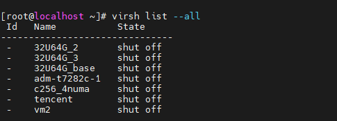
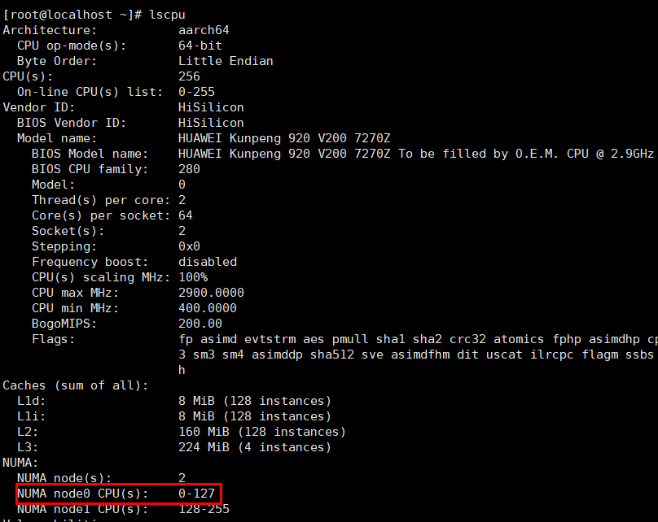

# Virtualization Scenario Topology Optimization Guide<a name="EN-US_TOPIC_0000002521088822"></a>

## Optimization Overview<a name="EN-US_TOPIC_0000002518687258"></a>

This document describes how to adjust the virtualization parameters of Kunpeng servers in KVM-based virtualization environments to achieve optimal performance.

In virtualized environments, multiple VMs share CPU core resources on the same physical host, which can create resource contention that leads to performance bottlenecks and degrades VM performance. By binding VM vCPUs to specific physical CPU cores, resources can be allocated more effectively, preventing resource over-concentration or underutilization and enhancing overall system performance. In the server CPU architecture, each socket encompasses multiple CPU dies, with each CPU die containing multiple clusters. Consequently, the varying microarchitectures of the physical CPU cores to which VM vCPUs are bound will influence the scope of resources available to those vCPUs.

> **NOTE:**
>-   A socket represents the physical packaging of a CPU, corresponding to a single, independent processor unit.
>-   A die refers to the core area of the CPU chip. It is a single piece of silicon containing the essential components of the CPU, such as the arithmetic units, cache, and control logic.
>-   A cluster is a logical grouping of several CPU cores on a chip, which share resources like cache.


## Environment Requirements<a name="EN-US_TOPIC_0000002550007099"></a>

This section describes the hardware and software requirements of the server to be optimized.

**Hardware Requirements<a name="section1815816277716"></a>**

[**Table 1**](#hardware-requirements) lists the hardware requirements.

**Table 1** Hardware requirements<a id="hardware-requirements"></a>

|Item|Description|
|--|--|
|Server|Kunpeng server|
|Processor|2 × new Kunpeng 920 processor model|
|Memory|Populate one DIMM Per Channel (1DPC) to maximize the memory performance. That is, populate all DIMM 0 slots first.|
|System drive|No special requirements|


**Software Requirements<a name="section102619448716"></a>**

[**Table 2**](#software-requirements) describes the software requirements.

**Table 2** Software requirements<a id="software-requirements"></a>

|Item|Version|How to Obtain|
|--|--|--|
|OS|openEuler 24.03 LTS SP1|[Link](https://mirrors.huaweicloud.com/openeuler/openEuler-24.03-LTS-SP1/ISO/aarch64/openEuler-24.03-LTS-SP1-everything-aarch64-dvd.iso)|
|libvirt|9.10.0|Install it using a Yum repository.|
|QEMU|8.2.0|Install it using a Yum repository.|


## Cluster Optimization Configuration for Four-NUMA-Node Scenarios<a name="EN-US_TOPIC_0000002518527338" id="cluster-optimization-configuration-for-four-numa-node-scenarios"></a>

Optimize CPU cluster configurations by binding VM vCPUs to specific physical CPU cores and configuring the vCPU topology to ensure the optimal performance for VMs.

To enhance VM performance, it is standard practice to assign VM vCPUs to particular physical CPU cores and define the VM vCPU topology. You are advised to perform 1:1 binding between VM vCPUs and physical CPU cores, and minimize the number of clusters that contain the bound physical CPU cores, to achieve peak performance.

> **NOTE:**
>This document uses a VM with 32 vCPUs and 64 GB memory as an example to describe how to optimize the cluster configuration. Adjust the parameters based on the actual requirements and VM specifications.

1. Find the name of the target VM.

    ```
    virsh list --all
    ```

    

2. Modify the VM XML file.

    ```
    virsh edit <VM_name>
    ```

    The following is a configuration example illustrating a cluster optimization policy. In this example, the `cputune` section establishes a 1:1 binding between vCPUs and physical CPU cores. In the `numatune` section, only one NUMA node is set for the VM, and `nodeset` points to the NUMA node where the physical CPU core is located. In the `cpu` section, configure one socket, one die, four clusters, with each cluster containing four vCPUs and a thread count of two per core.

    ```
    <domain type = 'KVM'>
    ...
      <vcpu placement='static'>32</vcpu>
      <cputune>
        <vcpupin vcpu='0' cpuset='8'/>
        <vcpupin vcpu='1' cpuset='9'/>
        <vcpupin vcpu='2' cpuset='10'/>
        <vcpupin vcpu='3' cpuset='11'/>
        <vcpupin vcpu='4' cpuset='12'/>
        <vcpupin vcpu='5' cpuset='13'/>
        <vcpupin vcpu='6' cpuset='14'/>
        <vcpupin vcpu='7' cpuset='15'/>
        <vcpupin vcpu='8' cpuset='16'/>
        <vcpupin vcpu='9' cpuset='17'/>
        <vcpupin vcpu='10' cpuset='18'/>
        <vcpupin vcpu='11' cpuset='19'/>
        <vcpupin vcpu='12' cpuset='20'/>
        <vcpupin vcpu='13' cpuset='21'/>
        <vcpupin vcpu='14' cpuset='22'/>
        <vcpupin vcpu='15' cpuset='23'/>
        <vcpupin vcpu='16' cpuset='24'/>
        <vcpupin vcpu='17' cpuset='25'/>
        <vcpupin vcpu='18' cpuset='26'/>
        <vcpupin vcpu='19' cpuset='27'/>
        <vcpupin vcpu='20' cpuset='28'/>
        <vcpupin vcpu='21' cpuset='29'/>
        <vcpupin vcpu='22' cpuset='30'/>
        <vcpupin vcpu='23' cpuset='31'/>
        <vcpupin vcpu='24' cpuset='32'/>
        <vcpupin vcpu='25' cpuset='33'/>
        <vcpupin vcpu='26' cpuset='34'/>
        <vcpupin vcpu='27' cpuset='35'/>
        <vcpupin vcpu='28' cpuset='36'/>
        <vcpupin vcpu='29' cpuset='37'/>
        <vcpupin vcpu='30' cpuset='38'/>
        <vcpupin vcpu='31' cpuset='39'/>
        <emulatorpin cpuset='8-39'/>
      </cputune>
    ...
      <numatune>
        <memnode cellid='0' mode='strict' nodeset='0'/>
      </numatune>
    ...
      <cpu mode='host-passthrough' check='none'>
        <topology sockets='1' dies='1' clusters='4' cores='4' threads='2'/>
     ...
      </cpu>
    ...
    <domain>
    ```


## CPU Optimization Configuration for Two-NUMA-Node Scenarios<a name="EN-US_TOPIC_0000002550127095"></a>

### Modifying BIOS Settings<a name="EN-US_TOPIC_0000002550127097"></a>

If the physical machine is configured with two NUMA nodes, modify the BIOS settings.

Enable `One Numa Per Socket` and `Die Interleaving` in the BIOS, as described in [**Table 1**](#bios-settings-for-the-two-numa-node-configuration).

**Table 1** BIOS settings for the two-NUMA-node configuration<a id="bios-settings-for-the-two-numa-node-configuration"></a>

|Option|Value|Option Path|
|--|--|--|
|One Numa Per Socket|Enabled|`Advanced` > `Memory Configuration` > `One Numa Per Socket`|
|Die Interleaving|Enabled|`Advanced` > `Memory Configuration` > `Die Interleaving`|


Set the options based on the recommended settings in the preceding table.

1. Restart the server and enter the BIOS.

    For details, see "Accessing the BIOS" in [TaiShan Server BIOS Parameter Reference (Kunpeng 920 Processor)](https://support.huawei.com/enterprise/en/doc/EDOC1100088647/426cffd9/about-this-document?idPath=23710424|251364417|9856629|252259139).

2. Enable `One Numa Per Socket`.

    In the BIOS, choose `Advanced` > `Memory Configuration` and set `One Numa Per Socket` to `Enabled`.

3. Enable `Die Interleaving`.

    In the BIOS, choose `Advanced` > `Memory Configuration` and set `Die Interleaving` to `Enabled`.

4. Press `F10` to save the BIOS configuration and restart the server.


### CPU Core Binding Optimization<a name="EN-US_TOPIC_0000002518527340"></a>

In a virtualization scenario with two NUMA nodes, optimize VM performance by adjusting the binding of vCPUs to physical machine dies and configuring the vCPU topology.

When a physical machine is configured with two NUMA nodes, each node typically contains two CPU dies. Due to performance overheads associated with cache and memory access between these dies, you are advised to prevent the physical CPU cores bound to VM vCPUs from spanning across different dies. For example, a new Kunpeng 920 processor model has 64 CPU cores per die. As shown below, in a two-NUMA-node setup, CPU cores 0 to 127 constitute NUMA node 0. This NUMA node 0 is further divided into two CPU dies: the first die includes cores 0 to 63, and the second die includes cores 64 to 127.



If the VM has fewer than 64 vCPUs, the optimal configuration is that all vCPUs are bound to the physical CPU cores of the first or second die. Do not bind vCPUs to the physical CPU cores across two dies.

The following is an example of CPU core binding optimization. In this example, the `cputune` section establishes a 1:1 binding between vCPUs and physical CPU cores, and all physical CPU cores are on the same CPU die. In the `numatune` section, only one NUMA node is set for the VM, and `nodeset` points to the NUMA node where the physical CPU core is located. In the `cpu` section, configure one socket, one die, four clusters, with each cluster containing four vCPUs and a thread count of two per core. Modify the VM XML file by referring to [Cluster Optimization Configuration for Four-NUMA-Node Scenarios](#cluster-optimization-configuration-for-four-numa-node-scenarios).

> **NOTE:**
>This document uses a VM with 32 vCPUs and 64 GB memory as an example to describe how to optimize CPU core binding. Adjust the parameters based on the actual requirements and VM specifications.

```
<domain type = 'KVM'>
...
  <vcpu placement='static'>32</vcpu>
  <cputune>
    <vcpupin vcpu='0' cpuset='64'/>
    <vcpupin vcpu='1' cpuset='65'/>
    <vcpupin vcpu='2' cpuset='66'/>
    <vcpupin vcpu='3' cpuset='67'/>
    <vcpupin vcpu='4' cpuset='68'/>
    <vcpupin vcpu='5' cpuset='69'/>
    <vcpupin vcpu='6' cpuset='70'/>
    <vcpupin vcpu='7' cpuset='71'/>
    <vcpupin vcpu='8' cpuset='72'/>
    <vcpupin vcpu='9' cpuset='73'/>
    <vcpupin vcpu='10' cpuset='74'/>
    <vcpupin vcpu='11' cpuset='75'/>
    <vcpupin vcpu='12' cpuset='76'/>
    <vcpupin vcpu='13' cpuset='77'/>
    <vcpupin vcpu='14' cpuset='78'/>
    <vcpupin vcpu='15' cpuset='79'/>
    <vcpupin vcpu='16' cpuset='80'/>
    <vcpupin vcpu='17' cpuset='81'/>
    <vcpupin vcpu='18' cpuset='82'/>
    <vcpupin vcpu='19' cpuset='83'/>
    <vcpupin vcpu='20' cpuset='84'/>
    <vcpupin vcpu='21' cpuset='85'/>
    <vcpupin vcpu='22' cpuset='86'/>
    <vcpupin vcpu='23' cpuset='87'/>
    <vcpupin vcpu='24' cpuset='88'/>
    <vcpupin vcpu='25' cpuset='89'/>
    <vcpupin vcpu='26' cpuset='90'/>
    <vcpupin vcpu='27' cpuset='91'/>
    <vcpupin vcpu='28' cpuset='92'/>
    <vcpupin vcpu='29' cpuset='93'/>
    <vcpupin vcpu='30' cpuset='94'/>
    <vcpupin vcpu='31' cpuset='95'/>
    <emulatorpin cpuset='64-95'/>
  </cputune>
...
  <numatune>
    <memnode cellid='0' mode='strict' nodeset='0'/>
  </numatune>
...
  <cpu mode='host-passthrough' check='none'>
    <topology sockets='1' dies='1' clusters='4' cores='4' threads='2'/>
...
  </cpu>
...
<domain>
```


## Acronyms and Abbreviations<a name="EN-US_TOPIC_0000002518687256"></a>

|**Acronym/Abbreviation**|**Full Spelling**|
|--|--|
|NUMA|Non-Uniform Memory Access|
|KVM|Kernel-based Virtual Machine|
|DIMM|Dual Inline Memory Module|
|DIMM0|Dual Inline Memory Module slot 0|
