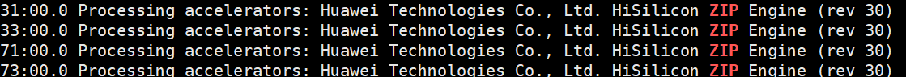
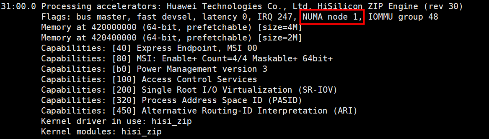
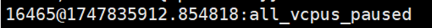
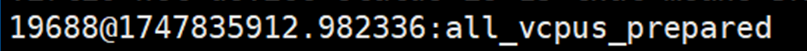

# vKAE Passthrough Live Migration Feature Guide

## Feature Description<a name="EN-US_TOPIC_0000002518686500"></a>

This document describes how to deploy and enable the vKAE passthrough live migration feature in virtualization scenarios on a Kunpeng server running the openEuler OS, and how to perform related function and performance tests.

VM live migration is an important O&M method, allowing a VM to be migrated from one physical host to another without interrupting the VM running. vKAE passthrough live migration specifically addresses the scenario where VMs are configured with KAE passthrough devices, offering enhanced operational flexibility and continuous service availability. The current live migration with passthrough devices relies on device-specific DMA dirty page marking, which many passthrough devices lack, limiting migration capabilities. The SMMU of the new Kunpeng 920 processor model introduces dirty page marking based on Hardware Translation Table Update (HTTU). By combining this hardware feature with an optimized software framework, robust passthrough device migration support is implemented, significantly strengthening competitiveness of Kunpeng virtualization.

**Version Requirements<a name="section152361333185213"></a>**

- Physical machine: openEuler 22.03 LTS SP4 or openEuler 24.03 LTS SP3
- QEMU 6.2.0 or 8.2.0
- libvirt 6.2.0 or 9.10.0
- License requirement: none

**Constraints<a name="section13017391482"></a>**

- The original live migration constraints are inherited.
- Passthrough devices other than KAE devices cannot be live migrated.
- The performance is optimal if KAE passthrough devices in a VM are located on the same NUMA node.

**Application Scenarios<a name="section342793714538"></a>**

The VM needs to use KAE devices and live migration is required.

## Feature Installation and Usage<a name="EN-US_TOPIC_0000002518686506"></a>

### Environment Requirements<a name="EN-US_TOPIC_0000002518686504"></a>

Before using the feature, ensure that the hardware and software requirements are met.

**Hardware Requirements<a name="en-us_topic_0000001217080138_section10273165810425"></a>**

[**Table 1**](#hardware-requirement) lists the hardware requirement.

**Table 1** Hardware requirement<a id="hardware-requirement"></a>

|Item|Specifications|
|--|--|
|Processor|Kunpeng 920 series processor or Kunpeng 950 processor|

**OS and Software Requirements<a name="section1240364411598"></a>**

[**Table 2**](#verified-os-and-software-versions) lists the OS and software requirements. The BIOS and firmware versions must be consistent between the migration source and target.

**Table 2** Verified OS and software versions<a id="verified-os-and-software-versions"></a>

|Software|Version|How to Obtain|
|--|--|--|
|OS|openEuler 22.03 LTS SP4 <br> openEuler 24.03 LTS SP3|[Link](https://mirrors.huaweicloud.com/openeuler/openEuler-22.03-LTS-SP4/ISO/aarch64/openEuler-22.03-LTS-SP4-everything-aarch64-dvd.iso) <br> [Link](https://mirrors.huaweicloud.com/openeuler/openEuler-24.03-LTS-SP3/ISO/aarch64/openEuler-24.03-LTS-SP3-everything-aarch64-dvd.iso)|
|QEMU|6.2.0 <br> 8.2.0|Code repository: [Link](https://gitee.com/src-openeuler/qemu/tree/openEuler-22.03-LTS-SP4/) <br> Install it using a Yum repository.|
|libvirt|6.2.0 <br> 9.10.0|Code repository: [Link](https://gitee.com/src-openeuler/libvirt/tree/openEuler-22.03-LTS-SP4/) <br> Install it using a Yum repository.|
|KAE|2.0|Code repository: [Link](https://gitcode.com/boostkit/KAE)|

### Installing KAE<a name="EN-US_TOPIC_0000002550006357"></a>

The KAE 2.0 source package contains the KAE kernel driver, UADK framework, KAEOpensslEngine, KAEZstd, KAELz4, and KAEZlib. The KAE kernel driver and UADK are mandatory, and the other modules are optional. This document uses the KAEOpensslEngine and KAEZlib as an example to verify the feature functions and performance. You can install the KAEOpensslEngine and KAEZlib as instructed in this section.

Install KAE on the physical machine and VM.

1. Download the KAE 2.0 source package.

    ```shell
    git clone https://gitee.com/kunpengcompute/KAE.git -b kae2
    ```

2. Install the dependencies. Before the installation, configure the Yum repository.

    ```shell
    yum -y install kernel-devel-$(uname -r) openssl-devel numactl-devel gcc make autoconf automake libtool patch
    ```

3. Install the kernel driver in the KAE source code directory.
    - openEuler 22.03 LTS SP4

        ```shell
        cd KAE
        sh build.sh driver
        ```

    - openEuler 24.03 LTS SP3

        ```shell
        cd KAE
        sh build.sh driver_migration
        ```

4. Check whether the driver is installed.

    Check whether the accelerator engine file system exists in `/sys/class/uacce`.

    ```shell
    ll /sys/class/uacce/
    ```

    If the following information is displayed, the driver has been installed:

    ```txt
    lrwxrwxrwx. 1 root root 0 Aug 22 17:14 hisi_hpre-2 -> ../../devices/pci0000:78/0000:78:00.0/0000:79:00.0/uacce/hisi_hpre-2
    lrwxrwxrwx. 1 root root 0 Aug 22 17:14 hisi_hpre-3 -> ../../devices/pci0000:b8/0000:b8:00.0/0000:b9:00.0/uacce/hisi_hpre-3
    lrwxrwxrwx. 1 root root 0 Aug 22 17:14 hisi_sec2-0 -> ../../devices/pci0000:74/0000:74:01.0/0000:76:00.0/uacce/hisi_sec2-0
    lrwxrwxrwx. 1 root root 0 Aug 22 17:14 hisi_sec2-1 -> ../../devices/pci0000:b4/0000:b4:01.0/0000:b6:00.0/uacce/hisi_sec2-1
    lrwxrwxrwx. 1 root root 0 Aug 22 17:14 hisi_zip-4 -> ../../devices/pci0000:74/0000:74:00.0/0000:75:00.0/uacce/hisi_zip-4
    lrwxrwxrwx. 1 root root 0 Aug 22 17:14 hisi_zip-5 -> ../../devices/pci0000:b4/0000:b4:00.0/0000:b5:00.0/uacce/hisi_zip-5
    ```

5. Install the UADK framework.
    1. Run the following command to install the UADK framework:

        ```shell
        sh build.sh uadk
        ```

        The UADK framework contains user-space drivers whose dynamic library files are `libwd.so` and `libwd_crypto.so`. The default UADK installation path is `/usr/include/uadk`. The dynamic library files are stored in `/usr/local/lib`.

        > **NOTE:**
        >If the UADK installation fails and a message is displayed indicating that header files are missing, install the related dependency packages and run the installation command again.

    2. Check whether the UADK framework is successfully installed.

        ```shell
        ll /usr/local/lib/libwd*
        ```

        The installation is successful if the following information is displayed:

        ```txt
        -rwxr-xr-x. 1 root root     961 Aug 22 17:23 /usr/local/lib/libwd_comp.la
        lrwxrwxrwx. 1 root root      19 Aug 22 17:23 /usr/local/lib/libwd_comp.so -> libwd_comp.so.2.5.0
        lrwxrwxrwx. 1 root root      19 Aug 22 17:23 /usr/local/lib/libwd_comp.so.2 -> libwd_comp.so.2.5.0
        -rwxr-xr-x. 1 root root  377872 Aug 22 17:23 /usr/local/lib/libwd_comp.so.2.5.0
        -rwxr-xr-x. 1 root root     973 Aug 22 17:23 /usr/local/lib/libwd_crypto.la
        lrwxrwxrwx. 1 root root      21 Aug 22 17:23 /usr/local/lib/libwd_crypto.so -> libwd_crypto.so.2.5.0
        lrwxrwxrwx. 1 root root      21 Aug 22 17:23 /usr/local/lib/libwd_crypto.so.2 -> libwd_crypto.so.2.5.0
        -rwxr-xr-x. 1 root root  715616 Aug 22 17:23 /usr/local/lib/libwd_crypto.so.2.5.0
        -rwxr-xr-x. 1 root root     907 Aug 22 17:23 /usr/local/lib/libwd.la
        lrwxrwxrwx. 1 root root      14 Aug 22 17:23 /usr/local/lib/libwd.so -> libwd.so.2.5.0
        lrwxrwxrwx. 1 root root      14 Aug 22 17:23 /usr/local/lib/libwd.so.2 -> libwd.so.2.5.0
        -rwxr-xr-x. 1 root root 1342080 Aug 22 17:23 /usr/local/lib/libwd.so.2.5.0
        ```

6. Compile and install KAEOpensslEngine.

    - OpenSSL 1.1.1*x*:
        - Use OpenSSL in the default path.

            ```shell
            sh build.sh engine
            ```

        - Use OpenSSL in a custom path.

            ```shell
            sh build.sh engine /usr/local/ssl1_1_1w
            ```

    - OpenSSL 3.0.*x*:
        - Use OpenSSL in the default path.

            ```shell
            sh build.sh engine3
            ```

        - Use OpenSSL in a custom path.

            ```shell
            sh build.sh engine3 /usr/local/ssl3_0_14
            ```

    - Tongsuo:
        - Use Tongsuo in the default path.

            ```shell
            sh build.sh engine3_tongsuo
            ```

        - Use Tongsuo in a custom path.

            ```shell
            sh build.sh engine3_tongsuo /opt/tongsuo
            ```

    The KAE dynamic library file is `libkae.so`. The dynamic library file is in `/usr/local/lib/engines-x.x` or `/usr/local/tongsuo/lib/engines-3.0`.

7. Check whether KAE is successfully installed.

    - OpenSSL 1.1.1*x*:

        ```shell
        ll /usr/local/lib/engines-1.1
        ```

    - OpenSSL 3.0.*x*:

        ```shell
        ll /usr/local/lib/engines-3.0
        ```

    - Tongsuo 8.4.0:

        ```shell
        ll /usr/local/tongsuo/lib/engines-3.0
        ```

    The installation is successful if the following information is displayed:

    ```txt
    total 5644
    -rw-r--r--. 1 root root 3846524 Aug 22 17:28 kae.a
    -rwxr-xr-x. 1 root root     995 Aug 22 17:28 kae.la
    lrwxrwxrwx. 1 root root      12 Aug 22 17:28 kae.so -> kae.so.2.0.0
    lrwxrwxrwx. 1 root root      12 Aug 22 17:28 kae.so.2 -> kae.so.2.0.0
    -rwxr-xr-x. 1 root root 1967736 Aug 22 17:28 kae.so.2.0.0
    ```

8. Compile and install the KAEZlib library.

    > **NOTICE:**
    >After installing KAEZlib, you can compile and install the KAEGzip decompression tool as required. The tool integrates the KAE hardware-based acceleration API, enabling you to compress and decompress files more conveniently. For details about the installation procedure, see [8.3](#li20414340916) to [8.4](#li5793114715813).

    1. Perform the compilation and installation.

        ```shell
        sh build.sh zlib
        ```

        The zlib library is installed in `/usr/local/kaezip`.

    2. Check whether the zlib compression library is successfully installed.

        ```shell
        ll /usr/local/kaezip/lib/
        ```

        The installation is successful if the following information is displayed:

        ```txt
        lrwxrwxrwx. 1 root root     40 Aug 29 10:20 libkaezip.so -> /usr/local/kaezip/lib/libkaezip.so.2.0.0
        lrwxrwxrwx. 1 root root     40 Aug 29 10:20 libkaezip.so.0 -> /usr/local/kaezip/lib/libkaezip.so.2.0.0
        -rwxr-xr-x. 1 root root 148096 Aug 29 10:20 libkaezip.so.2.0.0
        -rw-r--r--. 1 root root 145674 Aug 29 10:20 libz.a
        lrwxrwxrwx. 1 root root     14 Aug 29 10:20 libz.so -> libz.so.1.2.11
        lrwxrwxrwx. 1 root root     14 Aug 29 10:20 libz.so.1 -> libz.so.1.2.11
        -rwxr-xr-x. 1 root root 144784 Aug 29 10:20 libz.so.1.2.11
        drwxr-xr-x. 2 root root   4096 Aug 29 10:20 pkgconfig
        ```

    3. <a id="li20414340916"></a>Compile and install KAEGzip.

        ```shell
        sh build.sh gzip
        ```

        The tool is installed in `/usr/local/kaegzip`.

    4. <a id="li5793114715813"></a>Check whether KAEGzip is successfully installed.

        ```shell
        ldd /usr/local/kaegzip/gzip
        ```

        The installation is successful if the following information is displayed:

        ```txt
        [root@localhost /]# ldd /usr/local/kaegzip/gzip 
         linux-vdso.so.1 (0x0000ffff7fbc1000)
         libz.so.1 => /usr/local/kaezip/lib/libz.so.1 (0x0000ffff7fb50000)
         libwd.so.2 => /usr/local/lib/libwd.so.2 (0x0000ffff7fae0000)
         libkaezip.so => /usr/local/kaezip/lib/libkaezip.so (0x0000ffff7fa90000)
         libc.so.6 => /usr/lib64/libc.so.6 (0x0000ffff7f8e0000)
         /lib/ld-linux-aarch64.so.1 (0x0000ffff7fb84000)
         libwd_comp.so.2 => /usr/local/lib/libwd_comp.so.2 (0x0000ffff7f8a0000)
         libnuma.so.1 => /usr/lib64/libnuma.so.1 (0x0000ffff7f870000)
        ```

### Enabling a Device<a name="EN-US_TOPIC_0000002518526590"></a>

This section uses the KAE ZIP device as an example to describe how to enable the device on a physical machine.

1. Enable the drivers on the physical machine.
    - If the host OS is openEuler 22.03 LTS SP4, run the following commands to enable the drivers:

        ```shell
        modprobe hisi_zip pf_q_num=32
        modprobe hisi_migration
        ```

    - If the host OS is openEuler 24.03 LTS SP3, run the following commands to enable the drivers:

        ```shell
        insmod /lib/modules/`uname -r`/extra/uacce.ko
        insmod /lib/modules/`uname -r`/extra/hisi_qm.ko
        insmod /lib/modules/`uname -r`/extra/hisi_zip.ko
        insmod /lib/modules/`uname -r`/extra/hisi_hpre.ko
        insmod /lib/modules/`uname -r`/extra/hisi_sec2.ko
        insmod /lib/modules/`uname -r`/extra/hisi-acc-vfio-pci.ko
        ```

2. Query the BDF identifier of the ZIP device.

    ```shell
    lspci | grep ZIP
    ```

    

3. (Optional) Check the NUMA node where the ZIP device is located.

    ```shell
    lspci -s 31:00.0 -v
    ```

    

    > **NOTE:**
    >The performance is optimal if KAE passthrough devices in a VM are located on the same NUMA node.

4. Set virtual functions (VFs) on the physical machine.
    - If the host OS is openEuler 22.03 LTS SP4, run the following commands to set VFs:

        ```shell
        echo 8 > /sys/bus/pci/devices/0000:31:00.0/sriov_numvfs
        echo 0000:31:00.1 > /sys/bus/pci/drivers/hisi_zip/unbind
        echo vfio-pci > /sys/devices/pci0000:30/0000:30:00.0/0000:31:00.1/driver_override
        echo 0000:31:00.1 > /sys/bus/pci/drivers_probe
        ```

    - If the host OS is openEuler 24.03 LTS SP3, run the following commands to set VFs:

        ```shell
        echo 8 > /sys/bus/pci/devices/0000:31:00.0/sriov_numvfs
        echo 0000:31:00.1 > /sys/bus/pci/drivers/hisi_zip/unbind
        echo hisi_acc_vfio_pci > /sys/devices/pci0000:30/0000:30:00.0/0000:31:00.1/driver_override
        echo 0000:31:00.1 > /sys/bus/pci/drivers_probe
        ```

### Configuring the VM XML File<a name="EN-US_TOPIC_0000002518526594"></a>

Modify the KAE passthrough device parameters in the VM XML file to enable the vKAE live migration function.

**openEuler 22.03 LTS SP4<a name="section28685191351"></a>**

In the VM XML file, set the `migration` parameter of the KAE passthrough device to `on` to enable the vKAE live migration function.

The XML configuration is as follows:

```xml
    ...
    <devices>
        ...
        <hostdev mode='subsystem' type='pci' migration='on'>
            <driver name='vfio'/>
            <source>
                <address bus='0x31' slot='0x00' function='0x1'/>
            </source>
        </hostdev>
        ...
    </devices>
    ... 
```

**openEuler 24.03 LTS SP3<a name="section3214135715356"></a>**

In the VM XML file, set the `migration` parameter of the KAE passthrough device to `on` to enable the vKAE live migration function. Set `managed` to `no` to prevent libvirt from automatically replacing a KAE driver with a version that does not support live migration.

The XML configuration is as follows:

```xml
    ...
    <devices>
        ...
        <hostdev mode='subsystem' type='pci' managed='no' migration='on'>
            <driver name='vfio'/>
            <source>
                <address domain='0x0000' bus='0x31' slot='0x00' function='0x1'/>
            </source>
        </hostdev>
        ...
    </devices>
    ... 
```

## Feature Verification<a name="EN-US_TOPIC_0000002550006353"></a>

### Function Tests<a name="EN-US_TOPIC_0000002550126359"></a>

The function test only verifies whether the vKAE passthrough is successful and whether the vKAE device functions properly within the VM.

> **NOTICE:**
>If the VM drive image is not stored on a shared storage device, copy the VM drive image to the same directory on the target physical machine in advance.

1. Start the VM.

    ```shell
    virsh start <VM_name> --console
    ```

2. Compile the test tool.

    ```shell
    export LD_LIBRARY_PATH=/usr/local/kaezip/lib:$ LD_LIBRARY_PATH
    cd KAEZlib/test/perftest
    make
    ```

    > **NOTE:**
    >`KAEZlib/test/perftest` is in the KAE 2.0 source package downloaded in [Installing KAE](#installing-kae).

3. Use KAE to execute the compression task on the VM.

    ```shell
    ./kaezip_perf -m 6 -l 10240 -n 3000
    ```

4. Perform VM live migration on the source physical machine.

    ```shell
    virsh migrate --live --unsafe <VM_name> qemu+ssh://<IP_address_of_the_target_physical_machine>/system tcp://<IP_address_of_the_target_physical_machine>
    ```

5. After the migration is complete, log in to the target physical machine, and check whether the KAE compression task is complete.

    

### Performance Tests<a name="EN-US_TOPIC_0000002518686502"></a>

The performance test verifies whether VMs can be live migrated after vKAE passthrough and whether the service interruption time during the migration meets the performance requirements.

**Configuring Live Migration Parameters<a name="section9567115812316"></a>**

1. Open the file.

    ```shell
    virsh edit <VM_name>
    ```

2. Press `i` to enter the insert mode, add the `qemu:commandline` tag to the end of the XML file, and enable the `all_vcpus_paused` and `all_vcpus_prepared` trace events.

    ```xml
    <domain type="kvm" xmlns:qemu='http://libvirt.org/schemas/domain/qemu/1.0'>
        ...
        <qemu:commandline>
            <qemu:arg value='--trace'/>
            <qemu:arg value='all_vcpus*'/>
        </qemu:commandline>
    </domain>
    ```

3. Press `Esc` to exit the insert mode. Type `:wq!` and press `Enter` to save the file and exit.
4. Set the console log level to prevent KAE device driver logs from being printed to the serial port.

    ```shell
    sysctl -w kernel.printk="4 4 1 7"
    ```

5. Synchronize the local time of the migration source and target.

    ```shell
    ntpdate <NTP_server_IP_address>
    ```

6. Check whether the time is consistent.

    ```shell
    date +%Y-%m-%d\ %H:%M:%S.%3N
    ```

7. Set `downtime-limit` to `100`.

    ```shell
    virsh migrate-setmaxdowntime <VM_name> 100
    ```

**(Optional) Adding Service Pressure (Compression Task)<a name="section145832027152420"></a>**

1. Compile the test tool.

    ```shell
    export LD_LIBRARY_PATH=/usr/local/kaezip/lib:$ LD_LIBRARY_PATH
    cd KAEZlib/test/perftest
    make
    ```

    > **NOTE:**
    >`KAEZlib/test/perftest` is in the KAE 2.0 source package downloaded in [Installing KAE](#installing-kae).

2. Use KAE to accelerate the compression task on the VM.

    ```shell
    ./kaezip_perf -m 6 -l 10240 -n 3000
    ```

**(Optional) Adding Service Pressure (Nginx Task)<a name="section163529918256"></a>**

1. Deploy Nginx on the VM. For details, see section [Deploying Nginx on a VM](https://www.hikunpeng.com/document/detail/en/kunpengcpfs/basicAccelFeatures/comAccel/kunpengvkae_20_016.html) in the *vKAE Feature Guide*.
2. Deploy httpress on the client. For details, see section [Deploying httpress on the Client](https://www.hikunpeng.com/document/detail/en/kunpengcpfs/basicAccelFeatures/comAccel/kunpengvkae_20_017.html) in the *vKAE Feature Guide*.
3. On the client, use httpress to perform pressure tests on Nginx. For details, see [Testing the vKAE Performance Using httpress in the Nginx Application Scenario](https://www.hikunpeng.com/document/detail/en/kunpengcpfs/basicAccelFeatures/comAccel/kunpengvkae_20_020.html) in the *vKAE Feature Guide*.

**Performing the Migration Test<a name="section1344823416258"></a>**

1. Perform VM live migration on the source physical machine.

    ```shell
    virsh migrate --live --unsafe <VM_name> qemu+ssh://<IP_address_of_the_target_physical_machine>/system tcp://<IP_address_of_the_target_physical_machine>
    ```

2. After the migration is complete, view the `all_vcpus_paused` event in the log of the migration source and the `all_vcpus_prepared` event in the log of the migration target. Calculate the live migration downtime (unit: second) by determining the difference between the two timestamps. Check whether the downtime is less than 200 ms.

    View the logs.

    ```shell
    less /var/log/libvirt/qemu/<VM_name>.log
    ```

    <br>

    

## Troubleshooting<a name="EN-US_TOPIC_0000002550126357"></a>

### No Device File Is Queried After the Device Is Restarted and a Driver Is Installed on a Physical Machine Running openEuler 22.03 LTS SP4<a name="EN-US_TOPIC_0000002518526592"></a>

**Symptom<a name="en-us_topic_0000001216835577_section3941254"></a>**

After the device is restarted and a driver is installed on the physical machine running openEuler 22.03 LTS SP4, no device file is queried.

**Key Process and Cause Analysis<a name="en-us_topic_0000001216835577_section35471290"></a>**

This issue is caused by the incompatibility of the accelerator driver built in openEuler 22.03 LTS SP4.

**Conclusion and Solution<a name="en-us_topic_0000001216835577_section50806158"></a>**

Uninstall the acceleration driver built in the OS and reload the manually compiled KAE. Alternatively, add the driver reloading command to the startup script `rc.local`. The following uses `hisi_sec2` as an example.

```shell
rmmod hisi_sec2
modprobe hisi_sec2
```

### No Device File Is Queried After the Device Is Restarted and a Driver Is Installed on a Physical Machine Running openEuler 24.03 LTS SP3<a name="EN-US_TOPIC_0000002550006355"></a>

**Symptom<a name="en-us_topic_0000001216835577_section3941254"></a>**

After the device is restarted and a driver is installed on the physical machine running openEuler 24.03 LTS SP3, no device file is queried.

**Key Process and Cause Analysis<a name="en-us_topic_0000001216835577_section35471290"></a>**

This issue is caused by the incompatibility of the accelerator driver built in openEuler 24.03 LTS SP3.

**Conclusion and Solution<a name="en-us_topic_0000001216835577_section50806158"></a>**

Uninstall the acceleration driver built in the OS and reload the manually compiled KAE. Alternatively, add the driver reloading command to the startup script `rc.local`. The following uses `hisi_sec2` as an example.

```shell
rmmod hisi_sec2
insmod /lib/modules/`uname -r`/extra/hisi_sec2.ko
```
