# vKAE Feature Guide

## Feature Description<a name="EN-US_TOPIC_0000002005411138"></a>

### Introduction<a name="EN-US_TOPIC_0000002005252850"></a>

This document describes how to deploy and enable virtual Kunpeng Accelerator Engine (vKAE) on a Kunpeng server running openEuler, and provides methods for testing vKAE and solutions to faults that may occur during the deployment.

The cloud native environments are becoming more widely used today. Nginx, as an important network proxy and load balancer, faces great challenges in processing HTTPS traffic, especially in processing the asymmetric encryption in the SSL/TLS handshake phase. This has become a major bottleneck of CPU performance. To address this issue, hardware-based acceleration technologies are widely used in the industry to offload heavy encryption and decryption tasks from the CPU to dedicated hardware for processing. This reduces overheads and waiting time of CPU switchovers, thereby improving the efficiency and optimizing overall network forwarding performance.

The Kunpeng Accelerator Engine (KAE) is a hardware-based acceleration solution built on Kunpeng processors. It supports encryption, decryption, and decompression. The KAE encryption and decryption module accelerates Secure Sockets Layer (SSL) and Transport Layer Security (TLS) applications. The KAE decompression modules accelerate data compression and decompression, greatly reducing processor consumption and improving efficiency.

vKAE is also a hardware-based acceleration solution based on Kunpeng 920 processors, dedicated for virtualization and cloud native scenarios. Its core advantage is to efficiently process the SSL/TLS handshake phase, especially for asymmetric encryption algorithms such as RSA algorithm, in HTTPS requests. vKAE offers two types of flexible APIs, standard OpenSSL APIs and customized APIs, which allow vKAE to be applied to general software such as Nginx and customer-developed applications to gain better performance. To use vKAE, ensure that KAE has been installed and a VM has been created on the host OS, KAE has been installed on the created VM, and related configurations have been completed on the host OS.

Through the OpenSSL APIs provided by vKAE, Nginx can accelerate the encryption algorithm during HTTPS request processing in the VM environment, improving network forwarding performance.

### Software Architecture<a name="EN-US_TOPIC_0000002005411110"></a>

vKAE consists of the guest OS, host OS, and KAE hardware.

The vKAE acceleration process is similar to the process of using KAE on a physical machine to perform hardware-based acceleration for the RSA encryption and decryption algorithms. The High Performance RSA Engine (HPRE) device of the physical machine is used to create virtual functions (VFs). These VFs are then passed through to the VM, for the VM to use vKAE to perform hardware-based acceleration for the RSA encryption and decryption algorithms. All these are applicable in Nginx scenarios to improve network forwarding performance.

[**Figure 1**](#architecture-of-the-vkae-feature) shows the vKAE feature architecture. [**Table 1**](#functions-of-modules-in-the-vkae-feature) describes the functions of each module.

**Figure 1** Architecture of the vKAE feature<a name="fig138061989173"></a><a id="architecture-of-the-vkae-feature"></a>
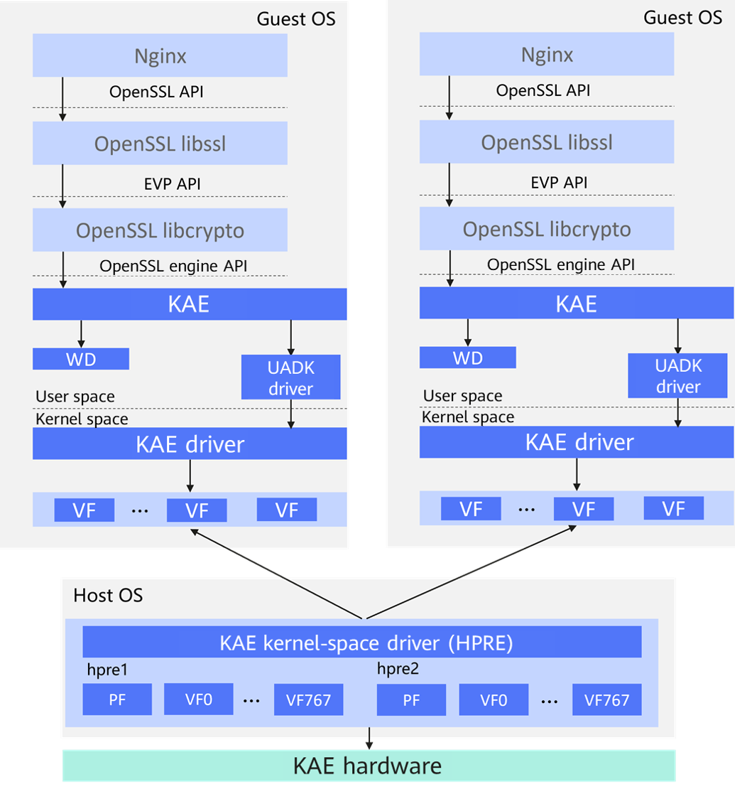

**Table 1** Functions of modules in the vKAE feature<a id="functions-of-modules-in-the-vkae-feature"></a>

|Name|Functionality|
|--|--|
|Host OS|OS of the physical machine.|
|Guest OS|OS of a VM.|
|KAE hardware|Hardware implementation of the accelerator integrated in the Kunpeng 920 processor, which is not directly open to users.|
|KAE kernel-space driver (HPRE)|Driver of the KAE accelerator card in kernel space. HPRE is used in encryption and decryption scenarios to directly interact with the KAE accelerator card. Each HPRE device provides 1,024 queues for a Kunpeng 920 server.|
|Physical function (PF)|Supports the Peripheral Component Interconnect (PCI) function of Single Root I/O Virtualization (SR-IOV) and fully configures or controls Peripheral Component Interconnect express (PCIe) device resources. By default, a single PF uses 256 queues in an HPRE device.|
|VF|A lightweight PCIe function that is associated with a PF. A VF can share one or more physical resources with the PF and other VFs associated with the same PF. 768 queues are reserved for VFs in one HPRE device. Number of VF queues = (1024 – Number of PF queues)/Number of VFs. The remainder queues are added to the last VF. You are advised to virtualize one PF into eight VFs.|
|Warpdriver (WD)|Acceleration driver, unified driver API in user space.|
|UADK driver|The User-space Accelerator Development Kit (UADK) is a general accelerator solution based on the Unified/User-space-access-intended Accelerator Framework (UACCE) kernel module and Linux Shared Virtual Addressing (SVA). This solution provides a user-space library, and users need to call related APIs to implement required functions for hardware-based acceleration.|
|KAE|Intermediate layer between applications and hardware, which is responsible for the data input and output during encryption and decryption operations. The main operations include I/O read and write between user applications and the KAE hardware device.|
|OpenSSL engine API|Engine loading framework that is provided by OpenSSL for the third party, allowing users to use proprietary hardware to complete cryptographic algorithms.|
|EVP API|EVP APIs are implemented by libcrypto to enable applications to perform cryptographic operations. The Core and Provider components are used to implement EVP APIs.|
|OpenSSL API|Open-source application suite consisting of OpenSSL libcrypto, OpenSSL libssl, and OpenSSL CLI.|
|OpenSSL libcrypto|OpenSSL cryptography library, which provides general cryptographic functions and contains a variety of encryption and decryption algorithms.|
|OpenSSL libssl|Library in OpenSSL that supports TLS (SSL and TLS protocols) and depends on libcrypto.|
|Nginx|Nginx application.|

### Specifications<a name="EN-US_TOPIC_0000002005252858"></a>

vKAE supports hardware-based acceleration on VMs allocated by servers powered by Kunpeng 920 processors. vKAE supports multiple VM specifications, such as 4C8G/8C16G/16C32G/32C64G, and is also applicable in container scenarios.

> **NOTE:**
>In the VM specifications, "4C8G" indicates that 4 vCPUs and 8 GB memory are allocated to the VM. This rule also applies to other specifications.

- vKAE performs hardware-based acceleration for the RSA algorithm using the VF passthrough to VMs. The `openssl speed` command is used to test the performance. The test result shows that the performance is tripled after vKAE is used. The improved performance is as good as that improved by KAE on a physical server. Compared with using KAE on a physical server, using vKAE on a VM has no performance loss.
- In the OpenSSL application environment, the `openssl speed` command is used to test the performance on a VM that is configured with vKAE. It is found that the performance trend is directly associated with the number of vCPU cores. In the synchronous or asynchronous operation mode, the performance upper limit of RSA-sign highly depends on the number of vCPU cores allocated to the VM.

    In a VM with 64 vCPU cores, the maximum throughput of RSA-sign reaches about 54,000 signs per second. When the number of vCPU cores is doubled to 128, the maximum throughput also doubles, reaching about 108,000 signs per second. This proves the association between performance improvement and CPU resource expansion.

- vKAE supports the asynchronous mode of Nginx 1.21.5 (and later versions), which aims to provide hardware-based acceleration for the RSA algorithm during HTTPS handshake process, thereby improving the performance.
- Tests are performed using the httpress tool on an 8C16G VM in the Nginx scenario. It is observed that before the CPU performance does not reach the bottleneck with the enablement of vKAE, the asynchronous mode supported by vKAE demonstrates better performance than the synchronous mode: The request per second (RPS) in the asynchronous mode is 40% higher than that in the synchronous mode, and the average response time is 30% shorter.

### Availability<a name="EN-US_TOPIC_0000002005252894"></a>

Before configuring vKAE, you are required to use KAE 2.0 and install the KAE license on a physical machine.

- License: Before configuring the vKAE feature, you are required to install the corresponding license on the physical machine. Successful installation of the license is the prerequisite for the OS to identify and utilize the accelerator. For details about how to apply for a license, see [Obtaining a License](https://www.hikunpeng.com/document/detail/en/kunpengaccel/kae/kae/docs/en/installation_guide.md#%E8%8E%B7%E5%8F%96license) in the *Accelerator User Guide (KAE)*. The hardware-based acceleration engine built in TaiShan K series servers is enabled by default. You do not need to apply for or install a license.
- Version: KAE 2.0, which contains multiple key components, including the KAE kernel driver, UADK framework, KAE OpenSSL engine, and KAEZlib.

### Constraints<a name="EN-US_TOPIC_0000002041371045"></a>

Before configuring vKAE, you need to understand the constraints on vKAE, including the impact on the system, application constraints, and interaction with other features.

- Impact on the system

    If the license of the KAE driver is not obtained, you are not advised using KAE to call the corresponding algorithms. Otherwise, the performance of the OpenSSL encryption and decryption algorithms can be affected.

- Application constraints

    vKAE mainly provides acceleration for the RSA encryption and decryption algorithms. Therefore, when optimizing the Nginx network performance, vKAE provides acceleration only for HTTPS connections that are encrypted using SSL/TLS. HTTP connections encrypted not using SSL/TLS are not applicable.

    KAE 2.0 supports openEuler 22.03 LTS SP3, while KAE 1.0 does not support openEuler 22.03.

- Feature interactions

    Before using vKAE, you are required to use KAE 2.0 and install the KAE driver license on the physical machine. You need to deploy the HPRE acceleration device on a physical machine, and create and configure the corresponding VFs using the HPRE acceleration device. Then you need to pass through these VFs to the target VM, for the VM to use vKAE to accelerate the RSA encryption and decryption algorithms.

### Application Scenarios<a name="EN-US_TOPIC_0000002041411949"></a>

vKAE is applicable in virtualization and cloud native scenarios.

With vKAE, the network forwarding efficiency of OpenSSL and Nginx in VMs can be significantly improved.

## Environment Requirements<a name="EN-US_TOPIC_0000002041411889"></a>

This document provides guidance based on the openEuler OS. Before performing operations, ensure that your hardware and software meet the requirements.

**Test Networking<a name="section114317592325"></a>**

25GE or 10GE optical modules are used. The server and client are directly connected or connected through a switch.

**Figure 1** Test networking<a name="fig178513213315"></a><a id="test-networking"></a><br>
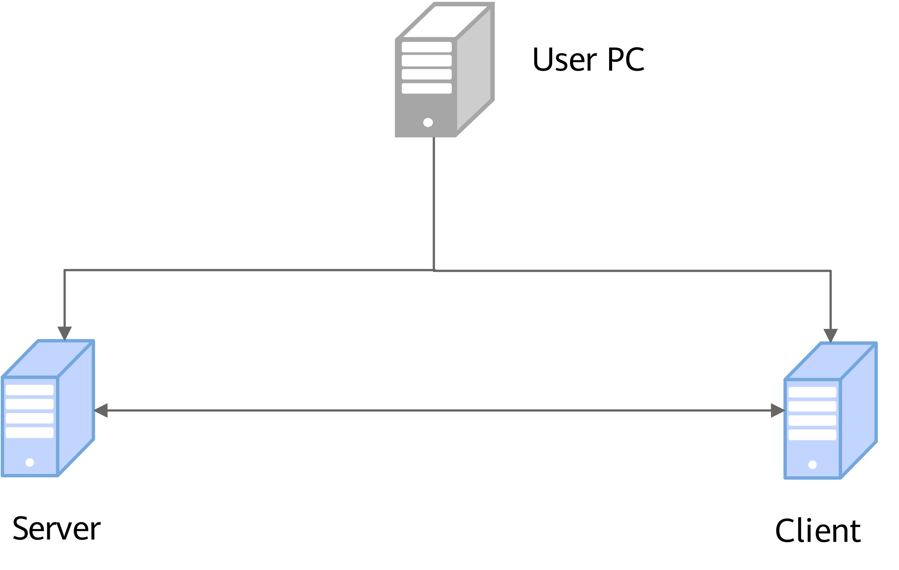

**Hardware Requirements<a name="section967416146301"></a>**

[**Table 1**](#hardware-requirement) lists the hardware requirement.

**Table 1** Hardware requirement<a id="hardware-requirement"></a>

|Item|Description|
|--|--|
|CPU|Kunpeng 920 or Kunpeng 950|

**OS and Software Requirements<a name="section21485361307"></a>**

[**Table 2**](#os-and-software-requirements) lists the OS and software requirements.

**Table 2** OS and software requirements<a id="os-and-software-requirements"></a>

|Item|Version|How to Obtain|
|--|--|--|
|OS|openEuler 22.03 LTS SP3 or openEuler 24.03 LTS SP3|openEuler 22.03 LTS SP3 ISO image: [Link](https://repo.openeuler.org/openEuler-22.03-LTS-SP3/ISO/aarch64/)<br>openEuler 24.03 LTS SP3 ISO image: [Link](https://repo.openeuler.org/openEuler-24.03-LTS-SP3/ISO/aarch64/)|
|QEMU|6.2.0 or 8.2.0|Install it using a Yum repository.|
|libvirt|6.2.0 or 9.10.0|Install it using a Yum repository.|
|Nginx|1.21.5|Install it using a Yum repository.|
|OpenSSL|1.1.1|Install it using a Yum repository.|
|httpress|1.1.0|Install it using a Yum repository.|
|KAE|2.0|Download command: `git clone https://gitcode.com/boostkit/KAE.git -b kae2`|

## Configuring the Deployment Environment<a name="EN-US_TOPIC_0000002005252886"></a>

### Configuring the BIOS<a name="EN-US_TOPIC_0000002085153957"></a>

Enable the system memory management unit (SMMU) to allow VF passthrough (for enabling KAE) and NIC passthrough to the VM.

To enable SMMU, perform the following steps:

1. Restart the server and enter the BIOS.

    For details, see "Accessing the BIOS" in [TaiShan Server BIOS Parameter Reference (Kunpeng 920 Processor)](https://support.huawei.com/enterprise/en/doc/EDOC1100088647/426cffd9/about-this-document?idPath=23710424|251364417|9856629|252259139).

2. Enable SMMU.

    > **NOTICE:**
    >Enable the SMMU feature only in virtualization scenarios. In non-virtualization scenarios, disable SMMU.

    In the BIOS, choose `Advanced` > `MISC Config` and set `Support Smmu` to `Enabled`.

    Then, set `Smmu Work Around` to `Enabled`.

    

3. Press `F10` to save the BIOS configuration and restart the server.

### Configuring the Server<a name="EN-US_TOPIC_0000002015928364" id="configuring-the-server"></a>

On the server, configure the file descriptor restriction, SELinux status, audit service, and SR-IOV passthrough of NIC to the VM, and bind NIC interrupts to cores.

1. Increase the number of file descriptors on the server.
    1. Open the file.

        ```shell
        vi /etc/security/limits.conf
        ```

    2. Press `i` to enter the insert mode and add the following content to the file. Set the `soft` and `hard` limits for all users (`*`), that is, set the number of file descriptors for both parameters to `102400`.

        ```txt
        * soft      nofile      102400
        * hard      nofile      102400
        ```

        

    3. Press `Esc`, type `:wq!`, and press `Enter` to save the file and exit.
    4. Log out the SSH terminal.

        ```shell
        logout
        ```

        Log in to the SSH terminal again for the new host name to take effect.

2. Disable SELinux to ensure that applications run properly as SELinux may restrict the access permission of applications. Disabling SELinux may impair system security and make the system more vulnerable to potential security problems and attacks. Assess the potential risks before disabling SELinux.
    - Disable SELinux temporarily.

        > **NOTICE:**
        >This operation becomes invalid after a server reboot.

        ```txt
        setenforce 0
        ```

    - Disable SELinux permanently.

        > **NOTICE:**
        >This operation takes effect after a server reboot.

        1. Modify the configuration file to disable SELinux.

            ```shell
            sed -i 's/SELINUX=enforcing/SELINUX=disabled/g' /etc/selinux/config
            cat /etc/selinux/config
            ```

            If `SELINUX=disabled` is displayed, as shown in the following figure, the modification is successful.

            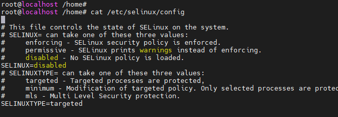

        2. Restart the server after disabling SELinux. Similarly, restart the VM after disabling SELinux on the VM.

3. Disable the audit service.
    1. Open the file.

        ```shell
        vim /boot/efi/EFI/openEuler/grub.cfg
        ```

    2. Press `i` to enter the insert mode. Add `audit=0` to the kernel startup commands of the corresponding OS version. See the following figure.

        

    3. Press `Esc`, type `:wq!`, and press `Enter` to save the file and exit.
    4. Restart the server for the configuration to take effect.

4. Pass through a NIC to the VM in the VF passthrough mode.

    On the server, pass through a NIC to the VM in the VF passthrough mode to establish the communication between the VM and external network. When httpress is used for a test, the client can run commands on another server to connect to the Nginx service of the local server.

    1. Create three VFs for the NIC. The quantity of created VFs are subject to actual requirements.

        ```shell
        echo 3 > /sys/class/net/enp7s0/device/sriov_numvfs
        ```

    2. Obtain the information about `bus-info` of the NIC.

        ```shell
        ethtool -i enp7s0
        ```

        

    3. Query the NUMA affinity of a NIC node.

        ```shell
        cat /sys/class/net/enp7s0/device/numa_node
        ```

        The physical NIC has affinity with NUMA node 0.

        

        > **NOTE:**
        >You can also run the following command to query the NUMA affinity of a NIC node:
        >
        >```shell
        >lspci -vvv -s 07:00.0 | grep NUMA
        >```
        >
        >The physical NIC has affinity with NUMA node 0.
        >
        >

        Check the IDs of the CPU cores corresponding to NUMA node 0.

        ```shell
        ls cpu
        ```

        The IDs of the CPU cores corresponding to NUMA node 0 are from `0` to `31`.

        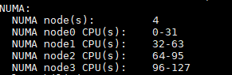

    4. After three VFs are created for the physical NIC, check the bus information of the physical and virtual NICs.

        ```shell
        cd /sys/class/net/enp7s0
        cd /device
        ls
        ```

        

        Check the NUMA affinity of `virtfn2`.

        ```shell
        cd virtfn2
        cat numa_node
        ```

        The NIC VF and physical NIC node who creates the VF have the same NUMA affinity, that is, NUMA node 0.

        

    5. Check the PCI IDs of the NIC VFs.
        - Method 1:

            ```shell
            cd virtfn0
            realpath .
            ```

            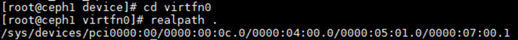

            ```shell
            cd virtfn1
            realpath .
            ```

            

            ```shell
            cd virtfn2
            realpath .
            ```

            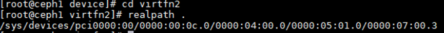

        - Method 2:

            ```shell
            ethtool -i enp7s0v0
            ```

            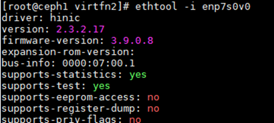

            ```shell
            ethtool -i enp7s0v1
            ```

            

            ```shell
            ethtool -i enp7s0v2
            ```

            

            The PCI IDs increase in ascending order.

    6. Run the `ip a` command to check the three NIC VFs that are created. They are named `enp7s0v0`, `enp7s0v1`, and `enp7s0v2`.

        ```shell
        ip a
        ```

        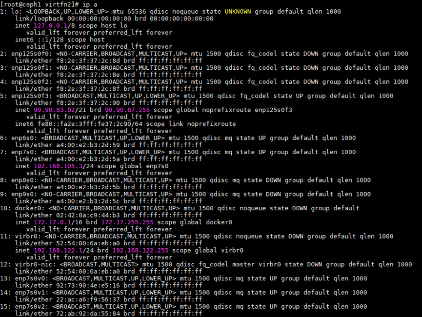

    7. Stop the VM.

        ```shell
        virsh shutdown <VM_name>
        ```

    8. Modify the VM configuration file. Copy the following content to the `<devices>` tag in the VM configuration file to pass through the VFs to the VM:

        ```txt
        <hostdev mode='subsystem' type='pci' managed='yes'>
        <source>
        <address domain='0x0000' bus='0x07' slot='0x00' function='0x1'/>
        </source>
        <address type='pci' domain='0x0000' bus='0x06' slot='0x00' function='0x0'/>
        </hostdev>
        ```

    9. Start the VM and check whether the configuration takes effect.

        ```shell
        virsh start <VM_name>
        ```

        After the VM is started, run the `ip a` command to check the NIC.

        ```shell
        ip a
        ```

        If the virtual NIC node that is passed through is not displayed in the command output, the VF passthrough to the VM is successful.

5. Bind NIC interrupts to cores.

    Bind the NIC interrupts to the affinity node of the NIC. In this example, the VF of the virtual NIC `enp7s0v0` has affinity with NUMA node 0.

    1. Create a core binding script file named `irq_server.sh` in the `/home` directory on the server.

        ```shell
        vim irq_server.sh
        ```

    2. Copy the following content to the core binding script file:

        ```txt
        #!/bin/bash
        # chkconfig: - 50 50
        # description: auto irq
        #Obtain the CPU where the NIC is located.
        function get_default_cpu(){
            eth_numa_node=`cat /sys/class/net/${eth}/device/numa_node`
            numa_nodes=`lscpu | grep node\(s | awk '{print $NF}'`
            cpus=`lscpu | grep CPU\(s | head -1 | awk '{print $NF}'`
            sockets=`lscpu | grep Socket\(s | awk '{print $NF}'`
            cpus_per_socket=`lscpu | grep Core\(s | awk '{print $NF}'`
            numa_per_socket=$((${numa_nodes} / ${sockets}))
            eth_socket=$((${eth_numa_node} / ${numa_per_socket}))
            first_cpu=$[$[$[${cpus_per_socket}*${eth_socket}]]]
            last_cpu=$[$[${cpus_per_socket}*$[${eth_socket}+1]]-1]
            cpurange="${first_cpu}-${last_cpu}"
        }
        #Obtain the CPU queue based on parameters.
        function get_cpu_list(){
            IFS_bak=$IFS
            IFS=','
            cpurange=($1)
            IFS=${IFS_bak}
            cpulist_arr=()
            n=0
            for i in ${cpurange[@]};do
                start=`echo $i | awk -F'-' '{print $1}'`
                stop=`echo $i | awk -F'-' '{print $NF}'`
                for x in `seq $start $stop`;do
                    cpulist_arr[$n]=$x
                    let n++
                done
            done
        }
        #Bind interrupts to cores.
        function bind(){
            ethtool -L ${eth} combined ${cnt}
            irq=`cat /proc/interrupts| grep ${eth} | awk -F ':' '{print $1}'`
            i=0
            for irq_i in $irq
            do
                if [ $i -ge ${#cpulist_arr[*]} ]; then
                    i=0
                fi
                echo ${cpulist_arr[${i}]} "->" $irq_i
                echo ${cpulist_arr[${i}]}  > /proc/irq/$irq_i/smp_affinity_list
                let i++
            done
        }
        #Read the information about the CPU bound to the NIC.
        function check(){
            ethtool -l $eth
            irq=`cat /proc/interrupts | grep ${eth} | awk -F ':' '{print $1}'`
            for irq_i in $irq
            do
                cat /proc/irq/$irq_i/smp_affinity_list
            done
        }
        [[ $2 ]] && eth=$2 || eth=`ifconfig | grep -B 1 "192.168" | head -1 | awk -F":" '{print $1}'`
        echo "$eth"
        [[ $3 ]] && cnt=$3 || cnt=48
        [[ $4 ]] && cpurange=$4 || get_default_cpu
        get_cpu_list $cpurange
        [[ $1 ]] && $1 || bind
        ```

        > **NOTE:**
        >Example
        >1. Run the following command to set the queue depth to `48` for the NIC whose network segment is `192.168` by default. That is, bind the NIC to the first 48 cores of the CPU:
            >
            > ```shell
            > sh irq.sh
            >```
            >
        >2. Read the information about the cores bound to the NIC.
            >
            > ```shell
            > sh irq.sh check eth1
            >```
            >
            > `eth1` indicates the NIC name. Replace it with the actual one.<br>
        >3. Change the queue depth for the `eth1` NIC to `24` and bind the interrupts to the four `'0 1 2 3'` cores cyclically. Consecutive core binding is supported, for example, `'1-3,6,7-9'`.
        >
        > ```shell
        > sh irq.sh bind eth1 24 '0 1 2 3'
        >    ```

    3. Run the command to bind NIC interrupts to cores.

        ```shell
        sh irq_server.sh bind enp7s0v0 4 '32-35'
        ```

    4. Check whether NIC interrupts are successfully bound to cores.

        ```shell
        sh irq_server.sh check enp7s0v0
        ```

### Configuring the Client<a name="EN-US_TOPIC_0000002052047053" id="configuring-the-client"></a>

If the client is a VM, configure the file descriptor restriction, SELinux status, audit service, and SR-IOV passthrough of NIC to the VM, and bind NIC interrupts to cores. If the client is a physical machine, only bind NIC interrupts to cores.

For details, see [Configuring the Server](#configuring-the-server). Change the NIC name as required.

## Deployment<a name="EN-US_TOPIC_0000002041371057"></a>

### Installing KAE on a Physical Machine<a name="EN-US_TOPIC_0000002041411957"></a>

The installation of KAE on a physical machine includes applying for and installing the KAE license, installing dependencies, obtaining the KAE source package, installing KAE using the source code, and verifying the KAE installation.

1. Apply for and install the KAE license. For details, see [Obtaining a License](https://www.hikunpeng.com/document/detail/en/kunpengaccel/kae/kae/docs/en/installation_guide.md#%E8%8E%B7%E5%8F%96license) in the *Accelerator User Guide (KAE)*.
2. Install dependencies.

    ```shell
    yum -y install kernel-devel-$(uname -r) openssl-devel numactl-devel gcc make autoconf automake libtool patch
    ```

3. Obtain the KAE 2.0 source package.

    ```shell
    git clone https://gitee.com/kunpengcompute/KAE.git -b kae2
    ```

    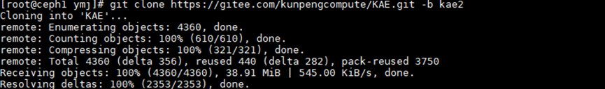

4. Install KAE using the source code.

    > **NOTICE:**
    >The `sh build.sh all` installation command can be used to install KAE in one-click mode. Before using this command, you are advised to run the `sh build.sh cleanup` command for cleanup.

    1. Go to the KAE source code directory and perform cleanup operations before the installation.

        ```shell
        cd KAE
        sh build.sh cleanup
        ```

        

    2. Install KAE in one-click mode.

        ```shell
        sh build.sh all
        ```

        

5. Check whether KAE is successfully installed.
    1. Check whether related PCI drivers exist in the `/sys/bus/pci/drivers` directory.

        ```shell
        ls /sys/bus/pci/drivers
        ```

        If files similar to `hisi_hpre`, `hisi_sec2`, and `hisi_zip` exist (`hisi_rde` not implemented currently), the related drivers have been successfully installed.

        

    2. Check whether the KAE drivers contain virtualization devices. `hisi_sec2` is used as an example here.

        ```shell
        ls -lt /sys/bus/pci/drivers/hisi_sec2
        ```

        If the corresponding device files are listed, the `hisi_sec2` driver is successfully associated with the PCI device.

        

    3. Check `kae.so` to see whether KAE is successfully installed.

        ```shell
        ll /usr/local/lib/engines-1.1
        ```

        Expected result:

        

        KAE is successfully installed.

        Check the devices and modules in the OS.

        ```shell
        ls -al /sys/class/uacce
        lsmod | grep uacce
        modprobe uacce
        modprobe hisi_zip
        modprobe hisi_sec2
        modprobe hisi_hpre
        modprobe hisi_rde (not implemented currently)
        ls -lt /sys/bus/pci/drivers/hisi_sec2
        lspci |grep HPRE
        lspci |grep RDE
        ```

        

        If KAE devices such as `hisi_zip`, `hisi_sec2`, and `hisi_hpre` cannot be found, restart the server and check again whether KAE is successfully installed.

        ```shell
        reboot
        ```

        Check the KAE devices again.

        ```shell
        ls -al /sys/class/uacce
        ```

        

6. Verify the acceleration capability of the KAE feature.
    1. Modify the OpenSSL configuration file to use KAE.

        Add the following content to the `openssl.cnf` file and save the file to the `/home` directory:

        ```txt
        openssl_conf=openssl_def
        [openssl_def]
        engines=engine_section
        [engine_section]
        kae=kae_section
        [kae_section]
        engine_id=kae
        dynamic_path=/usr/local/lib/engines-1.1/kae.so
        KAE_CMD_ENABLE_ASYNC=1
        KAE_CMD_ENABLE_SM3=1
        KAE_CMD_ENABLE_SM4=1
        default_algorithms=ALL
        init=1
        ```

    2. Run the `openssl speed` command to compare the RSA encryption and decryption performance when KAE is enabled with that when KAE is disabled.

        - Obtain the performance metrics before KAE is enabled.

            ```shell
            openssl speed -elapsed rsa2048
            ```

            

        - Obtain the performance metrics after KAE is enabled.

            ```shell
            export OPENSSL_CONF=/home/openssl.cnf
            openssl speed -engine kae -elapsed rsa2048
            ```

            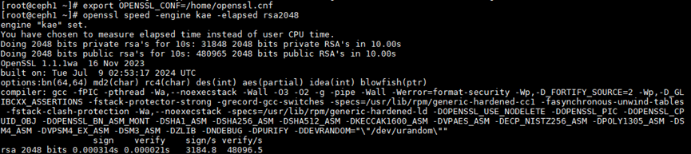

        The performance metrics before and after KAE is enabled are 774.2 and 3,184.8 sign/s, respectively. The performance is improved by about 300%.

### Deploying vKAE on a VM<a name="EN-US_TOPIC_0000002041371073"></a>

This section uses an 8C16G VM as an example to describe how to deploy vKAE on a VM. Operations include preparing the KAE environment on the VM, installing KAE on the VM, configuring VF passthrough to the VM, verifying the vKAE installation and enabling vKAE.

1. Prepare the KAE environment on the VM.
    1. Install dependencies.

        ```shell
        yum -y install kernel-devel-$(uname -r) openssl-devel numactl-devel gcc make autoconf automake libtool patch
        ```

        Installation of the patch is required when dependencies are installed on the VM. Otherwise, an error will be reported during the KAE installation. See the following figure.

        

    2. Obtain the KAE 2.0 source package.

        ```shell
        git clone https://gitee.com/kunpengcompute/KAE.git -b kae2
        ```

        

    3. Install KAE using the source code.

        > **NOTICE:**
        >The `sh build.sh all` installation command can be used to install KAE in one-click mode. Before using this command, you are advised to run the `sh build.sh cleanup` command for cleanup.

        1. Go to the KAE source code directory and perform cleanup operations before the installation.

            ```shell
            cd KAE
            sh build.sh cleanup
            ```

            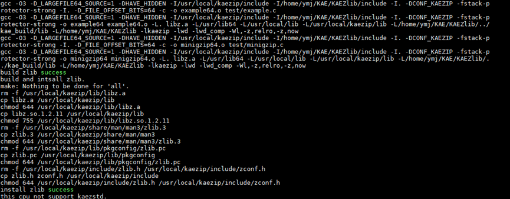

        2. Install KAE in one-click mode.

            ```shell
            sh build.sh all
            ```

            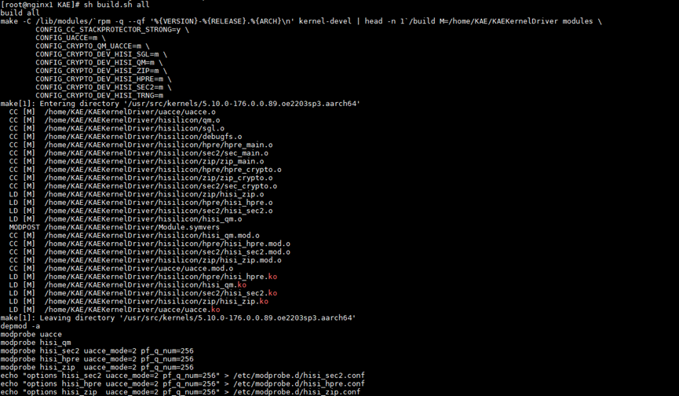

            If the following information is displayed, KAE is successfully installed.

            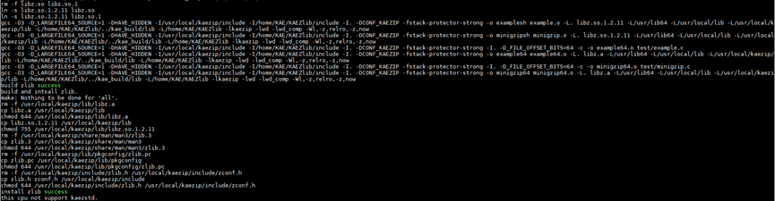

2. Before using vKAE, create VFs on the KAE device of the server and pass through the VFs to the VM to enable vKAE for acceleration. Use the HPRE accelerator to enable encryption and decryption acceleration.

    Check the name of the accelerator contained in KAE that is installed. In later steps, you need to use the accelerator name to search for the PCI IDs corresponding to the accelerator device, and then create VFs based on the PCI IDs.

    ```shell
    ls /sys/class/uacce
    ```

    

    > **NOTE:**
    >The command output in this step is only an example. The number of accelerators varies depending on the server. For example:
    >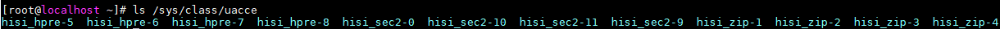

3. Check the actual path and PCI ID of the `hisi_hpre-1` accelerator device.

    ```shell
    cd /sys/class/uacce/hisi_hpre-1/device
    realpath .
    ```

    

4. The following uses the `hisi_hpre-1` accelerator as an example to describe how to create three KAE VFs to be passed through to the VM.

    ```shell
    echo 3 > /sys/devices/pci0000:78/0000:78:00.0/0000:79:00.0/sriov_numvfs
    ```

    Check whether the VFs of the KAE device are successfully created.

    ```shell
    ls -al /sys/class/uacce
    ```

    There are three virtual acceleration devices in addition to the physical acceleration device.

    > **NOTE:**
    >A server may have multiple HPRE accelerators. Each HPRE accelerator provides 1,024 queues. A PF uses 256 queues by default, and the other 768 queues are reserved for VFs. Number of VF queues = (1024 – Number of PF queues)/Number of VFs. The remainder queues are added to the last VF. You are advised to virtualize one PF into eight VFs.
    >Run the following command to check the folder where the created VFs are located:
    >
    >```shell
    >cd /sys/class/uacce/hisi_hpre-1/device
    >ls
    >```
    >
    >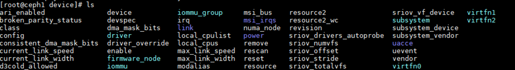

5. After three KAE VFs are created, three VM acceleration devices `virtfn0`, `virtfn1`, and `virtfn2` exist in the `hisi_hpre-1` accelerator list.

    Check the PCI IDs of `virtfn0`, `virtfn1`, and `virtfn2` to pass through the VFs to the VM.

    ```shell
    cd virtfn0
    realpath .
    ```

    

    ```shell
    cd virtfn1
    realpath .
    ```

    

    ```shell
    cd virtfn2
    realpath .
    ```

    

6. Modify the configuration file of the VM and pass through the KAE VFs to the VM.
    - Configure one KAE VF for the VM.
        1. Open the VM configuration file, for example, `vm01.xml`.

            ```shell
            vim vm01.xml
            ```

        2. Press `i` to enter the insert mode. Copy the following content to the `<devices>` tag in the VM configuration file:

            ```txt
            <hostdev mode='subsystem' type='pci' managed='yes'><source><address domain='0x0000' bus='0x79' slot='0x00' function='0x1'/></source><address type='pci' domain='0x0000' bus='0x07' slot='0x00' function='0x0'/>
            </hostdev>
            ```

            > **NOTE:**
            >- This operation is to split the VF address `0000:79:00.1`. `domain` uses `0000`, `bus` uses `79`, `slot` uses `00`, and `function` uses `1`.
            >- If the `address` already exists on the current VM, to prevent VM startup failures caused by conflicting addresses, delete the `address` line following `</source>`. After the VM is restarted, a new `address` is generated.

        3. Press `Esc`, type `:wq!`, and press `Enter` to save the file and exit.
        4. Restart the VM for the KAE VF passthrough to take effect.

            ```shell
            reboot
            ```

            

            After the preceding configuration is complete, the KAE VF is successfully passed through to the VM.

    - Configure multiple KAE VFs for the VM.
        1. Open the VM configuration file, for example, `vm01.xml`.

            ```shell
            vim vm01.xml
            ```

        2. Press `i` to enter the insert mode. Copy the following content to the `<devices>` tag in the VM configuration file:

            ```txt
            <hostdev mode='subsystem' type='pci' managed='yes'><source><address domain='0x0000' bus='0x79' slot='0x00' function='0x1'/></source><address type='pci' domain='0x0000' bus='0x07' slot='0x00' function='0x0'/>
            </hostdev>
            <hostdev mode='subsystem' type='pci' managed='yes'><source><address domain='0x0000' bus='0x79' slot='0x00' function='0x2'/></source><address type='pci' domain='0x0000' bus='0x07' slot='0x00' function='0x1'/>
            </hostdev>
            ```

        3. Restart the VM for the KAE VF passthrough to take effect.

            ```shell
            reboot
            ```

    - The following provides an example of a complete VM configuration file for your reference.

        The configuration file of an 8C16G VM is used as an example. The VM name is `nginx1`. Core binding in sequence and binding memory to NUMA nodes have been performed for the VM. After modifying the configuration file, restart the VM for the VF passthrough to take effect.

        1. Open the VM configuration file, for example, `vm01.xml`.

            ```shell
            vim vm01.xml
            ```

        2. Press `i` to enter the insert mode and copy the following content to the VM configuration file:

            ```txt
            <domain type='kvm'>
              <name>vm01</name> 
              <uuid>a1d11347-8738-45fb-8944-e3a058f464c9</uuid>
              <memory unit='KiB'>16777216</memory> 
              <currentMemory unit='KiB'>16777216</currentMemory>
              <memoryBacking>
                <hugepages/> 
              </memoryBacking>
              <vcpu placement='static'>8</vcpu>
              <cputune>
                <vcpupin vcpu='0' cpuset='4'/>
                <vcpupin vcpu='1' cpuset='5'/>
                <vcpupin vcpu='2' cpuset='6'/>
                <vcpupin vcpu='3' cpuset='7'/>
                <vcpupin vcpu='4' cpuset='8'/>
                <vcpupin vcpu='5' cpuset='9'/>
                <vcpupin vcpu='6' cpuset='10'/>
                <vcpupin vcpu='7' cpuset='11'/>
                <emulatorpin cpuset='4-11'/>
              </cputune>
              <numatune>
                <memnode cellid='0' mode='strict' nodeset='0'/>
              </numatune>
              <os>
                <type arch='aarch64' machine='virt-6.2'>hvm</type>
                <loader readonly='yes' type='pflash'>/usr/share/edk2/aarch64/QEMU_EFI-pflash.raw</loader>
                <nvram>/var/lib/libvirt/qemu/nvram/nginx1_VARS.fd</nvram>
                <boot dev='hd'/>
              </os>
              <features>
                <acpi/>
                <gic version='3'/>
              </features>
              <cpu mode='host-passthrough' check='none'>
                <topology sockets='1' dies='1' clusters='1' cores='8' threads='1'/>
                <numa>
                  <cell id='0' cpus='0-7' memory='16777216' unit='KiB'/>
                </numa>
              </cpu>
              <clock offset='utc'/>
              <on_poweroff>destroy</on_poweroff>
              <on_reboot>restart</on_reboot>
              <on_crash>destroy</on_crash>
              <devices>
                <emulator>/usr/libexec/qemu-kvm</emulator>
                <disk type='file' device='disk'>
                  <driver name='qemu' type='qcow2'/>
                  <source file='/home/images/nginx1.img'/>
                  <target dev='vda' bus='virtio'/>
                  <address type='pci' domain='0x0000' bus='0x05' slot='0x00' function='0x0'/>
                </disk>
                <disk type='file' device='cdrom'>
                  <driver name='qemu' type='raw'/>
                  <target dev='sda' bus='scsi'/>
                  <readonly/>
                  <address type='drive' controller='0' bus='0' target='0' unit='0'/>
                </disk>
                <controller type='usb' index='0' model='qemu-xhci' ports='15'>
                  <address type='pci' domain='0x0000' bus='0x02' slot='0x00' function='0x0'/>
                </controller>
                <controller type='scsi' index='0' model='virtio-scsi'>
                  <address type='pci' domain='0x0000' bus='0x03' slot='0x00' function='0x0'/>
                </controller>
                <controller type='pci' index='0' model='pcie-root'/>
                <controller type='pci' index='1' model='pcie-root-port'>
                  <model name='pcie-root-port'/>
                  <target chassis='1' port='0x8'/>
                  <address type='pci' domain='0x0000' bus='0x00' slot='0x01' function='0x0' multifunction='on'/>
                </controller>
                <controller type='pci' index='2' model='pcie-root-port'>
                  <model name='pcie-root-port'/>
                  <target chassis='2' port='0x9'/>
                  <address type='pci' domain='0x0000' bus='0x00' slot='0x01' function='0x1'/>
                </controller>
                <controller type='pci' index='3' model='pcie-root-port'>
                  <model name='pcie-root-port'/>
                  <target chassis='3' port='0xa'/>
                  <address type='pci' domain='0x0000' bus='0x00' slot='0x01' function='0x2'/>
                </controller>
                <controller type='pci' index='4' model='pcie-root-port'>
                  <model name='pcie-root-port'/>
                  <target chassis='4' port='0xb'/>
                  <address type='pci' domain='0x0000' bus='0x00' slot='0x01' function='0x3'/>
                </controller>
            <controller type='pci' index='5' model='pcie-root-port'>
                  <model name='pcie-root-port'/>
                  <target chassis='5' port='0xc'/>
                  <address type='pci' domain='0x0000' bus='0x00' slot='0x01' function='0x4'/>
                </controller>
                <controller type='pci' index='6' model='pcie-root-port'>
                  <model name='pcie-root-port'/>
                  <target chassis='6' port='0xd'/>
                  <address type='pci' domain='0x0000' bus='0x00' slot='0x01' function='0x5'/>
                </controller>
                <controller type='virtio-serial' index='0'>
                  <address type='pci' domain='0x0000' bus='0x04' slot='0x00' function='0x0'/>
                </controller>
                <interface type='network'>
                  <mac address='52:54:00:b4:09:bc'/>
                  <source network='default'/>
                  <model type='virtio'/>
                  <address type='pci' domain='0x0000' bus='0x01' slot='0x00' function='0x0'/>
                </interface>
                <serial type='pty'>
                  <target type='system-serial' port='0'>
                    <model name='pl011'/>
                  </target>
                </serial>
                <console type='pty'>
                  <target type='serial' port='0'/>
                </console>
                <channel type='unix'>
                  <target type='virtio' name='org.qemu.guest_agent.0'/>
                  <address type='virtio-serial' controller='0' bus='0' port='1'/>
                </channel>
                <hostdev mode='subsystem' type='pci' managed='yes'>
                  <source>
                    <address domain='0x0000' bus='0x07' slot='0x00' function='0x1'/>
                  </source>
                  <address type='pci' domain='0x0000' bus='0x06' slot='0x00' function='0x0'/>
                </hostdev>
                <hostdev mode='subsystem' type='pci' managed='yes'>
                  <source>
                    <address domain='0x0000' bus='0x79' slot='0x00' function='0x1'/> <!--Modify the parameters as needed.-->
                  </source>
                <address type='pci' domain='0x0000' bus='0x07' slot='0x00' function='0x0'/>
               </hostdev>
              </devices>
            </domain>
            ```

        3. Restart the VM for the VF passthrough to take effect.

            ```shell
            reboot
            ```

        4. Check the VF device again.

            ```shell
            ls -al /sys/class/uacce
            ```

            If the VF device passed through to the VM is not displayed in the command output, the VF is passed through to the VM successfully.

7. Verify whether the KAE installation and configuration are complete.
    1. Check whether the KAE device is successfully installed on the VM.

        ```shell
        lspci
        ll /usr/local/lib/engines-1.1
        ```

        If `HPRE Engine` and `kae.so` are displayed in the command output, the KAE device is successfully installed.

        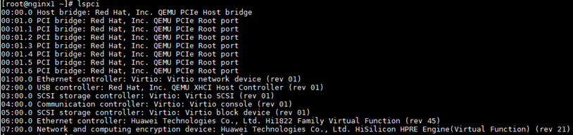

        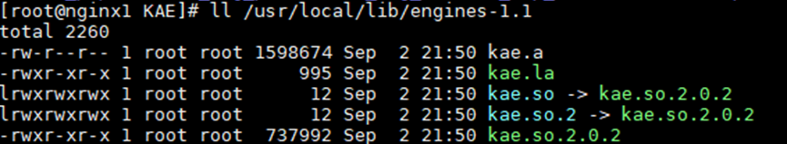

    2. Check whether the VF is successfully mounted to the VM.

        ```shell
        ls -al /sys/class/uacce
        ```

        If the VF device passed through is not displayed on the physical machine, the passthrough is successful.

        

        Check the address used by the VF.

        ```shell
        cd /sys/bus/pci/drivers
        cd hisi_hpre
        ls
        ```

        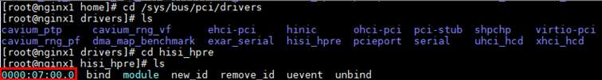

    3. Verify the KAE performance.

        Configure OpenSSL to use KAE. Run the `openssl speed` command to compare the RSA encryption and decryption performance when KAE is enabled with that when KAE is disabled.

        - Obtain the performance metrics before KAE is enabled.

        ```shell
            openssl speed -elapsed rsa2048
        ```

        

        - Obtain the performance metrics after KAE is enabled.

        ```shell
            export OPENSSL_CONF=/home/openssl.cnf
            openssl speed -engine kae -elapsed rsa2048
        ```

        

    4. Check whether the loading module is loaded.

        ```shell
        lsmod | grep uacce
        ```

        If the following information is displayed, the loading module is successfully loaded.

        

### Deploying Nginx on a VM<a name="EN-US_TOPIC_0000002051811469"></a>

Deploy Nginx for KAE to enable the Nginx synchronous or asynchronous mode.

1. Install dependencies on the VM.

    ```shell
    yum install -y openssl openssl-devel pcre pcre-devel zlib zlib-devel gcc make
    ```

2. If the server is connected to the Internet, run the `wget` command to download the Nginx source code and then upload the Nginx source code to the `/home` directory on the VM.

    ```shell
    wget https://nginx.org/download/nginx-1.21.5.tar.gz --no-check-certificate
    ```

3. Deploy Nginx.

    ```txt
    tar -zxvf nginx-1.21.5.tar.gz
    cd nginx-1.21.5/
    chmod 755 configure
    ./configure --prefix=/usr/local/nginx --user=nginx --group=nginx --with-http_ssl_module --with-http_v2_module --with-http_realip_module --with-http_stub_status_module --with-http_gzip_static_module --with-pcre --with-stream --with-stream_ssl_module --with-stream_realip_module
    make -j 60 && make install
    ```

    > **NOTE:**
    >- In the command, `-j 60` can make full use of the multi-core feature of the CPUs to accelerate the compilation.
    >- You can run the `lscpu` command to query the number of CPU cores.

4. Generate an OpenSSL certificate.

    For details, see [Generating an OpenSSL Certificate](https://www.hikunpeng.com/document/detail/en/kunpengwebs/ecosystemEnable/Nginx/kunpengnginx_02_0013.html) in the *Nginx Porting Guide*.

    > **NOTE:**
    >If the message "unable to find 'distinguished_name' in config" is displayed during OpenSSL certificate generation, the command conflicts with the `export OPENSSL_CONF=/home/openssl.cnf` command used for testing the KAE performance in step 7 in [Deploying vKAE on a VM](#deploying-vkae-on-a-vm). See [Failed to Generate an OpenSSL Certificate When Deploying Nginx on a VM During vKAE Deployment](#EN-US_TOPIC_0000002054536396) to rectify the fault.

5. Check the Nginx installation directory.

    ```shell
    ls /usr/local/nginx
    ```

6. Check that the Nginx version is the target version.

    ```shell
    /usr/local/nginx/sbin/nginx -v
    ```

7. <a name="li1074555611337" id="li1074555611337"></a>Configure and start the open-source Nginx when KAE is disabled.
    1. Open the Nginx configuration file.

        ```shell
        cd /usr/local/nginx/conf
        vim nginx.conf
        ```

    2. Press `i` to enter the insert mode and copy the following content to the Nginx configuration file.

        The following is the content of the open-source Nginx configuration file `nginx.conf`, which is not tuned. KAE is not enabled as well.

        ```txt
        user  root;
        worker_processes  auto;
        
        #worker_processes  10;
        #worker_cpu_affinity 
        #10000000000000000000000000000000000000000000000000000000000000000000000000000000000
        #100000000000000000000000000000000000000000000000000000000000000000000000000000000000
        #1000000000000000000000000000000000000000000000000000000000000000000000000000000000000
        #10000000000000000000000000000000000000000000000000000000000000000000000000000000000000
        #;
        
        #error_log  logs/error.log;
        #error_log  logs/error.log  notice;
        #error_log  logs/error.log  info;
        
        #pid        logs/nginx.pid;
        
        events {
            worker_connections  1024;
        }
        
        http {
            include       mime.types;
            default_type  application/octet-stream;
        
            #log_format  main  '$remote_addr - $remote_user [$time_local] "$request" '
            #                  '$status $body_bytes_sent "$http_referer" '
            #                  '"$http_user_agent" "$http_x_forwarded_for"';
        
            #access_log  logs/access.log  main;
        
            sendfile        on;
            #tcp_nopush     on;
        
            #keepalive_timeout  0;
            keepalive_timeout  65;
        
            #gzip  on;
        
            server {
                listen       10000;
                server_name  localhost;
        
                #charset koi8-r;
        
                #access_log  logs/host.access.log  main;
        
                location / {
                    root   html;
                    index  index.html index.htm;
                }
        
                #error_page  404              /404.html;
        
                # redirect server error pages to the static page /50x.html
                #
                error_page   500 502 503 504  /50x.html;
                location = /50x.html {
                    root   html;
                }
            }
        
            # HTTPS server
            #
            server {
                listen       20000 ssl;
                server_name  localhost;
        
                ssl_certificate      /usr/local/nginx/server_2048.crt;
                ssl_certificate_key  /usr/local/nginx/server_2048.key;
        
                ssl_session_cache    shared:SSL:1m;
                ssl_session_timeout  5m;
        
                ssl_ciphers  HIGH:!aNULL:!MD5;
                ssl_prefer_server_ciphers  on;
        
                location / {
                    root   html;
                    index  index.html index.htm;
                }
            }
        
        }
        ```

        > **NOTE:**
        >The HTTP listening port number is `10000`, and the HTTPS listening port number is `20000`.

    3. Press `Esc`, type `:wq!`, and press `Enter` to save the file and exit.
    4. Run the open-source Nginx and check whether Nginx is started.

        ```shell
        /usr/local/nginx/sbin/nginx -c /usr/local/nginx/conf/nginx.conf
        ps -ef | grep nginx
        ```

        If the Nginx threads are returned, Nginx has been started.

        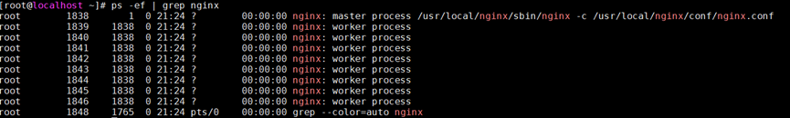

        In the `nginx.conf` configuration file, `worker_processes` is set to `auto`, and the number of created Nginx threads is 8, which is equal to the number of cores of the VM specification 8C16G. Set the number of `worker_processes` as required.

        > **NOTE:**  
        >Commands for restarting and exiting Nginx.
        >- Restart Nginx.
        >
        > ```shell
        > sudo systemctl restart nginx
        >    ```
        >
        >- Gracefully restart Nginx.
        >
        > ```shell
        > sudo nginx -s reload
        >    ```
        >
        >- Exit Nginx.
        >
        > ```shell
        > /usr/local/nginx/sbin/nginx -s quit
        >    ```
        >
        > Or
        >
        > ```shell
        > /usr/local/nginx/sbin/nginx -s stop
        >    ```

8. <a name="li367309154513" id="li367309154513"></a>Configure KAE enabled + Nginx synchronous mode.
    1. Create a configuration file named `nginx_kae.conf` in the `usr/local/nginx/conf` directory.

        ```shell
        vim nginx_kae.conf
        ```

    2. Press `i` to enter the insert mode and copy the following content to the Nginx configuration file.

        The following content of the Nginx configuration file `nginx.conf` is for enabling KAE and the Nginx synchronous mode. The Nginx parameters are tuned.

        ```txt
        user  root;
        worker_processes auto;
        #4-7
        #worker_cpu_affinity
        #10000
        #100000
        #1000000
        #10000000
        #;
        #daemon off;
        error_log  /dev/null;
        
        worker_rlimit_nofile 102400;
        events {
                use epoll;
                worker_connections 102400;
                accept_mutex off;
                multi_accept on;
        }
        
        
        http {
                include       mime.types;
                default_type  application/octet-stream;
                #log_format  main  '$remote_addr - $remote_user [$time_local] $request_time "$request" '
                #        '$status $body_bytes_sent $request_length $bytes_sent "$http_referer" '
                #        '"$http_user_agent" "$http_x_forwarded_for"';
                #access_log  logs/access.log  main;
                access_log  off;
        
                sendfile      on;
                tcp_nopush    on;
                tcp_nodelay   on;
                server_tokens off;
                sendfile_max_chunk 512k;
                keepalive_timeout  65;
                keepalive_requests 20000;
                client_header_buffer_size 4k;
                large_client_header_buffers 4 32k;
                server_names_hash_bucket_size 128;
                client_max_body_size 100m;
                open_file_cache max=102400 inactive=40s;
                open_file_cache_valid 50s;
                open_file_cache_min_uses 1;
                open_file_cache_errors on;
                #gzip  on;
        
            server {
                listen       10000 reuseport;
                server_name  localhost;
        
                #charset koi8-r;
        
                #access_log  logs/host.access.log  main;
        
                location / {
                    root   html;
                    index  index.html index.htm;
                }
        
                #error_page  404              /404.html;
        
                # redirect server error pages to the static page /50x.html
                #
                error_page   500 502 503 504  /50x.html;
                location = /50x.html {
                    root   html;
                }
        
            }
            # HTTPS server
            #
            server {
                listen       20000 ssl reuseport;
                server_name  localhost;
        
                ssl_certificate  /usr/local/nginx/server_2048.crt;
                ssl_certificate_key  /usr/local/nginx/server_2048.key;
        
                ssl_session_cache    shared:SSL:1m;
                ssl_session_timeout  5m;
                ssl_protocols  TLSv1 TLSv1.1 TLSv1.2;
                ssl_ciphers  AES256-GCM-SHA384;
                ssl_prefer_server_ciphers  on;
                ssl_session_tickets  off;
                location / {
                    root   html;
                    index  index.html index.htm;
                }
                access_log  off;
            }
        
        }
        ```

    3. Press `Esc`, type `:wq!`, and press `Enter` to save the file and exit.
    4. Run the configuration file for enabling KAE + Nginx synchronous mode with parameters tuned.

        > **NOTICE:**
        >To run the configuration file for enabling KAE + Nginx synchronous mode with parameters tuned, you only need to add `OPENSSL_CONF=/home/openssl.cnf` before the Nginx execute command.

        ```shell
        /usr/local/nginx/sbin/nginx -s stop || true; sleep 1;
        OPENSSL_CONF=/home/openssl.cnf /usr/local/nginx/sbin/nginx -c /usr/local/nginx/conf/nginx_kae.conf
        ```

9. <a name="li10813133111559" id="li10813133111559"></a>Configure KAE enabled + Nginx asynchronous mode.

    > **NOTICE:**
    >To enable KAE + Nginx asynchronous mode, you need to download the Nginx source code that adapts to the asynchronous mode. The source code supports synchronous or asynchronous mode and adapts to the KAE or Intel QAT hardware acceleration.

    1. Download the Nginx source code (version 0.4.9 in GitHub) that adapts to the asynchronous mode, and compile and install Nginx.

        ```shell
        cd /home
        git clone https://github.com/intel/asynch_mode_nginx.git
        cd /home/asynch_mode_nginx/
        yum install gcc gcc-c++ make libtool zlib zlib-devel pcre pcre-devel perl-devel perl-ExtUtils-Embed perl-WWW-Curl wget -y
        ./configure --prefix=/usr/share/nginx --add-dynamic-module=modules/nginx\_qat\_module --with-cc-opt="-DNGX\_SECURE\_MEM -Wno-error=deprecated-declarations" --with-http\_ssl\_module --with-http\_v2\_module
        make -j60 && make install
        ```

        > **NOTE:**
        >In steps [7](#li1074555611337) and [8](#li367309154513), the open-source Nginx is used for testing and is in the `/usr/local/nginx` directory. To avoid conflicts, Nginx in asynchronous mode is installed in the `/usr/share/nginx` directory.

    2. Create a file named `nginx_kae_async.conf` in the `/root` directory.

        ```shell
        vim nginx_kae_async.conf
        ```

    3. Press `i` to enter the insert mode and copy the following content to the `nginx_kae_async.conf` file.

        The following content of the Nginx configuration file `nginx.conf` is for enabling KAE and the Nginx asynchronous mode. The Nginx parameters are tuned. Change the number of Nginx processes as required. Generally, setting `worker_processes` to `auto` will occupy all cores of the VM. The HTTP port number is `10000`, and the HTTPS port number is `20000`.

        ```txt
        # For more information on configuration, see:
        #   * Official English Documentation: http://nginx.org/en/docs/
        #   * Official Russian Documentation: http://nginx.org/ru/docs/
        
        user root;
        worker_processes auto;
        
        #worker_processes  10;
        #worker_cpu_affinity 
        #10000000000000000000000000000000000000000000000000000000000000000000000000000000000
        #100000000000000000000000000000000000000000000000000000000000000000000000000000000000
        #1000000000000000000000000000000000000000000000000000000000000000000000000000000000000
        #10000000000000000000000000000000000000000000000000000000000000000000000000000000000000
        #;
        
        events  {
            use epoll;
            worker_connections 102400;
            accept_mutex off;
            multi_accept on;
        }
        
        error_log /var/log/nginx/error.log;
        pid /run/nginx.pid;
        
        include /usr/share/nginx/modules/*.conf;
        
        http {
            log_format  main  '$remote_addr - $remote_user [$time_local] "$request" '
                              '$status $body_bytes_sent "$http_referer" '
                              '"$http_user_agent" "$http_x_forwarded_for"';
        
            # access_log off;
            # access_log  /var/log/nginx/access.log  main;
        
            sendfile            on;
            tcp_nopush          on;
            tcp_nodelay         on;
            keepalive_timeout   65s;
            types_hash_max_size 4096;
        
            include             /usr/local/nginx/conf/mime.types;
            default_type        application/octet-stream;
        
            # Load modular configuration files from the /etc/nginx/conf.d directory.
            # See http://nginx.org/en/docs/ngx_core_module.html#include
            # for more information.
            include /etc/nginx/conf.d/*.conf;
                access_log  off;
                server_tokens off;
                sendfile_max_chunk 512k;
                keepalive_requests 20000;
                client_header_buffer_size 4k;
                large_client_header_buffers 4 32k;
                server_names_hash_bucket_size 128;
                client_max_body_size 100m;
                open_file_cache max=102400 inactive=40s;
                open_file_cache_valid 50s;
                open_file_cache_min_uses 1;
                open_file_cache_errors on;
        
            server {
                listen       10000;
                listen       [::]:10000;
                location / {
                    root html;
                    index index.html index.htm;
                }
                error_page 500 502 503 504  /50x.html;
                location = /50x.html {
                    root html;
                }
            }
        
        # Settings for a TLS enabled server.
        #
           server {
               listen 20000 ssl http2 asynch;
               listen [::]:20000 ssl http2 asynch;
               server_name localhost;
               ssl_asynch on;
               ssl_certificate /usr/local/nginx/server_2048.crt;
               ssl_certificate_key /usr/local/nginx/server_2048.key;
               ssl_session_cache shared:SSL:1m;
               ssl_session_timeout 5m;
               ssl_protocols  TLSv1 TLSv1.1 TLSv1.2;
               ssl_ciphers  "EECDH+ECDSA+AESGCM EECDH+aRSA+AESGCM EECDH+ECDSA+SHA384 EECDH+ECDSA+SHA256 EECDH+aRSA+SHA384 EECDH+aRSA+SHA256    EECDH+aRSA+RC4 EECDH EDH+aRSA !aNULL !eNULL !LOW !3DES !MD5 !EXP !PSK !SRP !DSS !RC4";
        
               ssl_prefer_server_ciphers  on;
        
               location / {
                    root html;
                    index index.html index.htm;
              }
        
           }
            gzip on;
            gzip_buffers 4 16k;
            gzip_comp_level 9;
            gzip_disable "MSIE [1-6]\.";
            gzip_http_version 1.1;
            gzip_min_length 500k;
            gzip_types text/css text/javascript text/xml text/plain text/x-component application/javascript application/x-javascript application/json application/xml;
            gzip_vary on;
            proxy_buffer_size 1024k;
            proxy_buffers 16 1024k;
            proxy_busy_buffers_size 2048k;
            proxy_temp_file_write_size 2048k;
         }
        ```

    4. Press `Esc`, type `:wq!`, and press `Enter` to save the file and exit.
    5. Reuse the OpenSSL certificate path (`/usr/local/nginx/conf/mime.types`) after the open-source Nginx installation.

        Copy the `mime.types`, `server_2048.crt`, and `server_2048.key` files to a new path.

        > **NOTE:**
        >To create an OpenSSL certificate by yourself, run the following commands in the new path:
>
        >```shell
        >openssl genrsa -des3 -out server_2048.key 2048
        >openssl rsa -in server_2048.key -out server_2048.key
        >openssl req -new -key server_2048.key -out server_2048.csr
        >openssl rsa -in server_2048.key -out server_2048.key
        >openssl x509 -req -days 365 -in server_2048.csr -signkey server_2048.key -out server_2048.crt
        >```

    6. Run the configuration file for enabling KAE + Nginx asynchronous mode with parameters tuned.

        > **NOTICE:**
        >To run the configuration file for enabling KAE + Nginx asynchronous mode with parameters tuned, you only need to add `OPENSSL_CONF=/home/openssl.cnf` before the Nginx execute command.

        ```shell
        /usr/share/nginx/sbin/nginx -s stop || true; sleep 1;
        OPENSSL_CONF=/home/openssl.cnf /usr/share/nginx/sbin/nginx -c /root/nginx_kae_async.conf
        ```

### Deploying httpress on the Client<a name="EN-US_TOPIC_0000002015863250"></a>

When testing performance, use the httpress tool on the client to perform a stress test, and enable KAE and use the Nginx service on the server to facilitate the test.

You can use either a physical machine or a VM as the client, which is flexible. When the CPU usage on the server reaches 100%, the RPS metrics generated by the httpress tool are used to measure the improved performance provided by KAE.

1. Install the dependencies.

    ```shell
    yum install -y gnutls-devel libev-devel openssl-devel
    ```

2. Download the httpress installation package to the `/home` directory of the VM. If the VM is connected to the Internet, run the `wget` command to download the httpress source code.

    ```shell
    cd /home
    wget https://github.com/yarosla/httpress/archive/1.1.0.tar.gz --no-check-certificate -O httpress-1.1.0.tar.gz
    ```

3. Decompress the httpress source package, go to the httpress directory generated after the decompression, and compile and install it.

    ```shell
    tar -zxvf httpress-1.1.0.tar.gz
    cd httpress-1.1.0
    make -j64
    ```

4. Configure httpress and check whether it is successfully installed.

    ```shell
    cp /home/httpress-1.1.0/bin/Release/httpress /usr/bin/
    httpress -v
    ```

    The installed httpress version is the target version.

    

## Tests<a name="EN-US_TOPIC_0000002041371065"></a>

### Testing the vKAE Performance Using OpenSSL<a name="EN-US_TOPIC_0000002052518101"></a>

On the client, the RSA encryption and decryption algorithms are used as an example. The OpenSSL tool is used to perform detailed performance tests on vKAE, covering the synchronous and asynchronous modes of the open-source Nginx and the synchronous and asynchronous modes of Nginx with vKAE enabled. The test results are analyzed in detail, and conclusions and suggestions are provided.

**Test Commands<a name="section134601731205010"></a>**

The following uses a 4C8G VM as an example. Four groups of performance tests using OpenSSL on the VM are performed, covering the synchronous and asynchronous modes of the open-source Nginx and the synchronous and asynchronous modes of Nginx with vKAE enabled.

The test commands of each group are as follows:

- Nginx synchronous mode:

    ```shell
    numactl -C 0 openssl speed -elapsed -multi 1 rsa2048
    ```

- Nginx asynchronous mode:

    ```shell
    numactl -C 0 openssl speed -elapsed -multi 1 -async_jobs 4 rsa2048
    ```

- vKAE enabled + Nginx synchronous mode:

    ```shell
    OPENSSL_CONF=/home/openssl.cnf numactl -C 0 openssl speed -engine kae -elapsed -multi 1 rsa2048
    ```

- vKAE enabled + Nginx asynchronous mode:

    ```shell
    OPENSSL_CONF=/home/openssl.cnf numactl -C 0 openssl speed -engine kae -elapsed -multi 1 -async_jobs 4 rsa2048
    ```

> **NOTE:**
>Adjust the following parameters as required:
>
>- `numactl -C 0`: CPU core 0 is bound.
>- `-m 0`: The core is bound to NUMA node 0.
>- `-engine kae -elapsed`: KAE is used for acceleration.
>- `-multi`: Number of concurrent threads. The value `1` indicates that there is no parallel operation, that is, only one operation is performed at a time.
>- `-async_jobs`: Number of asynchronous jobs. The value `4` indicates that four asynchronous jobs are started at the same time.

**Test Results and Analysis<a name="section752112578145"></a>**

[**Table 1**](#test-results) shows the RSA-sign results of the tests on a 4C8G VM where the `openssl speed` command is used.

**Table 1** Test results<a id="test-results"></a>

|Processor|Number of Server Threads = 1|Number of Server Threads = 4|VM Specification|Nginx Synchronous/Asynchronous|vKAE Enabled/Disabled|
|--|--|--|--|--|--|
|Kunpeng 920|6374|12528|4C8G|Synchronous|Enabled|
|Kunpeng 920|15593|52514|4C8G|Asynchronous|Enabled|
|Kunpeng 920|774|3100|4C8G|Synchronous|Disabled|
|Kunpeng 920|774|3096|4C8G|Asynchronous|Disabled|

Conclusions are drawn under the circumstance that the CPU usage reaches 100%:

- vKAE acceleration performance: In a 4C8G VM, hardware-based acceleration provided by vKAE significantly improves the performance. Before the vKAE acceleration reaches its bottleneck, the performance is improved by 16 times for the asynchronous mode and by 3 times for the synchronous mode.

- Comparison between the synchronous and asynchronous modes: With vKAE enabled in the OpenSSL scenario, the performance of the asynchronous mode is 4.2 times higher than that of the synchronous mode, showing asynchronous mode's advantages in high-concurrency scenarios. When vKAE is disabled, the performance of the synchronous and asynchronous modes is almost the same.
- Computing power ratio analysis: The computing power ratio in the synchronous mode is about 4 times. In asynchronous mode, the computing power ratio is about 17 times. This indicates that the asynchronous mode is more efficient in using hardware-based acceleration resources.

    > **NOTE:**
    >The computing power ratio refers to the ratio of the computing power empowered by hardware-based acceleration to the pure CPU computing power without KAE.

**Conclusion and Application Suggestions<a name="section199716171411"></a>**

For VMs of the 4C8G specification:

- Advantages of vKAE hardware-based acceleration: In a VM environment with limited resources, vKAE hardware-based acceleration is effective in improving the RSA signature performance.
- Advantages of the asynchronous mode: For applications that need to process a large number of concurrent requests, it is recommended the Nginx asynchronous mode together with vKAE hardware-based acceleration be used to achieve optimal performance.
- The test results and trends vary depending on the number of server threads and VM specifications. However, in the Nginx application scenario, for the Nginx server, as far as the number of CPU cores to bind does not exceed 64, the upper limit of the RSA-sign performance empowered by vKAE hardware-based acceleration is at about 54,000 sign/s, which provides a useful reference for actual scenarios.

### Testing the vKAE Performance Using httpress in the Nginx Application Scenario<a name="EN-US_TOPIC_0000002016398576"></a>

In the Nginx application scenario, the httpress tool is used to perform detailed performance tests on vKAE on the client, covering the synchronous and asynchronous modes of the open-source Nginx and the synchronous and asynchronous modes of Nginx with vKAE enabled. The test results are analyzed in detail, and conclusions and suggestions are provided.

**Test Commands<a name="section17499539195110"></a>**

Two groups of performance tests using httpress on the VM are performed, covering the synchronous and asynchronous modes of the open-source Nginx and the synchronous and asynchronous modes of Nginx with vKAE enabled.

**On the client**, run the following commands to use httpress to perform stress tests on HTTPS persistent and short connections:

- HTTPS persistent connection:

    ```txt
    httpress -n 2000000 -c 200 -t 10 -k https://<Server_IP_address>:<Server_port_number>/index<${nodeIndexNum}>.html
    ```

- HTTPS short connection:

    ```txt
    httpress -n 20000 -c 200 -t 10 https://<Server_IP_address>:<Server_port_number>/index<${nodeIndexNum}>.html
    ```

> **NOTE:**
>
>- `-n` specifies the number of requests, `-t` specifies the number of threads, `-c` specifies the number of connections, and `-k` enables the use of persistent connections. The `-n`, `-t`, and `-c` parameters can be adjusted to optimal values based on actual situations, achieving the largest RPS value.
>- *${nodeIndexNum}*, a variable, specifies the index of the page to be tested, which can be set as required.
>- On the client, HTTP does not use encryption and decryption algorithms, while HTTPS uses the SSL/TLS algorithm based on HTTP, and the SSL/TLS handshake process involves encryption and decryption calculation. Asymmetric encryption and decryption calculation is complex and time-consuming, and the HPRE device only accelerates the RSA asymmetric encryption and decryption algorithms, that is, vKAE hardware-based acceleration only works for HTTPS persistent and short connections. Therefore, in the vKAE acceleration scenario, only HTTPS test results are analyzed.

**On the server**, perform the following operations.

1. One thread is used as an example. Create an Nginx configuration file named `sync_nginx_1_worker.conf` in the `/root/test/` directory.

    ```shell
    vim sync_nginx_1_worker.conf
    ```

2. Press `i` to enter the insert mode and add the following content to the file.

    The following is the content of the configuration file for enabling KAE + Nginx synchronous mode without parameter tuning.

    ```txt
    # For more information on configuration, see:
    #   * Official English Documentation: http://nginx.org/en/docs/
    #   * Official Russian Documentation: http://nginx.org/ru/docs/
    
    user root;
    
    worker_processes 1;
    worker_cpu_affinity
    1
    ;
    
    # error_log /var/log/nginx/error.log debug;
    error_log /var/log/nginx/error.log;
    pid /run/nginx.pid;
    
    # Load dynamic modules. See /usr/share/doc/nginx/README.dynamic.
    include /usr/share/nginx/modules/*.conf;
    
    events {
        worker_connections 1024;
    }
    
    http {
        log_format  main  '$remote_addr - $remote_user [$time_local] "$request" '
                          '$status $body_bytes_sent "$http_referer" '
                          '"$http_user_agent" "$http_x_forwarded_for"';
        # access_log off;
        # access_log  /var/log/nginx/access.log  main;
    
        sendfile            on;
        tcp_nopush          on;
        tcp_nodelay         on;
        keepalive_timeout   65;
        types_hash_max_size 4096;
    
        include             /usr/local/nginx/conf/mime.types;
        default_type        application/octet-stream;
    
        # Load modular configuration files from the /etc/nginx/conf.d directory.
        # See http://nginx.org/en/docs/ngx_core_module.html#include
        # for more information.
        include /etc/nginx/conf.d/*.conf;
    
        server {
            listen       8080;
            listen       [::]:8080;
            server_name  _;
            root         /usr/share/nginx/html;
    
            # Load configuration files for the default server block.
            include /etc/nginx/default.d/*.conf;
    
            error_page 404 /404.html;
                location = /40x.html {
            }
    
            error_page 500 502 503 504 /50x.html;
                location = /50x.html {
            }
        }
    
    # Settings for a TLS enabled server.
    #
       server {
           listen       8090 ssl http2 so_keepalive=off;
           listen       [::]:8090 ssl http2 so_keepalive=off;
           #listen       8090 ssl http2 so_keepalive=off asynch;
           #listen       [::]:8090 ssl http2 so_keepalive=off asynch;
           server_name  _;
    
           # ssl_asynch on;
    
           ssl_certificate      /usr/local/nginx/server_2048.crt;
          ssl_certificate_key  /usr/local/nginx/server_2048.key;
    
           root         /usr/share/nginx/html;
    
           ssl_session_cache    shared:SSL:1m;
           ssl_session_timeout  5m;
           ssl_protocols  TLSv1 TLSv1.1 TLSv1.2;
    
           ssl_ciphers  "EECDH+ECDSA+AESGCM EECDH+aRSA+AESGCM EECDH+ECDSA+SHA384 EECDH+ECDSA+SHA256 EECDH+aRSA+SHA384 EECDH+aRSA+SHA256    EECDH+aRSA+RC4 EECDH EDH+aRSA !aNULL !eNULL !LOW !3DES !MD5 !EXP !PSK !SRP !DSS !RC4";
           #ssl_ciphers  "RSA-PSK-AES128-CBC-SHA256 !aNULL !eNULL !LOW !3DES !MD5 !EXP !PSK !SRP !DSS !RC4";
           # ssl_ciphers  AES256-GCM-SHA384;
           ssl_prefer_server_ciphers  on;
           # ssl_session_tickets  off;
    
           error_page 404 /404.html;
               location = /40x.html {
           }
    
           error_page 500 502 503 504 /50x.html;
               location = /50x.html {
           }
       }
    
    }
    ```

    > **NOTE:**
    >- In the configuration file, the HTTP port number is `8080` and the HTTPS port number is `8090`.
    >- `worker_processes` specifies the number of threads on the server, and `worker_cpu_affinity` specifies NUMA affinity. You can change the number of threads on the server as required and change the NUMA affinity accordingly.
    >- To use four server threads, modify the `worker_processes` and `worker_cpu_affinity` parameters as follows:
    >
    > ```txt
    > worker_processes 4;
    > worker_cpu_affinity
    > 1
    > 10
    > 100
    > 1000;
    >    ```
    >
    >- To configure a configuration file for enabling KAE + Nginx **asynchronous mode** without parameter tuning, create a configuration file named `async_nginx_x_worker.conf` (*x* is the number of threads to be used). Copy the preceding content to `async_nginx_x_worker.conf`, and delete the comment signs (#) at the start of the following three lines:
    >
    > ```txt
    > #listen       8090 ssl http2 so_keepalive=off asynch;
    > #listen       [::]:8090 ssl http2 so_keepalive=off asynch;
    > # ssl_asynch on;
    >    ```
    >
    > Add comment signs (#) to the start of the following two lines:
    >
    > ```txt
    > listen       8090 ssl http2 so_keepalive=off;
    > listen       [::]:8090 ssl http2 so_keepalive=off;
    >    ```
    >
    >- If you want to use the Nginx configuration file with tuned parameters, you can use the configuration file in [9](#li10813133111559).

3. Press `Esc`, type `:wq!`, and press `Enter` to save the file and exit.
4. On the client, use httpress to perform a stress test on HTTPS short connections.

    In this example, the server uses one thread and four threads, and the number of bound cores on the client is limited as required. Use httpress to perform a stress test on HTTPS short connections on the client. The test commands are as follows:

    - KAE enabled + Nginx synchronous mode + One thread used by the server
        - On the server:

            ```shell
            nginx -s stop || true; sleep 1; OPENSSL_CONF=/home/openssl.cnf /usr/share/nginx/sbin/nginx -c /root/test/sync_nginx_1_worker.conf; sleep 1
            ```

        - On the client:

            ```shell
            taskset -c 64-254 httpress -c 64 -t 32 -n 64000 https://<Server_IP_address>:8090/index.html
            ```

    - KAE enabled + Nginx asynchronous mode + One thread used by the server
        - On the server:

            ```shell
            nginx -s stop || true; sleep 1; OPENSSL_CONF=/home/openssl.cnf /usr/share/nginx/sbin/nginx -c /root/test/async_nginx_1_worker.conf; sleep 1
            ```

        - On the client:

            ```shell
            taskset -c 64-254 httpress -c 64 -t 32 -n 64000 https://<Server_IP_address>:8090/index.html
            ```

    - KAE enabled + Nginx synchronous mode + Four threads used by the server
        - On the server:

            ```shell
            nginx -s stop || true; sleep 1; OPENSSL_CONF=/home/openssl.cnf /usr/share/nginx/sbin/nginx -c /root/test/sync_nginx_4_worker.conf; sleep 1
            ```

        - On the client:

            ```shell
            taskset -c 64-254 httpress -c 64 -t 32 -n 128000 https://<Server_IP_address>:8090/index.html
            ```

    - KAE enabled + Nginx asynchronous mode + Four threads used by the server
        - On the server:

            ```shell
            nginx -s stop || true; sleep 1; OPENSSL_CONF=/home/openssl.cnf /usr/share/nginx/sbin/nginx -c /root/test/async_nginx_4_worker.conf; sleep 1
            ```

        - On the client:

            ```shell
            taskset -c 64-254 httpress -c 64 -t 32 -n 128000 https://<Server_IP_address>:8090/index.html
            ```

    - KAE disabled + Nginx synchronous mode + One thread used by the server
        - On the server:

            ```shell
            nginx -s stop || true; sleep 1; /usr/share/nginx/sbin/nginx -c /root/test/sync_nginx_1_worker.conf; sleep 1
            ```

        - On the client:

            ```shell
            taskset -c 64-254 httpress -c 64 -t 32 -n 64000 https://<Server_IP_address>:8090/index.html
            ```

    - KAE disabled + Nginx asynchronous mode + One thread used by the server
        - On the server:

            ```shell
            nginx -s stop || true; sleep 1; /usr/share/nginx/sbin/nginx -c /root/test/async_nginx_1_worker.conf; sleep 1
            ```

        - On the client:

            ```shell
            taskset -c 64-254 httpress -c 64 -t 32 -n 64000 https://<Server_IP_address>:8090/index.html
            ```

    - KAE disabled + Nginx synchronous mode + Four threads used by the server
        - On the server:

            ```shell
            nginx -s stop || true; sleep 1; /usr/share/nginx/sbin/nginx -c /root/test/sync_nginx_4_worker.conf; sleep 1
            ```

        - On the client:

            ```shell
            taskset -c 64-254 httpress -c 64 -t 32 -n 128000 https://<Server_IP_address>:8090/index.html
            ```

    - KAE disabled + Nginx asynchronous mode + Four threads used by the server
        - On the server:

            ```shell
            nginx -s stop || true; sleep 1; /usr/share/nginx/sbin/nginx -c /root/test/async_nginx_4_worker.conf; sleep 1
            ```

        - On the client:

            ```shell
            taskset -c 64-254 httpress -c 64 -t 32 -n 128000 https://<Server_IP_address>:8090/index.html
            ```

**Test Results and Analysis<a name="section10237142135911"></a>**

[**Table 1**](#test-results-1) shows the RPS results of the httpress stress tests on HTTPS short connections on an 8C16G VM.

**Table 1** Test results<a id="test-results-1"></a>

|Processor|Number of Server Threads = 1|Number of Server Threads = 4|VM Specification|Nginx Synchronous/Asynchronous|vKAE Enabled/Disabled|
|--|--|--|--|--|--|
|Kunpeng 920|1367|5102|8C16G|Synchronous|Enabled|
|Kunpeng 920|2246|7393|8C16G|Asynchronous|Enabled|
|Kunpeng 920|587|2255|8C16G|Synchronous|Disabled|
|Kunpeng 920|584|2245|8C16G|Asynchronous|Disabled|

Conclusions are drawn under the circumstance that the CPU usage reaches 100%:

- For 8C16G VMs, the performance in the synchronous and asynchronous modes is almost the same when vKAE is disabled. After vKAE is enabled and before the CPU reaches the performance bottleneck, vKAE gains better performance in the asynchronous mode than in the synchronous mode, and the RPS in the asynchronous mode is 40% higher than that in the synchronous mode.
- For 8C16G VMs, before the CPU reaches the performance bottleneck, the computing power ratio in the synchronous mode is 226%, and that in the asynchronous mode is 329%, which proves that the performance improvement of the asynchronous mode is higher than that of the synchronous mode.

**Conclusion and Application Suggestions<a name="section72697232592"></a>**

For VMs of the 8C16G specification:

- When vKAE is disabled, the performance of the Nginx synchronous and asynchronous modes is almost the same. After vKAE is enabled, the Nginx asynchronous mode demonstrates better performance especially when processing HTTPS requests. Therefore, in scenarios where high-performance HTTPS services are required, you are advised to use the combined configuration of vKAE and the Nginx asynchronous mode.
- The parameter tuning of the Nginx configuration file is also key to performance improvement. You can properly adjust Nginx parameters such as `worker_processes` and `worker_cpu_affinity` to further explore hardware capability potential and improve the overall performance of the system.

## Troubleshooting<a name="EN-US_TOPIC_0000002054694708"></a>

### Failed to Generate an OpenSSL Certificate When Deploying Nginx on a VM During vKAE Deployment<a id="EN-US_TOPIC_0000002054536396"></a>

**Symptom<a name="section158961545395"></a>**

During Nginx deployment on a VM for vKAE deployment, the following information is displayed when an OpenSSL certificate is to be generated:

```txt
unable to find 'distinguished_name' in config
```

**Key Process and Cause Analysis<a name="en-us_topic_0000001217009229_section35471290"></a>**

The command for generating an OpenSSL certificate conflicts with the `export OPENSSL_CONF=/home/openssl.cnf` command used to verify the KAE performance during vKAE deployment on VMs. You need to cancel the setting of the `OPENSSL_CONF` environment variable in the current environment.

**Conclusion and Solution<a name="section382551141"></a>**

1. Cancel the setting of the `OPENSSL_CONF` environment variable in the current environment.

    ```shell
    unset OPENSSL_CONF
    ```

2. Regenerate an OpenSSL certificate.

    ```shell
    openssl req -new -key server_2048.key -out server_2048.csr
    ```

## Acronyms and Abbreviations<a name="EN-US_TOPIC_0000002041538761"></a>

|**Acronym/Abbreviation**|**Full Spelling**|
|--|--|
|HPRE|High Performance RSA Engine|
|KAE|Kunpeng Accelerator Engine|
|PCI|Peripheral Component Interconnect|
|RPS|request per second|
|SR-IOV|Single Root I/O Virtualization|
|SVA|Shared Virtual Addressing|
|UACCE|Unified/User-space-access-intended Accelerator Framework|
|UADK|User-space Accelerator Development Kit|
|vKAE|virtual Kunpeng Accelerator Engine|
