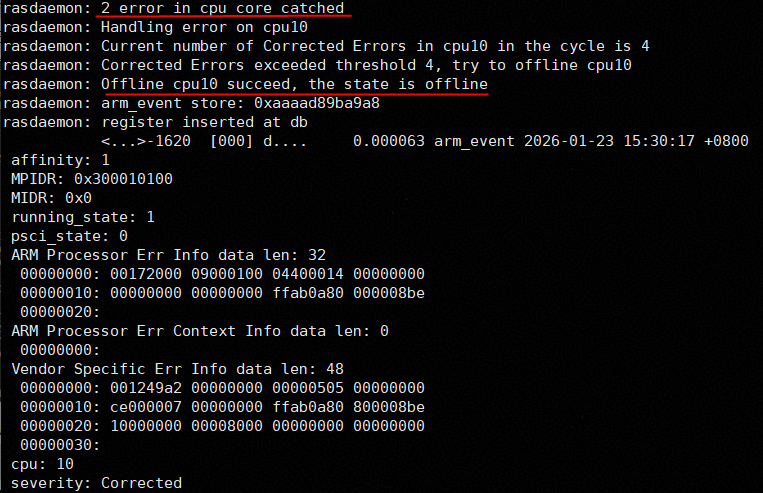
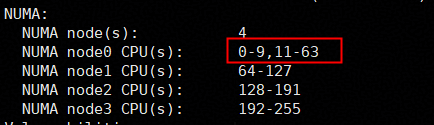
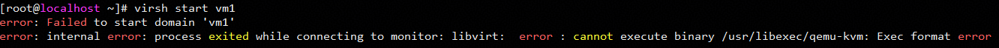
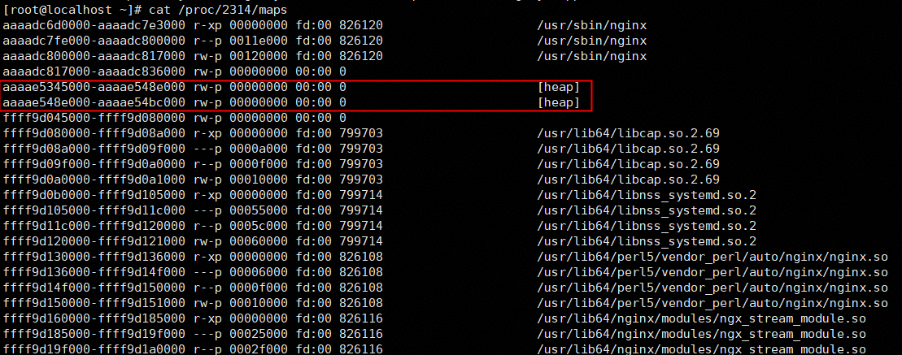
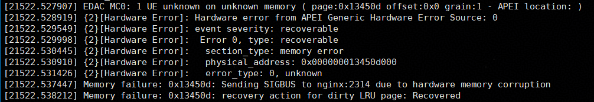
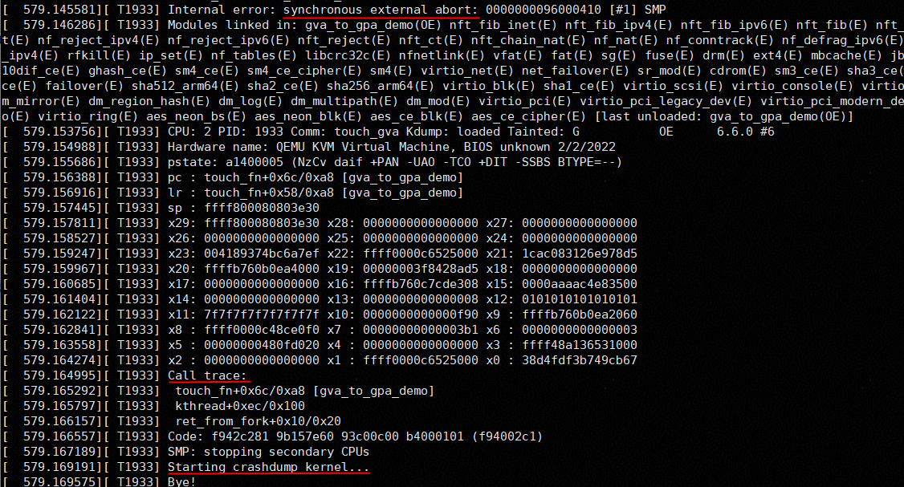

# VM Single-Core and Single-Page Exception Handling Feature Guide<a name="EN-US_TOPIC_0000002552288799"></a>

## Feature Description<a name="EN-US_TOPIC_0000002544272171"></a>

This document describes how to install, use, and test the single-core and single-page exception handling feature on a Kunpeng server running openEuler.

**Overview<a name="section12837201416207"></a>**

To ensure long-term stable running of Internet systems, Reliability, Availability, and Serviceability (RAS) capabilities are required to obtain the faulty hardware of the current physical machine and process the corresponding hardware information, minimizing the impact scope. After the single-core and single-page exception handling feature is enabled, single-core corrected errors (CEs) can be isolated online on Kunpeng servers without affecting service running; uncorrected errors (UEs) in a single page of memory affect only one process in a VM, preventing the VM from going offline.

**Specifications<a name="section186211624175715"></a>**

Supported VM specifications include but are not limited to 2 vCPUs with 8 GB memory, 4 vCPUs with 8 GB memory, 4 vCPUs with 16 GB memory, 8 vCPUs with 16 GB memory, 16 vCPUs with 32 GB memory, and 32 vCPUs with 64 GB memory.

**Version Requirements<a name="section1625164615574"></a>**

- Versions: openEuler 24.03 LTS SP3, QEMU 8.2.0, and libvirt 9.10.0-26.oe2403sp3 or later
- License requirement: none

**Constraints<a name="section3897196125818"></a>**

- The application environment must meet the hardware and software requirements.
- The single-page memory error handling is supported only when physical machines use 4 KB pages.

**Application Scenarios<a name="section49961711506"></a>**

In common cloud computing scenarios, VMs can be recovered without interrupting other services when memory hardware errors occur.

## Installation and Usage<a name="EN-US_TOPIC_0000002544287333"></a>

### Environment Requirements<a name="EN-US_TOPIC_0000002512745012"></a>

This document provides guidance based on specific environments. Before performing operations, ensure that your software and hardware meet the requirements.

**Hardware Requirements<a name="section26241127"></a>**

[**Table 1**](#hardware-requirement) lists the hardware requirement.

**Table 1** Hardware requirement<a id="hardware-requirement"></a>

|Item|Description|
|--|--|
|Processor|New Kunpeng 920 processor model or Kunpeng 950 processor|


**Firmware Version Requirements<a name="section4793193042413"></a>**

[**Table 2**](#firmware-version-requirement) lists the firmware version requirement. You are advised to upgrade all firmware to the required versions.

**Table 2** Firmware version requirement<a id="firmware-version-requirement"></a>

|Item|Version|
|--|--|
|New Kunpeng 920 processor model|Basic computing unit (BCU) CPLD: later than 7.0.0|


**OS and Software Requirements<a name="section153345522323"></a>**

[**Table 3**](#os-and-software-requirements) lists the OS and software requirements.

**Table 3** OS and software requirements<a id="os-and-software-requirements"></a>

|Item|Version|How to Obtain|
|--|--|--|
|OS|openEuler 24.03 LTS SP3|[Link](https://dl-cdn.openeuler.openatom.cn/openEuler-24.03-LTS-SP3/ISO/aarch64/)|
|libvirt|9.10.0-26.oe2403sp3 or later|Install it using a Yum repository.|
|QEMU|8.2.0|Install it using a Yum repository.|
|Nginx|1.24.0|Install it using a Yum repository.|
|wrk|4.2.0|Install it using a Yum repository.|

### Configuring the BIOS<a name="EN-US_TOPIC_0000002545544251"></a>

Modifying the BIOS is only for feature verification. You are advised to retain the default settings during normal use.

1. Restart the physical machine and go to the BIOS page.
2. Choose `Advanced` > `RAS Configuration` and set `Ce Report Policy` and `Error Inject` to `Enabled`.

    

### Installing libvirt<a name="EN-US_TOPIC_0000002544424933"></a>

Only libvirt 9.10.0 is supported. Ensure that the version of libvirt to be installed is the target one. If the version of libvirt is not 9.10.0, uninstall it and its dependencies before the installation.

**Prerequisites<a name="section610117391219"></a>**

Configure an online Yum repository. For details, see [Configuring a Yum Source](https://www.hikunpeng.com/document/detail/en/kunpengcpfs/ecosystemEnable/Libvirt/kunpengcpfs_libvirt_03_0005.html).

**Procedure<a name="section830916587214"></a>**

Install libvirt.

```
yum install -y libvirt
```

### Configuring the VM XML File<a name="EN-US_TOPIC_0000002544304941"></a>

Configure the VM XML file to enable the memory error injection function.

1. Edit the VM XML file.

    ```
    virsh edit <vm name>
    ```

2. Press `i` to enter the insert mode and add `<ras/>` under the `<features>` tag.

    ```
    <domain type='kvm'>
      ...
      <features>
        <acpi/>
        <gic version='3'/>
        <ras/>
      </features>
      ...
    </domain>
    ```

3. Press `Esc` to exit the insert mode. Type `:wq!` and press `Enter` to save the file and exit.


## Function Tests<a name="EN-US_TOPIC_0000002544247337"></a>

### Installing Test Tools<a name="EN-US_TOPIC_0000002516419674"></a>

Before tests, install the test tools.

**Installing Nginx<a name="section7262191845011"></a>**

Nginx is used only to verify service continuity during error injection. You can use any Nginx version. The following uses 1.24.0 as an example, which is the version provided by the Yum repository. Run the following command on the VM to install it:

```
yum install -y nginx
```

**Installing wrk<a name="section11529195313920"></a>**

wrk is an HTTP stress test tool. It is used to perform stress tests on Nginx to ensure that the service process is heavily-loaded when an error is injected. You can use any wrk version. The following uses 4.2.0 as an example, which is the version provided by the Yum repository. Run the following command on the physical machine to install it:

```
yum install -y wrk
```

**Installing Rasdaemon<a name="section15346121171015"></a>**

Rasdaemon is a daemon that records and prints error information when a RAS event occurs. Run the following command on the physical machine to install it:

```
yum install -y rasdaemon
```

### Single-Core CE Tests<a name="EN-US_TOPIC_0000002512727410"></a>

Single-core CE injection is implemented using the einj module provided by the kernel.
> **NOTE:**
>1. Single-core error injection takes effect only on physical cores. In hyper-threading scenarios, no matter which hyper-threads are selected for injection, the injection takes effect only on the first hyper-thread.
>2. Single-core error isolation is provided by the host OS. In hyper-threading scenarios, the OS does not proactively isolate all hyper-threads. Users or software need to determine whether to isolate one or two hyper-threads when an error occurs. For security purposes, if one hyper-thread is isolated due to an error, users need to manually isolate the other hyper-thread.

1. Load the error injection module.

    ```
    modprobe einj
    ```

2. Modify the VM XML file and add the core binding information. Take a 4-core VM as an example. Add the following content:

    ```
    <cputune>
        <vcpupin vcpu='0' cpuset='10'/>
        <vcpupin vcpu='1' cpuset='11'/>
        <vcpupin vcpu='2' cpuset='12'/>
        <vcpupin vcpu='3' cpuset='13'/>
    </cputune>
    ```

3. Start the VM, run Nginx on the VM, and disable the firewall of the VM.

    ```
    systemctl stop firewalld
    systemctl start nginx
    ```

4. Use wrk on the physical machine to perform a stress test on Nginx.

    ```
    wrk -t4 -c64 -d60s http://<VM IP address>/
    ```

5. Configure the threshold for the RAS function to take effect.

    ```
    export CPU_ISOLATION_ENABLE=yes; export CPU_CE_THRESHOLD=4; export CPU_ISOLATION_CYCLE=24h; export CPU_ISOLATION_LIMIT=10
    ```

6. Start the Rasdaemon service.

    ```
    rasdaemon -f -r
    ```

7. Select a core, for example, CPU 10, and repeatedly run the following commands to inject errors multiple times.

    ```
    echo 0x1 > /sys/kernel/debug/apei/einj/error_type
    echo 10 > /sys/kernel/debug/apei/einj/param1
    echo 0xfffffffffffffff0 > /sys/kernel/debug/apei/einj/param2
    echo 1 > /sys/kernel/debug/apei/einj/notrigger
    echo 1 > /sys/kernel/debug/apei/einj/error_inject 
    ```

8. Check whether the Rasdaemon log records the error information. If the error information is recorded, the error injection is successful. If no error information is recorded, the error injection fails. In this case, you are advised to inject errors again.

    

9. After the number of error injections reaches the threshold, run the following command to check whether the core where the errors are injected is offline and whether the vCPU binding relationship is changed:

    ```
    lscpu
    ```

    

    ```
    virsh vcpuinfo <vm name>
    ```

    

10. Check the Nginx running status on the VM.

    ```
    ps -ef | grep nginx
    ```

### Single-Page Memory Error Tests<a name="EN-US_TOPIC_0000002512607428"></a>

#### Precautions for Tests<a name="EN-US_TOPIC_0000002518779356"></a>

Single-page memory error tests may damage the QEMU binary file. The error information is as follows:



To solve this issue, you can perform the following operation:

Reinstall the QEMU software.

```
yum reinstall qemu
```


#### Obtaining the Error Injection Address<a name="EN-US_TOPIC_0000002514439060"></a>

This section uses Nginx as an example to describe how to obtain the virtual address of a process and how to convert the virtual address into a physical address or an address page number required by the error injection tool.

**Obtaining the VM User-Space Address<a id="section7262191845011"></a>**

1. Start Nginx on the VM.

    ```
    systemctl start nginx
    ```

2. Obtain the Nginx process ID.

    ```
    ps -ef | grep nginx
    ```

    

3. Select a worker process, obtain the process address space, and use an address within the heap segment in the address space as the guest virtual address (GVA) of error injection.

    ```
    cat /proc/<pid>/maps
    ```

    

4. Compile and execute the following code to convert the virtual address to a physical address.

    ```
    gcc -o addr_trans addr_trans.c
    ./addr_trans
    ```

    The content of the `addr_trans.c` file is as follows. Modify the PID and the address to be translated based on the actual situation before executing the script.

    ```
    // addr_trans.c
    #include <stdio.h>
    #include <stdlib.h>
    #include <fcntl.h>
    #include <unistd.h>
    #include <stdint.h>
    
    // Obtain the physical address corresponding to the virtual address (root permission required).
    unsigned long virt_to_phys(pid_t pid, unsigned long addr) {
        char pagemap_path[64];
        snprintf(pagemap_path, sizeof(pagemap_path), "/proc/%d/pagemap", pid);
    
        int fd = open(pagemap_path, O_RDONLY);
        if (fd < 0) {
            perror("open pagemap");
            return 0;
        }
    
        // Calculate the offset in the pagemap (each virtual page occupies 8 bytes).
        unsigned long offset = (addr / sysconf(_SC_PAGE_SIZE)) * sizeof(uint64_t);
        if (lseek(fd, offset, SEEK_SET) < 0) {
            perror("lseek");
            close(fd);
            return 0;
        }
    
        uint64_t entry;
        if (read(fd, &entry, sizeof(entry)) != sizeof(entry)) {
            perror("read");
            close(fd);
            return 0;
        }
        close(fd);
    
        // Check whether the page is in the memory (bit 63).
        if (!(entry & (1ULL << 63))) {
            return 0; // The page is not in the physical memory.
        }
    
        // The lower 55 bits indicate the physical frame number (PFN).
        unsigned long pfn = entry & ((1ULL << 55) - 1);
        return (pfn * sysconf(_SC_PAGE_SIZE)) + (addr % sysconf(_SC_PAGE_SIZE));
    }
    
    int main() {
        uint8_t *p = (void*)0xaaaae5345000; // Address to be translated.
        unsigned long phys_addr = virt_to_phys(2314, (uint64_t)p); // Passed to the PID.
        printf("Virtual address: %p\n", p);
        printf("Physical address: 0x%lx\n", phys_addr);
        return 0;
    }
    ```

**Obtaining the VM Kernel-Space Physical Address<a id="section1813642420262"></a>**

This document uses the physical address applied by the kernel module as an example of the error injection address.

1. Install the compilation dependencies.

    ```
    yum install -y kernel-devel-$(uname -r) kernel-headers-$(uname -r) gcc make elfutils-libelf-devel
    ```

2. Write the kernel module.
    1. Create a module directory.

        ```
        mkdir kmem && cd kmem
        ```

    2. Create the `gva_to_gpa_demo.c` module file.

        ```
        vim gva_to_gpa_demo.c
        ```

    3. Press `i` to enter the insert mode and edit the file. The file content is as follows:

        ```
        // gva_to_gpa_demo.c
        #include <linux/module.h>
        #include <linux/kernel.h>
        #include <linux/init.h>
        #include <linux/mm.h>
        #include <linux/slab.h>
        #include <linux/sched.h>
        #include <linux/kthread.h>
        
        MODULE_LICENSE("GPL");
        MODULE_AUTHOR("lt");
        MODULE_DESCRIPTION("Demo: allocate kernel memory and print GVA -> GPA");
        MODULE_VERSION("1.2");
        
        static void *buf;
        static struct task_struct *thr;
        
        static int touch_fn(void *data)
        {
            volatile u64 *p = buf;
            u64 cnt = 0;
        
            while (!kthread_should_stop()) {
                if (!buf) break;
                *p;   /* force access */
        
                if (++cnt % 1000 == 0)
                    cond_resched();
            }
            return 0;
        }
        
        static int __init gva_gpa_demo_init(void)
        {
            unsigned long gva;
            struct page *page;
            phys_addr_t gpa;
            unsigned long offset;
        
            buf = kmalloc(PAGE_SIZE, GFP_KERNEL);
            if (!buf) {
                pr_err("kmalloc failed\n");
                return -ENOMEM;
            }
        
            gva = (unsigned long)buf;
            offset = gva & ~PAGE_MASK;
        
            page = virt_to_page(buf);
            if (!page) {
                pr_err("virt_to_page failed\n");
                kfree(buf);
                return -EFAULT;
            }
        
            gpa = page_to_phys(page) + offset;
        
            pr_info("Allocated kernel memory:\n");
            pr_info("  GVA : 0x%lx\n", gva);
            pr_info("  GPA : 0x%llx\n", (unsigned long long)gpa);
            pr_info("  PFN : 0x%lx\n", page_to_pfn(page));
        
            thr = kthread_run(touch_fn, NULL, "touch_gva");
            if (IS_ERR(thr)) {
                kfree(buf);
                return PTR_ERR(thr);
            }
        
            return 0;
        }
        
        static void __exit gva_gpa_demo_exit(void)
        {
            if (thr)
                kthread_stop(thr);
        
            if (buf) {
                kfree(buf);
                buf = NULL;
            }
            pr_info("gva_gpa_demo unloaded\n");
        }
        
        module_init(gva_gpa_demo_init);
        module_exit(gva_gpa_demo_exit);
        ```

    4. Press `Esc` to exit the insert mode. Type `:wq!` and press `Enter` to save the file and exit.
    5. Create a `Makefile`.

        ```
        vim Makefile
        ```

    6. Press `i` to enter the insert mode and edit `Makefile`. The file content is as follows:

        ```
        # Makefile
        obj-m := gva_to_gpa_demo.o
        
        KDIR := /lib/modules/$(shell uname -r)/build
        PWD  := $(shell pwd)
        
        all:
                make -C $(KDIR) M=$(PWD) modules
        
        clean:
                make -C $(KDIR) M=$(PWD) clean
        ```

        > **NOTE:**
        >If the message "Makefile:8: *** missing separator" is displayed during compilation, replace all spaces before `make` with a tab.

    7. Press `Esc` to exit the insert mode. Type `:wq!` and press `Enter` to save the file and exit.

3. Compile and install the module, and obtain the guest physical address (GPA). As shown in the following figure, the GPA is `0x106525000`.

    ```
    make
    insmod gva_to_gpa_demo.ko
    dmesg | tail
    ```

    

**Converting the VM Address to a Physical Machine Address<a name="section12404223103714"></a>**

1. Obtain the physical address of the VM. For details, see [Obtaining the VM User-Space Address](#section7262191845011) and [Obtaining the VM Kernel-Space Physical Address](#section1813642420262).
2. Obtain the QEMU PID.

    ```
    ps -ef | grep qemu
    ```

3. Convert the GPA to the host virtual address (HVA).

    ```
    virsh qemu-monitor-command <vm name> --hmp "gpa2hva <GPA>"
    ```

4. Translate the HVA.

    > **NOTE:**
    >The HVA can be translated into a page number or a host physical address (HPA), depending on the tool used in the error injection process.

    - Run the following script to translate the HVA into a page number. Change the PID and the address to be translated based on the actual situation.

        ```
        pid=<PID>
        addr=<HVA>
        page_size=$(getconf PAGESIZE)
        vpn=$((addr / page_size))
        offset=$((vpn * 8))
        entry=$(dd if=/proc/$pid/pagemap bs=8 count=1 skip=$vpn 2>/dev/null | od -An -t u8)
        entry_hex=$(printf "%x\n" $entry)
        present=$(( (entry >> 63) & 1 ))
        pfn=$(( entry & ((1<<55)-1) ))
        echo "pagemap entry = 0x$entry_hex"
        echo "present      = $present"
        echo "PFN          = $pfn"
        ```

    - Run the following code to translate the HVA into an HPA:

        ```
        gcc -o addr_trans addr_trans.c
        ./addr_trans
        ```

        The content of the `addr_trans.c` file is as follows. Modify the PID and the address to be translated based on the actual situation before executing the script.

        ```
        // addr_trans.c
        #include <stdio.h>
        #include <stdlib.h>
        #include <fcntl.h>
        #include <unistd.h>
        #include <stdint.h>
        
        // Obtain the physical address corresponding to the virtual address (root permission required).
        unsigned long virt_to_phys(pid_t pid, unsigned long addr) {
            char pagemap_path[64];
            snprintf(pagemap_path, sizeof(pagemap_path), "/proc/%d/pagemap", pid);
        
            int fd = open(pagemap_path, O_RDONLY);
            if (fd < 0) {
                perror("open pagemap");
                return 0;
            }
        
            // Calculate the offset in the pagemap (each virtual page occupies 8 bytes).
            unsigned long offset = (addr / sysconf(_SC_PAGE_SIZE)) * sizeof(uint64_t);
            if (lseek(fd, offset, SEEK_SET) < 0) {
                perror("lseek");
                close(fd);
                return 0;
            }
        
            uint64_t entry;
            if (read(fd, &entry, sizeof(entry)) != sizeof(entry)) {
                perror("read");
                close(fd);
                return 0;
            }
            close(fd);
        
            // Check whether the page is in the memory (bit 63).
            if (!(entry & (1ULL << 63))) {
                return 0; // The page is not in the physical memory.
            }
        
            // The lower 55 bits indicate the PFN.
            unsigned long pfn = entry & ((1ULL << 55) - 1);
            return (pfn * sysconf(_SC_PAGE_SIZE)) + (addr % sysconf(_SC_PAGE_SIZE));
        }
        
        int main() {
            uint8_t *p = (void*)0xaaaae5345000; // Address to be translated.
            unsigned long phys_addr = virt_to_phys(2314, (uint64_t)p); // Passed to the QEMU PID.
            printf("Virtual address: %p\n", p);
            printf("Physical address: 0x%lx\n", phys_addr);
            return 0;
        }
        ```

#### Testing VM Memory UEs<a name="EN-US_TOPIC_0000002546078353"></a>

The hwpoison_inject module is used to inject VM memory UEs.

1. Load the module.

    ```
    modprobe hwpoison_inject
    ```

2. Convert the GPA into the page number of a physical machine address as instructed in [Obtaining the Error Injection Address](#obtaining-the-error-injection-address).
3. (Optional) If the error injection address is an Nginx process address, use wrk on the physical machine to perform a stress test on Nginx.

    ```
    wrk -t4 -c64 -d60s http://<VM IP address>/
    ```

4. Inject an error.

    ```
    echo <pfn> > /sys/kernel/debug/hwpoison/corrupt-pfn
    ```

5. Observe the result on the VM.
    - If the error injection address is a user-space address, run the `dmesg` command to check whether the system log contains the record of sending SIGBUS to the corresponding process.

        

    - If the error injection address is a kernel-space address, the kernel receives a synchronous external abort (SEA) interrupt, prints `Call trace`, and then executes the panic process.

        

#### Testing VM Memory CEs<a name="EN-US_TOPIC_0000002514438490"></a>

The einj module is used to inject VM memory CEs.

> **NOTE:**
>To use the einj module to inject memory errors, you need to disable the kernel compilation option `CONFIG_STRICT_DEVMEM` and then recompile the kernel.

1. Install the BusyBox tool.

    ```
    yum install busybox
    ```

2. Load the module.

    ```
    modprobe einj
    ```

3. Convert the GPA into an HPA as instructed in [Obtaining the Error Injection Address](#obtaining-the-error-injection-address).
4. (Optional) If the error injection address is an Nginx process address, use wrk on the physical machine to perform a stress test on Nginx.

    ```
    wrk -t4 -c64 -d60s http://<VM IP address>/
    ```

5. Start Rasdaemon.

    ```
    rasdaemon -r -f
    ```

6. Inject errors.

    ```
    echo 0x8 > /sys/kernel/debug/apei/einj/error_type
    echo <HPA> > /sys/kernel/debug/apei/einj/param1
    echo 0xfffffffffffffff0 > /sys/kernel/debug/apei/einj/param2
    echo 1 > /sys/kernel/debug/apei/einj/notrigger
    echo 1 > /sys/kernel/debug/apei/einj/error_inject
    busybox devmem <HPA> 32 0x11111111
    busybox devmem <HPA> 32 
    ```

7. On the physical machine, check whether Rasdaemon has updated CE logs.

    


## Acronyms and Abbreviations<a name="EN-US_TOPIC_0000002516299116"></a>

|Acronym/Abbreviation|Full Spelling|
|--|--|
|RAS|Reliability, Availability, and Serviceability|
|CE|corrected error|
|UE|uncorrected error|
|GVA|guest virtual address|
|GPA|guest physical address|
|HVA|host virtual address|
|HPA|host physical address|
|SEA|synchronous external abort|


## Change History<a name="EN-US_TOPIC_0000002544287789"></a>

|Date|Description|
|--|--|
|2026-03-30|The issue is the first official release.|
