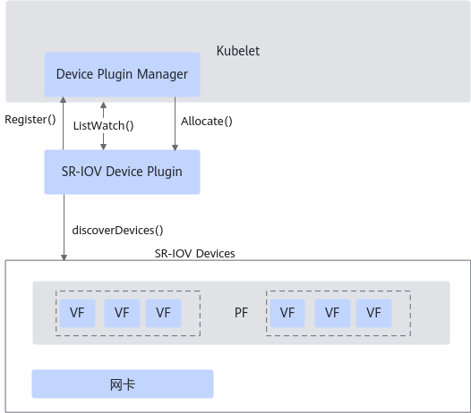
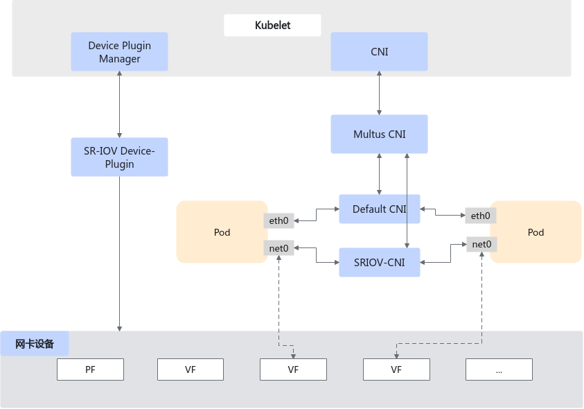
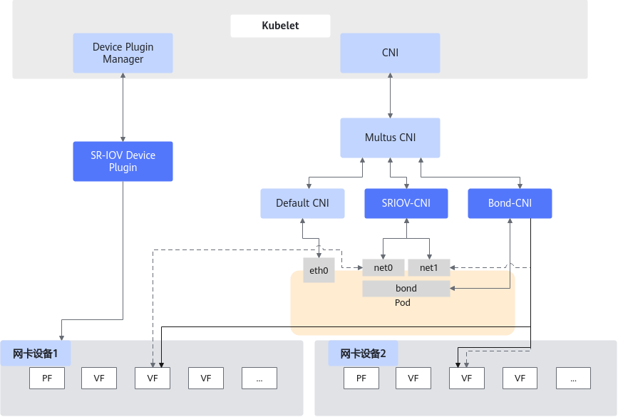
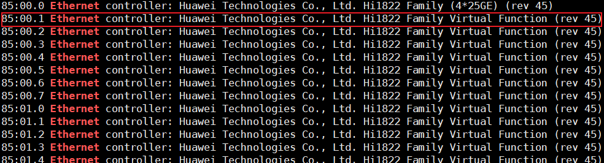
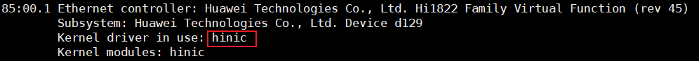

# K8s SR-IOV直通插件 用户指南<a name="ZH-CN_TOPIC_0000002552285773"></a>

## 介绍<a name="ZH-CN_TOPIC_0000002549765655"></a>

### 插件简介<a name="ZH-CN_TOPIC_0000002518405810"></a>

本文主要介绍如何在使用openEuler操作系统的服务器中部署和使用Kubernetes（K8s） SR-IOV直通插件，将物理机上的设备直通到容器中。当前支持SR-IOV设备直通插件，SR-IOV-CNI网络直通插件和Bond-CNI插件。

使用常见的Flannel和Calico等网络插件时，网络通信时延较高，这对微服务的IOPS时延影响较大。为降低网络时延，可以采用VF直通技术。SR-IOV-CNI网络直通插件通过将物理网卡的Virtual Function（VF）添加到容器中，有效减少了网络时延。

在将SR-IOV VF直通至容器的基础上，Bond-CNI插件为容器提供网卡Bonding功能，有助于在遇到网络配置错误或功能异常时提升服务的高可用性和异常保护。

### 软件架构<a name="ZH-CN_TOPIC_0000002518405808"></a>

SR-IOV设备直通插件运行在K8s集群中的计算节点上，采用DaemonSet形式的Pod进行部署。

- SR-IOV设备直通插件的软件架构图如[**图 1** SR-IOV设备直通插件架构图](#SR-IOV设备直通插件架构图)所示。
- SR-IOV-CNI网络直通插件的软件架构图如[**图 2** SR-IOV-CNI网络直通插件的软件架构图](#SR-IOV-CNI网络直通插件的软件架构图)所示。
- Bond-CNI插件的软件架构图如[**图 3** Bond-CNI插件的软件架构图](#Bond-CNI插件的软件架构图)所示。
- 架构图中各模块功能如[**表 1** 各模块功能](#各模块功能)所示。

**图 1** SR-IOV设备直通插件架构图<a name="fig3980193175810"></a><a id="SR-IOV设备直通插件架构图"></a><br>


**图 2** SR-IOV-CNI网络直通插件的软件架构图<a name="fig182891652499"></a><a id="SR-IOV-CNI网络直通插件的软件架构图"></a><br>


**图 3** Bond-CNI插件的软件架构图<a name="fig86021356104"></a><a id="Bond-CNI插件的软件架构图"></a><br>


**表 1** 各模块功能<a id="各模块功能"></a>

|名称|功能|
|--|--|
|Kubelet|Kubelet会在Pod启动前请求这些网络插件来配置网络接口。|
|Device Plugin Manager|Kubelet的一个子组件，负责管理设备插件的生命周期和状态。它通过与SR-IOV Device Plugin等设备插件交互，确保设备在节点上可用，并且在Pod调度时将设备分配给相应的容器。|
|Multus CNI|一个多网络插件管理工具，允许一个Pod同时连接多个网络。它充当CNI插件的管理器，根据Pod的配置，调用不同的网络插件（如SR-IOV-CNI网络直通插件、Flannel等）来配置网络接口。|
|SR-IOV Devices|支持SR-IOV设备，可以将单个设备直通给多个容器使用。|
|SR-IOV Device Plugin|K8s SR-IOV设备直通插件，负责识别与纳管SR-IOV设备。当分配请求到来时，负责决定分配哪一个设备。|
|SR-IOV-CNI网络直通插件|由Multus CNI管理并由Kubelet调用，用于为Pod配置SR-IOV网络接口。它直接与节点的物理网卡进行交互，从物理网卡分配虚拟功能（VF）并将其分配给容器。|
|Bond-CNI插件|由Multus CNI管理并由Kubelet调用，在Pod的SR-IOV网络接口的基础之上，构建新的Bond网络接口。|


### 规格<a name="ZH-CN_TOPIC_0000002549885659"></a>

K8s SR-IOV设备直通插件当前支持鲲鹏920系列处理器，能够对K8s集群上的SR-IOV设备进行自动识别与管理。


### 约束与限制<a name="ZH-CN_TOPIC_0000002549885655"></a>

在部署SR-IOV设备直通插件之前，请务必确保K8s集群与Docker/Containerd版本与本文的要求相匹配，以确保插件能够正常运行并发挥其应有的功能。

SR-IOV设备直通插件要求K8s集群使用Docker/Containerd作为容器运行时（Container Runtime），并且K8s与Docker/Containerd的版本需满足[**表 1** 版本要求](#版本要求)。

**表 1** 版本要求<a id="版本要求"></a>

|软件名|版本|获取地址|
|--|--|--|
|Kubernetes|1.28.4|[获取链接](https://github.com/kubernetes/kubernetes/archive/refs/tags/v1.28.4.tar.gz)|
|Kubernetes|1.23.6|[获取链接](https://github.com/kubernetes/kubernetes/archive/refs/tags/v1.23.6.tar.gz)|
|Containerd|1.7.14|[获取链接](https://github.com/containerd/containerd/releases/download/v1.7.14/containerd-1.7.14-linux-arm64.tar.gz)|
|Docker|20.10.14|从镜像源安装|


## 编译插件<a name="ZH-CN_TOPIC_0000002518245894"></a>

### 编译环境要求<a name="ZH-CN_TOPIC_0000002518245896"></a>

本文基于openEuler操作系统提供指导，在正式操作前请确保软硬件均满足要求。服务器需有访问外网权限，以方便下载依赖包。通过编译SR-IOV设备直通插件源码生成SR-IOV设备直通插件镜像，并部署至集群。

**硬件要求<a name="section195514534142"></a>**

**表 1** SR-IOV设备直通插件镜像编译构建硬件环境要求<a id="SR-IOV设备直通插件镜像编译构建硬件环境要求"></a>

|项目|说明|
|--|--|
|处理器|鲲鹏920系列处理器|


**操作系统和软件要求<a name="section377795111612"></a>**

> **须知：** 
>编译镜像前请确保已经配置Docker镜像源，保证Docker镜像可以顺利拉取。

**表 2** 已验证的操作系统和软件版本<a id="已验证的操作系统和软件版本"></a>

|软件|版本|获取地址|
|--|--|--|
|OS|openEuler 22.03 LTS SP4|[获取链接](https://repo.openeuler.org/openEuler-22.03-LTS-SP4/ISO/aarch64/)|
|OS|openEuler 20.03 LTS SP3|[获取链接](https://repo.openeuler.org/openEuler-20.03-LTS-SP3/ISO/aarch64/)|
|OS|openEuler 24.03 LTS SP1|[获取链接](https://repo.openeuler.org/openEuler-24.03-LTS-SP1/ISO/aarch64/)|
|Bond-CNI插件源码|-|[获取链接](https://github.com/k8snetworkplumbingwg/bond-cni)|
|Docker|20.10.14|通过配置Yum源方式安装|
|Golang|1.21+|通过[官网](https://golang.google.cn/dl/)安装|

### 获取SR-IOV-CNI网络直通插件<a name="ZH-CN_TOPIC_0000002549885657"></a>

SR-IOV-CNI网络直通插件的部署依赖于Multus和SR-IOV设备直通插件，部署之前，执行以下命令分别获取SR-IOV设备直通插件、SR-IOV-CNI网络直通插件和Multus CNI镜像。

```
docker pull ghcr.io/k8snetworkplumbingwg/sriov-network-device-plugin:latest
docker pull ghcr.io/k8snetworkplumbingwg/sriov-cni:latest
docker pull ghcr.io/k8snetworkplumbingwg/multus-cni:snapshot
```

如果需要配置全局whereabouts，还可以提前拉取whereabouts插件的镜像。

```
docker pull ghcr.io/k8snetworkplumbingwg/whereabouts:latest
```


### 获取Bond-CNI插件<a name="ZH-CN_TOPIC_0000002518245898"></a>

编译Bond-CNI插件源码得到可执行文件。

1. 获取[源代码](https://github.com/k8snetworkplumbingwg/bond-cni.git)。

    ```
    git clone https://github.com/k8snetworkplumbingwg/bond-cni.git
    ```

2. 进入源代码目录下进行编译，运行如下命令。

    ```
    ./build.sh
    ```

3. 编译完成后，将二进制文件“./bin/bond”复制到集群计算节点的“/opt/cni/bin”目录下。

    ```
    cp ./bin/bond /opt/cni/bin/
    ```


## 部署插件<a name="ZH-CN_TOPIC_0000002549765651"></a>

### 部署环境要求<a name="ZH-CN_TOPIC_0000002549765649"></a>

本文基于鲲鹏服务器和openEuler操作系统提供指导，在正式操作前请确保软硬件均满足要求。

**硬件要求<a name="section1279143142217"></a>**

部署插件的操作需要在主节点上执行，容器镜像导入至所有节点。

**表 1** 硬件要求<a id="硬件要求"></a>

|项目|说明|
|--|--|
|处理器|鲲鹏920系列处理器|


**操作系统和软件要求<a name="section94101941192313"></a>**

**表 2** 操作系统和软件要求<a id="操作系统和软件要求"></a>

|项目|版本|获取方式|
|--|--|--|
|OS|openEuler 22.03 LTS SP4|[获取链接](https://repo.openeuler.org/openEuler-22.03-LTS-SP4/ISO/aarch64/)|
|OS|openEuler 20.03 LTS SP3|[获取链接](https://repo.openeuler.org/openEuler-20.03-LTS-SP3/ISO/aarch64/)|
|OS|openEuler 24.03 LTS SP1|[获取链接](https://repo.openeuler.org/openEuler-24.03-LTS-SP1/ISO/aarch64/)|
|Kubernetes|1.28.4|[获取链接](https://github.com/kubernetes/kubernetes/archive/refs/tags/v1.28.4.tar.gz)<br>请参考《[Kubernetes 部署指南（CentOS&openEuler）](https://www.hikunpeng.com/document/detail/zh/kunpengcpfs/ecosystemEnable/Kubernetes/kunpengk8s_04_0001.html)》进行下载部署。|
|Kubernetes|1.23.6|[获取链接](https://github.com/kubernetes/kubernetes/archive/refs/tags/v1.23.6.tar.gz)<br>请参考《[Kubernetes 部署指南（CentOS&openEuler）](https://www.hikunpeng.com/document/detail/zh/kunpengcpfs/ecosystemEnable/Kubernetes/kunpengk8s_04_0001.html)》进行下载部署。|
|Containerd|1.7.14|[获取链接](https://github.com/containerd/containerd/releases/download/v1.7.14/containerd-1.7.14-linux-arm64.tar.gz)<br>请参考《[Containerd 安装指南（CentOS 8.1&openEuler 20.03）](https://www.hikunpeng.com/document/detail/zh/kunpengcpfs/ecosystemEnable/Containerd/kunpengcontainerd_03_0003.html)》进行下载部署。|
|Docker|20.10.14|从镜像源安装|
|SR-IOV Device Plugin|v3.9.0|[获取链接](https://github.com/k8snetworkplumbingwg/sriov-network-device-plugin.git)|
|Multus CNI|v4.2.0|[获取链接](https://github.com/k8snetworkplumbingwg/multus-cni.git)|
|SR-IOV-CNI网络直通插件|v2.9.0|[获取链接](https://github.com/k8snetworkplumbingwg/sriov-cni.git)|
|Bond-CNI插件|master|[获取链接](https://github.com/k8snetworkplumbingwg/bond-cni.git)|
|whereabouts|v0.9.0|[获取链接](https://github.com/k8snetworkplumbingwg/whereabouts)|

### 部署SR-IOV-CNI网络直通插件<a name="ZH-CN_TOPIC_0000002549765647"></a>

在部署之前需要确保宿主机上的网卡设备已经打开VF功能，且已经创建足够数量的VF。SR-IOV-CNI网络直通插件的部署依赖于Multus和SR-IOV设备直通插件，因而在此之前须部署和配置Multus与SR-IOV设备直通插件。

**部署Multus<a name="section19491204763810"></a>**

Multus插件是K8s网络插件的管理器，根据Pod的配置，调用不同的网络插件（如SR-IOV-CNI网络直通插件、Flannel等）来配置网络接口。它包括Thin plugin和Thick plugin两类实现，此处使用传统的Thin plugin方式进行配置，可参考配置文件[multus-daemonset.yml](https://raw.githubusercontent.com/k8snetworkplumbingwg/multus-cni/master/deployments/multus-daemonset.yml)。

1. 在集群主节点部署Multus插件。

    ```
    kubectl apply -f multus-daemonset.yml
    ```

2. 执行以下命令查看部署情况。

    ```
    kubectl -n kube-system get pod
    ```

    multus-ds应当处于Running状态，示例如下。

    ```
    NAME                             READY   STATUS    RESTARTS      AGE
    kube-multus-ds-ds26q             1/1     Running   0             20d
    kube-multus-ds-pp6mh             1/1     Running   0             20d
    ```

**部署SR-IOV设备直通插件<a name="section103321214448"></a>**

在部署SR-IOV设备直通插件之前需要先修改SR-IOV设备直通插件配置文件。

“configMap.yaml”配置文件描述了SR-IOV插件要管理的设备，即用户期望直通的设备。

```
apiVersion: v1
kind: ConfigMap
metadata:
  name: sriovdp-config
  namespace: kube-system
data:
  config.json: |
    {
        "resourceList": [
            {
               "resourceName": "huawei_1822_netdevice",
               "resourcePrefix": "huawei.com",
               "selectors": {
                    "vendors": ["19e5"],
                    "devices": ["375e"],
                    "drivers": ["hinic"],
                    "pfNames" : [ensp133s0]
                },
            },
            {
               "resourceName": "huawei_1823_netdevice",
               "resourcePrefix": "huawei.com",
               "selectors": {
                    "vendors": ["19e5"],
                    "devices": ["375f"],
                    "drivers": ["hisdk3"]
                }
            },
...
```

**表 1** configMap.yaml文件参数说明<a id="configMap.yaml文件参数说明"></a>

|参数|说明|约束条件|
|--|--|--|
|resourceName|资源的名字，可自定义。|不能重复并且不能包含特殊字符。|
|resourcePrefix|资源名称的前缀，可自定义。|不能包含特殊字符，可以写成xx.com，例如huawei.com。|
|deviceType|设备的类型。|目前支持的值有：accelerator、netDevice、auxNetDevice，默认值是netDevice。|
|selectors|资源筛选器。|只有与selectors里面填写的筛选条件相同的设备才会被管理。|
|vendors|设备的厂商号，比如华为的vendors是19e5，具体的查看方法参见2。|-|
|devices|设备的设备号，具体的查看方法参见2。|-|
|drivers|设备使用的驱动名字，具体的查看方法参见3。|-|
|pfNames|网卡上的pf名称|机器上存在多个网口时，需全部添加，防止来自不同网口的vf混用。|


1. 在节点查看需要使用的网卡设备的VF的PCI地址。

    ```
    lspci | grep Ethernet
    ```

    

    > **说明：** 
    >实际使用时创建的网卡设备的VF可能不只一个，选择其中一个VF的PCI地址查找即可，因为所有VF的“vendors”、“devices”、“drivers”都是一样。

2. <a name="li12442201520150"></a>根据上一步回显信息确认需要使用VF设备的PCI地址是“85:00.1”，然后执行以下命令进一步确认设备的“vendors”和“devices”。

    其中“vendors”是“19e5”，“devices”是“375e”。

    ```
    lspci -n | grep 85
    ```

    

3. <a name="li14503133373"></a>确认设备对应的驱动“drivers”。

    在输出中找到PCI地址为“85:00.1”的设备对应的驱动名称。

    ```
    lspci -k
    ```

    

4. 得到“vendors”、“devices”、“drivers”的信息后，填写到configMap.yaml文件中，每一个SR-IOV设备对应resourceList中的一项。
5. 通过sriovdp-daemonset.yaml部署文件，在集群中以Daemonset形式部署SR-IOV设备直通插件。

    ```
    git clone https://gitee.com/kunpeng_compute/sriov-network-device-plugin.git
    cd sriov-network-device-plugin
    kubectl apply -f deployments/configMap.yaml
    kubectl apply -f deployments/sriovdp-daemonset.yaml
    ```

6. 查看部署情况。

    ```
    kubectl -n kube-system get pod
    ```

    如果部署成功，回显示例如下。kube-sriov-device-plugin的数量与集群节点的数量保持一致。

    ```
    NAME                             READY   STATUS              RESTARTS          AGE
    kube-sriov-device-plugin-wkmrd   1/1     Running             0                 14d
    kube-sriov-device-plugin-xvcs3   1/1     Running             0                 14d
    kube-sriov-device-plugin-fgsa2   1/1     Running             0                 14d
    ```

**部署SR-IOV-CNI网络直通插件<a name="section27804182459"></a>**

1. 在集群中以Daemonset的形式部署，新建部署文件“sriov-cni-daemonset.yaml”，示例如下。

    ```
    ---
    apiVersion: apps/v1
    kind: DaemonSet
    metadata:
      name: kube-sriov-cni-ds
      namespace: kube-system
      labels:
        tier: node
        app: sriov-cni
    spec:
      selector:
        matchLabels:
          name: sriov-cni
      template:
        metadata:
          labels:
            name: sriov-cni
            tier: node
            app: sriov-cni
        spec:
          tolerations:
          - key: node-role.kubernetes.io/master
            operator: Exists
            effect: NoSchedule
          - key: node-role.kubernetes.io/control-plane
            operator: Exists
            effect: NoSchedule
          containers:
          - name: kube-sriov-cni
            image: ghcr.io/k8snetworkplumbingwg/sriov-cni:latest
            imagePullPolicy: IfNotPresent
            securityContext:
              allowPrivilegeEscalation: true
              privileged: true
              readOnlyRootFilesystem: true
              capabilities:
                drop:
                  - ALL
            resources:
              requests:
                cpu: "100m"
                memory: "50Mi"
              limits:
                cpu: "100m"
                memory: "50Mi"
            volumeMounts:
            - name: cnibin
              mountPath: /host/opt/cni/bin
          volumes:
            - name: cnibin
              hostPath:
                path: /opt/cni/bin
    ```

    在集群中运行如下命令部署。

    ```
    kubectl apply -f deployments/sriov-cni-daemonset.yaml
    ```

2. 在Multus中新建SR-IOV直通网络，新建如下“sriov-crd.yaml”配置文件指定SR-IOV网络信息。

    ```
    apiVersion: "k8s.cni.cncf.io/v1"
    kind: NetworkAttachmentDefinition
    metadata:
      name: sriov-net1
      annotations:
        k8s.v1.cni.cncf.io/resourceName: huawei.com/huawei_1822_netdevice # 根据configMap.yaml中的resourceName修改
    spec:
      config: '{
      "type": "sriov",
      "cniVersion": "0.3.1",
      "name": "sriov-network",
      "ipam": {
        "type": "host-local",
        "subnet": "10.56.217.0/24",
        "routes": [{
          "dst": "0.0.0.0/0"
        }],
        "gateway": "10.56.217.1"
      }
    }'
    ```

    在集群中运行如下命令部署。

    ```
    kubectl apply -f deployments/sriov-crd.yaml
    ```

3. 部署后，查询是否所有的网络插件都成功运行。运行如下命令：

    ```
    kubectl get pods -owide -n kube-system
    ```

    显示示例应当如下，部署的容器都处于Running状态，否则请重新查看错误。

    ```
    kube-multus-ds-qhqp4             1/1     Running   0             22h    10.175.119.147   compute01   <none>           <none>
    kube-sriov-cni-ds-4kks2          1/1     Running   0             168m   10.244.1.20      compute01   <none>           <none>
    kube-sriov-device-plugin-bnvg9   1/1     Running   0             20h    10.175.119.147   compute01   <none>           <none>
    ```

    查看网络配置是否成功，输入如下命令查看集群中的自定义资源：

    ```
    kubectl get crds
    ```

    输出中应该包括“network-attachment-definitions.k8s.cni.cncf.io”，如下所示：

    ```
    network-attachment-definitions.k8s.cni.cncf.io    2025-03-05T08:21:27Z
    ```

**（可选）部署whereabouts插件<a name="section1951622914121"></a>**

上述SR-IOV-CNI网络直通插件的示例在配置IP地址管理时，使用主机本地（host-local）CNI插件，但是主机本地插件只能为同一节点上的Pod分配IP地址，多个节点可能存在地址重复冲突的问题，如果希望SR-IOV-CNI网络直通插件动态地在整个集群范围中分配IP地址，可以配置whereabouts插件来满足需求。

1. 参考[部署环境要求](#部署环境要求)下载whereabouts插件后，进入目录当中。

    ```
    git clone https://github.com/k8snetworkplumbingwg/whereabouts && cd whereabouts
    ```

2. 运行下列部署命令。

    ```
    kubectl apply -f doc/crds/daemonset-install.yaml \
          -f doc/crds/whereabouts.cni.cncf.io_ippools.yaml \
          -f doc/crds/whereabouts.cni.cncf.io_overlappingrangeipreservations.yaml
    ```

3. 请将先前部署的“sriov-crd.yaml”文件进行卸载，“ipam.type”参数配置为“whereabouts”，且将“subnet”修改为“range”，其余参数按需修改。文件修改完毕后重新部署即可，示例内容如下：

    ```
    apiVersion: "k8s.cni.cncf.io/v1"
    kind: NetworkAttachmentDefinition
    metadata:
      name: sriov-net1
      annotations:
        k8s.v1.cni.cncf.io/resourceName: huawei.com/huawei_1822_netdevice # 根据configMap.yaml中的resourceName修改
    spec:
      config: '{
      "type": "sriov",
      "cniVersion": "0.3.1",
      "name": "sriov-network",
      "ipam": {
        "type": "whereabouts",
        "range": "10.56.217.0/24",
        "exclude": [],
        "routes": [{
           "dst": "0.0.0.0/0"
        }],
        "range_start": "172.21.217.2",
        "range_end": "172.21.217.255",
        "gateway": "10.56.217.1"
      }
    }'
    ```

### 部署Bond-CNI插件<a name="ZH-CN_TOPIC_0000002549765657"></a>

Bond-CNI需要与其他的多网卡和直通插件集成，在Pod内部完成虚拟网卡的Bonding。与之前SR-IOV-CNI网络直通插件的配置不同的是，在SR-IOV设备的configMap当中，使用PF来区分网络设备，如下为bond4模式的配置。

1. 对物理机上的两个网卡设备进行VF直通配置。

    在sriov-crd-01.yaml中配置一个网卡设备VF直通。

    ```
    apiVersion: "k8s.cni.cncf.io/v1"
    kind: NetworkAttachmentDefinition
    metadata:
      name: sriov-net1
      annotations:
        k8s.v1.cni.cncf.io/resourceName: huawei.com/huawei_1822_netdevice_01
    spec:
      config: '{
      "type": "sriov",
      "cniVersion": "0.3.1",
      "name": "sriov-network",
      "spoofchk":"off"
    }'
    ```

    在sriov-crd-02.yaml中配置另一个网卡设备VF直通。

    ```
    apiVersion: "k8s.cni.cncf.io/v1"
    kind: NetworkAttachmentDefinition
    metadata:
      name: sriov-net2
      annotations:
        k8s.v1.cni.cncf.io/resourceName: huawei.com/huawei_1822_netdevice_02
    spec:
      config: '{
      "type": "sriov",
      "cniVersion": "0.3.1",
      "name": "sriov-network",
      "spoofchk":"off"
    }'
    ```

    新建完成后，在集群中进行部署。

    ```
    kubectl apply -f sriov-crd-01.yaml
    kubectl apply -f sriov-crd-02.yaml
    ```

2. 配置Bond网络接口，新建sriov-crd-bond.yaml进行配置。

    配置中通过“mode”参数指定bonding模式，常见模式有：

    - “balance-rr”（mode=0）
    - “active-backup”（mode=1）
    - “balance-xor”（mode=2）
    - “broadcast”（mode=3）
    - “802.3ad”（mode=4）
    - “balance-tlb”（mode=5）
    - “balance-alb”（mode=6）

    **当前仅建议使用mode=0,1,2三种模式，由于mode=4模式下的协议限制，单个集群节点上无法使用多个mode=4的容器**。部署示例如下：

    ```
    apiVersion: "k8s.cni.cncf.io/v1"
    kind: NetworkAttachmentDefinition
    metadata:
      name: bond-net1
    spec:
      config: '{
      "type": "bond",
      "cniVersion": "0.3.1",
      "name": "bond-net1",
      "mode": "balance-xor",
      "failOverMac": 1,
      "linksInContainer": true,
      "miimon": "100",
      "mtu": 1500,
      "links": [
         {"name": "net1"},
         {"name": "net2"}
      ],
      "ipam": {
        "type": "host-local",
        "subnet": "10.56.217.0/24",
        "routes": [{
          "dst": "0.0.0.0/0"
        }],
        "gateway": "10.56.217.1"
      }
    }'
    ```

    新建完成后，在集群中部署。

    ```
    kubectl apply -f sriov-crd-bond.yaml
    ```

    注意：

    1. “active-backup”模式的“failOverMac”属性是必需的，必须设为“1”。
    2. “linksInContainer=true”标志告知Bond-CNI在容器内找到所需的接口。默认情况下，在容器内使用设置为true。
    3. “links”部分定义将用于创建绑定的接口。默认情况下，Multus将附加的接口命名为"net"，再加上一个连续的数字。
    4. 对于“balance-rr”或“balance-xor”模式，必须为SR-IOV VF将“trust”模式设置为“on”。

        方式一：在“sriov-crd-01.yaml”和“sriov-crd-02.yaml”配置文件中添加“"trust": on”

        ```
        apiVersion: "k8s.cni.cncf.io/v1"
        kind: NetworkAttachmentDefinition
        metadata:
          name: sriov-net2
          annotations:
            k8s.v1.cni.cncf.io/resourceName: huawei.com/huawei_1822_netdevice_02
        spec:
          config: '{
          "type": "sriov",
          "cniVersion": "0.3.1",
          "name": "sriov-network",
          "spoofchk":"off",
          "trust": "on"
        }'
        ```

        方式二：“ip link”直接开启trust模式：

        ```
        ip link set dev <pf接口名> vf <vf编号> 0 trust on
        ```

        设置后可通过“ip link show <PF接口名\>”查看对应的是否出现“trust on”，如下所示：

        ```
        7: enp65s0f1np1: <BROADCAST,MULTICAST,UP,LOWER_UP> mtu 1500 qdisc mq state UP mode DEFAULT group default qlen 1000
            link/ether 20:fa:db:e2:84:ed brd ff:ff:ff:ff:ff:ff
            vf 0     link/ether 00:00:00:00:00:00 brd ff:ff:ff:ff:ff:ff, spoof checking off, link-state auto, trust on, query_rss off
            vf 1     link/ether 00:00:00:00:00:00 brd ff:ff:ff:ff:ff:ff, spoof checking off, link-state auto, trust off, query_rss off
            vf 2     link/ether 00:00:00:00:00:00 brd ff:ff:ff:ff:ff:ff, spoof checking off, link-state auto, trust off, query_rss off
            vf 3     link/ether 00:00:00:00:00:00 brd ff:ff:ff:ff:ff:ff, spoof checking off, link-state auto, trust off, query_rss off
            vf 4     link/ether 00:00:00:00:00:00 brd ff:ff:ff:ff:ff:ff, spoof checking off, link-state auto, trust off, query_rss off
        ```


## 使用插件<a name="ZH-CN_TOPIC_0000002549765653"></a>

### SR-IOV网卡设备直通<a name="ZH-CN_TOPIC_0000002518245900"></a>

在使用该特性时，业务应用Pod的yaml文件中进行下述字段的添加。

1. 在Pod的annotations中指明使用的网络“k8s.v1.cni.cncf.io/networks: sriov-net1”，“sriov-net1”由之前的“sriov-crd.yaml”文件中的“name”字段配置。

    ```
    apiVersion: v1
    kind: Pod
    metadata:
      name: testpod2
      annotations:
        k8s.v1.cni.cncf.io/networks: sriov-net1
    ```

2. 在Pod的resources字段中，添加字段“huawei.com/huawei\_1822\_netdevice: "1"”，具体字段由SR-IOV设备直通插件的配置文件“configMap.yaml”指定，格式为：“resourcePrefix/resourceName: "1"”。

    ```
    resources:
        requests:
           huawei.com/huawei_1822_netdevice: "1"
           cpu: 1
        limits:
           huawei.com/huawei_1822_netdevice: "1"
           cpu: 2
    ```

3. 将容器部署后，进入部署的容器，查询其是否成功生成网络接口。

    ```
    docker exec -it 8ba9054e6de1 /bin/sh
    ```

    成功创建后可以看到net1网络接口，输入如下命令进行查看：

    ```
    ip a
    ```

    输出结果示例如下，其中出现第三个网络接口net1，ip属于SR-IOV网络当中，此时表示创建成功。

    ```
    1: lo: <LOOPBACK,UP,LOWER_UP> mtu 65536 qdisc noqueue qlen 1000
        link/loopback 00:00:00:00:00:00 brd 00:00:00:00:00:00
        inet 127.0.0.1/8 scope host lo
           valid_lft forever preferred_lft forever
    3: eth0@if662: <BROADCAST,MULTICAST,UP,LOWER_UP,M-DOWN> mtu 1450 qdisc noqueue 
        link/ether fa:f9:09:1f:dd:12 brd ff:ff:ff:ff:ff:ff
        inet 10.244.1.22/24 brd 10.244.1.255 scope global eth0
           valid_lft forever preferred_lft forever
    602: net1: <BROADCAST,MULTICAST,UP,LOWER_UP> mtu 1500 qdisc mq qlen 1000
        link/ether e6:5d:99:42:04:d6 brd ff:ff:ff:ff:ff:ff
        inet 10.56.217.2/24 brd 10.56.217.255 scope global net1
           valid_lft forever preferred_lft forever
    ```


### SR-IOV网卡直通Bond<a name="ZH-CN_TOPIC_0000002518405814"></a>

在使用Bond-CNI插件特性时，业务应用Pod的yaml文件中进行下述字段的添加。在annotations当中使用“k8s.v1.cni.cncf.io/networks: ”指定使用的网络，在容器声明中指定资源“huawei.com/huawei\_bond\_device: '1'”。

```
apiVersion: v1
kind: Pod
metadata:
  name: bond-test
  annotations:
    k8s.v1.cni.cncf.io/networks: bond-net1
spec:
  containers:
  - name: nginx-1 
    image: nginx:latest
    imagePullPolicy: IfNotPresent
    command: [ "/bin/sh", "-c", "--" ]
    args: [ "while true; do sleep 300000; done;" ]
    resources:
      requests:
        cpu: "1"
        memory: "16Gi"
        huawei.com/huawei_bond_device: "1"
      limits:
        cpu: "1"
        memory: "16Gi"
        huawei.com/huawei_bond_device: "1"
```


## （可选）卸载插件<a name="ZH-CN_TOPIC_0000002518405806"></a>

### 卸载SR-IOV设备直通插件<a name="ZH-CN_TOPIC_0000002549885651"></a>

当不再需要使用SR-IOV设备直通插件时，可以卸载SR-IOV设备直通插件。

> **说明：** 
>当前步骤仅供需要卸载SR-IOV设备直通插件时参考，不属于部署SR-IOV设备直通插件的必要操作步骤。

1. 在Master节点上，执行如下命令进入SR-IOV设备直通插件源码目录，并卸载SR-IOV设备直通插件。

    ```
    cd /path/to/sriov-network-device-plugin
    kubectl delete -f deployments/configMap.yaml
    kubectl delete -f deployments/sriovdp-daemonset.yaml
    ```

2. 卸载后查询当前集群中已有的Pod。

    ```
    kubectl -n kube-system get pod
    ```

    名为kube-sriov-device-plugin的Pod都已经被删除即卸载成功，可能的回显示例如下。

    ```
    NAME                              READY   STATUS    RESTARTS   AGE
    ```

### 卸载SR-IOV-CNI网络直通插件<a name="ZH-CN_TOPIC_0000002518245892"></a>

当不再需要使用SR-IOV-CNI网络直通插件时，可以卸载SR-IOV-CNI网络直通插件。

> **说明：** 
>当前步骤仅供需要卸载SR-IOV-CNI网络直通插件时参考，不属于部署SR-IOV-CNI网络直通插件的必要操作步骤。

1. 按照部署时的yaml文件的顺序，反向进行删除部署yaml文件即可。

    ```
    kubectl delete -f sriov-cni-daemonset.yaml
    kubectl delete -f sriov-crd.yaml
    kubectl delete -f configMap.yaml
    kubectl delete -f sriovdp-daemonset.yaml
    kubectl delete -f multus-daemonset.yml
    ```

2. 执行以下命令检查是否删除成功。

    ```
     kubectl get pods -owide -n kube-system
    ```

    不存在multus，sriov-cni和sriov-device等Pod则表示成功删除。

### 卸载Bond-CNI插件<a name="ZH-CN_TOPIC_0000002549885653"></a>

当不再需要使用Bond-CNI插件时，可以卸载Bond-CNI插件。

> **说明：** 
>当前步骤仅供需要卸载Bond-CNI插件时参考，不属于部署Bond-CNI插件的必要操作步骤。

1. 按照部署时的yaml文件的顺序，反向进行删除部署yaml文件即可。

    ```
    kubectl delete -f sriov-crd-bond.yaml
    kubectl delete -f sriov-crd-01.yaml
    kubectl delete -f sriov-crd-02.yaml
    kubectl delete -f configMap.yaml
    kubectl delete -f sriovdp-daemonset.yaml
    kubectl delete -f multus-daemonset.yml
    rm /opt/cni/bin/bond
    ```

2. 执行以下命令检查是否删除成功。

    ```
     kubectl get pods -owide -n kube-system
    ```

    不存在multus，sriov-cni和sriov-device等Pod则表示成功删除。

