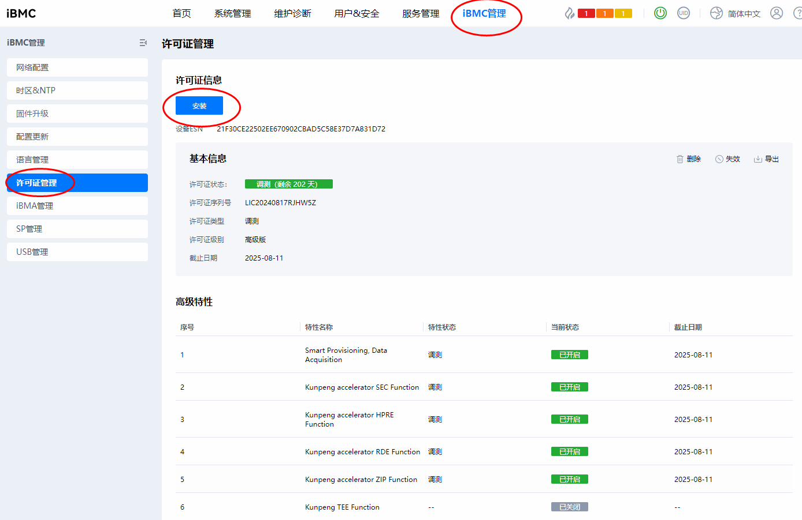
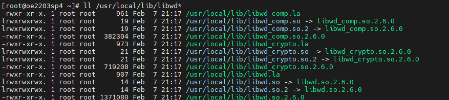
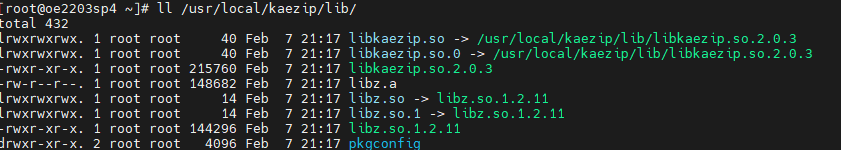
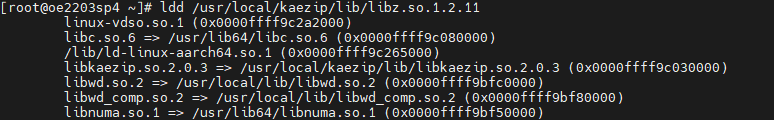
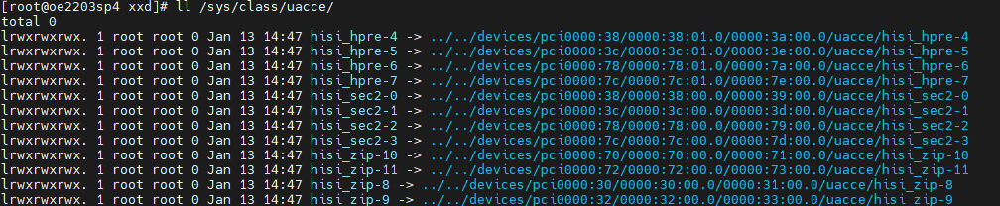

# 虚拟化场景KAE加速热迁移<a name="ZH-CN_TOPIC_0000002552288801"></a>

## 特性描述<a name="ZH-CN_TOPIC_0000002550131443"></a>

### 简介<a name="ZH-CN_TOPIC_0000002518691586"></a>

本文主要介绍如何在使用openEuler操作系统的鲲鹏服务器上使用KAE压缩和解压缩功能加速虚拟机热迁移。

虚拟机热迁移是指在不中断虚拟机运行的情况下，将虚拟机从一台物理主机迁移到另一台物理主机。为了减少迁移过程中的数据传输量，通常会在源物理机使用压缩技术（如zlib库）对内存页进行压缩后传输，再在目标物理机中解压缩内存页，从而达到加速虚拟机热迁移速度的效果。

鲲鹏加速引擎KAE（Kunpeng Accelerator Engine）包含压缩模块KAEZip，可以显著降低处理器消耗，提高处理器效率。KAEZlib是鲲鹏加速引擎的压缩模块提供的zlib标准接口，使用鲲鹏硬加速模块实现deflate算法，结合无损用户态驱动框架。因此KAE加速引擎可以替代开源压缩库zlib加速虚拟机热迁移。

在配置特性前，请先了解虚拟机热迁移与KAE的基本规格、版本支持和License支持信息、使用约束与限制和应用场景。

**规格<a name="section186211624175715"></a>**

支持虚拟机规格包括但不限于2C8G、4C8G、4C16G、8C16G、16C32G、32C64G。

> **须知：** 
>开源压缩库zlib进行Redis加压时，在部分规格的虚拟机和部分热迁移线程中，无法完成热迁移：
>-   虚拟机规格为2C8G，热迁移线程小于32。
>-   虚拟机规格为4C8G，热迁移线程小于4或等于4。
>-   虚拟机规格为4C16G，热迁移线程小于4或等于4。
>-   虚拟机规格为8C16G、16C32G和32C64G，热迁移线程小于3或等于3。

**版本支持<a name="section1625164615574"></a>**

- 版本：基于ARM架构的KVM与QEMU的虚拟化平台。仅支持libvirt 10.0.0及以上。支持QEMU6.2.0。
- License支持：需获取KAE License。

- 使用环境需要满足KAE支持的软硬件环境需求。
- 详细版本参见[**表 2** 操作系统和软件要求](#操作系统和软件要求) 。

**应用场景<a name="section49961711506"></a>**

虚拟机热迁移的应用场景主要包括负载均衡、硬件维护和容灾高可用，通过动态调整虚拟机分布避免单台物理主机过载并提升资源利用率，在不中断服务的情况下迁移虚拟机以便对原主机进行维护或升级，以及在主机故障或性能下降时快速迁移虚拟机以保证业务连续性。


## 安装和使用<a name="ZH-CN_TOPIC_0000002550011437"></a>

### 环境要求<a name="ZH-CN_TOPIC_0000002518691580"></a>

本文基于openEuler操作系统提供指导，在正式操作前请确保目的端与源端物理机软硬件均满足要求。

**硬件要求<a name="section26241127"></a>**

硬件要求如[**表 1** 硬件要求](#硬件要求)所示。

**表 1** 硬件要求<a id="硬件要求"></a>

|项目|说明|
|--|--|
|处理器|鲲鹏920新型号处理器|


**操作系统和软件要求<a name="section153345522323"></a>**

操作系统和软件要求如[**表 2** 操作系统和软件要求](#操作系统和软件要求)所示。

**表 2** 操作系统和软件要求<a id="操作系统和软件要求"></a>

|项目|版本|获取方法|
|--|--|--|
|OS|openEuler 22.03 LTS SP4<br>本特性支持openEuler 22.03 LTS SP1/SP2/SP3/SP4。本文档基于openEuler 22.03 LTS SP4版本的操作系统进行使能和验证。|[获取链接](https://mirrors.huaweicloud.com/openeuler/openEuler-22.03-LTS-SP4/ISO/aarch64/openEuler-22.03-LTS-SP4-everything-aarch64-dvd.iso)|
|libvirt|10.0.0及以上|[获取链接](https://gitee.com/openeuler/libvirt)|
|QEMU|6.2.0|[获取链接](https://gitlab.com/qemu-project/qemu)|
|Redis|6.0.20|[获取链接](http://download.redis.io/releases/redis-6.0.20.tar.gz)|
|KAE|2.0|[获取链接](https://gitee.com/kunpengcompute/KAE)|


**iBMC和BIOS版本要求<a name="section4793193042413"></a>**

本特性对iBMC和BIOS版本没有明确要求。

已验证的iBMC和BIOS版本如[**表 3** 已验证的iBMC和BIOS版本](#已验证的iBMC和BIOS版本)所示。

**表 3** 已验证的iBMC和BIOS版本<a id="已验证的iBMC和BIOS版本"></a>

|项目|版本|
|--|--|
|iBMC|55.00.01.03、5.05.12.08|
|BIOS|12.70、11.78|


### 安装libvirt<a name="ZH-CN_TOPIC_0000002550131445"></a>

libvirt只有10.0.0及以上才能支持在虚拟机热迁移过程中使用zlib库进行数据压缩与解压缩。

> **须知：** 
>-   因特性安装过程涉及到系统文件的修改，安装过程中的各操作默认由**root**用户执行，非**root**用户下进行相关操作应自行确保具有相关权限。
>-   若存在旧版本libvirt，直接安装新版libvirt可能会出现共享库冲突，因此需要卸载旧版本libvirt。
>-   需要提前配置好Yum源。

1. 安装libvirt 10.0.0相关依赖包。

    ```
    yum install -y meson gnutls-devel yajl-devel libtirpc-devel libxslt glib2-devel libxml2-devel glusterfs-api dnsmasq git gcc patch make autoconf automake libtool
    ```

2. 编译安装。

    ```
    meson setup build -Dsystem=true -Ddriver_qemu=enabled -Ddriver_lxc=enabled -Ddocs=disabled
    ninja -C build install
    ```

3. 配置动态链接器的库搜索路径。

    配置/etc/ld.so.conf，添加编译安装库链接查找路径。

    ```
    /usr/local/lib64
    ```

4. 保存文件并更新动态链接器缓存。

    执行以下命令，更新动态链接器缓存。

    ```
    ldconfig
    ```


### 申请、安装与验证KAE License<a name="ZH-CN_TOPIC_0000002550131449"></a>

使用KAE加速库之前需要正确安装相应的License，License安装成功之后，操作系统才能识别到加速器设备。

**申请KAE证书<a name="section153345522323"></a>**

License申请和安装操作请参见《[华为服务器iBMC许可证 使用指导](https://support.huawei.com/enterprise/zh/management-software/ibmc-pid-8060757?category=operation-maintenance)》。

> **须知：** 
>安装前请确保使用的环境满足KAE支持的软硬件环境。

**安装KAE证书<a name="section1058518317346"></a>**

登录对应服务器的iBMC，若如图中所示已经安装了一个License，请先单击删除。然后单击安装，将下载的License文件上传，安装完成后就有如图所示的相关显示。加载完License需重启服务器。



**验证KAE证书<a name="section5308183216347"></a>**

若lspci回显出现以下信息，则说明License生效。

```
lspci | grep HPRE
79:00.0 Network and computing encryption device: Huawei Technologies Co., Ltd. HiSilicon HPRE Engine (rev 21)
b9:00.0 Network and computing encryption device: Huawei Technologies Co., Ltd. HiSilicon HPRE Engine (rev 21)
lspci | grep ZIP
75:00.0 Processing accelerators: Huawei Technologies Co., Ltd. HiSilicon ZIP Engine (rev 21)
b5:00.0 Processing accelerators: Huawei Technologies Co., Ltd. HiSilicon ZIP Engine (rev 21)
lspci | grep SEC
76:00.0 Network and computing encryption device: Huawei Technologies Co., Ltd. HiSilicon SEC Engine (rev 21)
b6:00.0 Network and computing encryption device: Huawei Technologies Co., Ltd. HiSilicon SEC Engine (rev 21)
```


### 安装KAE软件<a name="ZH-CN_TOPIC_0000002550011441"></a>

正确安装KAE证书之后，还需要安装KAE软件，才能够使用KAEZlib压缩模块。

本文所提及的KAE驱动为KAE2.0版本，源码包中包含KAEKernelDriver内核驱动、UADK框架、KAEOpensslEngine引擎和KAEZlib几个模块。可直接使用脚本进行全部安装，也可以选择只安装KAE内核驱动、UADK框架和KAEZlib。最后检查是否安装成功。

> **须知：** 
>-   安装前的系统环境需满足环境要求。
>-   KAE安装权限：root账户。
>-   KAE使用权限：root账户与非root账户。其中非root账户需要获取相关设备（/dev/hisi\_\*）和文件（/var/log/kae.\*）权限。
>-   KAE驱动需要同时安装在源物理机和目标物理机。
>-   更多内容请参见《[加速器 用户指南（鲲鹏加速引擎）](https://www.hikunpeng.com/document/detail/zh/kunpengaccel/kae/usermanual/kunpengaccel_16_0002.html)》。

1. 从网页下载[KAE2.0源码包](https://gitee.com/kunpengcompute/KAE/tree/kae2/)或采用git clone方式。

    ```
    git clone https://gitee.com/kunpengcompute/KAE.git -b kae2
    ```

2. 安装相关依赖包。

    ```
    yum install -y meson gnutls-devel yajl-devel libtirpc-devel libxslt glib2-devel libxml2-devel kernel-devel automake libtool autoconf numactl-devel
    ```

3. 安装内核驱动。

    1. 进入KAE源码包目录中，初次使用前建议先执行清除命令。

        ```
        sh build.sh cleanup
        ```

    2. 安装KAE驱动和KAEZlib加速库，执行以下安装命令。

        ```
        sh build.sh driver
        sh build.sh uadk
        sh build.sh zlib
        ```

        或者执行以下安装命令，安装所有KAE模块（KAE驱动、UADK、KAEZlib加速库与OpenSSLEngine）。

        ```
        sh build.sh all
        ```

    > **说明：** 
    >若执行安装命令后失败，提示缺少头文件，则安装相关依赖包后重新执行安装命令即可。

4. 查看是否安装成功。

    1. 查看KAE驱动是否安装成功。

        查看对应目录下是否存在加速引擎文件系统。

        ```
        ll /sys/class/uacce/
        ```

        回显信息如下所示，表示驱动安装成功。

        

    2. 通过**lsmod**查看驱动安装情况来判断驱动是否安装成功。

        ```
        lsmod | grep uacce
        ```

        回显信息如下所示，表示驱动安装成功。

        

    3. 查看UADK是否安装成功。

        ```
        ll /usr/local/lib/libwd*
        ```

        

    4. 查看KAEZlib库是否安装成功。

        ```
        ll /usr/local/kaezip/lib/
        ```

        

        ```
        ldd /usr/local/kaezip/lib/libz.so.1.2.11
        ```

        

    > **说明：** 
    >-   重启设备安装驱动后查询不到设备文件，可能是操作系统自带加速驱动导致，可以卸载驱动后重新加载；或者在启动脚本re.local中加上重新加载驱动命令。以hisi\_sec2为例。
    >    ```
    >    rmmod hisi_sec2 
    >    modprobe hisi_sec
    >    ```
    >-   如果sh build.sh cleanup后重新安装仍旧找不到设备文件，请确保License安装成功，若无License也会导致驱动安装失败。
    >-   若安装不成功，请执行以下命令清除已安装文件，再重新安装：
    >    ```
    >    sh build.sh cleanup
    >    ```


### 更改libvirt与QEMU配置<a name="ZH-CN_TOPIC_0000002518691584"></a>

需要修改libvirt与QEMU中相关配置，以允许libvirt在热迁移过程中监控虚拟机和使用KAEZlib加速。以下配置修改需要同时修改源物理机和目标物理机。

**更改热迁移相关配置<a name="section1807451083"></a>**

修改/etc/libvirt/libvirtd.conf相关配置，以允许libvirt在虚拟机热迁移过程中监控虚拟机的状态。libvirt将通过TCP协议在所有网络接口上侦听16509端口。

```
listen_tls = 0
listen_tcp = 1
tcp_port = "16509"
listen_addr = "0.0.0.0"
auth_tcp = "none"
```

> **须知：** 
>-   以上配置通常用于开发和测试环境，或者对安全性要求不高的场景。如对安全性有更高要求，需要对侦听地址、身份验证、加密协议等做进一步的安全配置。
>-   需要关闭防火墙或者防火墙打开端口16509。

**添加KAE设备相关配置<a name="section4954121010912"></a>**

1. 查看/dev/hisi\_zip-xx设备型号，执行以下命令。

    ```
    ll /sys/class/uacce/
    ```

    

2. 修改/etc/libvirt/qemu.conf配置。

    修改/etc/libvirt/qemu.conf，允许libvirt/QEMU使用KAEZlib设备，hisi\_zip-xx需要与步骤一中的一致。

    ```
    cgroup_device_acl = [
        "/dev/null", "/dev/full", "/dev/zero",
        "/dev/random", "/dev/urandom",
        "/dev/ptmx", "/dev/kvm",
        "/dev/hisi_zip-10",
        "/dev/hisi_zip-11",
        "/dev/hisi_zip-8",
        "/dev/hisi_zip-9"
    ]
    ```

3. 配置修改后，重启libvirt服务。

    ```
    systemctl stop libvirtd.socket libvirtd-ro.socket libvirtd-admin.socket libvirtd-tls.socket libvirtd-tcp.socket
    systemctl stop libvirtd
    systemctl daemon-reload
    systemctl start libvirtd-tcp.socket
    ```


### 搭建网桥<a name="ZH-CN_TOPIC_0000002518531690"></a>

KAE加速热迁移测试的网络环境是使用Linux网桥。

> **须知：** 
>-   若是源物理机与目标物理机网卡直连，则不需要配置网关。
>-   源物理机与目标物理机的网桥名需要一样。
>-   源物理机与目标物理机需处在同个网段。
>-   虚拟机的IP地址需要与网桥处在同个网段。

1. 创建网桥接口。

    ```
    brctl addbr <网桥名>
    ```

2. 绑定网卡。

    若是网卡存在IP地址，需要清除IP地址。

    ```
    ip addr flush dev <网卡名>
    ```

    执行以下命令，将网卡绑在网桥上。

    ```
    ip link set <网卡名> master <网桥名>
    ```

3. 启动接口。

    ```
    sudo ip link set <网桥名> up
    sudo ip link set <网卡名> up
    ```

4. 查看是否绑定成功。

    ```
    brctl show
    ```

    若绑定成功，回显如下：

    

    > **须知：** 
    >需要安装bridge-utils。

5. 配置网桥的IP地址与网关。

    ```
    ip addr add <IP地址> dev <网桥名>
    ip route add default via <网关IP地址> dev <网卡名>
    ```

6. 修改虚拟机XML文件绑定网桥。

    ```
    <interface type='bridge'>
      <mac address='<Mac地址>'/>
      <source bridge='<网桥名>'/>
      <model type='virtio'/>
      <address type='pci' domain='0x0000' bus='0x0b' slot='0x00' function='0x0'/>
    </interface>
    ```

    虚拟机内IP地址与网关配置命令如下：

    ```
    ip addr add <IP地址> dev <虚拟网卡名>
    ip route add default via <网关IP地址> dev <虚拟网卡名>
    ```

7. 测试连通。

    在目标物理机中，执行以下命令查看虚拟机网络是否畅通，若能成功连接网络，则说明网络搭建成功。

    ```
    ping <虚拟网卡IP地址>
    ```


### 启用KAEZlib<a name="ZH-CN_TOPIC_0000002550011439"></a>

需要在虚拟机的xml中增加KAEZlib的路径才能在虚拟机热迁移过程中使用KAEZlib库。

1. 查看虚拟机的xml配置。

    ```
    virsh edit <虚拟机名称>
    ```

2. 修改虚拟机的xml以使用KAEZlib替代开源zlib压缩。

    ```
    <qemu:commandline xmlns:qemu='http://libvirt.org/schemas/domain/qemu/1.0'>
        <qemu:env name='LD_LIBRARY_PATH' value='/usr/local/kaezip/lib:/usr/local/lib:$LD_LIBRARY_PATH'/>
    </qemu:commandline>
    ```

> **说明：** 
>虚拟机无需配置内存大页。配置内存大页的虚拟机热迁移需要做另外适配。


## KAE加速热迁移测试<a name="ZH-CN_TOPIC_0000002518531688"></a>

在KAE加速热迁移测试中，采用redis-benchmark对虚拟机进行set操作的压测来模拟业务场景，再统计使用KAEZlib库的热迁移时间。

> **须知：** 
>-   在非共享存储环境中，需要提前将虚拟机的镜像文件和NVRAM文件拷贝到目标物理机，再执行热迁移操作。
>-   需要关闭SELinux。
>    ```
>    setenforce 0
>    ```

### 安装Redis<a name="ZH-CN_TOPIC_0000002550131447"></a>

虚拟机热迁移过程中，内存脏页率对热迁移效率影响较大。为了能够充分模拟一个高内存脏页刷新率的使用场景，选择在虚拟机热迁移过程中使用redis-benchmark对虚拟机中的Redis服务器进行加压操作。Redis的版本选择为6.0.20，编译与安装可参考以下链接：[通过源码编译安装Redis 6.0.20](https://www.hikunpeng.com/document/detail/zh/kunpengdbs/ecosystemEnable/Redis/kunpengredis_02_0004.html)。

> **说明：** 
>Redis配置/etc/redis.conf中需要绑定虚拟网卡的IP地址。
>```
>bind <虚拟网卡IP地址>
>```


### 热迁移测试<a name="ZH-CN_TOPIC_0000002518531692"></a>

1. 启动虚拟机。

    ```
    virsh start <虚拟机名称>
    ```

2. 查看KAE是否被使用。

    虚拟机启动后，执行以下操作可以看到KAE硬件队列数量减少，说明KAE设备正在被使用。

    ```
    watch -n 0.1 "cat /sys/class/uacce/hisi_zip-*/available_instances"
    ```

    

3. 启动Redis服务器。

    ```
    redis-server /etc/redis.conf --port 6379 &
    ```

4. Redis客户端加压。

    在目标物理机中使用20个线程与1000个连接数对Redis服务端进行1000万次set操作。

    ```
    redis-benchmark -h <虚拟机IP地址> -n 10000000 -c 1000 -r 10000000  -t set -p 6379 --threads 20
    ```

5. 执行虚拟机热迁移操作。

    ```
    time virsh migrate --parallel --parallel-connections <热迁移线程数> --compressed --comp-methods zlib --live --verbose --domain <虚拟机名称> qemu+ssh://<目标物理机br网桥IP地址>/system --migrateuri tcp://<目标物理机br网桥IP地址> --unsafe
    ```

6. 统计耗时。

    real指示的时间是虚拟机热迁移的总耗时。

    


