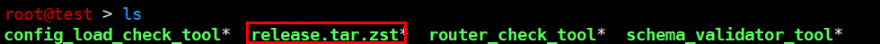
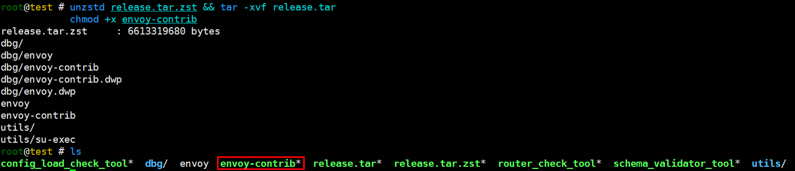
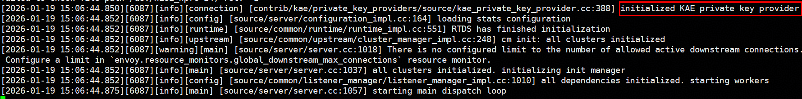
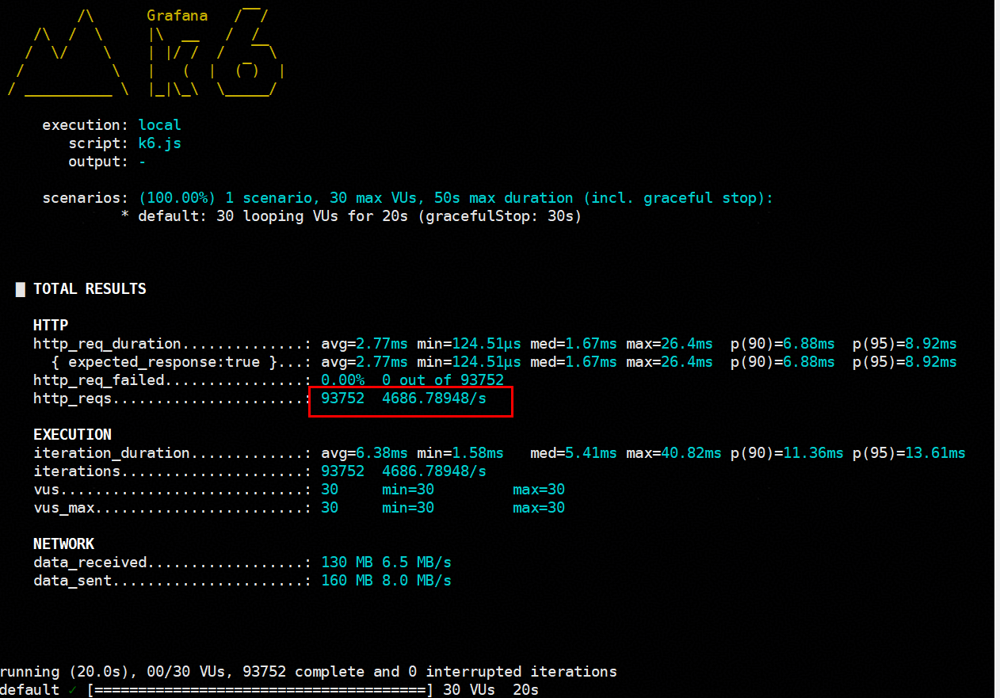

# 云原生场景Envoy使能KAE 用户指南

## 简介<a name="ZH-CN_TOPIC_0000002511547578"></a>

本文主要介绍如何在使用openEuler操作系统的服务器中让Envoy使能KAE设备。

KAE（Kunpeng Accelerator Engine，鲲鹏加速引擎）是基于鲲鹏处理器提供的硬件加速解决方案，包含了KAE加解密和KAE解压缩。KAE加解密用于加速SSL（Secure Sockets Layer）/TLS（Transport Layer Security）应用，KAE解压缩用于加速数据压缩、解压，可以显著降低处理器消耗，提高处理器效率。

Envoy是一款专为现代云原生架构设计的高性能网络代理与通信总线，广泛用作服务网格中的数据平面组件。它通常以sidecar模式独立运行在每个微服务旁边，透明地接管服务间的入站和出站流量，实现流量管理、安全策略、可观测性等核心功能，并支持动态配置，是Istio等服务网格技术的关键基础设施。

在微服务场景中，无论作为Ingress Gateway还是微服务的代理，Envoy都需处理大量TLS请求。尤其是在TLS握手阶段，非对称加解密操作对CPU资源消耗巨大。在大规模部署微服务的场景下，这一开销可能成为系统性能瓶颈。

为解决此问题，Envoy的KAE Private Key Provider会将耗时的加密运算从CPU卸载到鲲鹏KAE加速器上，在加速加解密的同时也为其他业务负载释放CPU算力。

## 环境要求<a name="ZH-CN_TOPIC_0000002511736266"></a>

本文基于特定环境提供指导，在正式操作前请确保软硬件均满足要求。

**表 1** 硬件要求<a id="硬件要求"></a>

|项目|规格|
|--|--|
|CPU|鲲鹏920系列处理器、鲲鹏950处理器|


**表 2** 已验证的操作系统和软件版本<a id="已验证的操作系统和软件版本"></a>

|软件|版本|获取地址|
|--|--|--|
|OS|openEuler 24.03 LTS SP2|[获取链接](https://www.openeuler.org/en/download/#openEuler%2024.03%20LTS%20SP2)|
|Docker|不低于20.10.13，且需支持Docker Compose功能|[获取链接](https://download.docker.com/linux/static/stable/aarch64/)|
|KAE|2.0|[获取链接](https://www.hikunpeng.com/document/detail/zh/kunpengaccel/kae/usermanual/kunpengaccel_06_0012.html)|

## 获取Envoy<a name="ZH-CN_TOPIC_0000002511738428"></a>

Envoy KAE Private Key Provider需要使用Envoy 1.38.0及之后版本，且需要使用ARM架构的contrib版本Envoy。可以从Envoy官方release页面直接下载，也可以从源码编译获取。

### 从官网获取<a name="section_get_envoy_from_release"></a>

访问[Envoy release页面](https://github.com/envoyproxy/envoy/releases)，选择Envoy版本，并在对应版本的Assets中下载ARM架构的contrib版本Envoy二进制文件。

> **说明：** 
>-   Envoy KAE Private Key Provider需要使用Envoy 1.38.0及之后版本。
>-   下载二进制文件时，请选择文件名中包含“contrib”和“linux-aarch_64”的文件。

将获取的Envoy二进制文件重命名为envoy-contrib，并添加可执行权限。

```
mv envoy-contrib-<version>-linux-aarch_64 envoy-contrib
chmod +x envoy-contrib
```

### 从源码编译<a name="section_build_envoy_from_source"></a>

使用Docker镜像进行Envoy编译。Envoy的编译操作需要依赖Docker Compose，请在编译之前确保Docker已经安装Compose插件。

**前提条件<a name="section9577940124515"></a>**

- 需要在普通用户下执行Envoy的编译，否则会报错。编译之前确保使用的用户为**非root**用户。
- 编译Envoy的过程中需要拉取大量依赖包，请确保网络畅通。
- 编译Envoy过程中生成的中间文件占用空间较大（约50GB），请确保有足够的磁盘空间。
- 可以使用如下命令自定义配置代理和build目录位置。

    ```
    ENVOY_DOCKER_BUILD_DIR=/path/to/build go_proxy=https://goproxy.cn,direct http_proxy=http://proxy.foo.com:8080 https_proxy=http://proxy.bar.com:8080 ./ci/run_envoy_docker.sh './ci/do_ci.sh release.server_only'
    ```

- 详细编译过程参考[GitHub官方文档](https://github.com/envoyproxy/envoy/tree/main/ci#building-and-running-tests-as-a-developer)。

**操作步骤<a name="section1721632217462"></a>**

1. 获取Envoy源码。

    ```
    git clone https://github.com/envoyproxy/envoy.git 
    cd envoy
    ```

2. 编译Envoy获取软件二进制。

    ```
    ./ci/run_envoy_docker.sh './ci/do_ci.sh release.server_only'
    ```

    编译完成后可以在“/_your-build-path_/envoy-docker-build/envoy/arm64/bin”（默认是“/tmp/envoy-docker-build/envoy/arm64/bin”，可通过ENVOY\_DOCKER\_BUILD\_DIR环境变量配置）目录下找到已经编译完成的release包release.tar.zst。

    

3. 将获取的Envoy的包解压，得到Envoy的二进制文件envoy-contrib。

    ```
    unzstd release.tar.zst && tar -xvf release.tar
    chmod +x envoy-contrib
    ```

    

## Envoy使能KAE<a name="ZH-CN_TOPIC_0000002543218379"></a>

在Envoy的启动配置文件中配置private\_key\_provider为kae后，再启动Envoy，即可在Envoy使能KAE。

**前提条件<a name="section18439938112415"></a>**

已提前安装KAE。如未安装KAE，请参见[环境要求](#环境要求)进行安装。

**操作步骤<a name="section2828203192514"></a>**

1. 在Envoy的启动配置文件中配置private\_key\_provider为kae。

    下面是一个Envoy的启动配置文件示例**envoy-kae.yaml**，其中加粗的部分是配置kae相关的内容。

    ```
    static_resources:
      listeners:
      - name: listener_tls
        address:
          socket_address:
            address: 0.0.0.0
            port_value: 10000
        filter_chains:
        - transport_socket:
            name: envoy.transport_sockets.tls
            typed_config:
              "@type": type.googleapis.com/envoy.extensions.transport_sockets.tls.v3.DownstreamTlsContext
              common_tls_context:
                tls_certificates:
                - certificate_chain:
                    filename: "/etc/envoy/tls/tls.crt"
                  private_key_provider:
                    provider_name: kae
                    typed_config:
                      "@type": type.googleapis.com/envoy.extensions.private_key_providers.kae.v3alpha.KaePrivateKeyMethodConfig
                      poll_delay: "0.001s"
                        max_instances: 12
                      private_key:
                        filename: "/etc/envoy/tls/tls.key"
          filters:
          - name: envoy.filters.network.http_connection_manager
            typed_config:
              "@type": type.googleapis.com/envoy.extensions.filters.network.http_connection_manager.v3.HttpConnectionManager
              codec_type: auto
              stat_prefix: ingress_http
              route_config:
                name: local_route
                virtual_hosts:
                - name: backend
                  domains: ["*"]
                  routes:
                  - match: { prefix: "/" }
                    direct_response: { status: 200 }
              http_filters:
              - name: envoy.filters.http.router
                typed_config:
                  "@type": type.googleapis.com/envoy.extensions.filters.http.router.v3.Router
    
    admin:
      access_log_path: "/dev/null"
      address:
        socket_address:
          address: 0.0.0.0
          port_value: 9001
    ```

    > **说明：** 
    >-   上述配置文件中poll\_delay为kae轮询线程的sleep时间，poll\_delay时间越小，轮询的越快，相对来说性能越高，CPU占用也会更多，根据实际情况配置poll\_delay的值。
    >-   max\_instances是创建KAE轮询线程的数量，默认值是16。实际值会取实际的KAE队列数量与设置值的最小值。KAE轮询线程越多性能越好，可根据实际情况进行设置。
    >-   另外由于涉及到https请求，需要给Envoy配置证书，上述配置文件中的证书存放在“/etc/envoy/tls/”目录下，可根据实际情况进行修改。

2. 使用如下命令启动Envoy。

    ```
    ./envoy-contrib -c /path/to/envoy-kae.yaml
    ```

    启动之后可能的回显如下，提示KAE private key provider已经初始化，说明Envoy已经成功使能KAE。

    

3. （可选）通过[k6 Benchmark](https://github.com/grafana/k6/releases)进行测试可以得到Envoy使能KAE前后的性能提升效果。

    1. 启动Envoy并在另一个终端执行测试命令，得到性能效果如[**图 1** Envoy使能KAE前的性能结果](#Envoy使能KAE前的性能结果)所示。

        ```
        numactl -C 0-7 ./envoy-contrib -c /path/to/envoy-no-kae.yaml
        # 另一个终端执行如下命令
        numactl -C 192-255 k6 run --vus 30 --duration 20s  k6.js
        ```

        **图 1** Envoy使能KAE前的性能结果<a name="fig10843125831516"></a><a id="Envoy使能KAE前的性能结果"></a>
        

    2. 在Envoy使能KAE后执行如下命令，得到性能效果如[**图 2** Envoy使能KAE后的性能结果](#Envoy使能KAE后的性能结果)所示。

        ```
        numactl -C 0-7 ./envoy-contrib -c /path/to/envoy-kae.yaml
        # 另一个终端执行如下命令
        numactl -C 192-255 k6 run --vus 30 --duration 20s  k6.js
        ```

        **图 2** Envoy使能KAE后的性能结果<a name="fig189951242151717"></a><a id="Envoy使能KAE后的性能结果"></a>
        

    3. 对比Envoy使能KAE前后的性能结果，可以看到http的rps性能有明显上升。

    其中，k6的配置文件**k6.js**如下所示。

    ```
    import http from "k6/http";
    
    export let options = {
     insecureSkipTLSVerify: true,
     noConnectionReuse: true,
     noVUConnectionReuse: true,
    };
    
    export default function() {
     http.get("https://<your envoy ip>:10000/");
    }
    ```

    未使能KAE的Envoy配置文件示例**envoy-no-kae.yaml**如下所示。

    ```
    static_resources:
      listeners:
      - name: listener_tls
        address:
          socket_address:
            address: 0.0.0.0
            port_value: 10000
        filter_chains:
        - transport_socket:
            name: envoy.transport_sockets.tls
            typed_config:
              "@type": type.googleapis.com/envoy.extensions.transport_sockets.tls.v3.DownstreamTlsContext
              common_tls_context:
                tls_certificates:
                - certificate_chain:
                    filename: "/etc/envoy/tls/tls.crt"
                  private_key:
                    filename: "/etc/envoy/tls/tls.key"
          filters:
          - name: envoy.filters.network.http_connection_manager
            typed_config:
              "@type": type.googleapis.com/envoy.extensions.filters.network.http_connection_manager.v3.HttpConnectionManager
              codec_type: auto
              stat_prefix: ingress_http
              route_config:
                name: local_route
                virtual_hosts:
                - name: backend
                  domains: ["*"]
                  routes:
                  - match: { prefix: "/" }
                    direct_response: { status: 200 }
              http_filters:
              - name: envoy.filters.http.router
                typed_config:
                  "@type": type.googleapis.com/envoy.extensions.filters.http.router.v3.Router
    admin:
      access_log_path: "/dev/null"
      address:
        socket_address:
          address: 0.0.0.0
          port_value: 9001
    ```

## 修订记录<a name="ZH-CN_TOPIC_0000002513179182"></a>

|发布日期|修订记录|
|--|--|
|2026-03-30|第一次正式发布。|
