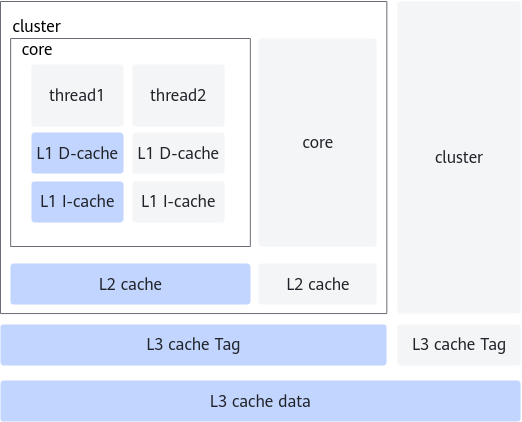
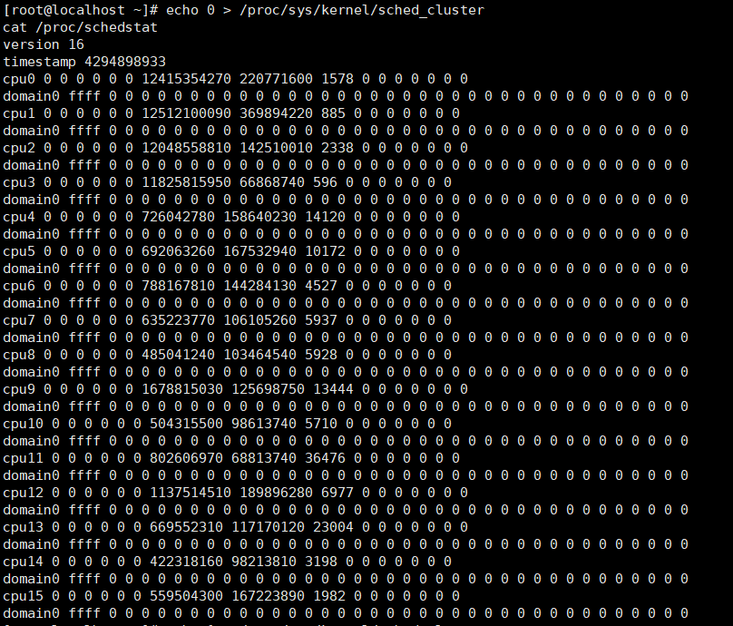

# cluster感知 特性指南

## 特性描述<a name="ZH-CN_TOPIC_0000002105902629"></a>

### 简介<a name="ZH-CN_TOPIC_0000002105902621"></a>

本文主要介绍如何在使用openEuler操作系统的鲲鹏服务器上部署和使能Cluster感知特性。

如[**图 1** Cluster与L3 cache结构图](#Cluster与L3 cache结构图)所示，Cluster是CPU的一个硬件单元，每个Cluster包含数个core。同一个Cluster内的core会共享同一块L3 cache Tag，一个core访问对应Cluster的共享L3 cache Tag的时间，比访问其他L3 cache或内存的时间更短。因此，当某个线程被调度到相同Cluster（而不是另一个Cluster，即跨Cluster调度）上的core执行时，便能复用该Cluster对应的L3 cache Tag，减少数据访问需要的时间。通过新增OS内核的Cluster任务调度优化选项，可以避免线程跨Cluster调度，复用L3 cache Tag资源，以提升多线程应用的CPU调度效率和内存带宽的利用效率。

**图 1** Cluster与L3 cache结构图<a name="fig356644616414"></a><a id="Cluster与L3 cache结构图"></a>


通过这项优化，可以更好地利用硬件资源，提高系统的吞吐量和响应速度，从而提升系统的整体性能表现。在各种应用场景或测试场景中，尤其是在多核多线程的应用场景上，使能Cluster调度优化特性将获得比较好的性能提升效果，提升幅度可达2%～20%。

通过配置虚拟机的vCPU拓扑，将物理CPU Cluster拓扑结构映射给虚拟机，实现虚拟机系统内与物理CPU相同的优化效果。


### 可获得性<a name="ZH-CN_TOPIC_0000002070182902"></a>

在配置特性前，请先了解Cluster感知特性的版本支持和License支持信息。

- 版本支持：支持openEuler 22.03 LTS SP2及以上的操作系统版本。
- License支持：无。


### 约束与限制<a name="ZH-CN_TOPIC_0000002105902633"></a>

需使用openEuler 22.03 LTS SP2及以上的操作系统版本。虚拟机内使用时需要将物理CPU Cluster拓扑信息准确映射给虚拟机。


### 应用场景<a name="ZH-CN_TOPIC_0000002070342698"></a>

适用于1:1绑核场景，根据vCPU绑定的物理CPU拓扑，呈现最佳Cluster拓扑结构。


## 特性使用<a name="ZH-CN_TOPIC_0000002070182918"></a>

### 环境要求<a name="ZH-CN_TOPIC_0000002152530982"></a>

本文基于openEuler操作系统提供指导，在正式操作前请确保软硬件均满足要求。

**硬件要求<a name="section26241127"></a>**

硬件要求如[**表 1** 硬件要求](#硬件要求)所示。

**表 1** 硬件要求<a id="硬件要求"></a>

|项目|说明|
|--|--|
|处理器|鲲鹏920系列处理器|


**操作系统和软件要求<a name="section153345522323"></a>**

操作系统和软件要求如[**表 2** 操作系统和软件要求](#操作系统和软件要求)所示。

**表 2** 操作系统和软件要求<a id="操作系统和软件要求"></a>

|项目|版本|获取方法|
|--|--|--|
|OS|openEuler 22.03 LTS SP2及以上版本|[获取链接](https://mirrors.huaweicloud.com/openeuler/openEuler-22.03-LTS-SP4/ISO/aarch64/openEuler-22.03-LTS-SP4-everything-aarch64-dvd.iso)|


### 使能与验证<a name="ZH-CN_TOPIC_0000002105902617"></a>

通过配置虚拟机的XML将物理机的CPU Cluster拓扑信息映射给虚拟机，在虚拟机中使能cluster-aware调度器以启用此特性。使能前后观察每个vCPU的调度组情况，验证使能是否成功。

1. 虚拟机XML配置CPU topology。

    例如：若16U32G VM VCPU 1:1绑定在4个Cluster上，即16个CORE上。则最优配置如下。

    ```
    <topology sockets='1' dies='1' clusters='4' cores='4' threads='1'/>
    ```

2. 在Guest OS内运行以下命令，确保cluster-aware调度器未使能，并观察每个vCPU的调度组情况。

    ```
    echo 0 > /proc/sys/kernel/sched_cluster
    cat /proc/schedstat
    ```

    运行上述命令后可看到类似下图的CPU调度组情况。

    

3. 在Guest OS内设置命令使能cluster-aware调度器，并观察每个vCPU的调度组情况。

    ```
    echo 1 > /proc/sys/kernel/sched_cluster
    cat /proc/schedstat
    ```

    运行上述命令后可看到类似下图的CPU调度组情况。

    

    可以观察到，与步骤2对比，特性使能后，每个vCPU均增加了一层调度组（“domain”）。


