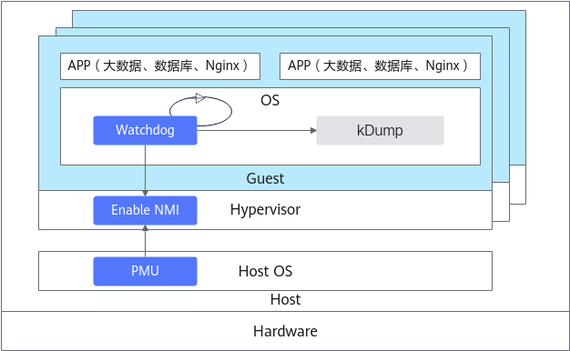

# 虚拟机死锁检测 特性指南

## 特性描述<a name="ZH-CN_TOPIC_0000002070338474"></a>

### 简介<a name="ZH-CN_TOPIC_0000002105898409"></a>

本文主要介绍如何在使用openEuler操作系统的鲲鹏服务器上部署和使能虚拟机死锁检测特性。

在虚拟机环境中，构建一个可靠的死锁检测机制尤为重要，因为它能防止虚拟机在陷入死循环后无法跳出，保持系统的持续可管理性。虚拟机死锁检测机制通过触发不可屏蔽中断（NMI，Non-Maskable Interrupt），在虚拟机中实时监测中断响应情况，以此来实现对虚拟机内部的死锁情况的检测，可以有效防止因死锁导致的虚拟机卡住而无法恢复运行的问题。

在Linux系统中，死锁检测功能通常依赖于Watchdog机制来实现。传统的Watchdog机制主要依赖于时钟中断来监测系统是否陷入挂死状态。然而，在特定的系统执行阶段，如中断处理过程中或中断被明确禁用的代码段（即原子上下文），时钟中断的处理可能会被阻塞，从而导致Watchdog的检测功能无法有效发挥作用。相比之下，NMI Watchdog机制则利用了NMI（即不可屏蔽中断）这一特性来进行检测。NMI中断具有在原子上下文中触发并得到处理的能力，因此它能够有效地捕捉到那些在原子上下文中发生的系统挂死情况，为系统提供了更为全面和可靠的挂死检测保障。

**图 1** 虚拟机死锁检测特性架构图<a name="fig762914904419"></a><a id="虚拟机死锁检测特性架构图"></a><br>


**原理描述<a name="section18127132914911"></a>**

NMI Watchdog是一种专门用于检测Linux系统中硬死锁（hard lockup）现象的机制。NMI Watchdog通过触发NMI中断，根据中断是否得到处理，来监测内核是否发生了硬死锁。

整体上看，openEuler在Arm64平台上提供了两种NMI Watchdog方案：

- **基于SDEI的Watchdog（默认方案）**

    SDEI（Software Delegated Exception Interface，软件委托异常接口）用于在非安全环境中注册回调函数，以在底层系统事件发生时执行指定动作。openEuler操作系统基于Arm64特有的SDEI功能，实现了SDEI Watchdog作为NMI Watchdog的一种形式。

- **基于PMC（PMU）中断的NMI Watchdog**

    openEuler支持的另一种方案是采用基于中断优先级的Pseudo-NMI技术，将PMI（Performance Monitoring Interrupt）配置为模拟NMI中断的功能，同时禁用SDEI Watchdog，从而在虚拟机内部触发高优先级NMI中断，以此来实现NMI Watchdog机制，也称为PMU Watchdog（Performance Monitoring Unit Watchdog）。当系统出现hard lockup时，可以记录异常并进行复位。

> **须知：** 
>Arm64平台上：
>-   默认情况下，openEuler会优先使用SDEI Watchdog。但是，虚拟机场景下，SDEI Watchdog无法成功启用，但系统并不会自动切换到基于PMC/PMU的NMI Watchdog，因此要通过配置内核参数将其禁用。
>-   若用户确实需要使用基于PMC/PMU的NMI Watchdog，则需要在系统启动参数中明确禁用SDEI Watchdog，具体操作为添加“disable\_sdei\_nmi\_watchdog”参数，完整参数请参见[使能](#使能)一节。


### 可获得性<a name="ZH-CN_TOPIC_0000002070178706"></a>

版本支持：使用鲲鹏920系列处理器的服务器上的虚拟机已经验证支持该特性，采用openEuler 22.03 LTS SP2操作系统，配合libvirt 6.2.0和QEMU 6.2.0使用。


### 约束与限制<a name="ZH-CN_TOPIC_0000002105898393"></a>

使用本特性，要求硬件必须满足以下两个条件中的至少一个：

- 支持NMI中断。虚拟化场景下不满足该项条件。
- 支持性能监控计数器（PMC，Performance Monitoring Counter）或PMU（Performance Monitoring Unit Watchdog）功能。


### 应用场景<a name="ZH-CN_TOPIC_0000002070338458"></a>

适用于公有云和私有云场景。


## 特性使用<a name="ZH-CN_TOPIC_0000002070178682"></a>

### 环境要求<a name="ZH-CN_TOPIC_0000002155880797"></a>

本文基于openEuler操作系统提供指导，在正式操作前请确保软硬件均满足要求。

**硬件要求<a name="section26241127"></a>**

硬件要求如[**表 1** 硬件要求](#硬件要求)所示。

**表 1** 硬件要求<a id="硬件要求"></a>

|项目|说明|
|--|--|
|处理器|鲲鹏920系列处理器|


**操作系统和软件要求<a name="section153345522323"></a>**

操作系统和软件要求如[**表 2** 操作系统和软件要求](#操作系统和软件要求)所示。

**表 2** 操作系统和软件要求<a id="操作系统和软件要求"></a>

|项目|版本|获取方法|
|--|--|--|
|OS|openEuler 22.03 LTS SP2本特性对物理机、虚拟机的操作系统均要求以上版本|[获取链接](https://mirrors.pku.edu.cn/openeuler/openEuler-22.03-LTS-SP2/ISO/aarch64/openEuler-22.03-LTS-SP2-everything-aarch64-dvd.iso)|
|libvirt|6.2.0及以上均可|利用Yum工具直接安装。|
|QEMU|6.2.0及以上均可|利用Yum工具直接安装。|


### 使能<a name="ZH-CN_TOPIC_0000002105898413" id="使能"></a>

在Arm64平台上，使能NMI Watchdog的前提条件是硬件必须支持NMI中断。虚拟化场景下，并不支持标准的NMI中断，但提供了伪NMI中断（pseudo NMI interrupt）的功能，则需要在系统启动前进行特定的配置。

1. 您需要在虚拟机操作系统的引导配置文件“/etc/default/grub”的“GRUB\_CMDLINE\_LINUX”参数中添加如下配置。

    ```
    nmi_watchdog=1 pmu_nmi_enable hardlockup_cpu_freq=auto irqchip.gicv3_pseudo_nmi=1 disable_sdei_nmi_watchdog hardlockup_enable=1
    ```

2. 完成参数配置后，更新grub配置。

    ```
    grub2-mkconfig -o /boot/efi/EFI/openEuler/grub.cfg
    ```

3. 重启系统使配置生效。

    ```
    reboot
    ```

> **须知：** 
>-   在虚拟化场景下，仅支持当前配置方案。
>-   当且仅当使用伪NMI中断实现NMI Watchdog功能时，必须添加“irqchip.gicv3\_pseudo\_nmi=1”参数。
>-   要使用irqchip.gicv3\_pseudo\_nmi参数，内核编译时也需启用“CONFIG\_ARM64\_PSEUDO\_NMI”配置项，该选项在内核编译时默认已启用。


### 验证<a name="ZH-CN_TOPIC_0000002105898401"></a>

使能特性后，可在虚拟机内部通过以下命令验证基于PMC（PMU）中断的NMI Watchdog是否加载成功。

```
dmesg | grep "NMI watchdog"
```

根据加载的Watchdog类型，您将看到不同的回显信息。

- 如果已加载SDEI Watchdog，且已加载成功，回显中应包含以下内容。

    ```
    SDEI NMI watchdog: SDEI Watchdog registered successfully
    ```

- 虚拟化场景下，默认加载SDEI Watchdog，且加载必然失败，将回显如下内容。

    ```
    SDEI NMI watchdog: Disable SDEI NMI Watchdog in VM
    ```

- 如果已加载基于PMC（PMU）中断的NMI Watchdog（虚拟化场景下的唯一可行方案），且已加载成功，回显中应包含以下内容。

    ```
    NMI watchdog: Enabled. Permanently consumes one hw-PMU counter.
    ```


### 配置<a name="ZH-CN_TOPIC_0000002094732684"></a>

调整NMI Watchdog的触发阈值。默认情况下，NMI watchdog将以10s为间隔，周期性地检测硬死锁是否发生。

```
echo 10 > /proc/sys/kernel/watchdog_thresh
```

在操作系统启动时，可以通过以上命令修改该阈值，合法的阈值应在\[0-60\]范围内。此更改在重启操作系统后将失效。


## 缩略语<a name="ZH-CN_TOPIC_0000002070338482"></a>

|**缩略语**|**英文全称**|**中文全称**|
|--|--|--|
|NMI|Non-Maskable Interrupt|不可屏蔽中断|
|PMC|Performance Monitoring Counter|性能监控计数器|
|PMU|Performance Monitoring Unit|性能监控单元|
|SDEI|Software Delegated Exception Interface|软件委托异常接口|


