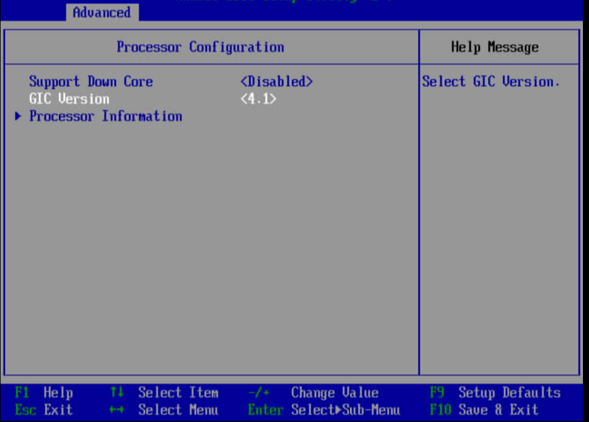
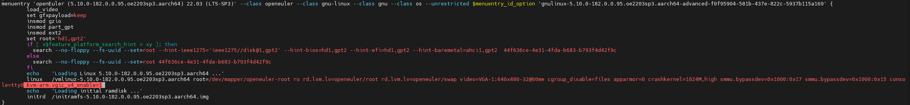
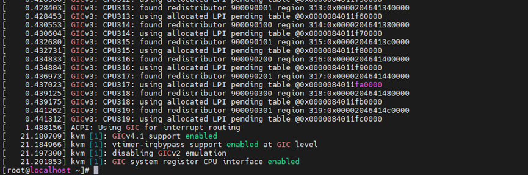

# GICv4.1超分优化 特性指南

## 特性描述

### 简介<a name="ZH-CN_TOPIC_0000002547452333"></a>

本文主要介绍如何在使用openEuler操作系统的鲲鹏服务器上部署和使能GIC超分优化特性。

GICv4.1是ARM服务器中先进的通用中断控制器架构，支持虚拟中断直通（vLPI）、硬件加速的虚拟机中断注入及中断优先级管理，显著提升虚拟化场景下的中断处理效率与可扩展性。而在物理机资源有限，虚拟机超分售卖时，GIC需要通过VMOVP指令维护vCPU和物理机CPU的映射关系，由于VMOVP指令在GIC硬件上串行执行，会导致虚拟机业务性能下降。

鲲鹏BoostKit推出GICv4.1超分优化方案，通过支持vCPU在共享同一个vpe表的CPU间迁移的时候可以跳过VMOVP指令，从而提高超分场景下的虚拟机业务性能。

### 其他信息<a name="ZH-CN_TOPIC_0000002515892420"></a>

在配置特性前，请先了解GICv4.1超分优化特性的基本规格、版本支持和License支持信息、使用约束与限制和应用场景。

**规格<a name="section186211624175715"></a>**

可支持虚拟机规格包括但不限于2C8G、4C8G、4C16G、8C16G、16C32G、32C64G等。

**可获得性<a name="section1625164615574"></a>**

- 版本：仅支持libvirt 9.10.0和QEMU 8.2.0。
- License支持：无。

**约束与限制<a name="section3897196125818"></a>**

- 操作系统约束

    支持openEuler 24.03 LTS SP3操作系统。

**应用场景<a name="section49961711506"></a>**

在开启GICv4.1特性的虚拟机超分场景中，多个虚拟机vCPU范围映射到相同的物理机CPU范围内，提升虚拟机业务性能。

## 环境要求<a name="ZH-CN_TOPIC_0000002547452335"></a>

本文基于openEuler操作系统提供指导，在正式操作前请确保软硬件均满足要求。

**硬件要求<a name="section26241127"></a>**

硬件要求如[**表 1** 硬件要求](#硬件要求)所示。

**表 1** 硬件要求<a id="硬件要求"></a>

|项目|说明|
|--|--|
|处理器|鲲鹏920新型号处理器|

**操作系统和软件要求<a name="section153345522323"></a>**

操作系统和软件要求如[**表 2** 操作系统和软件要求](#操作系统和软件要求)所示。

**表 2** 操作系统和软件要求<a id="操作系统和软件要求"></a>

|项目|版本|获取方法|
|--|--|--|
|OS|openEuler 24.03 LTS SP3|[获取链接](https://mirrors.huaweicloud.com/openeuler/openEuler-24.03-LTS-SP3/ISO/aarch64/openEuler-24.03-LTS-SP3-everything-aarch64-dvd.iso)|
|kernel|OLK6.6|[获取链接](https://gitcode.com/openeuler/kernel)|
|libvirt|9.10.0|在openEuler 24.03 LTS SP3系统上，确保网络畅通情况下，利用Yum工具直接安装。|
|QEMU|8.2.0|[获取链接](https://gitlab.com/qemu-project/qemu)|
|0001-KVM-arm64-Optimize-VMOVP.patch|-|[获取链接](https://gitcode.com/boostkit/cloud-virtual/blob/master/kernel/kernel-6.6.0/[GICv4.1%20Oversubscription%20Optimization]0001-KVM-arm64-Optimize-VMOVP.patch)<br>打开链接后，在页面单击“克隆/下载”，即可获取补丁内容。|

## 安装和使用<a name="ZH-CN_TOPIC_0000002547372339"></a>

本文基于openEuler操作系统提供指导，在正式操作前请确保软硬件均满足要求。
GICv4.1超分优化特性仅支持kernel 6.6版本。openEuler社区提供了6.6版本内核，只需要执行本章节的操作步骤编译安装内核即可。

### 编译并安装内核<a name="ZH-CN_TOPIC_0000002515892418"></a>

GICv4.1超分优化特性仅支持kernel 6.6版本。openEuler社区提供了6.6版本内核，只需要执行本章节的操作步骤编译安装内核即可。

> **须知：** 
>因特性安装过程涉及到系统文件的修改，安装过程中的各操作默认由**root**用户执行，非**root**用户下进行相关操作应自行确保具有相关权限。

1. 安装依赖

    ```shell
    yum install rpm-build openssl-devel bc rsync gcc gcc-c++ flex bison m4 git glib2-devel spice-protocol zlib-devel libffi-devel libgcrypt-devel libnfs-devel libiscsi-devel libseccomp-devel libaio-devel libcap-ng-devel librados2-devel librbd1-devel libfdt-devel libpng-devel spice-server-devel numactl-devel dwarves elfutils-libelf-devel ncurses-devel cmake make
    ```

2. 下载openEuler内核。

    ```shell
    git clone https://gitcode.com/openeuler/kernel.git
    ```

3. 切换到6.6分支。

    ```shell
    cd kernel
    git checkout -b 6.6 origin/OLK-6.6
    ```

4. 下载GICv4.1超分优化补丁。

    ```shell
    cd ..
    git clone https://gitcode.com/boostkit/cloud-virtual.git
    ```

5. 打入内核补丁。

    ```shell
    cp cloud-virtual/kernel/kernel-6.6.0/[GICv4.1 versubscription ptimization]0001-KVM-arm64-Optimize-VMOVP.patch kernel/
    cd kernel
    git am --reject [GICv4.1 versubscription ptimization]0001-KVM-arm64-Optimize-VMOVP.patch
    ```

6. 编译内核。

    ```shell
    make openeuler_defconfig
    make binrpm-pkg -j$(getconf _NPROCESSORS_ONLN)
    ```

7. 安装内核。

    ```shell
    rpm -ivh rpmbuild/RPMS/aarch64/kernel-6.6.0_[kernel_salt].aarch64.rpm
    grub2-mkconfig -o /boot/efi/EFI/openEuler/grub.cfg
    ```

    > **注意：** 
    >kernel\_salt：是编译内核时生成的随机盐值，可以在make menuconfig中设置，如未设置可以根据回显的内容找到对应的rpm包。  
    >安装时可能会提示dracut-install: Failed to find module 'virtio\_gpu'，其实已经装上了内核。  
    >如提示“package kernel-$(uname -r) (which is newer than kernel-....aarch64) is already installed”，则执行rpm -ivh rpmbuild/RPMS/aarch64/kernel-6.6.0_[kernel_salt].aarch64.rpm --force强制安装。

## 开启GICv4.1

该超分优化特性仅针对开启GICv4.1时，对虚拟机进行超分有效。GICv4.1如引入诸如直通设备vLPI中断透传、vSGI中断直通等中断直接注入特性，能够显著减少虚拟机组高负载环境中的VM-exit与VM-entry，提升虚拟机的性能。

1. 修改BIOS。  
   进入“BIOS->Advanced->Processor Configuration->GIC Version”，设置“GIC Version”为“4.1”。
   

2. 修改cmdline启动参数。  
   在cmdline中增加"kvm-arm.vgic_v4_enable=1"。修改完cmdline后，需要重启服务器。
   

3. 确认GICv4.1成功开启。  
   
