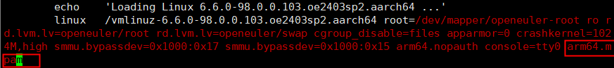
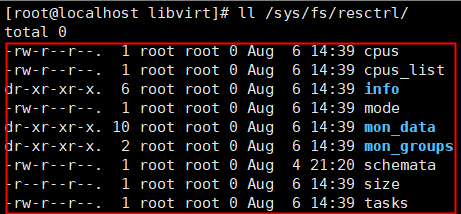
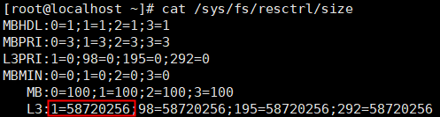
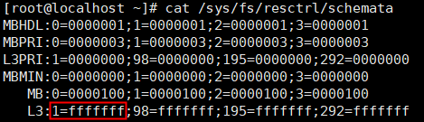
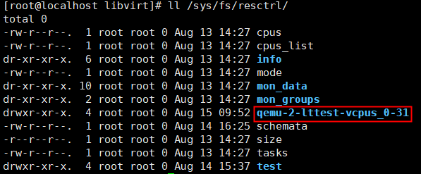
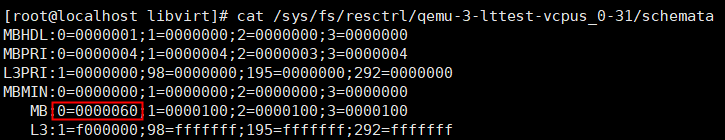
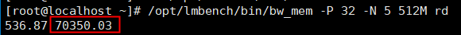
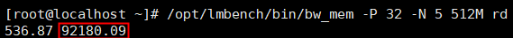
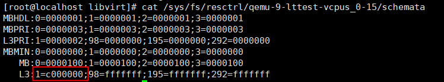

# libvirt使能MPAM 用户指南

## 特性描述<a name="ZH-CN_TOPIC_0000002518685864"></a>

本文主要介绍如何在鲲鹏服务器上配置虚拟机的内存带宽以及Cache Line，并提供了libvirt的安装指导以及虚拟机XML的配置指导。

运行在同一NUMA节点上的虚拟机共享内存带宽以及Cache Line等公共资源。当共享资源有限时，虚拟机之间可能出现资源争抢，导致性能下降。客户希望通过配置虚拟机的带宽和缓存上限来限制虚拟机的资源使用，避免多租户间的相互干扰，提升云主机的可用性。MPAM（Memory System Resource Partitioning and Monitoring，内存系统资源分区与监控）提供限制进程最大内存使用带宽及Cache Line数量的功能，需要在libvirt上适配此特性，支持通过XML直接配置虚拟机DDR bandwidth和缓存大小。

**规格<a name="section186211624175715"></a>**

可支持的虚拟机规格包括但不限于2C8G、4C8G、4C16G、8C16G、16C32G、32C64G。

**版本支持<a name="section1625164615574"></a>**

- 版本：支持openEuler 24.03 LTS SP2、openEuler 24.03 LTS SP3操作系统，QEMU 8.2.0和libvirt 9.10.0-18.oe2403sp2及以上版本。
- License支持：无。

**约束与限制<a name="section3897196125818"></a>**

使用环境需满足软硬件环境要求。

**应用场景<a name="section49961711506"></a>**

libvirt支持DDR bandwidth配置的应用场景主要包括虚拟机内存带宽隔离与QoS控制，通过使用MPAM将不同VM分配到不同的带宽/缓存分区，实现限速或优先级控制，确保高优先级VM（如实时业务）获得稳定性能，同时低优先级VM不影响关键负载。

## 安装和使用特性<a name="ZH-CN_TOPIC_0000002518685868"></a>

### 环境要求<a name="ZH-CN_TOPIC_0000002518525978"></a>

本文基于openEuler操作系统提供指导，在正式操作前请确保软硬件均满足要求。

**硬件要求<a name="section26241127"></a>**

硬件要求如[**表 1** 硬件要求](#硬件要求)所示。

**表 1** 硬件要求<a id="硬件要求"></a>

|项目|说明|
|--|--|
|处理器|鲲鹏920新型号处理器、鲲鹏950处理器|


**操作系统和软件要求<a name="section153345522323"></a>**

操作系统和软件要求如[**表 2** 操作系统和软件要求](#操作系统和软件要求) 所示。

**表 2** 操作系统和软件要求<a id="操作系统和软件要求"></a>

|项目|版本|获取方法|
|--|--|--|
|OS|openEuler 24.03 LTS SP2<br>openEuler 24.03 LTS SP3|[获取链接](https://mirrors.huaweicloud.com/openeuler/openEuler-24.03-LTS-SP2/ISO/aarch64/openEuler-24.03-LTS-SP2-everything-aarch64-dvd.iso)<br>[获取链接](https://mirrors.huaweicloud.com/openeuler/openEuler-24.03-LTS-SP3/ISO/aarch64/openEuler-24.03-LTS-SP3-everything-aarch64-dvd.iso)|
|libvirt|9.10.0|通过配置Yum源的方式安装|
|QEMU|8.2.0|通过配置Yum源的方式安装|
|lmbench|3-4|通过配置Yum源的方式安装|


### 使能MPAM<a name="ZH-CN_TOPIC_0000002518685866"></a>

使能MPAM需要修改内核启动参数，并且完成resctrl文件系统的挂载。

1. 修改内核启动参数。
    1. 打开grub.cfg文件。

        ```
        vi /boot/efi/EFI/openEuler/grub.cfg
        ```

    2. 按“i”进入编辑模式，为内核启动参数增加**arm64.mpam**。

        

    3. 按“Esc”键退出编辑模式，输入 **:wq!**，按“Enter”键保存并退出文件。

2. 重启物理机，查看是否存在“/sys/fs/resctrl”目录。

    ```
    reboot
    ll /sys/fs/resctrl
    ```

    

3. 执行挂载命令，挂载resctrl文件系统。

    ```
    mount -t resctrl resctrl /sys/fs/resctrl/
    ```

4. 查看resctrl目录下是否有对应内容，如图所示有对应内容表示挂载成功。

    ```
    ll /sys/fs/resctrl
    ```

    

### 安装libvirt<a name="ZH-CN_TOPIC_0000002550125719"></a>

当前仅支持libvirt 9.10.0版本使能MPAM特性，请确保编译安装的libvirt为本特性需要的版本。若为其他版本，安装前需要先卸载原有libvirt及其依赖。

**前提条件<a name="section610117391219"></a>**

配置在线Yum源，具体配置方法请参见[配置Yum源](https://www.hikunpeng.com/document/detail/zh/kunpengcpfs/ecosystemEnable/Libvirt/kunpengcpfs_libvirt_03_0005.html)。

**操作步骤<a name="section830916587214"></a>**

安装libvirt。

```
yum install -y libvirt
```


### 配置虚拟机XML<a name="ZH-CN_TOPIC_0000002550005731"></a>

通过XML直接配置虚拟机Cache和memory bandwidth，使MPAM能够限制进程使用Cache Line的数量和最大内存使用带宽。

**配置Cache<a name="section362983302918"></a>**

Cache配置的XML如下所示，相关参数请参见[**表 1** 参数说明](#参数说明)。

```
<cputune>
    <cachetune vcpus='0-15'>
      <cache id='0' level='3' type='both' size='2560' unit='KiB'/>
      <cache id='0' level='3' type='priority' size='2'/>
    </cachetune>
</cputune>
```

**表 1** 参数说明<a id="参数说明"></a>

|参数|说明|
|--|--|
|vcpus|需要限制的vCPU列表。|
|id|NUMA ID或Cluster ID，与芯片实现相关。|
|level|Cache Level，目前仅支持L3。|
|type|参数类型，有效值有both、code、data以及priority，分别对应MPAM中的L3、L3CODE、L3DATA以及L3PRI；针对鲲鹏950处理器，新增max、min，对应MPAM中的L3MAX与L3MIN。关于MPAM参数的更多内容请参见[MPAM参数介绍](https://gitee.com/openeuler/kernel/blob/c3f8f5c91794b44b7d65a27371a536a1bc86905e/Documentation/arch/arm64/mpam.md#331-pri-%E4%BC%98%E5%85%88%E7%BA%A7%E8%AE%BE%E7%BD%AE)。|
|size|type为priority时是优先级值，有效值[0,3]，type为min时，有效值为[0,100]，type为max时，有效值为[1,100]。type为其他类型时，size与unit一起组成Cache Line大小。手动配置Cache Line的示例请参见[手动配置Cache Line示例](#section2711453414)。|
|unit|type为priority、max、min时缺省，其他类型时是Cache Line单位，有效值有B、KiB、MiB以及GiB，默认值为KiB。手动配置Cache Line的示例请参见[手动配置Cache Line示例](#section2711453414)。|


**手动配置Cache Line示例<a id="section2711453414"></a>**

此处以size为2，unit为MiB为例，说明如何进行手动配置Cache Line的计算方法。

手动配置的Cache Line大小必须是物理机单条Cache Line大小的整数倍，物理机单条Cache Line大小可通过“/sys/fs/resctrl/size”文件中单NUMA节点L3大小除以“/sys/fs/resctrl/schemata”文件中单NUMA节点L3掩码位数得到。如下图所示，单个NUMA的L3大小为58720256字节，除以单个NUMA掩码二进制位数28，得到单条Cache Line大小为2097152字节，即2MiB。





**配置memory bandwidth<a name="section16870222133515"></a>**

memory bandwidth配置的XML如下所示，相关参数请参见[**表 2** 参数说明](#参数说明_1)。

```
<cputune>
    <memorytune vcpus='0-15'>
      <node id='0' bandwidth='60' min_bandwidth='10' hardlimit='0' priority='2'/>
    </memorytune>
</cputune>
```

**表 2** 参数说明<a id="参数说明_1"></a>

|参数|说明|
|--|--|
|vcpus|需要限制的vCPU列表。|
|id|NUMA ID。|
|bandwidth|必选，对应MPAM的MB，有效值范围[1,100]。|
|min_bandwidth|可选，对应MPAM的MBMIN，有效值范围[0,100]。|
|hardlimit|可选，对应MPAM的MBHDL，有效值0或者1。|
|priority|可选，对应MPAM的MBPRI，有效值[0,7]。|


> **说明：** 
>关于MPAM参数的更多内容请参见[MPAM参数介绍](https://gitee.com/openeuler/kernel/blob/c3f8f5c91794b44b7d65a27371a536a1bc86905e/Documentation/arch/arm64/mpam.md#331-pri-%E4%BC%98%E5%85%88%E7%BA%A7%E8%AE%BE%E7%BD%AE)。


## 验证特性<a name="ZH-CN_TOPIC_0000002550125721"></a>

lmbench是一个内存性能测试工具，可以用来测试内存带宽以及访存延迟，工具版本可任意选择。请先安装lmbench，再进行MPAM功能测试。

**前提条件<a name="section930415406507"></a>**

已提前创建虚拟机，可支持的虚拟机规格包括但不限于2C8G、4C8G、4C16G、8C16G、16C32G、32C64G。

**安装lmbench<a name="section10264710191217"></a>**

> **须知：** 
>为虚拟机安装软件，需要在虚拟机中提前配置好Yum源。

本文以lmbench 3-4为例，该版本为Yum源自带版本，在虚拟机中执行以下命令安装。

```
yum install -y lmbench
```

**内存带宽限制<a name="section6695756134"></a>**

1. 编辑虚拟机XML，并将_vm name_替换为实际的虚拟机名称。

    ```
    virsh edit <vm name>
    ```

2. 使用以下XML将Node 0内存带宽限制到60%。

    ```
    <domain type='kvm'>
    ......
      <cputune>
        <memorytune vcpus='0-31'>
          <node id='0' bandwidth='60'/>
        </memorytune>
      </cputune>
    ......
    </domain>
    ```

3. 启动虚拟机。

    ```
    virsh start <vm name>
    ```

4. 查看对应MPAM控制组是否创建成功，控制组目录在“/sys/fs/resctrl”，新的控制组名根据vm id、name以及限制的vCPU列表决定。
    1. 查看是否有对应控制组。

        ```
        ll /sys/fs/resctrl
        ```

        

    2. 查看对应控制组schemata文件内容是否与XML配置匹配。

        ```
        cat /sys/fs/resctrl/<group name>/schemata
        ```

        

5. 进入虚拟机使用lmbench测试带宽观察是否有对应变化。

    > **说明：** 
    >-   不同规格虚拟机能够达到的内存带宽上限不同，MPAM是根据理论上限限制带宽，并非虚拟机能达到的实际上限，测试过程重点关注变化趋势。
    >-   测试中使用的命令需要根据虚拟机规格自行调整并发数量-P以及内存页大小参数，-P参数保持与vCPU数量一致。

    以32C64G规格虚拟机为例。

    1. 将虚拟机绑核在NUMA 0，设置内存带宽为50，启动并进入虚拟机，使用以下命令测试内存带宽，得到当前内存带宽。

        ```
        <cputune>
            <vcpupin vcpu='0' cpuset='0'/>
            <vcpupin vcpu='1' cpuset='1'/>
            ......
            <vcpupin vcpu='30' cpuset='30'/>
            <vcpupin vcpu='31' cpuset='31'/>
            <memorytune vcpus='0-31'>
              <node id='0' bandwidth='50'/>
            </memorytune>
        </cputune>
        <numatune>
            <memnode cellid='0' mode='strict' nodeset='0'/>
        </numatune>
        ```

        ```
        /opt/lmbench/bin/bw_mem -P 32 -N 5 512M rd
        ```

        

    2. 重复上述步骤将内存带宽修改为80，重启虚拟机，使用相同命令再次测试，观察带宽是否有明显上升。

        ```
        virsh shutdown <vm name>
        virsh start <vm name>
        ```

        

**L3 Cache限制<a name="section46953561317"></a>**

> **须知：** 
>libvirt限制L3 Cache时，要求独占Cache Line，需要事先调整其他控制组（包括默认控制组）的Cache Line使用情况，空余出足够的Cache Line。

1. 修改默认控制组L3 Cache数据，将最高两位掩码对应的Cache Line设置为空闲。

    ```
    echo "L3:1=3ffffff" > /sys/fs/resctrl/schemata
    ```

2. 编辑虚拟机XML。

    ```
    virsh edit <vm name>
    ```

3. 使用以下XML将Node 0 L3 Cache限制为4MiB，对应机型的两条Cache Line。

    ```
    <domain type='kvm'>
    ......
      <cputune>
        <cachetune vcpus='0-15'>
          <cache id='0' level='3' type='both' size='4' unit='MiB'/>
          <cache id='0' level='3' type='priority' size='2'/>
        </cachetune>
      </cputune>
    ......
    </domain>
    ```

4. 启动虚拟机。

    ```
    virsh start <vm name>
    ```

5. 查看对应MPAM控制组是否创建成功，控制组目录在“/sys/fs/resctrl”，新的控制组名根据vm id、name以及限制的vCPU列表决定。
    1. 查看是否有对应控制组。

        ```
        ll /sys/fs/resctrl
        ```

        

    2. 查看对应控制组schemata文件内容是否与XML配置匹配。

        ```
        cat /sys/fs/resctrl/<group name>/schemata
        ```

        

6. 查看对应控制组的监控数据，观察限制是否生效，数据是否与XML设置的大小匹配，数据单位为Byte。

    ```
    cd /sys/fs/resctrl/<group name>/mon_data/mon_L3_01
    watch -n 1 grep . *
    ```

    


## 故障排除<a name="ZH-CN_TOPIC_0000002518525980"></a>

**问题现象描述<a name="section758133012554"></a>**

启动libvirtd服务后，启动虚拟机报错“error: can't connect to virtlogd: Failed to connect socket to '/var/run/libvirt/virtlogd-sock': Connection refused”。

**关键过程、根本原因分析<a name="section145813300553"></a>**

无

**结论、解决方案及效果<a name="section96942184217"></a>**

通过执行以下命令修复。

```
sudo systemctl enable --now virtlogd.socket
sudo systemctl enable --now libvirtd.service
sudo pkill virtlogd
sudo pkill libvirtd
sudo systemctl restart virtlogd.socket
sudo systemctl restart libvirtd
```


