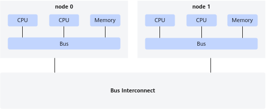
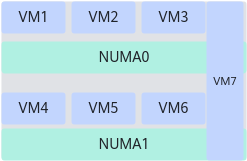

# NUMA感知 特性指南

## 特性描述<a name="ZH-CN_TOPIC_0000002070343122"></a>

**简介<a name="section117054563113"></a>**

NUMA感知是一种优化策略，用于充分利用NUMA（Non-Uniform Memory Access，非统一内存访问）架构的特性，以提高多处理器系统的性能。

NUMA架构将处理器和内存划分为多个节点，如下图node0和node1，每个节点包含本地内存和对应的处理器。对于某个处理器（如node0中的CPU），访问相同节点内的内存（可称为本地内存）的速度比访问其他节点中的内存（可称为远程内存）更快。NUMA感知的核心原理是，通过感知NUMA的拓扑结构，尽量减少跨节点的内存访问，以降低延迟并提高性能。

**图 1** NUMA架构图<a name="fig1860217228139"></a><a id="NUMA架构图"></a>



通过为虚拟机配置Guest NUMA，虚拟机内部能够识别vCPU NUMA状态，以便于虚拟机根据Guest NUMA拓扑，优化内存资源使用。例如对于下图的VM7，其使用的宿主机CPU和内存分布于两个NUMA节点中，在无NUMA感知情况下，虚拟机内部便可能出现大量的跨NUMA节点的内存访问，影响性能。当配置Guest NUMA，将宿主机的NUMA拓扑结构传递给虚拟机时，便能减少跨NUMA节点的内存访问。



**版本支持<a name="section160134962811"></a>**

- 版本支持：支持openEuler20.03 LTS SP1及以上版本操作系统，QEMU v2.6.0及以上版本。
- License支持：无。

**约束与限制<a name="section149451330182917"></a>**

NUMA感知特性的主要目的为在虚拟机内部感知Host上的NUMA架构，对于性能的影响依赖于应用特征。如果业务软件不识别NUMA，或没有针对NUMA进行优化，会出现跨NUMA内存访问的问题，导致性能下降。

**应用场景<a name="section195951573305"></a>**

适用于1:1绑核场景，根据vCPU绑定物理CPU拓扑，呈现最佳的NUMA拓扑。

**原理描述<a name="section179511734103018"></a>**

通过配置NUMA感知特性可以实现内存的分块绑定和vCPU绑定，使虚拟机感知到宿主机的NUMA架构，从而优化性能。


## 特性使用<a name="ZH-CN_TOPIC_0000002070343110"></a>

### 配置XML<a name="ZH-CN_TOPIC_0000002070183306"></a>

配置NUMA感知时可以指定虚拟NUMA节点（vNode）的内存在Host上的分配位置，实现内存的分块绑定，同时配合vCPU绑定，使vNode上的vCPU和内存在同一个物理NUMA node上。下面给出虚拟机XML参考配置。

```
  <memory unit='KiB'>8388608</memory>
  <currentMemory unit='KiB'>8388608</currentMemory>
  <vcpu placement='static'>16</vcpu>
  <cputune>
    <vcpupin vcpu='0' cpuset='24'/>
    <vcpupin vcpu='1' cpuset='25'/>
    <vcpupin vcpu='2' cpuset='26'/>
    <vcpupin vcpu='3' cpuset='27'/>
    <vcpupin vcpu='4' cpuset='28'/>
    <vcpupin vcpu='5' cpuset='29'/>
    <vcpupin vcpu='6' cpuset='30'/>
    <vcpupin vcpu='7' cpuset='31'/>
    <vcpupin vcpu='8' cpuset='32'/>
    <vcpupin vcpu='9' cpuset='33'/>
    <vcpupin vcpu='10' cpuset='34'/>
    <vcpupin vcpu='11' cpuset='35'/>
    <vcpupin vcpu='12' cpuset='36'/>
    <vcpupin vcpu='13' cpuset='37'/>
    <vcpupin vcpu='14' cpuset='38'/>
    <vcpupin vcpu='15' cpuset='39'/>
    <emulatorpin cpuset='24-39'/>
  </cputune>
  <numatune>
    <memnode cellid='0' mode='strict' nodeset='0'/>
    <memnode cellid='1' mode='strict' nodeset='1'/>
  </numatune>
  <cpu mode='host-passthrough' check='none'>
    <topology sockets='1' dies='1' clusters='4' cores='4' threads='1'/>
    <numa>
      <cell id='0' cpus='0-7' memory='4194304' unit='KiB'/>
      <cell id='1' cpus='8-15' memory='4194304' unit='KiB'/>
    </numa>
  </cpu>
```

配置步骤说明：

1. 设置vCPU与物理机CPU一一对应，即1:1绑核。

    如下配置将虚拟机内存设置为8G，vcpu数量设置为16，并将vcpu0-15与对应的宿主机CPU24-39绑定。

    ```
      <memory unit='KiB'>8388608</memory>
      <currentMemory unit='KiB'>8388608</currentMemory>
      <vcpu placement='static'>16</vcpu>
      <cputune>
        <vcpupin vcpu='0' cpuset='24'/>
        <vcpupin vcpu='1' cpuset='25'/>
        <vcpupin vcpu='2' cpuset='26'/>
        <vcpupin vcpu='3' cpuset='27'/>
        <vcpupin vcpu='4' cpuset='28'/>
        <vcpupin vcpu='5' cpuset='29'/>
        <vcpupin vcpu='6' cpuset='30'/>
        <vcpupin vcpu='7' cpuset='31'/>
        <vcpupin vcpu='8' cpuset='32'/>
        <vcpupin vcpu='9' cpuset='33'/>
        <vcpupin vcpu='10' cpuset='34'/>
        <vcpupin vcpu='11' cpuset='35'/>
        <vcpupin vcpu='12' cpuset='36'/>
        <vcpupin vcpu='13' cpuset='37'/>
        <vcpupin vcpu='14' cpuset='38'/>
        <vcpupin vcpu='15' cpuset='39'/>
        <emulatorpin cpuset='24-39'/>
      </cputune>
    ```

2. 配置虚拟机NUMA。

    为虚拟机配置两个NUMA节点，分别为node0和node1。

    ```
      <numatune>
        <memnode cellid='0' mode='strict' nodeset='0'/>
        <memnode cellid='1' mode='strict' nodeset='1'/>
      </numatune>
    ```

3. 配置NUMA内部结构。

    将两个NUMA节点内存均设置为4G，且node0包含cpu0-7，node1包含cpu8-15。

    ```
      <cpu mode='host-passthrough' check='none'>
        <topology sockets='1' dies='1' clusters='4' cores='4' threads='1'/>
        <numa>
          <cell id='0' cpus='0-7' memory='4194304' unit='KiB'/>
          <cell id='1' cpus='8-15' memory='4194304' unit='KiB'/>
        </numa>
      </cpu>
    ```


### 特性验证<a name="ZH-CN_TOPIC_0000002105903009"></a>

对虚拟机进行上述配置后，可进入虚拟机利用如下命令查看NUMA个数。

```
numactl -H
```

如下图，可查看到NUMA节点个数为2，node0包含cpu0-7，node1包含cpu8-15，与虚拟机XML配置一致。两个NUMA节点各自有4G左右的内存，由于系统本身占据部分内存，所以显示的内存大小会与虚拟机XML配置的不完全一致。


## 缩略语<a name="ZH-CN_TOPIC_0000002105903033"></a>

|**缩略语**|**英文全称**|**中文全称**|
|--|--|--|
|NUMA|Non-Uniform Memory Access|非统一内存访问|


