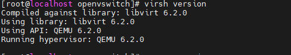

# 虚拟化场景拓扑感知 用户指南

## 特性描述<a name="ZH-CN_TOPIC_0000002550128075"></a>

本文主要介绍如何在使用openEuler操作系统的鲲鹏服务器上部署和使能虚拟化场景拓扑感知特性。

在ARM架构的虚拟机环境中，查看缓存大小通常会默认显示一组预设值，这些默认值无法准确反映虚拟机实际使用的缓存大小。这种情况下，虚拟机中的应用程序和操作系统优化可能会受到影响。为了解决这个问题，本特性提供了一种在libvirt的虚拟机XML配置或QEMU启动虚拟机的命令中，明确指定缓存大小的方式。通过采用这种特性，虚拟机可以精确地反映其使用的缓存大小，来获取更精确的缓存结构信息，从而更好地优化虚拟机中的应用程序性能。该特性由QEMU和libvirt的补丁提供。

**版本支持<a name="section152361333185213"></a>**

- 物理机支持openEuler 22.03 LTS SP4的操作系统版本。
- 虚拟机支持openEuler 22.03 LTS SP4的操作系统版本。
- License支持：无。

**应用场景<a name="section342793714538"></a>**

本特性能够增强虚拟机内缓存结构信息的精确度，有助于提升游戏类业务的单业务性能。


## 特性使用<a name="ZH-CN_TOPIC_0000002550008067"></a>

### 环境要求<a name="ZH-CN_TOPIC_0000002518688214"></a>

在使用特性前，请确认已满足软件与硬件要求。

**硬件要求<a name="zh-cn_topic_0000001217080138_section10273165810425"></a>**

硬件要求如[**表 1** 硬件要求](#硬件要求) 所示。

**表 1** 硬件要求<a id="硬件要求"></a>

|项目|规格|
|--|--|
|处理器|鲲鹏920系列处理器|


**操作系统和软件要求<a name="section1240364411598"></a>**

操作系统和软件要求如[**表 2** 操作系统与软件要求](#操作系统与软件要求)所示。

**表 2** 操作系统与软件要求<a id="操作系统与软件要求"></a>

|软件名称|版本|获取方法|
|--|--|--|
|物理机与虚拟机操作系统|已经验证的版本：openEuler 22.03 LTS SP4|[获取链接](https://mirrors.huaweicloud.com/openeuler/openEuler-22.03-LTS-SP4/ISO/aarch64/openEuler-22.03-LTS-SP4-everything-aarch64-dvd.iso)|
|QEMU|6.2.0|代码仓：[获取链接](https://gitee.com/src-openeuler/qemu/tree/openEuler-22.03-LTS-SP4/)<br>补丁：[获取链接](https://gitee.com/openeuler/qemu/pulls/1449)|
|libvirt|6.2.0|代码仓：[获取链接](https://gitee.com/src-openeuler/libvirt/tree/openEuler-22.03-LTS-SP4/)<br>补丁：[获取链接](https://gitee.com/openeuler/libvirt/pulls/315)|


### 使能与验证<a name="ZH-CN_TOPIC_0000002518528304"></a>

#### 安装libvirt与QEMU<a name="ZH-CN_TOPIC_0000002550008069"></a>

通过配置虚拟机的XML或配置QEMU拉起虚拟机的命令将缓存结构信息传给虚拟机，使能前后观察虚拟机中的缓存结构信息，验证使能是否成功。配置前需通过编译rpm包的方式安装libvirt与QEMU。

1. <a name="li13594163933816"></a>获取libvirt与QEMU代码仓。

    获取针对openEuler 22.03 LTS SP4的libvirt，命令如下。

    ```
    git clone https://gitee.com/src-openeuler/libvirt.git -b openEuler-22.03-LTS-SP4
    ```

    获取针对openEuler 22.03 LTS SP4的QEMU，命令如下。

    ```
    git clone https://gitee.com/src-openeuler/qemu.git -b openEuler-22.03-LTS-SP4
    ```

2. 获取libvirt补丁与QEMU补丁。
    - 确认[步骤1](#li13594163933816)中的代码仓是否包含如下补丁。如果有，则无需下载补丁，直接跳转到[步骤4](#li101064218395)即可。

        libvirt补丁名称：

        ```
        libvirt-Support-specifying-the-cache-size-presented-.patch
        ```

        QEMU补丁名称：

        ```
        qapi-qom-Define-cache-enumeration-and-properties-for.patch
        hw-core-machine-smp-Initialize-caches_bitmap-before-.patch
        qemu-Support-specifying-the-cache-size-presented-to-.patch
        ```

    - 如果没有补丁，则需要根据[**表 2** 操作系统与软件要求](#操作系统与软件要求)中的地址下载补丁。在对应补丁地址中，单击“克隆/下载-\>HTTPS-\>下载 Email Patch”的“下载 Email Patch”，将所有的代码复制保存成“Patch名称.patch”，并将Patch放到[步骤1](#li13594163933816)中克隆的文件夹的spec文件所在目录。补丁下载完成后，需要执行[步骤3](#li24971128394)的操作。

3. <a name="li24971128394"></a>修改libvirt.spec与qemu.spec。

    修改对应的spec文件，以libvirt.spec文件为例。在libvirt.spec文件的Patch清单最后，加上前文所下载的libvirt Email Patch的名称。QEMU的操作类似。

    

4. <a name="li101064218395"></a>拷贝文件。

    以libvirt为例，把所有文件（libvirt-6.2.0.tar.xz, libvirt.spec, \*, patch）复制到“/root/rpmbuild/SOURCES”。QEMU的操作类似。

5. 编译安装依赖包。

    > **说明：** 
    >-   libvirt与QEMU需要分开单独编译。
    >-   需要提前配置好Yum源。

    编译安装相关的依赖包，libvirt的命令如下。

    ```
    yum-builddep -y /root/rpmbuild/SOURCES/libvirt.spec
    ```

    QEMU的命令如下。

    ```
    yum-builddep -y /root/rpmbuild/SOURCES/qemu.spec
    ```

6. 编译rpm包。

    编译安装相关的依赖包，libvirt的命令如下。

    ```
    rpmbuild -ba /root/rpmbuild/SOURCES/libvirt.spec
    ```

    QEMU的命令如下。

    ```
    rpmbuild -ba /root/rpmbuild/SOURCES/qemu.spec
    ```

7. 安装rpm包。

    编译安装相关的依赖包，libvirt的命令如下。

    ```
    cd /root/rpmbuild/RPMS/aarch64
    rpm -ivh libvirt* --nodeps --force
    ```

    QEMU的命令如下。

    ```
    cd /root/rpmbuild/RPMS/aarch64
    rpm -ivh qemu* --nodeps --force
    ```

8. 确认是否安装成功。

    执行以下命令，查询libvirt与QEMU的版本。

    ```
    virsh version
    ```

    


#### 配置虚拟机缓存<a name="ZH-CN_TOPIC_0000002550128077" id="配置虚拟机缓存"></a>

拉起虚拟机可以通过libvirt，也可以通过QEMU命令。下面将针对两种拉起虚拟机的方式的缓存大小配置进行介绍。

**通过libvirt拉起虚拟机<a name="section058302812215"></a>**

采用libvirt拉起虚拟机的方式，需要在虚拟机的xml配置文件中修改缓存相关配置。

> **说明：** 
>修改虚拟机xml文件后，需要重新拉起虚拟机，配置才生效。

- l1缓存为指令-数据分离结构时（比如ARM架构），配置如下。

    ```
        ... 
        <cpu mode='host-passthrough'>
            <cacheinfo cache='l1d' size='<l1d缓存大小>'/> //示例 32768
            <cacheinfo cache='l1i' size='<l1i缓存大小>'/> //示例 32768
            <cacheinfo cache='l2' size='<l2缓存大小>'/> //示例 1048576
            <cacheinfo cache='l3' size='<l3缓存大小>'/> //示例 50331648
        </cpu>
        ... 
    ```

- l1缓存为统一缓存结构时，配置如下。

    ```
      ... 
        <cpu mode='host-passthrough'>
            <cacheinfo cache='l1' size='<l1缓存大小>'/> //示例 32768
            <cacheinfo cache='l2' size='<l2缓存大小>'/> //示例 1048576
            <cacheinfo cache='l3' size='<l3缓存大小>'/> //示例 50331648
        </cpu>
        ...
    ```

**（可选）通过QEMU命令或Device Tree拉起虚拟机<a name="section587337679"></a>**

采用QEMU命令或Device Tree拉起虚拟机，需要在QEMU命令中修改缓存相关配置。

- l1缓存为指令-数据分离结构时（比如ARM架构），配置如下。

    ```
    -machine virt,\
    smp-cache.0.cache=l1i,smp-cache.0.size=<l1i缓存大小>,\ //示例 32768
    smp-cache.1.cache=l1d,smp-cache.1.size=<l1d缓存大小>,\ //示例 32768
    smp-cache.2.cache=l2,smp-cache.2.size=<l2缓存大小>,\  //示例 1048576
    smp-cache.3.cache=l3,smp-cache.3.size=<l3缓存大小> \ //示例 50331648
    ```

- l1缓存为统一缓存结构时，配置如下。

    ```
    -machine virt,\
    smp-cache.0.cache=l1,smp-cache.0.size=<l1缓存大小>,\ //示例 32768
    smp-cache.2.cache=l2,smp-cache.2.size=<l2缓存大小>,\ //示例 1048576
    smp-cache.3.cache=l3,smp-cache.3.size=<l3缓存大小> \ //示例 50331648
    ```

> **说明：** 
>-   此处配置的l1i缓存大小、l1d缓存大小、l2缓存大小和l3缓存大小为虚拟机中看到的缓存大小。为了保证准确，需要确认与虚拟机实际使用的缓存大小一致。
>-   如果l1缓存为指令-数据分离结构，应配置“l1d”和“l1i”，否则配置“l1”。
>-   设置缓存的大小必须大于0。


#### 测试虚拟机缓存<a name="ZH-CN_TOPIC_0000002518528302"></a>

在修改虚拟机缓存之前，在虚拟机中看到的缓存大小应是默认大小。在进行缓存配置修改后，在虚拟机中将看到所配置的缓存大小。

1. 启动虚拟机。

    > **说明：** 
    >有三种方式启动虚拟机，通常使用libvirt启动虚拟机。
    >也可使用QEMU命令启动虚拟机或以Device Tree的方式启动虚拟机。

    - 使用libvirt启动虚拟机。

        ```
        virsh start <虚拟机名称>
        ```

    - 使用QEMU命令启动虚拟机，可参考以下命令。

        ```
        qemu-kvm \
        -blockdev '{"driver":"file","filename":"<EFI文件路径>","node-name":"libvirt-pflash0-storage","auto-read-only":true,"discard":"unmap"}' \
        -blockdev '{"node-name":"libvirt-pflash0-format","read-only":true,"driver":"raw","file":"libvirt-pflash0-storage"}' \
        -blockdev '{"driver":"file","filename":"<nvram文件>","node-name":"libvirt-pflash1-storage","auto-read-only":true,"discard":"unmap"}' \
        -blockdev '{"node-name":"libvirt-pflash1-format","read-only":false,"driver":"raw","file":"libvirt-pflash1-storage"}' \
        -machine virt,usb=off,dump-guest-core=off,gic-version=3,pflash0=libvirt-pflash0-format,pflash1=libvirt-pflash1-format \
        -accel kvm \
        -cpu host \
        -m <内存大小> \
        -smp <vcpu个数> \
        -drive file=<虚拟机硬盘路径> \
        -nographic
        ```

    - 以Device Tree的方式启动虚拟机，可参考以下命令。

        ```
        qemu-kvm \
        -kernel <kernel 镜像>
        -smp <vcpu个数> \
        -m <内存大小> \
        -accel kvm \
        -machine virt,gic-version=3,\
        -initrd <虚拟机镜像文件> \
        -cpu host \
        -nographic \
        -append "rdinit=init console=ttyAMA0 earlycon=pl011,0x90000000"
        ```

2. 查看虚拟机初始缓存大小。

    在虚拟机中执行以下命令。

    ```
    lscpu
    ```

    可以看到虚拟机的缓存大小，应显示为默认值（l1d: 64KiB, l1i: 64KiB, l2: 512KiB, l3: 32MiB）。

    

3. 配置缓存大小。

    参考[配置虚拟机缓存](#配置虚拟机缓存)配置虚拟机的缓存大小，再重新拉起一台虚拟机。

4. 确认配置生效。
    1. 在虚拟机中执行以下命令。

        ```
        lscpu
        ```

        能看到缓存大小与设置一致。

        

    2. 在物理机中执行以下命令。

        ```
        virsh dumpxml cachesize_test | grep cacheinfo
        ```

        可以看到运行中的虚拟机生成的xml中缓存大小与设置大小一致。

        


