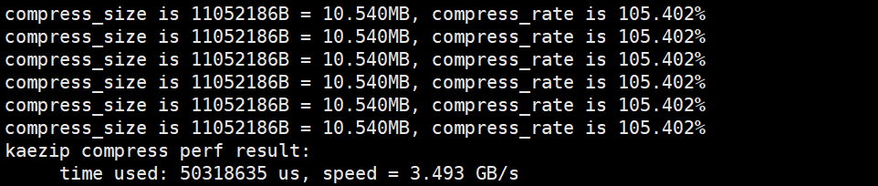

# vKAE直通热迁移 特性指南

## 特性描述<a name="ZH-CN_TOPIC_0000002518686500"></a>

本文主要介绍如何在使用openEuler操作系统的鲲鹏服务器上部署和使能虚拟化场景vKAE直通热迁移特性，以及如何进行功能与性能测试的操作指导。

虚拟机热迁移是指在不中断虚拟机运行的情况下，将虚拟机从一个物理主机迁移到另一个物理主机，是一种重要的运维手段。vKAE直通热迁移是指虚拟机在配置KAE直通设备时，进行热迁移的能力，可以为KAE设备的使用提供更强的灵活性和业务不中断的保障。目前直通设备热迁移DMA标脏基于设备标脏特性，但很多设备不支持此特性，使得直通设备热迁移能力缺失。鲲鹏920新型号处理器SMMU支持HTTU硬件标脏特性，可以通过软件框架+硬件特性结合的方式构建直通设备热迁移硬件标脏特性，提高鲲鹏虚拟化竞争力。

**版本支持<a name="section152361333185213"></a>**

- 物理机支持openEuler 22.03 LTS SP4、openEuler 24.03 LTS SP3的操作系统版本。
- QEMU支持6.2.0、8.2.0版本。
- libvirt支持6.2.0、9.10.0版本。
- License支持：无。

**约束限制<a name="section13017391482"></a>**

- 继承原有热迁移的约束。
- 不支持KAE设备以外的直通设备热迁移。
- 虚拟机内直通的KAE设备位于同一NUMA节点上时性能最佳。

**应用场景<a name="section342793714538"></a>**

虚拟机内需要使用KAE设备并且有热迁移需求的场景。

## 安装和使用特性<a name="ZH-CN_TOPIC_0000002518686506"></a>

### 环境要求<a name="ZH-CN_TOPIC_0000002518686504"></a>

在使用特性前，请确认已满足软件与硬件要求。

**硬件要求<a name="zh-cn_topic_0000001217080138_section10273165810425"></a>**

硬件要求如[**表 1** 硬件要求](#硬件要求) 所示。

**表 1** 硬件要求<a id="硬件要求"></a>

|项目|规格|
|--|--|
|处理器|鲲鹏920系列处理器、鲲鹏950处理器|


**操作系统和软件要求<a name="section1240364411598"></a>**

操作系统和软件要求如[**表 2** 已验证操作系统与软件要求](#已验证操作系统与软件要求)所示，迁移源端与目的端BIOS以及固件版本需要保持一致。

**表 2** 已验证操作系统与软件要求<a id="已验证操作系统与软件要求"></a>

|软件名称|版本|获取方法|
|--|--|--|
|OS|openEuler 22.03 LTS SP4|[获取链接](https://mirrors.huaweicloud.com/openeuler/openEuler-22.03-LTS-SP4/ISO/aarch64/openEuler-22.03-LTS-SP4-everything-aarch64-dvd.iso)|
|QEMU|6.2.0|代码仓：[获取链接](https://gitee.com/src-openeuler/qemu/tree/openEuler-22.03-LTS-SP4/)|
|libvirt|6.2.0|代码仓：[获取链接](https://gitee.com/src-openeuler/libvirt/tree/openEuler-22.03-LTS-SP4/)|
|KAE|2.0|代码仓：[获取链接](https://gitcode.com/boostkit/KAE)|


**表 3** 已验证操作系统与软件要求<a id="已验证操作系统与软件要求_1"></a>

|软件名称|版本|获取方法|
|--|--|--|
|OS|openEuler 24.03 LTS SP3|[获取链接](https://mirrors.huaweicloud.com/openeuler/openEuler-24.03-LTS-SP3/ISO/aarch64/openEuler-24.03-LTS-SP3-everything-aarch64-dvd.iso)|
|QEMU|8.2.0|通过配置Yum源的方式安装|
|libvirt|9.10.0|通过配置Yum源的方式安装|
|KAE|2.0|代码仓：[获取链接](https://gitcode.com/boostkit/KAE)|


### 安装KAE<a name="ZH-CN_TOPIC_0000002550006357"></a>

KAE2.0源码包中包含KAEKernelDriver内核驱动、UADK框架、KAEOpensslEngine引擎和KAEZlib、KAEZstd、KAELz4几个模块，其中KAEKernelDriver内核驱动与UADK为必选项，其他模块按实际需求选择安装。本特性以KAEOpensslEngine引擎和KAEZlib为例进行特性的功能和性能测试验证，请参考本章节安装KAEOpensslEngine引擎和KAEZlib。

请在物理机和虚拟机中安装KAE。

1. 下载KAE2.0源码包。

    ```
    git clone https://gitee.com/kunpengcompute/KAE.git -b kae2
    ```

2. 安装依赖，安装前需要自行配置好yum源。

    ```
    yum -y install kernel-devel-$(uname -r) openssl-devel numactl-devel gcc make autoconf automake libtool patch
    ```

3. 在KAE源码目录下安装内核驱动。
    - openEuler 22.03 LTS SP4

        ```
        cd KAE
        sh build.sh driver
        ```

    - openEuler 24.03 LTS SP3

        ```
        cd KAE
        sh build.sh driver_migration
        ```

4. 查看驱动是否安装成功。

    查看“/sys/class/uacce”是否存在加速引擎文件系统。

    ```
    ll /sys/class/uacce/
    ```

    回显信息如下所示，表示驱动安装成功。

    ```
    lrwxrwxrwx. 1 root root 0 Aug 22 17:14 hisi_hpre-2 -> ../../devices/pci0000:78/0000:78:00.0/0000:79:00.0/uacce/hisi_hpre-2
    lrwxrwxrwx. 1 root root 0 Aug 22 17:14 hisi_hpre-3 -> ../../devices/pci0000:b8/0000:b8:00.0/0000:b9:00.0/uacce/hisi_hpre-3
    lrwxrwxrwx. 1 root root 0 Aug 22 17:14 hisi_sec2-0 -> ../../devices/pci0000:74/0000:74:01.0/0000:76:00.0/uacce/hisi_sec2-0
    lrwxrwxrwx. 1 root root 0 Aug 22 17:14 hisi_sec2-1 -> ../../devices/pci0000:b4/0000:b4:01.0/0000:b6:00.0/uacce/hisi_sec2-1
    lrwxrwxrwx. 1 root root 0 Aug 22 17:14 hisi_zip-4 -> ../../devices/pci0000:74/0000:74:00.0/0000:75:00.0/uacce/hisi_zip-4
    lrwxrwxrwx. 1 root root 0 Aug 22 17:14 hisi_zip-5 -> ../../devices/pci0000:b4/0000:b4:00.0/0000:b5:00.0/uacce/hisi_zip-5
    ```

5. 安装UADK框架。
    1. 执行安装UADK框架的脚本命令。

        ```
        sh build.sh uadk
        ```

        UADK框架中包含了用户态驱动，用户态驱动动态库文件为libwd.so、libwd\_crypto.so等。UADK默认安装路径为“/usr/include/uadk”，动态库文件在“/usr/local/lib”下。

        > **说明：** 
        >若执行安装UADK命令后失败，提示缺少头文件，则安装相关依赖包后重新执行安装命令即可。

    2. 查看UADK框架是否安装成功。

        ```
        ll /usr/local/lib/libwd*
        ```

        回显信息如下，表示安装成功。

        ```
        -rwxr-xr-x. 1 root root     961 Aug 22 17:23 /usr/local/lib/libwd_comp.la
        lrwxrwxrwx. 1 root root      19 Aug 22 17:23 /usr/local/lib/libwd_comp.so -> libwd_comp.so.2.5.0
        lrwxrwxrwx. 1 root root      19 Aug 22 17:23 /usr/local/lib/libwd_comp.so.2 -> libwd_comp.so.2.5.0
        -rwxr-xr-x. 1 root root  377872 Aug 22 17:23 /usr/local/lib/libwd_comp.so.2.5.0
        -rwxr-xr-x. 1 root root     973 Aug 22 17:23 /usr/local/lib/libwd_crypto.la
        lrwxrwxrwx. 1 root root      21 Aug 22 17:23 /usr/local/lib/libwd_crypto.so -> libwd_crypto.so.2.5.0
        lrwxrwxrwx. 1 root root      21 Aug 22 17:23 /usr/local/lib/libwd_crypto.so.2 -> libwd_crypto.so.2.5.0
        -rwxr-xr-x. 1 root root  715616 Aug 22 17:23 /usr/local/lib/libwd_crypto.so.2.5.0
        -rwxr-xr-x. 1 root root     907 Aug 22 17:23 /usr/local/lib/libwd.la
        lrwxrwxrwx. 1 root root      14 Aug 22 17:23 /usr/local/lib/libwd.so -> libwd.so.2.5.0
        lrwxrwxrwx. 1 root root      14 Aug 22 17:23 /usr/local/lib/libwd.so.2 -> libwd.so.2.5.0
        -rwxr-xr-x. 1 root root 1342080 Aug 22 17:23 /usr/local/lib/libwd.so.2.5.0
        ```

6. 编译安装KAEOpensslEngine加速引擎。

    - OpenSSL 1.1.1x系列：
        - 使用默认路径下的OpenSSL。

            ```
            sh build.sh engine
            ```

        - 支持使用其他路径下的OpenSSL，如下所示。

            ```
            sh build.sh engine /usr/local/ssl1_1_1w
            ```

    - OpenSSL 3.0.x系列：
        - 使用默认路径下的OpenSSL。

            ```
            sh build.sh engine3
            ```

        - 支持使用其他路径下的OpenSSL，如下所示。

            ```
            sh build.sh engine3 /usr/local/ssl3_0_14
            ```

    - Tongsuo：
        - 使用默认路径下的Tongsuo。

            ```
            sh build.sh engine3_tongsuo
            ```

        - 支持使用其他路径下的Tongsuo，如下所示。

            ```
            sh build.sh engine3_tongsuo /opt/tongsuo
            ```

    KAE引擎动态库文件为libkae.so。动态库文件在“/usr/local/lib/engines-x.x”或“/usr/local/tongsuo/lib/engines-3.0”下。

7. 查看KAE引擎是否安装成功。

    - OpenSSL 1.1.1x系列：

        ```
        ll /usr/local/lib/engines-1.1
        ```

    - OpenSSL 3.0.x系列：

        ```
        ll /usr/local/lib/engines-3.0
        ```

    - Tongsuo 8.4.0：

        ```
        ll /usr/local/tongsuo/lib/engines-3.0
        ```

    回显信息如下，表示安装成功。

    ```
    total 5644
    -rw-r--r--. 1 root root 3846524 Aug 22 17:28 kae.a
    -rwxr-xr-x. 1 root root     995 Aug 22 17:28 kae.la
    lrwxrwxrwx. 1 root root      12 Aug 22 17:28 kae.so -> kae.so.2.0.0
    lrwxrwxrwx. 1 root root      12 Aug 22 17:28 kae.so.2 -> kae.so.2.0.0
    -rwxr-xr-x. 1 root root 1967736 Aug 22 17:28 kae.so.2.0.0
    ```

8. 编译安装KAEZlib加速库。

    > **须知：** 
    >在完成KAEZlib加速库的安装后，可以结合自身需求进行KAEGzip解压缩工具的编译安装，该解压缩工具集成了KAE硬加速接口，使用户能够更加便捷地使用鲲鹏硬加速模块进行文件的压缩和解压操作。安装步骤请参见[8.c](#li20414340916)\~[8.d](#li5793114715813)。

    1. 编译安装。

        ```
        sh build.sh zlib
        ```

        zlib加速库安装在“/usr/local/kaezip”。

    2. 查看zlib加速压缩库是否安装成功。

        ```
        ll /usr/local/kaezip/lib/
        ```

        回显信息如下所示，表示安装成功。

        ```
        lrwxrwxrwx. 1 root root     40 Aug 29 10:20 libkaezip.so -> /usr/local/kaezip/lib/libkaezip.so.2.0.0
        lrwxrwxrwx. 1 root root     40 Aug 29 10:20 libkaezip.so.0 -> /usr/local/kaezip/lib/libkaezip.so.2.0.0
        -rwxr-xr-x. 1 root root 148096 Aug 29 10:20 libkaezip.so.2.0.0
        -rw-r--r--. 1 root root 145674 Aug 29 10:20 libz.a
        lrwxrwxrwx. 1 root root     14 Aug 29 10:20 libz.so -> libz.so.1.2.11
        lrwxrwxrwx. 1 root root     14 Aug 29 10:20 libz.so.1 -> libz.so.1.2.11
        -rwxr-xr-x. 1 root root 144784 Aug 29 10:20 libz.so.1.2.11
        drwxr-xr-x. 2 root root   4096 Aug 29 10:20 pkgconfig
        ```

    3. <a name="li20414340916"></a>编译安装KAEGzip解压缩工具。

        ```
        sh build.sh gzip
        ```

        工具安装在“/usr/local/kaegzip”。

    4. <a name="li5793114715813"></a>查看KAEGzip解压缩工具是否安装成功。

        ```
        ldd /usr/local/kaegzip/gzip
        ```

        回显信息如下所示，表示安装成功。

        ```
        [root@localhost /]# ldd /usr/local/kaegzip/gzip 
        	linux-vdso.so.1 (0x0000ffff7fbc1000)
        	libz.so.1 => /usr/local/kaezip/lib/libz.so.1 (0x0000ffff7fb50000)
        	libwd.so.2 => /usr/local/lib/libwd.so.2 (0x0000ffff7fae0000)
        	libkaezip.so => /usr/local/kaezip/lib/libkaezip.so (0x0000ffff7fa90000)
        	libc.so.6 => /usr/lib64/libc.so.6 (0x0000ffff7f8e0000)
        	/lib/ld-linux-aarch64.so.1 (0x0000ffff7fb84000)
        	libwd_comp.so.2 => /usr/local/lib/libwd_comp.so.2 (0x0000ffff7f8a0000)
        	libnuma.so.1 => /usr/lib64/libnuma.so.1 (0x0000ffff7f870000)
        ```

### 使能设备<a name="ZH-CN_TOPIC_0000002518526590"></a>

本小节以KAE ZIP设备为例，指导如何在物理机上使能设备。

1. 在物理机上使能驱动。
    - 若Host OS为openEuler 22.03 LTS SP4，使用如下命令使能驱动。

        ```
        modprobe hisi_zip pf_q_num=32
        modprobe hisi_migration
        ```

    - 若Host OS为openEuler 24.03 LTS SP3，使用如下命令使能驱动。

        ```
        insmod /lib/modules/`uname -r`/extra/uacce.ko
        insmod /lib/modules/`uname -r`/extra/hisi_qm.ko
        insmod /lib/modules/`uname -r`/extra/hisi_zip.ko
        insmod /lib/modules/`uname -r`/extra/hisi_hpre.ko
        insmod /lib/modules/`uname -r`/extra/hisi_sec2.ko
        insmod /lib/modules/`uname -r`/extra/hisi-acc-vfio-pci.ko
        ```

2. 查询ZIP设备bdf号。

    ```
    lspci | grep ZIP
    ```

    

3. （可选）确认ZIP设备所在NUMA节点。

    ```
    lspci -s 31:00.0 -v
    ```

    

    > **说明：** 
    >虚拟机内直通的KAE设备位于同一NUMA节点上时性能最佳。

4. 在物理机上设置VF。
    - 若Host OS为openEuler 22.03 LTS SP4，使用如下命令设置VF。

        ```
        echo 8 > /sys/bus/pci/devices/0000:31:00.0/sriov_numvfs
        echo 0000:31:00.1 > /sys/bus/pci/drivers/hisi_zip/unbind
        echo vfio-pci > /sys/devices/pci0000:30/0000:30:00.0/0000:31:00.1/driver_override
        echo 0000:31:00.1 > /sys/bus/pci/drivers_probe
        ```

    - 若Host OS为openEuler 24.03 LTS SP3，使用如下命令设置VF。

        ```
        echo 8 > /sys/bus/pci/devices/0000:31:00.0/sriov_numvfs
        echo 0000:31:00.1 > /sys/bus/pci/drivers/hisi_zip/unbind
        echo hisi_acc_vfio_pci > /sys/devices/pci0000:30/0000:30:00.0/0000:31:00.1/driver_override
        echo 0000:31:00.1 > /sys/bus/pci/drivers_probe
        ```


### 配置虚拟机XML<a name="ZH-CN_TOPIC_0000002518526594"></a>

修改虚拟机XML文件中KAE直通设备的相关参数值，使能vKAE热迁移功能。

**openEuler 22.03 LTS SP4<a name="section28685191351"></a>**

在虚拟机XML文件中，将KAE直通设备的“migration”参数配置为“on”，使能vKAE热迁移功能。

XML配置内容如下所示。

```
    ...
    <devices>
        ...
        <hostdev mode='subsystem' type='pci' migration='on'>
            <driver name='vfio'/>
            <source>
                <address bus='0x31' slot='0x00' function='0x1'/>
            </source>
        </hostdev>
        ...
    </devices>
    ... 
```

**openEuler 24.03 LTS SP3<a name="section3214135715356"></a>**

在虚拟机XML文件中，将KAE直通设备的“migration”参数配置为“on”，使能vKAE热迁移功能。“managed”参数配置为“no”，避免libvirt将KAE驱动自动替换为不支持热迁移的版本。

XML配置内容如下所示。

```
    ...
    <devices>
        ...
        <hostdev mode='subsystem' type='pci' managed='no' migration='on'>
            <driver name='vfio'/>
            <source>
                <address domain='0x0000' bus='0x31' slot='0x00' function='0x1'/>
            </source>
        </hostdev>
        ...
    </devices>
    ... 
```


## 验证特性<a name="ZH-CN_TOPIC_0000002550006353"></a>

### 功能测试<a name="ZH-CN_TOPIC_0000002550126359"></a>

功能测试仅用来验证vKAE直通是否成功，vKAE设备在虚拟机内能否正常使用。

> **须知：** 
>如果虚拟机磁盘镜像是非共享存储形式的，需要将虚拟磁盘镜像提前复制到目的端物理机相同目录下。

1. 启动虚拟机。

    ```
    virsh start <虚拟机名称> --console
    ```

2. 编译测试工具。

    ```
    export LD_LIBRARY_PATH=/usr/local/kaezip/lib:$ LD_LIBRARY_PATH
    cd KAEZlib/test/perftest
    make
    ```

    > **说明：** 
    >“KAEZlib/test/perftest”位于[安装KAE](#安装KAE)下载的KAE2.0源码包中。

3. 在虚拟机中使用KAE执行压缩任务。

    ```
    ./kaezip_perf -m 6 -l 10240 -n 3000
    ```

4. 源端物理机执行虚拟机热迁移操作。

    ```
    virsh migrate --live --unsafe <虚拟机名称> qemu+ssh://<目的端物理机IP地址>/system tcp://<目的端物理机IP地址>
    ```

5. 迁移完成后，由目的端物理机进入虚拟机，等待并查看KAE压缩任务是否完成并成功打印。

    


### 性能测试<a name="ZH-CN_TOPIC_0000002518686502"></a>

性能测试用来验证vKAE直通后，虚拟机能否正常执行热迁移，以及迁移过程中的业务中断时间是否满足性能要求。

**配置热迁移参数<a name="section9567115812316"></a>**

1. 打开文件。

    ```
    virsh edit <虚拟机名>
    ```

2. 按“i”进入编辑模式，在XML末尾增加**qemu:commandline**标签，打开“all\_vcpus\_paused”和“all\_vcpus\_prepared”两个trace事件。

    ```
    <domain type="kvm" xmlns:qemu='http://libvirt.org/schemas/domain/qemu/1.0'>
        ...
        <qemu:commandline>
            <qemu:arg value='--trace'/>
            <qemu:arg value='all_vcpus*'/>
        </qemu:commandline>
    </domain>
    ```

3. 按“Esc”键退出编辑模式，输入 **:wq!**，按“Enter”键保存退出文件。
4. 设置控制台日志级别，避免KAE设备驱动的日志打印到串口中。

    ```
    sysctl -w kernel.printk="4 4 1 7"
    ```

5. 同步迁移源端和目的端的本地时间。

    ```
    ntpdate <ntp服务器ip>
    ```

6. 检查时间是否一致。

    ```
    date +%Y-%m-%d\ %H:%M:%S.%3N
    ```

7. 设置downtime-limit为100。

    ```
    virsh migrate-setmaxdowntime <虚拟机名称> 100
    ```

**（可选）添加业务压力（压缩任务）<a name="section145832027152420"></a>**

1. 编译测试工具。

    ```
    export LD_LIBRARY_PATH=/usr/local/kaezip/lib:$ LD_LIBRARY_PATH
    cd KAEZlib/test/perftest
    make
    ```

    > **说明：** 
    >“KAEZlib/test/perftest”位于[安装KAE](#安装KAE)下载的KAE2.0源码包中。

2. 在虚拟机中使用KAE加速压缩任务。

    ```
    ./kaezip_perf -m 6 -l 10240 -n 3000
    ```

**（可选）添加业务压力（Nginx任务）<a name="section163529918256"></a>**

1. 在虚拟机中部署Nginx，部署流程请参见《vKAE 特性指南》的[在虚拟机部署Nginx](https://www.hikunpeng.com/document/detail/zh/kunpengcpfs/basicAccelFeatures/comAccel/kunpengvkae_20_016.html)章节。
2. 在客户端部署HTTPress，部署流程请参见《vKAE 特性指南》的[在客户端部署HTTPress](https://www.hikunpeng.com/document/detail/zh/kunpengcpfs/basicAccelFeatures/comAccel/kunpengvkae_20_017.html)章节。
3. 在客户端使用HTTPress对Nginx进行压测，操作流程请参见《vKAE 特性指南》的[在Nginx应用场景中使用HTTPress对vKAE进行性能测试](https://www.hikunpeng.com/document/detail/zh/kunpengcpfs/basicAccelFeatures/comAccel/kunpengvkae_20_020.html)章节。

**执行迁移测试<a name="section1344823416258"></a>**

1. 源端物理机执行虚拟机热迁移操作。

    ```
    virsh migrate --live --unsafe <虚拟机名称> qemu+ssh://<目的端物理机IP地址>/system tcp://<目的端物理机IP地址>
    ```

2. 迁移完成后，在迁移源端的日志中查看all\_vcpus\_paused事件，在迁移目的端的日志中查看all\_vcpus\_prepared事件，计算两个时间戳的差值，即为热迁移停机时间，单位为秒，观察停机时间是否满足小于200ms的性能要求。

    查看日志：

    ```
    less /var/log/libvirt/qemu/<虚拟机名称>.log
    ```

    

    


## 故障排除<a name="ZH-CN_TOPIC_0000002550126357"></a>

### 在Host OS为openEuler 22.03 LTS SP4的物理机上重启设备安装驱动后查询不到设备文件的解决方法<a name="ZH-CN_TOPIC_0000002518526592"></a>

**问题现象描述<a name="zh-cn_topic_0000001216835577_section3941254"></a>**

在Host OS为openEuler 22.03 LTS SP4的物理机上重启设备安装驱动后查询不到设备文件。

**关键过程、根本原因分析<a name="zh-cn_topic_0000001216835577_section35471290"></a>**

openEuler 22.03 LTS SP4操作系统自带的加速驱动不兼容导致。

**结论、解决方案及效果<a name="zh-cn_topic_0000001216835577_section50806158"></a>**

卸载操作系统自带的加速驱动后，重新加载手动编译的KAE。或者在启动脚本**rc.local**中加上重新加载驱动命令，以hisi\_sec2为例进行说明。

```
rmmod hisi_sec2
modprobe hisi_sec2
```


### 在Host OS为openEuler 24.03 LTS SP3的物理机上重启设备安装驱动后查询不到设备文件的解决方法<a name="ZH-CN_TOPIC_0000002550006355"></a>

**问题现象描述<a name="zh-cn_topic_0000001216835577_section3941254"></a>**

在Host OS为openEuler 24.03 LTS SP3的物理机上重启设备安装驱动后查询不到设备文件。

**关键过程、根本原因分析<a name="zh-cn_topic_0000001216835577_section35471290"></a>**

openEuler 24.03 LTS SP3操作系统自带的加速驱动不兼容导致。

**结论、解决方案及效果<a name="zh-cn_topic_0000001216835577_section50806158"></a>**

卸载操作系统自带的加速驱动后，重新加载手动编译的KAE。或者在启动脚本**rc.local**中加上重新加载驱动命令，以hisi\_sec2为例进行说明。

```
rmmod hisi_sec2
insmod /lib/modules/`uname -r`/extra/hisi_sec2.ko
```


