# vKAE 特性指南

## 特性描述<a name="ZH-CN_TOPIC_0000002005411138"></a>

### 简介<a name="ZH-CN_TOPIC_0000002005252850"></a>

本文主要介绍如何在使用openEuler操作系统的鲲鹏服务器上部署并使能vKAE，并提供了测试方法以及在部署过程中遇到故障的解决方法。

在云原生环境日益普及的当下，Nginx作为关键的网络代理和负载均衡器，在处理HTTPS流量时面临着显著的挑战，尤其是SSL/TLS握手阶段的非对称加密运算，这成为了CPU性能的一大瓶颈。为了缓解这一问题，业界普遍采用硬件加速技术，将原本繁重的加密解密任务从CPU卸载至专用硬件处理，以此提升处理效率，减少CPU切换的开销和等待时间，进而优化整体的网络转发性能。

KAE（Kunpeng Accelerator Engine，鲲鹏加速引擎）是基于鲲鹏处理器提供的硬件加速解决方案，包含了KAE加解密和KAE解压缩。KAE加解密用于加速SSL（Secure Sockets Layer）/TLS（Transport Layer Security）应用，KAE解压缩用于加速数据压缩、解压，可以显著降低处理器消耗，提高处理器效率。

vKAE（virtual Kunpeng Accelerator Engine）是专为基于鲲鹏920处理器的虚拟化和云原生场景设计的硬件加速解决方案。该方案的核心优势在于，它能够高效处理HTTPS请求中的SSL/TLS握手过程，特别是针对RSA等非对称加密算法，实现了硬件卸载。vKAE提供了两种灵活的接口方式：标准的OpenSSL API和定制化的API。这使得Nginx等通用软件以及客户自主研发的应用都能应用vKAE带来的性能提升。该方案使用前要求HostOS上已经安装KAE并已建立虚拟机，且虚拟机上已经安装KAE，最后在HostOS上完成相关配置后方可使用。

通过利用vKAE提供的OpenSSL API接口，Nginx能够在虚拟机环境下实现HTTPS请求处理中的加密算法加速，从而提升网络转发性能。

### 软件架构<a name="ZH-CN_TOPIC_0000002005411110"></a>

vKAE主要由Guest OS、Host OS和KAE Hardware组成。

vKAE的加速流程与在物理机上使用KAE设备进行RSA算法加解密硬件加速类似，可以通过物理机的HPRE（High Performance RSA Engine）设备来创建VF（Virtual Function），这些VF随后被直通到虚拟机中，使得虚拟机能够使用vKAE设备进行RSA算法加解密硬件加速，并应用于Nginx场景中，从而提升网络转发性能。

vKAE特性架构图如[**图 1** vKAE特性架构图](#vKAE特性架构图)所示，各模块功能如[**表 1** vKAE特性各模块功能](#vKAE特性各模块功能)所示。

**图 1** vKAE特性架构图<a name="fig138061989173"></a><a id="vKAE特性架构图"></a>
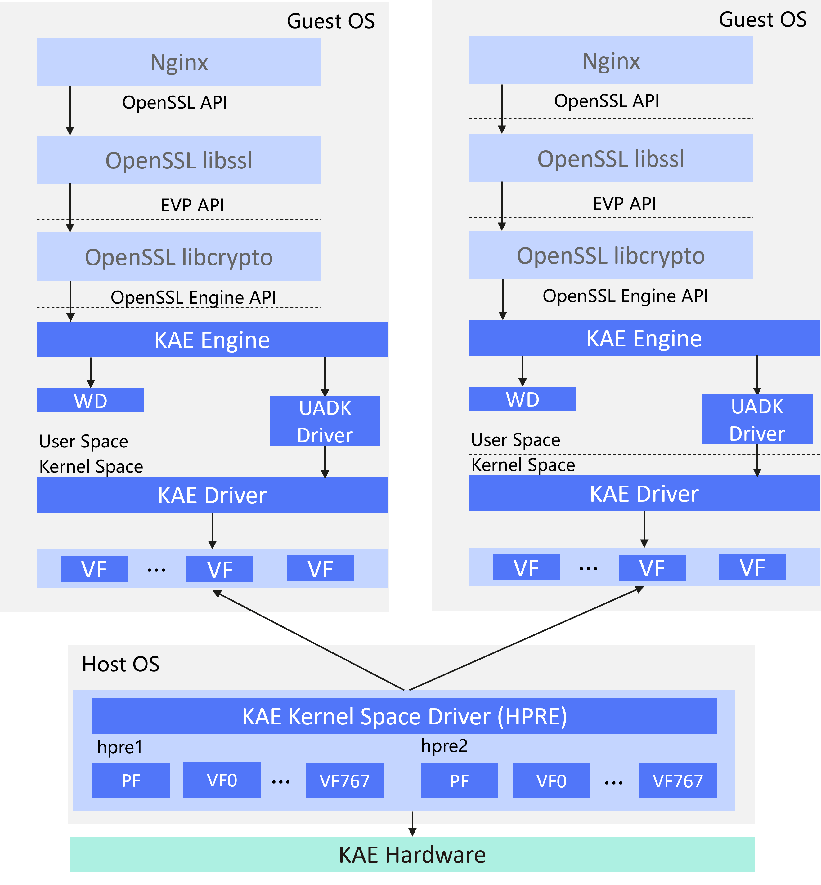

**表 1** vKAE特性各模块功能<a id="vKAE特性各模块功能"></a>

|名称|功能|
|--|--|
|Host OS|物理机的操作系统。|
|Guest OS|虚拟机的操作系统。|
|KAE Hardware|集成在鲲鹏920处理器中，加速器的硬件实现，不直接开放给客户。|
|KAE Kernel Space Driver (HPRE)|KAE加速卡内核态的驱动程序，加解密场景下使用HPRE（High Performance RSA Engine），直接和KAE硬件加速卡打交道。对于鲲鹏920服务器，每个HPRE设备提供了1024个队列。|
|PF（Physical Function）|用于支持SR-IOV（Single Root I/O Virtualization）的PCI（Peripheral Component Interconnect）功能，拥有完全配置或控制PCIe（Peripheral Component Interconnect express）设备资源的能力。在1个HPRE设备中，单个PF默认使用256个队列。|
|VF（Virtual Function）|是一种轻量级的PCIe功能，与PF相关联，可以与PF以及同一PF关联的其他VF共享一个或多个物理资源。在1个HPRE设备中，有768个队列留给VF使用。VF队列数量=（1024-PF队列数量）/VF个数，余数队列会加到最后一个VF上。推荐1个PF虚拟化出8个VF数目。|
|WD（Warpdriver）|加速驱动，用户态驱动统一接口。|
|UADK Driver|用户态加速器框架（User-space Accelerator Development Kit），是一个基于UACCE（Unified/User-space-access-intended Accelerator Framework）内核模块和Linux SVA（Shared Virtual Addressing）技术的通用的加速器用户态解决方案，该方案提供一套用户态库，需要使用硬件加速的用户调用相关API完成所需要的功能。|
|KAE Engine|作为应用程序和硬件之间的中间层，负责“加解密操作的输入输出数据”，在用户应用程序与KAE硬件设备之间进行传递，主要操作就是IO读写。|
|OpenSSL Engine API|OpenSSL为第三方提供了Engine加载框架，方便用户使用自己的硬件设备完成密码学算法。|
|EVP API|EVP是由libcrypto实现的一系列API，使应用程序能够执行密码操作。EVP API的实现使用Core和Provider组件。|
|OpenSSL API|是开源的程序套件，由三部分组成：OpenSSL libcrypto、OpenSSL libssl和OpenSSL命令行工具。|
|OpenSSL libcrypto|OpenSSL加解密算法库，具有通用功能的加解密库，里面包含众多加解密算法。|
|OpenSSL libssl|OpenSSL中支持TLS（SSL和TLS协议）的库，并依赖于libcrypto。|
|Nginx|Nginx应用程序。|

### 规格<a name="ZH-CN_TOPIC_0000002005252858"></a>

vKAE目前针对使用鲲鹏920处理器的服务器上分配的虚拟机进行硬件加速，支持多种虚拟机规格，例如4C8G/8C16G/16C32G/32C64G等，也支持在容器场景下使用。

> **说明：** 
>虚拟机规格中，“4C8G”表示为虚拟机分配4个CPU和8GB内存，其他规格以此类推。

- vKAE通过在虚拟机中直通VF来实现对RSA算法的硬件加速。使用**openssl speed**命令进行测试评估，结果显示，启用vKAE后，相较于未使用该加速技术的环境，实现了约3倍的大幅提升。这一性能增益与在物理服务器上直接应用KAE硬件加速后所获得的性能提升效果相同，在虚拟机中使用vKAE相比在物理机使用KAE无性能损耗。
- 在OpenSSL的应用环境中，当在配置了vKAE的虚拟机上使用**openssl speed**命令进行性能测试时，可以观察到性能趋势与CPU核数直接关联。在同步或异步操作模式下，RSA-sign的性能上限紧密依赖于分配给虚拟机的CPU核数。

    在配置64个CPU核的虚拟机中，RSA-sign的最大吞吐量达到了约54,000次 sign/s；当CPU核数翻倍至128个时，RSA-sign的性能也相应翻倍，达到了约108,000次sign/s。这证实了性能提升与CPU资源扩展之间的关联关系。

- vKAE支持Nginx的异步模式，自Nginx 1.21.5版本起，主要针对HTTPS握手过程中的RSA算法进行硬件加速，显著提升了处理性能。
- 在Nginx场景中，通过HTTPress测试工具进行测试，在8C16G规格的虚拟机中，启用vKAE进行加速后，观察到在CPU性能尚未达到瓶颈时，vKAE支持的异步模式相较于同步模式展现出了更优的性能优势：异步模式下的RPS（Request Per Second）相比同步模式提升了40%，同时平均响应时间也下降了30%。

### 可获得性<a name="ZH-CN_TOPIC_0000002005252894"></a>

配置vKAE之前，需要使用KAE2.0版本和在物理机安装KAE的License。

- License：在配置vKAE特性之前，必须在物理机安装相应的License。License的成功安装是操作系统能够识别和利用加速器设备的前提条件。申请License的详细操作步骤请参见《加速器用户指南（鲲鹏加速引擎）》的[获取License](https://www.hikunpeng.com/document/detail/zh/kunpengaccel/kae/kae/docs/zh/installation_guide.md#%E8%8E%B7%E5%8F%96license)。TaiShan K系列服务器内置的硬件加速引擎已默认开启，无需用户额外申请或安装License。
- 版本：使用KAE2.0版本，该版本包含了多个关键组件，包括KAEKernelDriver内核驱动、UADK框架、KAE OpenSSLEngine引擎以及KAEZlib。

### 约束与限制<a name="ZH-CN_TOPIC_0000002041371045"></a>

配置vKAE之前，需要了解vKAE的约束与限制，包括对系统的影响、应用的限制以及与其他特性的交互情况。

- 对系统的影响

    如果未获得KAE驱动的License，建议系统不要通过KAE加速引擎调用相应算法，否则可能会影响OpenSSL加解密算法的性能。

- 应用限制

    由于vKAE主要针对RSA加解密算法进行加速，因此在Nginx的网络性能优化场景中，vKAE仅限于对使用SSL/TLS加密的HTTPS连接进行加速，而不适用于不使用SSL/TLS加密的HTTP连接。

    KAE2.0支持openEuler 22.03 LTS SP3，KAE1.0不支持openEuler 22.03。

- 与其他特性的交互

    使用vKAE特性之前，需要使用KAE2.0版本并在物理机安装KAE驱动的License。在物理机部署并使用HPRE加速设备并通过该设备创建并配置相应的VF，并将这些VF直通到目标虚拟机后，虚拟机才能使用vKAE来执行RSA加解密算法的硬件加速。

### 应用场景<a name="ZH-CN_TOPIC_0000002041411949"></a>

vKAE可以应用于虚拟化和云原生场景。

通过应用vKAE，OpenSSL和Nginx在虚拟机中的网络转发效率可以得到显著提升。

## 环境要求<a name="ZH-CN_TOPIC_0000002041411889"></a>

本文基于openEuler操作系统提供指导，在正式操作前请确保软硬件均满足要求。

**测试组网<a name="section114317592325"></a>**

使用25Ge或10Ge的光模块，服务端和客户端直连或通过交换机连接。

**图 1** 测试组网<a name="fig178513213315"></a><a id="测试组网"></a><br>
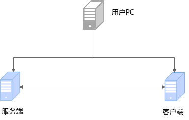

**硬件要求<a name="section967416146301"></a>**

硬件要求如[**表 1** 硬件要求](#硬件要求)所示。

**表 1** 硬件要求<a id="硬件要求"></a>

|项目|说明|
|--|--|
|CPU|鲲鹏920处理器、鲲鹏950处理器|

**操作系统和软件要求<a name="section21485361307"></a>**

操作系统和软件要求如[**表 2** 操作系统和软件要求](#操作系统和软件要求)所示。

**表 2** 操作系统和软件要求<a id="操作系统和软件要求"></a>

|项目|版本|获取方式|
|--|--|--|
|OS|openEuler 22.03 LTS SP3、openEuler 24.03 LTS SP3|openEuler 22.03 LTS SP3 ISO镜像：[获取链接](https://repo.openeuler.org/openEuler-22.03-LTS-SP3/ISO/aarch64/)<br>openEuler 24.03 LTS SP3 ISO镜像：[获取链接](https://repo.openeuler.org/openEuler-24.03-LTS-SP3/ISO/aarch64/)|
|QEMU|6.2.0、8.2.0|通过配置Yum源的方式安装|
|libvirt|6.2.0、9.10.0|通过配置Yum源的方式安装|
|Nginx|1.21.5|通过配置Yum源的方式安装|
|OpenSSL|1.1.1|通过配置Yum源的方式安装|
|HTTPress|1.1.0|通过配置Yum源的方式安装|
|KAE|2.0|下载命令：`git clone https://gitcode.com/boostkit/KAE.git -b kae2`|

## 配置部署环境<a name="ZH-CN_TOPIC_0000002005252886"></a>

### 配置BIOS<a name="ZH-CN_TOPIC_0000002085153957"></a>

必须开启SMMU，虚拟机才可以进行KAE设备VF直通、网卡直通等操作。

开启SMMU的配置操作步骤如下：

1. 重启服务器，进入BIOS设置界面。

    具体操作请参见《[TaiShan 服务器 BIOS 参数参考（鲲鹏920处理器）](https://support.huawei.com/enterprise/zh/doc/EDOC1100088653/a77cbc34)》中“进入BIOS界面”的相关内容。

2. 开启SMMU。

    > **须知：** 
    >此优化项只在虚拟化场景使用，非虚拟化场景需关闭。

    在BIOS中，依次选择“Advanced \> MISC Config \> Support Smmu”，设置为“Enabled”。

    再将“Smmu Work Around”设置为“Enabled”。

    

3. 按**F10**保存BIOS设置，并重启服务器。

### 配置服务端<a name="ZH-CN_TOPIC_0000002015928364" id="配置服务端"></a>

在服务端的配置操作，包括针对文件描述符限制、SELinux状态、audit服务、网卡SR-IOV直通到虚拟机以及网卡中断绑核的配置。

1. 在服务器中配置扩展文件描述符。
    1. 打开文件。

        ```shell
        vi /etc/security/limits.conf
        ```

    2. 按“i”进入编辑模式，在文件中新增如下内容，为所有用户（\*）设置软限制（soft）和硬限制（hard），文件描述符数量均为**102400**。

        ```shell
        * soft      nofile      102400
        * hard      nofile      102400
        ```

        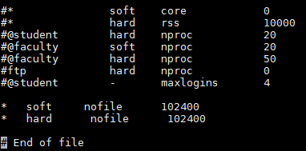

    3. 按“Esc”键，输入 **:wq!**，按“Enter”保存并退出编辑。
    4. 退出SSH终端。

        ```shell
        logout
        ```

        重新登录SSH终端后，使修改主机名生效。

2. SELinux可能会限制应用的访问权限，因此需要关闭SELinux，以确保应用能够正常工作。关闭SELinux可能会降低系统的安全性，使系统更容易受到潜在的安全问题和攻击。在关闭之前，您应该仔细评估潜在的风险。
    - 临时关闭SELinux。

        > **须知：** 
        >临时关闭SELinux方式，重启服务器后失效。

        ```shell
        setenforce 0
        ```

    - 永久关闭SELinux。

        > **须知：** 
        >永久关闭SELinux方式，需要重启服务器才能生效。

        1. 执行如下命令修改配置文件，关闭SELinux。

            ```xml
            sed -i 's/SELINUX=enforcing/SELINUX=disabled/g' /etc/selinux/config
            cat /etc/selinux/config
            ```

            如下图所示，显示“**SELINUX=disabled**”即表示修改成功。

            

        2. 关闭SELinux后，重启服务器，在虚拟机中也需要关闭SELinux，修改完成后需要重启虚拟机。

3. 关闭audit服务。
    1. 打开文件。

        ```shell
        vim /boot/efi/EFI/openEuler/grub.cfg
        ```

    2. 按“i”进入编辑模式，在对应操作系统版本的内核启动命令行中新增“audit=0”，修改后如下图所示。

        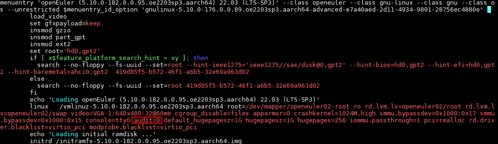

    3. 按“Esc”键，输入 **:wq!**，按“Enter”保存并退出编辑。
    4. 重启服务器，使配置生效。

4. 将网卡通过VF直通的方式直通虚拟机。

    在服务器中，将网卡通过VF直通的方式直通虚拟机，使虚拟机可以和外部网络进行通信，测试HTTPress时，客户端可以在别的服务器中执行命令，连接到本服务器的Nginx服务中。

    1. 给网卡创建3个VF。请根据实际需要创建VF个数。

        ```shell
        echo 3 > /sys/class/net/enp7s0/device/sriov_numvfs
        ```

    2. 获取网卡的bus-info。

        ```shell
        ethtool -i enp7s0
        ```

        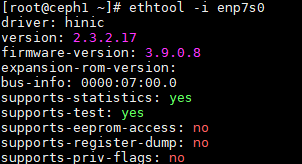

    3. 查询网卡node的NUMA亲和性。

        ```shell
        cat /sys/class/net/enp7s0/device/numa_node
        ```

        可以看到，该物理网卡亲和NUMA node0。

        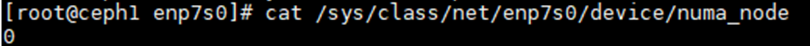

        > **说明：** 
        >查询网卡node的NUMA亲和性，还可以通过以下命令：
>
        >```shell
        >lspci -vvv -s 07:00.0 | grep NUMA
        >```
>
        >可以看到，该物理网卡亲和NUMA node0。
        >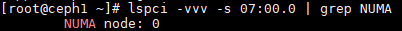

        查看NUMA node0所在的CPU核编号。

        ```shell
        ls cpu
        ```

        可以看到，NUMA node0对应的CPU核在编号**0-31**。

        

    1. 物理网卡创建了3个VF之后，查看物理网卡和虚拟网卡的bus信息。

        ```shell
        cd /sys/class/net/enp7s0
        cd /device
        ls
        ```

        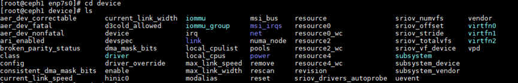

        查看virtfn2的NUMA亲和性。

        ```shell
        cd virtfn2
        cat numa_node
        ```

        可以看到网卡VF的NUMA亲和性和创建VF的物理网卡节点一致，都亲和NUMA node0。

        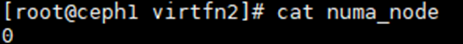

    2. 查看网卡VF的PCI编号。
        - 方式一：

            ```shell
            cd virtfn0
            realpath .
            ```

            

            ```shell
            cd virtfn1
            realpath .
            ```

            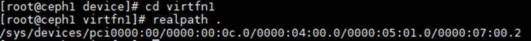

            ```shell
            cd virtfn2
            realpath .
            ```

            

        - 方式二：

            ```shell
            ethtool -i enp7s0v0
            ```

            

            ```shell
            ethtool -i enp7s0v1
            ```

            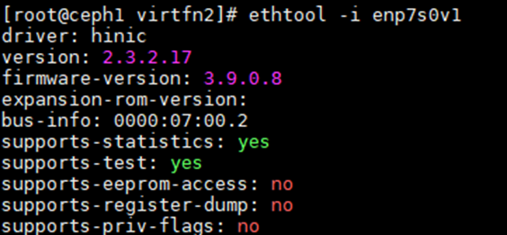

            ```shell
            ethtool -i enp7s0v2
            ```

            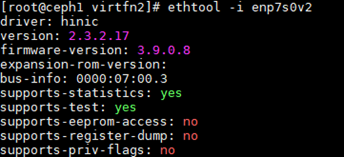

            可以发现其PCI编号是按照规律进行递增的。

    3. 通过**ip a**可以查看创建出来的3个网卡VF，命名为enp7s0v0，enp7s0v1和enp7s0v2。

        ```shell
        ip a
        ```

        

    4. 关闭虚拟机。

        ```shell
        virsh shutdown <虚拟机名称>
        ```

    5. 修改虚拟机的配置文件，将以下内容复制到虚拟机的配置文件的<devices\>标签中，将虚拟网卡VF直通到虚拟机。

        ```xml
        <hostdev mode='subsystem' type='pci' managed='yes'>
        <source>
        <address domain='0x0000' bus='0x07' slot='0x00' function='0x1'/>
        </source>
        <address type='pci' domain='0x0000' bus='0x06' slot='0x00' function='0x0'/>
        </hostdev>
        ```

    6. 启动虚拟机，查看配置是否生效。

        ```shell
        virsh start <虚拟机名称>
        ```

        启动虚拟机完成后，通过**ip a**命令查看网卡。

        ```shell
        ip a
        ```

        如果被直通的虚拟网卡节点没有在回显中显示，说明该虚拟网卡VF直通虚拟机成功。

5. 网卡中断绑核。

    需要将网卡中断绑核到网卡所亲和的node上。在本例中，虚拟网卡enp7s0v0的VF亲和NUMA node0。

    1. 在服务器“/home”目录下创建一个名为irq\_server.sh的绑核脚本文件。

        ```shell
        vim irq_server.sh
        ```

    2. 将以下内容拷贝到绑核脚本文件中。

        ```shell
        #!/bin/bash
        # chkconfig: - 50 50
        # description: auto irq
        #获取网卡所在CPU
        function get_default_cpu(){
            eth_numa_node=`cat /sys/class/net/${eth}/device/numa_node`
            numa_nodes=`lscpu | grep node\(s | awk '{print $NF}'`
            cpus=`lscpu | grep CPU\(s | head -1 | awk '{print $NF}'`
            sockets=`lscpu | grep Socket\(s | awk '{print $NF}'`
            cpus_per_socket=`lscpu | grep Core\(s | awk '{print $NF}'`
            numa_per_socket=$((${numa_nodes} / ${sockets}))
            eth_socket=$((${eth_numa_node} / ${numa_per_socket}))
            first_cpu=$[$[$[${cpus_per_socket}*${eth_socket}]]]
            last_cpu=$[$[${cpus_per_socket}*$[${eth_socket}+1]]-1]
            cpurange="${first_cpu}-${last_cpu}"
        }
        #根据参数获取CPU队列
        function get_cpu_list(){
            IFS_bak=$IFS
            IFS=','
            cpurange=($1)
            IFS=${IFS_bak}
            cpulist_arr=()
            n=0
            for i in ${cpurange[@]};do
                start=`echo $i | awk -F'-' '{print $1}'`
                stop=`echo $i | awk -F'-' '{print $NF}'`
                for x in `seq $start $stop`;do
                    cpulist_arr[$n]=$x
                    let n++
                done
            done
        }
        #中断绑核
        function bind(){
            ethtool -L ${eth} combined ${cnt}
            irq=`cat /proc/interrupts| grep ${eth} | awk -F ':' '{print $1}'`
            i=0
            for irq_i in $irq
            do
                if [ $i -ge ${#cpulist_arr[*]} ]; then
                    i=0
                fi
                echo ${cpulist_arr[${i}]} "->" $irq_i
                echo ${cpulist_arr[${i}]}  > /proc/irq/$irq_i/smp_affinity_list
                let i++
            done
        }
        #读取网卡绑定的CPU信息
        function check(){
            ethtool -l $eth
            irq=`cat /proc/interrupts | grep ${eth} | awk -F ':' '{print $1}'`
            for irq_i in $irq
            do
                cat /proc/irq/$irq_i/smp_affinity_list
            done
        }
        [[ $2 ]] && eth=$2 || eth=`ifconfig | grep -B 1 "192.168" | head -1 | awk -F":" '{print $1}'`
        echo "$eth"
        [[ $3 ]] && cnt=$3 || cnt=48
        [[ $4 ]] && cpurange=$4 || get_default_cpu
        get_cpu_list $cpurange
        [[ $1 ]] && $1 || bind
        ```

        > **说明：** 
        >使用举例
        >1. 运行下述命令，默认将网段为192.168的网卡的队列深度设置为48，即将网卡绑定到CPU的前48个核上。
>
        > ```shell
        > sh irq.sh
        >    ```
>
        >2. 读取网卡绑核信息。
>
        > ```shell
        > sh irq.sh check eth1
        >    ```
>
        > **eth1**为网卡名称，请根据实际情况修改。<br>
        >3.  将**eth1**队列深度修改为**24**，并循环绑定到**'0 1 2 3'** 四个核上。支持连续绑核，例如连续绑核至 **'1-3,6,7-9'**。
>
        > ```shell
        > sh irq.sh bind eth1 24 '0 1 2 3'
        >    ```

    3. 执行网卡中断绑核命令。

        ```shell
        sh irq_server.sh bind enp7s0v0 4 '32-35'
        ```

    4. 确认网卡中断绑核成功。

        ```shell
        sh irq_server.sh check enp7s0v0
        ```

### 配置客户端<a name="ZH-CN_TOPIC_0000002052047053" id="配置客户端"></a>

客户端如果是虚拟机，在客户端的配置操作包括针对文件描述符限制、SELinux状态、audit服务、网卡SR-IOV直通到虚拟机以及网卡中断绑核的配置；客户端如果是物理机，只需要进行网卡中断绑核。

上述操作的详细步骤请参见[配置服务端](#配置服务端)，其中，网卡的名称根据实际情况调整即可。

## 部署<a name="ZH-CN_TOPIC_0000002041371057"></a>

### 在物理机安装KAE<a name="ZH-CN_TOPIC_0000002041411957"></a>

在物理机上安装KAE，包括申请并安装KAE的License、安装依赖包、获取KAE源码包、通过源码安装KAE，以及验证KAE安装是否成功。

1. 申请并安装KAE的License。详细操作步骤请参见《加速器用户指南（鲲鹏加速引擎）》的[获取License](https://www.hikunpeng.com/document/detail/zh/kunpengaccel/kae/kae/docs/zh/installation_guide.md#%E8%8E%B7%E5%8F%96license)。
2. 安装依赖。

    ```shell
    yum -y install kernel-devel-$(uname -r) openssl-devel numactl-devel gcc make autoconf automake libtool patch
    ```

3. 获取KAE2.0源码包。

    ```shell
    git clone https://gitee.com/kunpengcompute/KAE.git -b kae2
    ```

    

4. 通过源码安装KAE。

    > **须知：** 
    >**sh build.sh all**安装命令可以一键式安装KAE，使用该安装命令前建议先执行**sh build.sh cleanup**进行清理操作。

    1. 进入KAE源码目录，执行安装前，先进行清理操作。

        ```shell
        cd KAE
        sh build.sh cleanup
        ```

        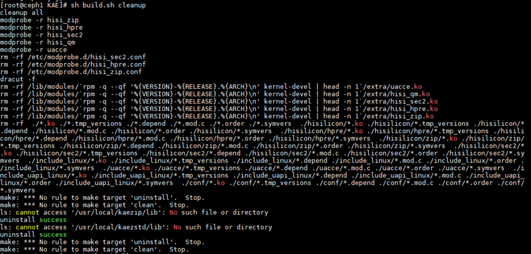

    2. 一键式安装KAE。

        ```shell
        sh build.sh all
        ```

        

5. 验证KAE是否安装成功。
    1. 检查“/sys/bus/pci/drivers”目录下是否有相关的PCI驱动。

        ```shell
        ls /sys/bus/pci/drivers
        ```

        如果有类似hisi\_hpre、hisi\_sec2、hisi\_zip的文件（hisi\_rde当前还未实现），则表示相关驱动已成功安装。

        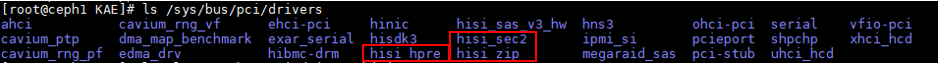

    2. 检查KAE驱动内是否有虚拟化设备。这里以查看hisi\_sec2是否有虚拟化设备为例。

        ```shell
        ls -lt /sys/bus/pci/drivers/hisi_sec2
        ```

        如果有对应的设备文件列出，则表示hisi\_sec2驱动已经成功关联到了PCI设备。

        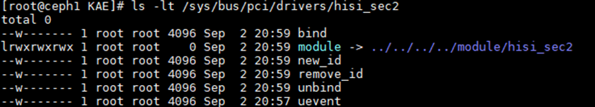

    3. 查看kae.so，判断KAE是否安装成功。

        ```shell
        ll /usr/local/lib/engines-1.1
        ```

        预期结果：

        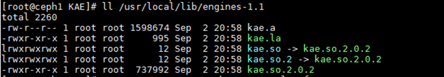

        至此，则说明KAE已安装成功。

        查看操作系统中的设备和模块。

        ```shell
        ls -al /sys/class/uacce
        lsmod | grep uacce
        modprobe uacce
        modprobe hisi_zip
        modprobe hisi_sec2
        modprobe hisi_hpre
        modprobe hisi_rde（hisi_rde当前还未实现）
        ls -lt /sys/bus/pci/drivers/hisi_sec2
        lspci |grep HPRE
        lspci |grep RDE
        ```

        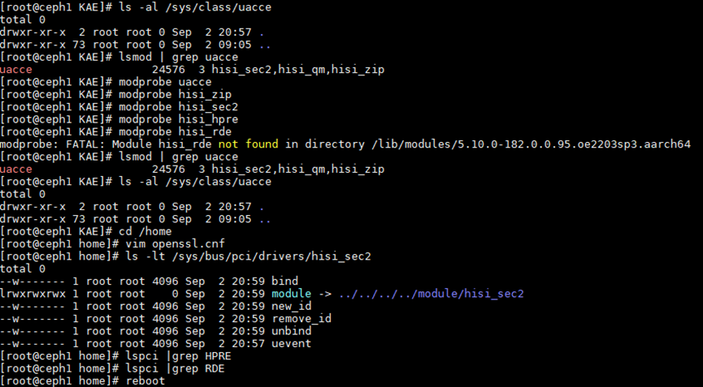

        如果查找不到hisi\_zip、hisi\_sec2、hisi\_hpre等KAE设备，可以重启服务器后再次检查KAE是否安装成功。

        ```shell
        reboot
        ```

        再次查看KAE设备。

        ```shell
        ls -al /sys/class/uacce
        ```

        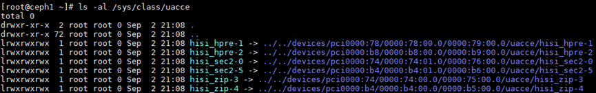

6. 验证KAE特性的加速能力。
    1. 通过修改OpenSSL配置文件来使用KAE。

        在配置文件openssl.cnf添加以下内容后，将openssl.cnf放在“/home”目录下。

        ```xml
        openssl_conf=openssl_def
        [openssl_def]
        engines=engine_section
        [engine_section]
        kae=kae_section
        [kae_section]
        engine_id=kae
        dynamic_path=/usr/local/lib/engines-1.1/kae.so
        KAE_CMD_ENABLE_ASYNC=1
        KAE_CMD_ENABLE_SM3=1
        KAE_CMD_ENABLE_SM4=1
        default_algorithms=ALL
        init=1
        ```

    2. 通过执行**openssl speed**命令来比较开启和未开启KAE时RSA加密解密的性能差异。

        - 使能KAE前的性能值。

            ```shell
            openssl speed -elapsed rsa2048
            ```

            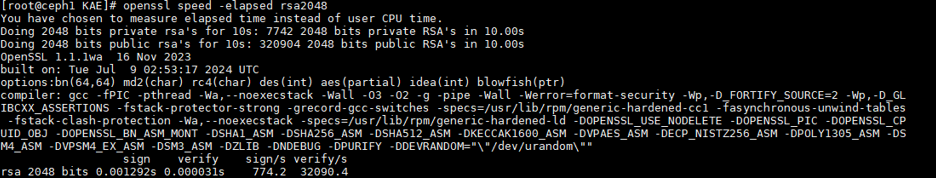

        - 使能KAE后的性能值。

            ```shell
            export OPENSSL_CONF=/home/openssl.cnf
            openssl speed -engine kae -elapsed rsa2048
            ```

            

        可以看到，使能KAE前后的性能值分别是774.2、3184.8，性能约提升了300%。

### 在虚拟机部署vKAE<a name="ZH-CN_TOPIC_0000002041371073"></a>

以使用8C16G的虚拟机规格为例描述在虚拟机中部署vKAE的详细操作步骤，包括在虚拟机上准备KAE环境、在虚拟机中安装KAE、配置VF直通到虚拟机，以及验证vKAE是否成功安装并启用。

1. 在虚拟机上准备KAE环境。
    1. 安装依赖。

        ```shell
        yum -y install kernel-devel-$(uname -r) openssl-devel numactl-devel gcc make autoconf automake libtool patch
        ```

        在虚拟机中安装依赖时，需要安装patch，否则安装KAE过程中会报错，如下图所示。

        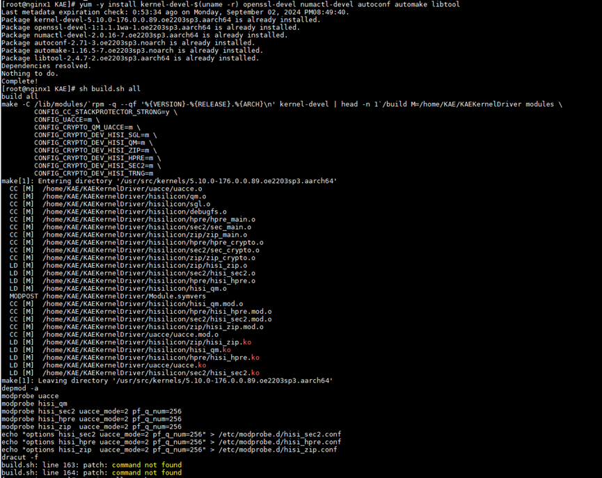

    2. 获取KAE2.0源码包。

        ```shell
        git clone https://gitee.com/kunpengcompute/KAE.git -b kae2
        ```

        

    3. 通过源码安装KAE。

        > **须知：** 
        >**sh build.sh all**安装命令可以一键式安装KAE，使用该安装命令前建议先执行**sh build.sh cleanup**进行清理操作。

        1. 进入KAE源码目录，执行安装前，先进行清理操作。

            ```shell
            cd KAE
            sh build.sh cleanup
            ```

            

        2. 一键式安装KAE。

            ```shell
            sh build.sh all
            ```

            

            预期结果如下，表示安装KAE成功。

            

2. 使用vKAE前，需要在服务器KAE设备上创建VF，然后将VF直通到虚拟机中，才可以让虚拟机使能vKAE进行加速。需要使用HPRE加速器使能加解密加速。

    查看已安装的KAE包含的加速器名称。后续需要通过加速器的名称来查找加速器设备对应的PCI编号，从而根据PCI编号来创建VF。

    ```shell
    ls /sys/class/uacce
    ```

    

    > **说明：** 
    >本步骤中的回显仅为举例。不同服务器包含的加速器数量也不尽相同。例如：
    >

3. 查看hisi\_hpre-1加速器设备的实际路径和PCI编号。

    ```shell
    cd /sys/class/uacce/hisi_hpre-1/device
    realpath .
    ```

    

4. 以hisi\_hpre-1为例，使用hisi\_hpre-1加速器创建3个KAE设备VF直通虚拟机。

    ```shell
    echo 3 > /sys/devices/pci0000:78/0000:78:00.0/0000:79:00.0/sriov_numvfs
    ```

    查看KAE设备VF是否创建成功。

    ```shell
    ls -al /sys/class/uacce
    ```

    可以看到除了物理加速设备外，还多出来3个虚拟加速设备。

    > **说明：** 
    >一台服务器中可能包含多个HPRE加速器，每个HPRE加速器提供了1024个队列，单个PF默认使用256个队列，其余768个队列则预留给VF使用。VF队列数量 = \(1024-PF队列数量\) / VF个数，余数队列会加到最后一个VF上。推荐一个PF虚拟化出8个VF数目。
    >通过以下命令可以查看已创建的VF所在的文件夹。
    >
    >```shell
    >cd /sys/class/uacce/hisi_hpre-1/device
    >ls
    >```
    >
    >

5. 创建3个KAE设备VF之后，可以看到hisi\_hpre-1加速器列表中存在三个虚拟机加速设备：virtfn0、virtfn1和virtfn2。

    可以分别查看virtfn0、virtfn1和virtfn2的PCI编号以便将VF直通到虚拟机。

    ```shell
    cd virtfn0
    realpath .
    ```

    

    ```shell
    cd virtfn1
    realpath .
    ```

    

    ```shell
    cd virtfn2
    realpath .
    ```

    

6. 修改虚拟机的配置文件，配置KAE设备VF直通虚拟机。
    - 给虚拟机配置1个KAE设备VF。
        1. 打开虚拟机配置文件，例如“vm01.xml”。

            ```shell
            vim vm01.xml
            ```

        2. 按“i”键进入编辑模式，将以下内容复制到虚拟机配置文件的 **<devices\>** 标签中。

            ```xml
            <hostdev mode='subsystem' type='pci' managed='yes'><source><address domain='0x0000' bus='0x79' slot='0x00' function='0x1'/></source><address type='pci' domain='0x0000' bus='0x07' slot='0x00' function='0x0'/>
            </hostdev>
            ```

            > **说明：** 
            >- 相当于把VF地址**0000:79:00.1**进行拆分，domain域使用**0000**部分，bus域使用**79**部分，slot域使用**00**部分，function使用末位的**1**。
            >- 如果当前虚拟机已存在该address，为避免address冲突导致虚拟机启动失败，需要删除`</source>`之后的address一行。重启虚拟机后，系统会自动生成新的address。

        3. 按“Esc”键，输入 **:wq!**，按“Enter”保存并退出编辑。
        4. 重启虚拟机，使KAE设备VF直通虚拟机生效。

            ```shell
            reboot
            ```

            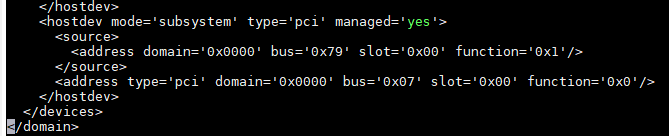

            上述的配置完成后，KAE设备VF直通虚拟机成功。

    - 给虚拟机配置多个KAE设备VF。
        1. 打开虚拟机配置文件，例如“vm01.xml”。

            ```shell
            vim vm01.xml
            ```

        2. 按“i”键进入编辑模式，将以下内容复制到虚拟机配置文件的 **<devices\>** 标签中。

            ```xml
            <hostdev mode='subsystem' type='pci' managed='yes'><source><address domain='0x0000' bus='0x79' slot='0x00' function='0x1'/></source><address type='pci' domain='0x0000' bus='0x07' slot='0x00' function='0x0'/>
            </hostdev>
            <hostdev mode='subsystem' type='pci' managed='yes'><source><address domain='0x0000' bus='0x79' slot='0x00' function='0x2'/></source><address type='pci' domain='0x0000' bus='0x07' slot='0x00' function='0x1'/>
            </hostdev>
            ```

        3. 重启虚拟机，使KAE设备VF直通虚拟机生效。

            ```shell
            reboot
            ```

    - 以下提供虚拟机配置文件的一个完整示例，用户可以参考。

        以8C16G规格的虚拟机配置文件为例，虚拟机名为nginx1，对虚拟机进行了顺序绑核和内存绑核。修改完配置文件后重启虚拟机，使VF直通虚拟机生效。

        1. 打开虚拟机配置文件，例如“vm01.xml”。

            ```shell
            vim vm01.xml
            ```

        2. 按“i”键进入编辑模式，将以下内容复制到虚拟机配置文件中。

            ```xml
            <domain type='kvm'>
              <name>vm01</name> 
              <uuid>a1d11347-8738-45fb-8944-e3a058f464c9</uuid>
              <memory unit='KiB'>16777216</memory> 
              <currentMemory unit='KiB'>16777216</currentMemory>
              <memoryBacking>
                <hugepages/> 
              </memoryBacking>
              <vcpu placement='static'>8</vcpu>
              <cputune>
                <vcpupin vcpu='0' cpuset='4'/>
                <vcpupin vcpu='1' cpuset='5'/>
                <vcpupin vcpu='2' cpuset='6'/>
                <vcpupin vcpu='3' cpuset='7'/>
                <vcpupin vcpu='4' cpuset='8'/>
                <vcpupin vcpu='5' cpuset='9'/>
                <vcpupin vcpu='6' cpuset='10'/>
                <vcpupin vcpu='7' cpuset='11'/>
                <emulatorpin cpuset='4-11'/>
              </cputune>
              <numatune>
                <memnode cellid='0' mode='strict' nodeset='0'/>
              </numatune>
              <os>
                <type arch='aarch64' machine='virt-6.2'>hvm</type>
                <loader readonly='yes' type='pflash'>/usr/share/edk2/aarch64/QEMU_EFI-pflash.raw</loader>
                <nvram>/var/lib/libvirt/qemu/nvram/nginx1_VARS.fd</nvram>
                <boot dev='hd'/>
              </os>
              <features>
                <acpi/>
                <gic version='3'/>
              </features>
              <cpu mode='host-passthrough' check='none'>
                <topology sockets='1' dies='1' clusters='1' cores='8' threads='1'/>
                <numa>
                  <cell id='0' cpus='0-7' memory='16777216' unit='KiB'/>
                </numa>
              </cpu>
              <clock offset='utc'/>
              <on_poweroff>destroy</on_poweroff>
              <on_reboot>restart</on_reboot>
              <on_crash>destroy</on_crash>
              <devices>
                <emulator>/usr/libexec/qemu-kvm</emulator>
                <disk type='file' device='disk'>
                  <driver name='qemu' type='qcow2'/>
                  <source file='/home/images/nginx1.img'/>
                  <target dev='vda' bus='virtio'/>
                  <address type='pci' domain='0x0000' bus='0x05' slot='0x00' function='0x0'/>
                </disk>
                <disk type='file' device='cdrom'>
                  <driver name='qemu' type='raw'/>
                  <target dev='sda' bus='scsi'/>
                  <readonly/>
                  <address type='drive' controller='0' bus='0' target='0' unit='0'/>
                </disk>
                <controller type='usb' index='0' model='qemu-xhci' ports='15'>
                  <address type='pci' domain='0x0000' bus='0x02' slot='0x00' function='0x0'/>
                </controller>
                <controller type='scsi' index='0' model='virtio-scsi'>
                  <address type='pci' domain='0x0000' bus='0x03' slot='0x00' function='0x0'/>
                </controller>
                <controller type='pci' index='0' model='pcie-root'/>
                <controller type='pci' index='1' model='pcie-root-port'>
                  <model name='pcie-root-port'/>
                  <target chassis='1' port='0x8'/>
                  <address type='pci' domain='0x0000' bus='0x00' slot='0x01' function='0x0' multifunction='on'/>
                </controller>
                <controller type='pci' index='2' model='pcie-root-port'>
                  <model name='pcie-root-port'/>
                  <target chassis='2' port='0x9'/>
                  <address type='pci' domain='0x0000' bus='0x00' slot='0x01' function='0x1'/>
                </controller>
                <controller type='pci' index='3' model='pcie-root-port'>
                  <model name='pcie-root-port'/>
                  <target chassis='3' port='0xa'/>
                  <address type='pci' domain='0x0000' bus='0x00' slot='0x01' function='0x2'/>
                </controller>
                <controller type='pci' index='4' model='pcie-root-port'>
                  <model name='pcie-root-port'/>
                  <target chassis='4' port='0xb'/>
                  <address type='pci' domain='0x0000' bus='0x00' slot='0x01' function='0x3'/>
                </controller>
            <controller type='pci' index='5' model='pcie-root-port'>
                  <model name='pcie-root-port'/>
                  <target chassis='5' port='0xc'/>
                  <address type='pci' domain='0x0000' bus='0x00' slot='0x01' function='0x4'/>
                </controller>
                <controller type='pci' index='6' model='pcie-root-port'>
                  <model name='pcie-root-port'/>
                  <target chassis='6' port='0xd'/>
                  <address type='pci' domain='0x0000' bus='0x00' slot='0x01' function='0x5'/>
                </controller>
                <controller type='virtio-serial' index='0'>
                  <address type='pci' domain='0x0000' bus='0x04' slot='0x00' function='0x0'/>
                </controller>
                <interface type='network'>
                  <mac address='52:54:00:b4:09:bc'/>
                  <source network='default'/>
                  <model type='virtio'/>
                  <address type='pci' domain='0x0000' bus='0x01' slot='0x00' function='0x0'/>
                </interface>
                <serial type='pty'>
                  <target type='system-serial' port='0'>
                    <model name='pl011'/>
                  </target>
                </serial>
                <console type='pty'>
                  <target type='serial' port='0'/>
                </console>
                <channel type='unix'>
                  <target type='virtio' name='org.qemu.guest_agent.0'/>
                  <address type='virtio-serial' controller='0' bus='0' port='1'/>
                </channel>
                <hostdev mode='subsystem' type='pci' managed='yes'>
                  <source>
                    <address domain='0x0000' bus='0x07' slot='0x00' function='0x1'/>
                  </source>
                  <address type='pci' domain='0x0000' bus='0x06' slot='0x00' function='0x0'/>
                </hostdev>
                <hostdev mode='subsystem' type='pci' managed='yes'>
                  <source>
                    <address domain='0x0000' bus='0x79' slot='0x00' function='0x1'/> <!-- 该参数请根据实际情况进行修改 -->
                  </source>
                <address type='pci' domain='0x0000' bus='0x07' slot='0x00' function='0x0'/>
               </hostdev>
              </devices>
            </domain>
            ```

        3. 重启虚拟机，使VF直通虚拟机生效。

            ```shell
            reboot
            ```

        4. 再次查看VF设备。

            ```shell
            ls -al /sys/class/uacce
            ```

            如果被虚拟机直通的VF设备没有在回显中显示，说明该VF直通虚拟机成功。

7. 验证KAE的安装与配置是否完成。
    1. 在虚拟机内查看KAE设备是否安装成功。

        ```shell
        lspci
        ll /usr/local/lib/engines-1.1
        ```

        回显中显示HPRE Engine和kae.so文件，表示KAE设备安装成功。

        

        

    2. 查看VF是否成功挂载到虚拟机上。

        ```shell
        ls -al /sys/class/uacce
        ```

        如果直通的VF设备在物理机上不再显示，说明直通成功。

        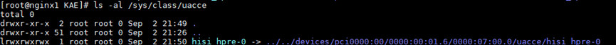

        查看VF使用的地址。

        ```shell
        cd /sys/bus/pci/drivers
        cd hisi_hpre
        ls
        ```

        

    3. 验证KAE性能。<br>配置OpenSSL以使用KAE，并通过执行 **openssl speed** 命令来比较开启和未开启KAE时RSA加密解密的性能差异。

        使能KAE前的性能值。

        ```shell
        openssl speed -elapsed rsa2048
        ```

        

        使能KAE后的性能值。

        ```shell
        export OPENSSL_CONF=/home/openssl.cnf
        openssl speed -engine kae -elapsed rsa2048
        ```

        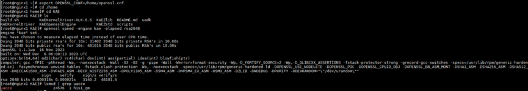

    4. 检查加载模块是否加载。

        ```shell
        lsmod | grep uacce
        ```

        预期结果如下，表示加载模块已经加载。

        

### 在虚拟机部署Nginx<a name="ZH-CN_TOPIC_0000002051811469"></a>

部署Nginx，使KAE可以使能Nginx的同步模式或异步模式。

1. 在虚拟机安装依赖。

    ```shell
    yum install -y openssl openssl-devel pcre pcre-devel zlib zlib-devel gcc make
    ```

2. 若服务器可以访问网络，可以通过**wget**命令直接下载Nginx源码，再将Nginx源码上传到虚拟机的“/home”目录。

    ```shell
    wget https://nginx.org/download/nginx-1.21.5.tar.gz --no-check-certificate
    ```

3. 部署Nginx。

    ```shell
    tar -zxvf nginx-1.21.5.tar.gz
    cd nginx-1.21.5/
    chmod 755 configure
    ./configure --prefix=/usr/local/nginx --user=nginx --group=nginx --with-http_ssl_module --with-http_v2_module --with-http_realip_module --with-http_stub_status_module --with-http_gzip_static_module --with-pcre --with-stream --with-stream_ssl_module --with-stream_realip_module
    make -j 60 && make install
    ```

    > **说明：** 
    >- -j 60：充分利用CPU多核优势，加快编译速度。
    >- CPU的核数可以通过**lscpu**命令查看。

4. 生成OpenSSL证书。

    请参见《Nginx 移植指南》的[生成OpenSSL证书](https://www.hikunpeng.com/document/detail/zh/kunpengwebs/ecosystemEnable/Nginx/kunpengnginx_02_0013.html)章节。

    > **说明：** 
    >若生成OpenSSL证书时，提示“unable to find 'distinguished\_name' in config”，说明与[在虚拟机部署vKAE](#在虚拟机部署vkae)的“验证KAE的安装与配置是否完成”步骤中验证KAE性能时执行的**export OPENSSL\_CONF=/home/openssl.cnf**命令冲突，请参见[部署vKAE特性时，在虚拟机部署Nginx过程中生成OpenSSL证书时报错](#ZH-CN_TOPIC_0000002054536396)解决该问题。

5. 查看Nginx安装目录。

    ```shell
    ls /usr/local/nginx
    ```

6. 确认Nginx版本为目标版本。

    ```shell
    /usr/local/nginx/sbin/nginx -v
    ```

7. <a name="li1074555611337" id="li1074555611337"></a>在不使能KAE的情况下，配置并启动Nginx开源版本。
    1. 打开Nginx配置文件。

        ```shell
        cd /usr/local/nginx/conf
        vim nginx.conf
        ```

    2. 按“i”键进入编辑模式，将以下内容复制到Nginx配置文件中。

        以下为Nginx开源版本的配置文件nginx.conf的内容，此配置未进行任何调优，也未启用KAE。

        ```xml
        user  root;
        worker_processes  auto;
        
        #worker_processes  10;
        #worker_cpu_affinity 
        #10000000000000000000000000000000000000000000000000000000000000000000000000000000000
        #100000000000000000000000000000000000000000000000000000000000000000000000000000000000
        #1000000000000000000000000000000000000000000000000000000000000000000000000000000000000
        #10000000000000000000000000000000000000000000000000000000000000000000000000000000000000
        #;
        
        #error_log  logs/error.log;
        #error_log  logs/error.log  notice;
        #error_log  logs/error.log  info;
        
        #pid        logs/nginx.pid;
        
        events {
            worker_connections  1024;
        }
        
        http {
            include       mime.types;
            default_type  application/octet-stream;
        
            #log_format  main  '$remote_addr - $remote_user [$time_local] "$request" '
            #                  '$status $body_bytes_sent "$http_referer" '
            #                  '"$http_user_agent" "$http_x_forwarded_for"';
        
            #access_log  logs/access.log  main;
        
            sendfile        on;
            #tcp_nopush     on;
        
            #keepalive_timeout  0;
            keepalive_timeout  65;
        
            #gzip  on;
        
            server {
                listen       10000;
                server_name  localhost;
        
                #charset koi8-r;
        
                #access_log  logs/host.access.log  main;
        
                location / {
                    root   html;
                    index  index.html index.htm;
                }
        
                #error_page  404              /404.html;
        
                # redirect server error pages to the static page /50x.html
                #
                error_page   500 502 503 504  /50x.html;
                location = /50x.html {
                    root   html;
                }
            }
        
            # HTTPS server
            #
            server {
                listen       20000 ssl;
                server_name  localhost;
        
                ssl_certificate      /usr/local/nginx/server_2048.crt;
                ssl_certificate_key  /usr/local/nginx/server_2048.key;
        
                ssl_session_cache    shared:SSL:1m;
                ssl_session_timeout  5m;
        
                ssl_ciphers  HIGH:!aNULL:!MD5;
                ssl_prefer_server_ciphers  on;
        
                location / {
                    root   html;
                    index  index.html index.htm;
                }
            }
        
        }
        ```

        > **说明：** 
        >其中，http侦听端口号是10000，https侦听端口号是20000。

    3. 按“Esc”键，输入 **:wq!**，按“Enter”保存并退出编辑。
    4. 运行Nginx开源版本，并查看Nginx是否启动。

        ```shell
        /usr/local/nginx/sbin/nginx -c /usr/local/nginx/conf/nginx.conf
        ps -ef | grep nginx
        ```

        回显中显示Nginx线程，表示Nginx已经启动。

        

        可以看到，nginx.conf配置文件中指定worker\_processes为auto，创建的Nginx线程数量为8个，刚好等于8C16G虚拟机的总核数，worker\_processes数量也可以根据实际情况进行设置。

        > **说明：** 
        >多种方式的重启和退出Nginx命令。
        >- 重启Nginx。
>
        > ```shell
        > sudo systemctl restart nginx
        >    ```
>
        >- 优雅重启Nginx。
>
        > ```shell
        > sudo nginx -s reload
        >    ```
>
        >- 退出Nginx。
>
        > ```shell
        > /usr/local/nginx/sbin/nginx -s quit
        >    ```
>
        > 或者
>
        > ```shell
        > /usr/local/nginx/sbin/nginx -s stop
        >    ```

8. <a name="li367309154513" id="li367309154513"></a>配置使能KAE + Nginx的同步模式。
    1. 在“usr/local/nginx/conf”目录下创建一个名为nginx\_kae.conf的配置文件。

        ```shell
        vim nginx_kae.conf
        ```

    2. 按“i”键进入编辑模式，将以下内容复制到Nginx配置文件中。

        以下为配置KAE使能 + Nginx同步模式的Nginx配置文件nginx.conf的内容，此配置已进行Nginx参数调优。

        ```xml
        user  root;
        worker_processes auto;
        #4-7
        #worker_cpu_affinity
        #10000
        #100000
        #1000000
        #10000000
        #;
        #daemon off;
        error_log  /dev/null;
        
        worker_rlimit_nofile 102400;
        events {
                use epoll;
                worker_connections 102400;
                accept_mutex off;
                multi_accept on;
        }
        
        
        http {
                include       mime.types;
                default_type  application/octet-stream;
                #log_format  main  '$remote_addr - $remote_user [$time_local] $request_time "$request" '
                #        '$status $body_bytes_sent $request_length $bytes_sent "$http_referer" '
                #        '"$http_user_agent" "$http_x_forwarded_for"';
                #access_log  logs/access.log  main;
                access_log  off;
        
                sendfile      on;
                tcp_nopush    on;
                tcp_nodelay   on;
                server_tokens off;
                sendfile_max_chunk 512k;
                keepalive_timeout  65;
                keepalive_requests 20000;
                client_header_buffer_size 4k;
                large_client_header_buffers 4 32k;
                server_names_hash_bucket_size 128;
                client_max_body_size 100m;
                open_file_cache max=102400 inactive=40s;
                open_file_cache_valid 50s;
                open_file_cache_min_uses 1;
                open_file_cache_errors on;
                #gzip  on;
        
            server {
                listen       10000 reuseport;
                server_name  localhost;
        
                #charset koi8-r;
        
                #access_log  logs/host.access.log  main;
        
                location / {
                    root   html;
                    index  index.html index.htm;
                }
        
                #error_page  404              /404.html;
        
                # redirect server error pages to the static page /50x.html
                #
                error_page   500 502 503 504  /50x.html;
                location = /50x.html {
                    root   html;
                }
        
            }
            # HTTPS server
            #
            server {
                listen       20000 ssl reuseport;
                server_name  localhost;
        
                ssl_certificate  /usr/local/nginx/server_2048.crt;
                ssl_certificate_key  /usr/local/nginx/server_2048.key;
        
                ssl_session_cache    shared:SSL:1m;
                ssl_session_timeout  5m;
                ssl_protocols  TLSv1 TLSv1.1 TLSv1.2;
                ssl_ciphers  AES256-GCM-SHA384;
                ssl_prefer_server_ciphers  on;
                ssl_session_tickets  off;
                location / {
                    root   html;
                    index  index.html index.htm;
                }
                access_log  off;
            }
        
        }
        ```

    3. 按“Esc”键，输入 **:wq!**，按“Enter”保存并退出编辑。
    4. 运行使能KAE+参数调优过的Nginx同步模式的配置文件。

        > **须知：** 
        >运行使能KAE+参数调优过的Nginx同步模式的配置文件，只需要在Nginx执行命令前添加**OPENSSL\_CONF=/home/openssl.cnf**。

        ```shell
        /usr/local/nginx/sbin/nginx -s stop || true; sleep 1;
        OPENSSL_CONF=/home/openssl.cnf /usr/local/nginx/sbin/nginx -c /usr/local/nginx/conf/nginx_kae.conf
        ```

9. <a name="li10813133111559" id="li10813133111559"></a>配置使能KAE + Nginx的异步模式。

    > **须知：** 
    >配置使能KAE + Nginx的异步模式，需要额外下载适配异步模式的Nginx源代码。该源代码支持同步或异步模式，可以适配KAE或Intel QAT硬件加速。

    1. 下载适配异步模式的Nginx源代码，在github中选择版本0.4.9，并编译安装Nginx。

        ```shell
        cd /home
        git clone https://github.com/intel/asynch_mode_nginx.git
        cd /home/asynch_mode_nginx/
        yum install gcc gcc-c++ make libtool zlib zlib-devel pcre pcre-devel perl-devel perl-ExtUtils-Embed perl-WWW-Curl wget -y
        ./configure --prefix=/usr/share/nginx --add-dynamic-module=modules/nginx\_qat\_module --with-cc-opt="-DNGX\_SECURE\_MEM -Wno-error=deprecated-declarations" --with-http\_ssl\_module --with-http\_v2\_module
        make -j60 && make install
        ```

        > **说明：** 
        >上述[7](#li1074555611337)和[8](#li367309154513)都使用Nginx开源版本进行测试，路径位于“/usr/local/nginx”。为避免冲突，异步模式的Nginx安装在“/usr/share/nginx”路径下。

    2. 在“/root”目录下创建一个名为nginx\_kae\_async.conf的文件。

        ```shell
        vim nginx_kae_async.conf
        ```

    3. 按“i”键进入编辑模式，将以下内容复制到nginx\_kae\_async.conf文件中。

        以下为配置KAE使能 + Nginx异步模式的Nginx配置文件nginx.conf的内容，此配置已进行Nginx参数调优，并启用KAE。其中Nginx线程数可以根据实际需求进行更改，使用 **auto**一般会占满虚拟机的所有核。http占用端口号为 **10000**，https占用端口号为 **20000**。

        ```xml
        # For more information on configuration, see:
        #   * Official English Documentation: http://nginx.org/en/docs/
        #   * Official Russian Documentation: http://nginx.org/ru/docs/
        
        user root;
        worker_processes auto;
        
        #worker_processes  10;
        #worker_cpu_affinity 
        #10000000000000000000000000000000000000000000000000000000000000000000000000000000000
        #100000000000000000000000000000000000000000000000000000000000000000000000000000000000
        #1000000000000000000000000000000000000000000000000000000000000000000000000000000000000
        #10000000000000000000000000000000000000000000000000000000000000000000000000000000000000
        #;
        
        events  {
            use epoll;
            worker_connections 102400;
            accept_mutex off;
            multi_accept on;
        }
        
        error_log /var/log/nginx/error.log;
        pid /run/nginx.pid;
        
        include /usr/share/nginx/modules/*.conf;
        
        http {
            log_format  main  '$remote_addr - $remote_user [$time_local] "$request" '
                              '$status $body_bytes_sent "$http_referer" '
                              '"$http_user_agent" "$http_x_forwarded_for"';
        
            # access_log off;
            # access_log  /var/log/nginx/access.log  main;
        
            sendfile            on;
            tcp_nopush          on;
            tcp_nodelay         on;
            keepalive_timeout   65s;
            types_hash_max_size 4096;
        
            include             /usr/local/nginx/conf/mime.types;
            default_type        application/octet-stream;
        
            # Load modular configuration files from the /etc/nginx/conf.d directory.
            # See http://nginx.org/en/docs/ngx_core_module.html#include
            # for more information.
            include /etc/nginx/conf.d/*.conf;
                access_log  off;
                server_tokens off;
                sendfile_max_chunk 512k;
                keepalive_requests 20000;
                client_header_buffer_size 4k;
                large_client_header_buffers 4 32k;
                server_names_hash_bucket_size 128;
                client_max_body_size 100m;
                open_file_cache max=102400 inactive=40s;
                open_file_cache_valid 50s;
                open_file_cache_min_uses 1;
                open_file_cache_errors on;
        
            server {
                listen       10000;
                listen       [::]:10000;
                location / {
                    root html;
                    index index.html index.htm;
                }
                error_page 500 502 503 504  /50x.html;
                location = /50x.html {
                    root html;
                }
            }
        
        # Settings for a TLS enabled server.
        #
           server {
               listen 20000 ssl http2 asynch;
               listen [::]:20000 ssl http2 asynch;
               server_name localhost;
               ssl_asynch on;
               ssl_certificate /usr/local/nginx/server_2048.crt;
               ssl_certificate_key /usr/local/nginx/server_2048.key;
               ssl_session_cache shared:SSL:1m;
               ssl_session_timeout 5m;
               ssl_protocols  TLSv1 TLSv1.1 TLSv1.2;
               ssl_ciphers  "EECDH+ECDSA+AESGCM EECDH+aRSA+AESGCM EECDH+ECDSA+SHA384 EECDH+ECDSA+SHA256 EECDH+aRSA+SHA384 EECDH+aRSA+SHA256    EECDH+aRSA+RC4 EECDH EDH+aRSA !aNULL !eNULL !LOW !3DES !MD5 !EXP !PSK !SRP !DSS !RC4";
        
               ssl_prefer_server_ciphers  on;
        
               location / {
                    root html;
                    index index.html index.htm;
              }
        
           }
            gzip on;
            gzip_buffers 4 16k;
            gzip_comp_level 9;
            gzip_disable "MSIE [1-6]\.";
            gzip_http_version 1.1;
            gzip_min_length 500k;
            gzip_types text/css text/javascript text/xml text/plain text/x-component application/javascript application/x-javascript application/json application/xml;
            gzip_vary on;
            proxy_buffer_size 1024k;
            proxy_buffers 16 1024k;
            proxy_busy_buffers_size 2048k;
            proxy_temp_file_write_size 2048k;
         }
        ```

    4. 按“Esc”键，输入 **:wq!**，按“Enter”保存并退出编辑。
    5. 复用安装Nginx开源版本后的OpenSSL证书路径（路径在“/usr/local/nginx/conf/mime.types”）。

        将mime.types、server\_2048.crt和server\_2048.key文件拷贝到一个新的路径。

        > **说明：** 
        >若要自己创建OpenSSL证书，可在新的路径下运行下述命令：
>
        >```shell
        >openssl genrsa -des3 -out server_2048.key 2048
        >openssl rsa -in server_2048.key -out server_2048.key
        >openssl req -new -key server_2048.key -out server_2048.csr
        >openssl rsa -in server_2048.key -out server_2048.key
        >openssl x509 -req -days 365 -in server_2048.csr -signkey server_2048.key -out server_2048.crt
        >```

    6. 运行使能KAE+参数调优过的Nginx异步模式的配置文件。

        > **须知：** 
        >运行使能KAE + 参数调优过的Nginx异步模式的配置文件，也只需要在Nginx执行命令前添加**OPENSSL\_CONF=/home/openssl.cnf**。

        ```shell
        /usr/share/nginx/sbin/nginx -s stop || true; sleep 1;
        OPENSSL_CONF=/home/openssl.cnf /usr/share/nginx/sbin/nginx -c /root/nginx_kae_async.conf
        ```

### 在客户端部署HTTPress<a name="ZH-CN_TOPIC_0000002015863250"></a>

在性能测试场景中，需要使用HTTPress作为客户端工具进行压力测试，而服务端使能KAE并结合Nginx服务。

客户端可以灵活配置，既可以使用物理机，也可以利用虚拟机来模拟客户端。当服务端CPU利用率达到100%时，使用HTTPress测试生成的RPS指标来衡量KAE的加速性能。

1. 安装依赖包。

    ```shell
    yum install -y gnutls-devel libev-devel openssl-devel
    ```

2. 下载HTTPress安装包到虚拟机的“/home”目录。若虚拟机可以访问网络，则可以通过**wget**命令直接下载HTTPress源码。

    ```shell
    cd /home
    wget https://github.com/yarosla/httpress/archive/1.1.0.tar.gz --no-check-certificate -O httpress-1.1.0.tar.gz
    ```

3. 解压HTTPress源码包并进入解压后的HTTPress目录，进行编译安装。

    ```shell
    tar -zxvf httpress-1.1.0.tar.gz
    cd httpress-1.1.0
    make -j64
    ```

4. 配置并检查HTTPress是否安装成功。

    ```shell
    cp /home/httpress-1.1.0/bin/Release/httpress /usr/bin/
    httpress -v
    ```

    可以看到已安装的HTTPress为目标版本。

    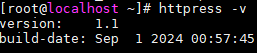

## 测试<a name="ZH-CN_TOPIC_0000002041371065"></a>

### 使用OpenSSL对vKAE进行性能测试<a name="ZH-CN_TOPIC_0000002052518101"></a>

在客户端上，以RSA加解密算法为例，使用OpenSSL工具对vKAE进行详细的性能测试，涵盖Nginx开源版本的同步与异步模式，以及使能vKAE结合Nginx的同步与异步模式，并对测试结果进行详细分析，得出结论与应用建议。

**测试命令介绍<a name="section134601731205010"></a>**

以4C8G规格的虚拟机为例，在虚拟机中执行四组OpenSSL性能测试，分别针对Nginx开源版本的同步和异步模式，以及使能vKAE结合Nginx的同步与异步模式。

各组的测试命令如下：

- Nginx同步模式。

    ```shell
    numactl -C 0 openssl speed -elapsed -multi 1 rsa2048
    ```

- Nginx异步模式。

    ```shell
    numactl -C 0 openssl speed -elapsed -multi 1 -async_jobs 4 rsa2048
    ```

- 使能vKAE + Nginx同步模式。

    ```shell
    OPENSSL_CONF=/home/openssl.cnf numactl -C 0 openssl speed -engine kae -elapsed -multi 1 rsa2048
    ```

- 使能vKAE + Nginx异步模式。

    ```shell
    OPENSSL_CONF=/home/openssl.cnf numactl -C 0 openssl speed -engine kae -elapsed -multi 1 -async_jobs 4 rsa2048
    ```

> **说明：** 
>以下参数请根据实际情况调整：
>
>- numactl -C 0：表示绑核编号为**0**的CPU核。
>- -m 0：表示绑核位置在NUMA node0。
>- -engine kae -elapsed：表示使用KAE进行加速。
>- -multi：表示并发线程数。**1**表示没有并行操作，即每次只执行一个操作。
>- -async\_jobs：表示使用异步作业的数量。**4**表示将同时启动4个异步作业。

**测试结果与分析<a name="section752112578145"></a>**

在4C8G虚拟机中使用**openssl speed**命令测试得到的RSA-sign结果如[**表 1** 测试结果](#测试结果)所示。

**表 1** 测试结果<a id="测试结果"></a>

|处理器型号|服务端线程数=1|服务端线程数=4|虚拟机规格|Nginx同步/异步|是否启用vKAE|
|--|--|--|--|--|--|
|鲲鹏920处理器|6374|12528|4C8G|同步|是|
|鲲鹏920处理器|15593|52514|4C8G|异步|是|
|鲲鹏920处理器|774|3100|4C8G|同步|否|
|鲲鹏920处理器|774|3096|4C8G|异步|否|

在CPU利用率达到100%的情况下，得出以下结论：

- vKAE加速效果：在4C8G规格的虚拟机中，vKAE硬件加速显著提升了性能。在vKAE加速达到瓶颈之前，对于异步模式，性能提升高达16倍；对于同步模式，也实现了3倍的性能提升。

- 同步与异步模式比较：在OpenSSL场景下启用vKAE进行加速后，异步模式相比同步模式在性能上提升了4.2倍，显示出异步处理在高并发场景下的优势。未启用vKAE时，同步和异步模式的性能差异几乎无差异。
- 硬软比分析：同步模式的硬软比约为4倍，而异步模式高达17倍，表明异步模式在利用硬件加速资源时更为高效。

    > **说明：** 
    >硬软比指硬件加速的算力和纯CPU软算（不使用KAE加速）的比值。

**结论与应用建议<a name="section199716171411"></a>**

对于4C8G规格的虚拟机：

- vKAE硬件加速的优势：在资源受限的虚拟机环境中，vKAE硬件加速是提升RSA签名性能的有效手段。
- 异步模式的优势：对于需要处理大量并发请求的应用，推荐采用Nginx异步模式结合vKAE硬件加速，以获得最佳性能。
- 在不同规格的虚拟机中，不同的服务端线程数的测试结果、趋势都存在差异，需要具体问题具体分析。但在Nginx应用场景中，对于Nginx服务端，在不超过64个核的绑定场景下，vKAE硬件加速RSA-sign的上限值约为54000sign/s，为实际部署提供了参考依据。

### 在Nginx应用场景中使用HTTPress对vKAE进行性能测试<a name="ZH-CN_TOPIC_0000002016398576"></a>

针对Nginx应用场景，在客户端上，使用HTTPress工具对vKAE进行详细的性能测试，涵盖Nginx开源版本的同步与异步模式，以及使能vKAE结合Nginx的同步与异步模式，并对测试结果进行详细分析，得出结论与应用建议。

**测试命令介绍<a name="section17499539195110"></a>**

在虚拟机中执行两组HTTPress性能测试，分别针对Nginx开源版本的同步和异步模式，以及使能vKAE结合Nginx的同步与异步模式。

**在客户端上**，执行以下操作：使用HTTPress对HTTPS长连接和HTTPS短连接进行压力测试，测试命令如下：

- HTTPS长连接。

    ```shell
    httpress -n 2000000 -c 200 -t 10 -k https://服务端IP地址:服务端端口号/index${nodeIndexNum}.html
    ```

- HTTPS短连接。

    ```shell
    httpress -n 20000 -c 200 -t 10 https://服务端IP地址:服务端端口号/index${nodeIndexNum}.html
    ```

> **说明：** 
>
>- 命令中的 **-n**、 **-t**、 **-c**和 **-k**参数分别代表请求数、线程数、连接数和是否使用长连接。 **-n**、 **-t**和 **-c**参数可以根据实际情况进行调整，以寻找RPS值最大的最优参数。
>- $\{nodeIndexNum\}是一个变量，可以根据实际情况设置为指定测试的页面编号。
>- 在客户端下，由于HTTP不使用加解密算法，HTTPS在HTTP基础上使用SSL/TLS算法，其中SSL/TLS握手过程包含加解密相关计算，非对称加解密计算复杂耗时，HPRE设备只对RSA非对称加解密算法进行加速，即使用vKAE硬件加速只对HTTPS长/短连接有效，因此在vKAE加速场景下仅对比HTTPS的测试结果。

**在服务端上**，执行以下操作：

1. 以1个线程为例，在“/root/test/”目录下创建一个名为sync\_nginx\_1\_worker.conf的Nginx配置文件。

    ```shell
    vim sync_nginx_1_worker.conf
    ```

2. 按“i”进入编辑模式，在文件中新增如下内容。

    以下为使能KAE + 参数未调优过的Nginx同步模式的配置文件内容。

    ```xml
    # For more information on configuration, see:
    #   * Official English Documentation: http://nginx.org/en/docs/
    #   * Official Russian Documentation: http://nginx.org/ru/docs/
    
    user root;
    
    worker_processes 1;
    worker_cpu_affinity
    1
    ;
    
    # error_log /var/log/nginx/error.log debug;
    error_log /var/log/nginx/error.log;
    pid /run/nginx.pid;
    
    # Load dynamic modules. See /usr/share/doc/nginx/README.dynamic.
    include /usr/share/nginx/modules/*.conf;
    
    events {
        worker_connections 1024;
    }
    
    http {
        log_format  main  '$remote_addr - $remote_user [$time_local] "$request" '
                          '$status $body_bytes_sent "$http_referer" '
                          '"$http_user_agent" "$http_x_forwarded_for"';
        # access_log off;
        # access_log  /var/log/nginx/access.log  main;
    
        sendfile            on;
        tcp_nopush          on;
        tcp_nodelay         on;
        keepalive_timeout   65;
        types_hash_max_size 4096;
    
        include             /usr/local/nginx/conf/mime.types;
        default_type        application/octet-stream;
    
        # Load modular configuration files from the /etc/nginx/conf.d directory.
        # See http://nginx.org/en/docs/ngx_core_module.html#include
        # for more information.
        include /etc/nginx/conf.d/*.conf;
    
        server {
            listen       8080;
            listen       [::]:8080;
            server_name  _;
            root         /usr/share/nginx/html;
    
            # Load configuration files for the default server block.
            include /etc/nginx/default.d/*.conf;
    
            error_page 404 /404.html;
                location = /40x.html {
            }
    
            error_page 500 502 503 504 /50x.html;
                location = /50x.html {
            }
        }
    
    # Settings for a TLS enabled server.
    #
       server {
           listen       8090 ssl http2 so_keepalive=off;
           listen       [::]:8090 ssl http2 so_keepalive=off;
           #listen       8090 ssl http2 so_keepalive=off asynch;
           #listen       [::]:8090 ssl http2 so_keepalive=off asynch;
           server_name  _;
    
           # ssl_asynch on;
    
           ssl_certificate      /usr/local/nginx/server_2048.crt;
          ssl_certificate_key  /usr/local/nginx/server_2048.key;
    
           root         /usr/share/nginx/html;
    
           ssl_session_cache    shared:SSL:1m;
           ssl_session_timeout  5m;
           ssl_protocols  TLSv1 TLSv1.1 TLSv1.2;
    
           ssl_ciphers  "EECDH+ECDSA+AESGCM EECDH+aRSA+AESGCM EECDH+ECDSA+SHA384 EECDH+ECDSA+SHA256 EECDH+aRSA+SHA384 EECDH+aRSA+SHA256    EECDH+aRSA+RC4 EECDH EDH+aRSA !aNULL !eNULL !LOW !3DES !MD5 !EXP !PSK !SRP !DSS !RC4";
           #ssl_ciphers  "RSA-PSK-AES128-CBC-SHA256 !aNULL !eNULL !LOW !3DES !MD5 !EXP !PSK !SRP !DSS !RC4";
           # ssl_ciphers  AES256-GCM-SHA384;
           ssl_prefer_server_ciphers  on;
           # ssl_session_tickets  off;
    
           error_page 404 /404.html;
               location = /40x.html {
           }
    
           error_page 500 502 503 504 /50x.html;
               location = /50x.html {
           }
       }
    
    }
    ```

    > **说明：** 
    >- 该配置文件中，HTTP使用的端口号为8080，HTTPS使用的端口号为8090。
    >- worker\_processes为服务端线程数，worker\_cpu\_affinity为NUMA亲和性，可根据需要设置服务端的线程数，同时对应改变NUMA亲和性部分。
    >- 如果要使用4个服务端线程，将“worker\_processes”和“worker\_cpu\_affinity”参数修改为如下：
    >
    > ```shell
    > worker_processes 4;
    > worker_cpu_affinity
    > 1
    > 10
    > 100
    > 1000;
    >    ```
    >
    >- 如果要配置使能KAE+参数未调优过的Nginx**异步模式**的配置文件内容，请先创建一个名为async\_nginx\__x_\_worker.conf（x表示使用的线程个数）的配置文件，并将上述配置文件内容拷贝到async\_nginx\__x_\_worker.conf文件中，再分别将以下三行内容前面的\#号删除：
    >
    > ```shell
    > #listen       8090 ssl http2 so_keepalive=off asynch;
    > #listen       [::]:8090 ssl http2 so_keepalive=off asynch;
    > # ssl_asynch on;
    >    ```
    >
    > 最后在以下两行内容前面分别添加 **\#** 号：
    >
    > ```shell
    > listen       8090 ssl http2 so_keepalive=off;
    > listen       [::]:8090 ssl http2 so_keepalive=off;
    >    ```
    >
    >- 如果要使用参数调优过的Nginx配置文件，可以直接使用[9](#li10813133111559)中的配置文件。

3. 按“Esc”键，输入 **:wq!** ，按“Enter”保存并退出编辑。
4. 在客户端上使用HTTPress对HTTPS短连接进行压力测试。

    以服务端分别使用1个线程和4个线程，客户端绑核数根据实际需要进行限制为例，在客户端上使用HTTPress对HTTPS短连接进行压力测试，测试命令如下：

    - 使能KAE + Nginx同步 + 服务端使用1个线程。
        - 服务端：

            ```shell
            nginx -s stop || true; sleep 1; OPENSSL_CONF=/home/openssl.cnf /usr/share/nginx/sbin/nginx -c /root/test/sync_nginx_1_worker.conf; sleep 1
            ```

        - 客户端：

            ```shell
            taskset -c 64-254 httpress -c 64 -t 32 -n 64000 https://服务端IP地址:8090/index.html
            ```

    - 使能KAE + Nginx异步 + 服务端使用1个线程。
        - 服务端：

            ```shell
            nginx -s stop || true; sleep 1; OPENSSL_CONF=/home/openssl.cnf /usr/share/nginx/sbin/nginx -c /root/test/async_nginx_1_worker.conf; sleep 1
            ```

        - 客户端：

            ```shell
            taskset -c 64-254 httpress -c 64 -t 32 -n 64000 https://服务端IP地址:8090/index.html
            ```

    - 使能KAE + Nginx同步 + 服务端使用4个线程。
        - 服务端：

            ```shell
            nginx -s stop || true; sleep 1; OPENSSL_CONF=/home/openssl.cnf /usr/share/nginx/sbin/nginx -c /root/test/sync_nginx_4_worker.conf; sleep 1
            ```

        - 客户端：

            ```shell
            taskset -c 64-254 httpress -c 64 -t 32 -n 128000 https://服务端IP地址:8090/index.html
            ```

    - 使能KAE + Nginx异步+服务端使用4个线程。
        - 服务端：

            ```shell
            nginx -s stop || true; sleep 1; OPENSSL_CONF=/home/openssl.cnf /usr/share/nginx/sbin/nginx -c /root/test/async_nginx_4_worker.conf; sleep 1
            ```

        - 客户端：

            ```shell
            taskset -c 64-254 httpress -c 64 -t 32 -n 128000 https://服务端IP地址:8090/index.html
            ```

    - 不使能KAE + Nginx同步 + 服务端使用1个线程。
        - 服务端：

            ```shell
            nginx -s stop || true; sleep 1; /usr/share/nginx/sbin/nginx -c /root/test/sync_nginx_1_worker.conf; sleep 1
            ```

        - 客户端：

            ```shell
            taskset -c 64-254 httpress -c 64 -t 32 -n 64000 https://服务端IP地址:8090/index.html
            ```

    - 不使能KAE + Nginx异步 + 服务端使用1个线程。
        - 服务端：

            ```shell
            nginx -s stop || true; sleep 1; /usr/share/nginx/sbin/nginx -c /root/test/async_nginx_1_worker.conf; sleep 1
            ```

        - 客户端：

            ```shell
            taskset -c 64-254 httpress -c 64 -t 32 -n 64000 https://服务端IP地址:8090/index.html
            ```

    - 不使能KAE + Nginx同步 + 服务端使用4个线程。
        - 服务端：

            ```shell
            nginx -s stop || true; sleep 1; /usr/share/nginx/sbin/nginx -c /root/test/sync_nginx_4_worker.conf; sleep 1
            ```

        - 客户端：

            ```shell
            taskset -c 64-254 httpress -c 64 -t 32 -n 128000 https://服务端IP地址:8090/index.html
            ```

    - 不使能KAE + Nginx异步 + 服务端使用4个线程。
        - 服务端：

            ```shell
            nginx -s stop || true; sleep 1; /usr/share/nginx/sbin/nginx -c /root/test/async_nginx_4_worker.conf; sleep 1
            ```

        - 客户端：

            ```shell
            taskset -c 64-254 httpress -c 64 -t 32 -n 128000 https://服务端IP地址:8090/index.html
            ```

**测试结果与分析<a name="section10237142135911"></a>**

以HTTPS短连接为例，在规格为8C16G虚拟机中，使用HTTPress工具进行压力测试得到的RPS结果如[**表 1** 测试结果](#测试结果_1)所示。

**表 1** 测试结果<a id="测试结果_1"></a>

|处理器型号|服务端线程数=1|服务端线程数=4|虚拟机规格|Nginx同步/异步|是否启用vKAE|
|--|--|--|--|--|--|
|鲲鹏920处理器|1367|5102|8C16G|同步|是|
|鲲鹏920处理器|2246|7393|8C16G|异步|是|
|鲲鹏920处理器|587|2255|8C16G|同步|否|
|鲲鹏920处理器|584|2245|8C16G|异步|否|

在CPU利用率达到100%的情况下，得出以下结论：

- 对于8C16G规格的虚拟机，在不使能vKAE的情况下同步与异步性能几乎无差异；使能vKAE之后，在CPU达到性能瓶颈之前，vKAE异步性能优于同步，RPS相比同步提升40%。
- 在8C16G规格的虚拟机未达到CPU瓶颈时，同步的硬软比为226%，异步的硬软比为329%，异步性能提升优于同步。

**结论与应用建议<a name="section72697232592"></a>**

对于8C16G规格的虚拟机：

- 在不使能vKAE时，Nginx的同步与异步模式在性能上差异不大；在使用vKAE进行硬件加速后，特别是在处理HTTPS请求时，异步模式表现出更优异的性能提升。因此，在需要高性能HTTPS服务的场景中，推荐采用vKAE结合Nginx的异步模式配置。
- Nginx配置文件的调优也是提升性能的关键因素之一。通过合理配置Nginx的worker\_processes、worker\_cpu\_affinity等参数，可以进一步挖掘硬件的潜力，提升系统的整体性能。

## 故障排除<a name="ZH-CN_TOPIC_0000002054694708"></a>

### 部署vKAE特性时，在虚拟机部署Nginx过程中生成OpenSSL证书时报错<a id="ZH-CN_TOPIC_0000002054536396"></a>

**问题现象描述<a name="section158961545395"></a>**

部署vKAE特性时，在虚拟机部署Nginx过程中生成OpenSSL证书时，提示如下信息：

```shell
unable to find 'distinguished_name' in config
```

**关键过程、根本原因分析<a name="zh-cn_topic_0000001217009229_section35471290"></a>**

与在虚拟机部署vKAE过程中的验证KAE性能时执行的**export OPENSSL\_CONF=/home/openssl.cnf**命令冲突，需要取消当前环境中**OPENSSL\_CONF**环境变量的设置。

**结论、解决方案及效果<a name="section382551141"></a>**

1. 取消当前环境中**OPENSSL\_CONF**环境变量的设置。

    ```shell
    unset OPENSSL_CONF
    ```

2. 重新生成OpenSSL证书。

    ```shell
    openssl req -new -key server_2048.key -out server_2048.csr
    ```

## 缩略语<a name="ZH-CN_TOPIC_0000002041538761"></a>

|**缩略语**|**英文全称**|**中文全称**|
|--|--|--|
|HPRE|High Performance RSA Engine|高性能RSA加速引擎|
|KAE|Kunpeng Accelerator Engine|鲲鹏加速引擎|
|PCI|Peripheral Component Interconnect|外设部件互连标准|
|RPS|Request Per Second|每秒请求数|
|SR-IOV|Single Root I/O Virtualization|单根输入/输出虚拟化|
|SVA|Shared Virtual Addressing|共享虚拟地址|
|UACCE|Unified/User-space-access-intended Accelerator Framework|用户态加速器框架|
|UADK|User-space Accelerator Development Kit|用户态加速器开发包|
|vKAE|virtual Kunpeng Accelerator Engine|虚拟鲲鹏加速引擎|
