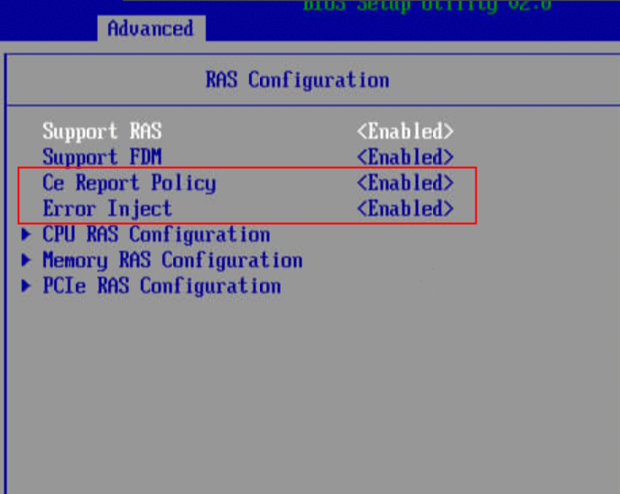
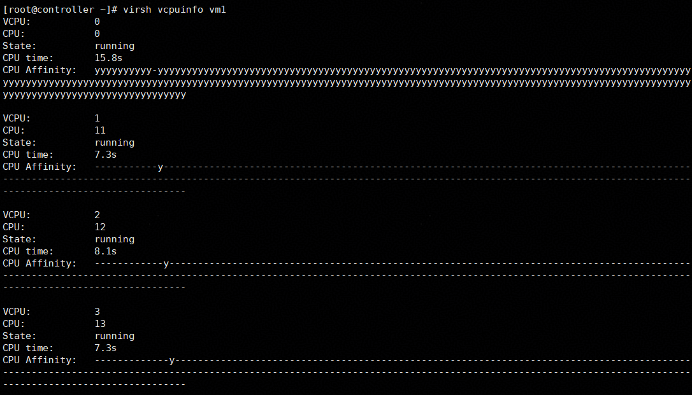
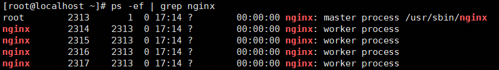
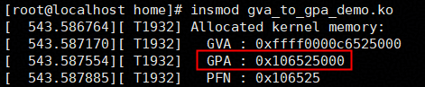
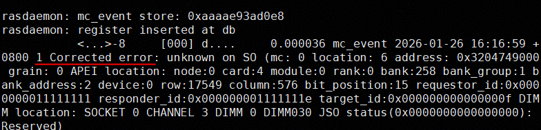

# 虚拟机单核单页异常处理 特性指南

## 特性描述<a name="ZH-CN_TOPIC_0000002544272171"></a>

本文主要介绍如何在使用openEuler操作系统的鲲鹏服务器上安装、使用和测试虚拟机单核单页异常处理特性。

**简介<a name="section12837201416207"></a>**

互联网面临整机长稳运行的关键痛点，需要通过硬件RAS（Reliability，Availability，Serviceability）能力获取当前物理机错误硬件并处理对应的硬件信息，把硬件问题影响范围降到最低。使能单核单页异常处理特性后，可以在鲲鹏系列服务器上实现单核CE（Corrected Error）故障在线隔离，不影响业务的运行；单页内存UE（Uncorrected Error）故障只影响虚拟机内一个进程，避免虚拟机直接下线。

**规格<a name="section186211624175715"></a>**

可支持虚拟机规格包括但不限于2C8G、4C8G、4C16G、8C16G、16C32G、32C64G。

**版本支持<a name="section1625164615574"></a>**

- 版本：支持openEuler 24.03 LTS SP3操作系统，QEMU 8.2.0和libvirt 9.10.0-26.oe2403sp3及以上版本。
- License支持：无。

**约束与限制<a name="section3897196125818"></a>**

- 使用环境需满足软硬件环境要求。
- 当前内存单页故障处理只支持物理机使用4K页的场景。

**应用场景<a name="section49961711506"></a>**

云计算通用场景，使虚拟机能够在发生内存硬件故障时实现“不中断恢复”。

## 安装和使用<a name="ZH-CN_TOPIC_0000002544287333"></a>

### 环境要求<a name="ZH-CN_TOPIC_0000002512745012"></a>

本文基于特定环境提供指导，在正式操作前请确保软硬件均满足要求。

**硬件要求<a name="section26241127"></a>**

硬件要求如[**表 1** 硬件要求](#硬件要求) 所示。

**表 1** 硬件要求<a id="硬件要求"></a>

|项目|说明|
|--|--|
|处理器|鲲鹏920新型号处理器、鲲鹏950处理器|

**固件版本要求<a name="section4793193042413"></a>**

固件版本要求如[**表 2** 固件版本要求](#固件版本要求) 所示，建议升级配套版本的全部固件。

**表 2** 固件版本要求<a id="固件版本要求"></a>

|项目|版本|
|--|--|
|鲲鹏920新型号处理器|基础板（BCU）CPLD 大于7.0.0|

**操作系统和软件要求<a name="section153345522323"></a>**

操作系统和软件要求如[**表 3** 操作系统和软件要求](#操作系统和软件要求)所示。

**表 3** 操作系统和软件要求<a id="操作系统和软件要求"></a>

|项目|版本|获取方法|
|--|--|--|
|OS|openEuler 24.03 LTS SP3|[获取链接](https://dl-cdn.openeuler.openatom.cn/openEuler-24.03-LTS-SP3/ISO/aarch64/)|
|libvirt|9.10.0-26.oe2403sp3及以上|通过配置Yum源的方式安装|
|QEMU|8.2.0|通过配置Yum源的方式安装|
|Nginx|1.24.0|通过配置Yum源的方式安装|
|Wrk|4.2.0|通过配置Yum源的方式安装|

### 配置BIOS<a name="ZH-CN_TOPIC_0000002545544251"></a>

修改BIOS仅为验证特性功能，正常使用过程建议保持默认配置。

1. 重启物理机，进入BIOS界面。
2. 设置“Advanced \> RAS Configuration”下的“Ce Report Policy”以及“Error Inject”为“Enabled”。

    

### 安装libvirt<a name="ZH-CN_TOPIC_0000002544424933"></a>

当前仅支持libvirt 9.10.0，请确保安装的libvirt为本特性需要的版本。若为其他版本，安装前需要先卸载原有libvirt及其依赖。

**前提条件<a name="section610117391219"></a>**

配置在线Yum源，具体配置方法请参见[配置Yum源](https://www.hikunpeng.com/document/detail/zh/kunpengcpfs/ecosystemEnable/Libvirt/kunpengcpfs_libvirt_03_0005.html)。

**操作步骤<a name="section830916587214"></a>**

安装libvirt。

```shell
yum install -y libvirt
```

### 配置虚拟机XML<a name="ZH-CN_TOPIC_0000002544304941"></a>

通过配置虚拟机XML打开内存故障注入开关。

1. 编辑虚拟机XML。

    ```shell
    virsh edit <vm name>
    ```

2. 按“i”进入编辑模式，在<features\>标签中添加<ras/\>标签。

    ```xml
    <domain type='kvm'>
      ...
      <features>
        <acpi/>
        <gic version='3'/>
        <ras/>
      </features>
      ...
    </domain>
    ```

3. 按“Esc”键退出编辑模式，输入 **:wq!**，按“Enter”键保存并退出文件。

## 功能测试<a name="ZH-CN_TOPIC_0000002544247337"></a>

### 安装测试工具<a name="ZH-CN_TOPIC_0000002516419674"></a>

测试开始前需要提前安装测试工具。

**安装Nginx<a name="section7262191845011"></a>**

Nginx只作为验证注错过程对业务连续性影响的工具，Nginx的版本可任意选择，以1.24.0为例，该版本为Yum源自带版本，在虚拟机中执行以下命令安装。

```shell
yum install -y nginx
```

**安装Wrk<a name="section11529195313920"></a>**

Wrk是一款HTTP压力测试工具，使用它对Nginx进行压测，保证注错时业务进程处在高负载状态。Wrk的版本可任意选择，以4.2.0为例，该版本为Yum源自带版本，在物理机中执行以下命令安装。

```shell
yum install -y wrk
```

**安装Rasdaemon<a name="section15346121171015"></a>**

Rasdaemon是一个守护进程，RAS事件发生后记录并打印故障信息，在物理机中执行以下命令安装。

```shell
yum install -y rasdaemon
```

### 单核CE故障测试<a name="ZH-CN_TOPIC_0000002512727410"></a>

单核CE故障注入使用内核提供的einj模块实现。
> **说明：** 
>
>1. 单核故障注入只会生效在物理核上，在超线程场景下，无论选择哪个超线程注入，都只会生效在第一个超线程上。
>2. 单核故障隔离是Host OS提供的能力，目前在超线程场景下，OS不会主动隔离所有超线程，需要用户/软件判断在故障时隔离1个或2个超线程。安全起见，在一个超线程因故障被隔离的情况下，用户需要主动隔离另一个超线程。

1. 加载注错模块。

    ```shell
    modprobe einj
    ```

2. 修改虚拟机XML，添加绑核信息。以4核虚拟机为例，添加如下内容。

    ```xml
    <cputune>
        <vcpupin vcpu='0' cpuset='10'/>
        <vcpupin vcpu='1' cpuset='11'/>
        <vcpupin vcpu='2' cpuset='12'/>
        <vcpupin vcpu='3' cpuset='13'/>
    </cputune>
    ```

3. 启动并进入虚拟机运行Nginx，关闭虚拟机防火墙。

    ```shell
    systemctl stop firewalld
    systemctl start nginx
    ```

4. 回到物理机，使用wrk对Nginx进行压测。

    ```shell
    wrk -t4 -c64 -d60s http://<虚拟机IP>/
    ```

5. 配置RAS功能生效阈值。

    ```shell
    export CPU_ISOLATION_ENABLE=yes; export CPU_CE_THRESHOLD=4; export CPU_ISOLATION_CYCLE=24h; export CPU_ISOLATION_LIMIT=10
    ```

6. 启动Rasdaemon服务。

    ```shell
    rasdaemon -f -r
    ```

7. 选择其中一个核心，以CPU10为例，重复执行以下步骤，进行多次注错。

    ```shell
    echo 0x1 > /sys/kernel/debug/apei/einj/error_type
    echo 10 > /sys/kernel/debug/apei/einj/param1
    echo 0xfffffffffffffff0 > /sys/kernel/debug/apei/einj/param2
    echo 1 > /sys/kernel/debug/apei/einj/notrigger
    echo 1 > /sys/kernel/debug/apei/einj/error_inject 
    ```

8. 观察Rasdaemon日志中是否记录到故障信息。有记录到故障信息，表示故障注入成功。没有记录到，则表示故障注入失败，建议重新注入。

    

9. 注错次数达到阈值后，执行以下命令，查看被注错核心是否下线，对应vCPU绑核是否发生改变。

    ```shell
    lscpu
    ```

    

    ```shell
    virsh vcpuinfo <vm name>
    ```

    

10. 进入虚拟机查看Nginx运行状态。

    ```shell
    ps -ef | grep nginx
    ```

### 内存单页故障测试<a name="ZH-CN_TOPIC_0000002512607428"></a>

#### 测试前须知<a name="ZH-CN_TOPIC_0000002518779356"></a>

内存单页故障测试可能导致qemu二进制文件损坏，报错现象如下：


解决方案参考如下：

重新安装qemu软件。

```shell
yum reinstall qemu
```

#### 获取故障注入地址<a name="ZH-CN_TOPIC_0000002514439060"></a>

本章节以Nginx为例，介绍如何获取进程的虚拟地址，以及如何将虚拟地址翻译为故障注入工具需要的物理地址或地址页号。

**获取虚拟机用户态地址<a name="section7262191845011"></a>**

1. 进入虚拟机，启动Nginx。

    ```shell
    systemctl start nginx
    ```

2. 获取Nginx进程号。

    ```shell
    ps -ef | grep nginx
    ```

    

3. 选择worker进程，获取进程地址空间，取地址空间中heap段的地址作为注错地址的GVA（Guest Virtual Address）。

    ```shell
    cat /proc/<pid>/maps
    ```

    

4. 编译并执行以下代码，将虚拟地址转换为物理地址。

    ```shell
    gcc -o addr_trans addr_trans.c
    ./addr_trans
    ```

    addr\_trans.c文件内容如下所示，执行脚本时根据实际情况修改PID与需要翻译的地址。

    ```c
    // addr_trans.c
    #include <stdio.h>
    #include <stdlib.h>
    #include <fcntl.h>
    #include <unistd.h>
    #include <stdint.h>
    
    // 获取虚拟地址对应的物理地址（需 root 权限）
    unsigned long virt_to_phys(pid_t pid, unsigned long addr) {
        char pagemap_path[64];
        snprintf(pagemap_path, sizeof(pagemap_path), "/proc/%d/pagemap", pid);
    
        int fd = open(pagemap_path, O_RDONLY);
        if (fd < 0) {
            perror("open pagemap");
            return 0;
        }
    
        // 计算 pagemap 中的偏移量（每个虚拟页占 8 字节）
        unsigned long offset = (addr / sysconf(_SC_PAGE_SIZE)) * sizeof(uint64_t);
        if (lseek(fd, offset, SEEK_SET) < 0) {
            perror("lseek");
            close(fd);
            return 0;
        }
    
        uint64_t entry;
        if (read(fd, &entry, sizeof(entry)) != sizeof(entry)) {
            perror("read");
            close(fd);
            return 0;
        }
        close(fd);
    
        // 检查页面是否在内存中（第 63 位）
        if (!(entry & (1ULL << 63))) {
            return 0; // 页面不在物理内存
        }
    
        // 物理页帧号（PFN）是低 55 位
        unsigned long pfn = entry & ((1ULL << 55) - 1);
        return (pfn * sysconf(_SC_PAGE_SIZE)) + (addr % sysconf(_SC_PAGE_SIZE));
    }
    
    int main() {
        uint8_t *p = (void*)0xaaaae5345000; // 待翻译地址
        unsigned long phys_addr = virt_to_phys(2314, (uint64_t)p); // 传入PID
        printf("Virtual address: %p\n", p);
        printf("Physical address: 0x%lx\n", phys_addr);
        return 0;
    }
    ```

**获取虚拟机内核态物理地址<a name="section1813642420262"></a>**

本文内核地址注错以内核模块的方式为例。

1. 安装编译依赖。

    ```shell
    yum install -y kernel-devel-$(uname -r) kernel-headers-$(uname -r) gcc make elfutils-libelf-devel
    ```

2. 编写内核模块。
    1. 创建模块目录。

        ```shell
        mkdir kmem && cd kmem
        ```

    2. 新建模块文件gva\_to\_gpa\_demo.c。

        ```shell
        vim gva_to_gpa_demo.c
        ```

    3. 按“i”进入编辑模式，编写模块文件，文件内容如下所示。

        ```c
        // gva_to_gpa_demo.c
        #include <linux/module.h>
        #include <linux/kernel.h>
        #include <linux/init.h>
        #include <linux/mm.h>
        #include <linux/slab.h>
        #include <linux/sched.h>
        #include <linux/kthread.h>
        
        MODULE_LICENSE("GPL");
        MODULE_AUTHOR("lt");
        MODULE_DESCRIPTION("Demo: allocate kernel memory and print GVA -> GPA");
        MODULE_VERSION("1.2");
        
        static void *buf;
        static struct task_struct *thr;
        
        static int touch_fn(void *data)
        {
            volatile u64 *p = buf;
            u64 cnt = 0;
        
            while (!kthread_should_stop()) {
                if (!buf) break;
                *p;   /* force access */
        
                if (++cnt % 1000 == 0)
                    cond_resched();
            }
            return 0;
        }
        
        static int __init gva_gpa_demo_init(void)
        {
            unsigned long gva;
            struct page *page;
            phys_addr_t gpa;
            unsigned long offset;
        
            /* 1. 申请一页内核内存 */
            buf = kmalloc(PAGE_SIZE, GFP_KERNEL);
            if (!buf) {
                pr_err("kmalloc failed\n");
                return -ENOMEM;
            }
        
            gva = (unsigned long)buf;
            offset = gva & ~PAGE_MASK;
        
            /* 2. 内核地址 → struct page */
            page = virt_to_page(buf);
            if (!page) {
                pr_err("virt_to_page failed\n");
                kfree(buf);
                return -EFAULT;
            }
        
            /* 3. 计算 GPA */
            gpa = page_to_phys(page) + offset;
        
            pr_info("Allocated kernel memory:\n");
            pr_info("  GVA : 0x%lx\n", gva);
            pr_info("  GPA : 0x%llx\n", (unsigned long long)gpa);
            pr_info("  PFN : 0x%lx\n", page_to_pfn(page));
        
            thr = kthread_run(touch_fn, NULL, "touch_gva");
            if (IS_ERR(thr)) {
                kfree(buf);
                return PTR_ERR(thr);
            }
        
            return 0;
        }
        
        static void __exit gva_gpa_demo_exit(void)
        {
            if (thr)
                kthread_stop(thr);
        
            if (buf) {
                kfree(buf);
                buf = NULL;
            }
            pr_info("gva_gpa_demo unloaded\n");
        }
        
        module_init(gva_gpa_demo_init);
        module_exit(gva_gpa_demo_exit);
        ```

    4. 按“Esc”键退出编辑模式，输入 **:wq!**，按“Enter”键保存并退出文件。
    5. 新建Makefile。

        ```shell
        vim Makefile
        ```

    6. 按“i”进入编辑模式，编写Makefile，文件内容如下所示。

        ```shell
        # Makefile
        obj-m := gva_to_gpa_demo.o
        
        KDIR := /lib/modules/$(shell uname -r)/build
        PWD  := $(shell pwd)
        
        all:
                make -C $(KDIR) M=$(PWD) modules
        
        clean:
                make -C $(KDIR) M=$(PWD) clean
        ```

        > **说明：** 
        >如果编译时提示“Makefile:8: \*\*\* missing separator”，请将“make”前的全部空格改成一个制表符（Tab）。

    7. 按“Esc”键退出编辑模式，输入 **:wq!**，按“Enter”键保存并退出文件。

3. 编译模块并安装，获取GPA（Guest Physical Address），结果如图所示，GPA为0x106525000。

    ```shell
    make
    insmod gva_to_gpa_demo.ko
    dmesg | tail
    ```

    

**虚拟机地址转换物理机地址<a name="section12404223103714"></a>**

1. 获取虚机物理地址，详细步骤见[获取虚拟机用户态地址](#section7262191845011)和[获取虚拟机内核态物理地址](#section1813642420262)。
2. 获取QEMU进程PID。

    ```shell
    ps -ef | grep qemu
    ```

3. 执行虚拟机物理地址到物理机虚拟地址转换。

    ```shell
    virsh qemu-monitor-command <vm name> --hmp "gpa2hva <GPA>"
    ```

4. 翻译物理机虚拟地址HVA（Host Virtual Address）。

    > **说明：** 
    >翻译过程分为两种，分别将HVA翻译为页号或者HPA（Host Physical Address），根据注错过程使用的工具不同，选择合适的翻译方式。

    - 执行以下脚本将HVA翻译为页号，根据实际情况修改PID与需要翻译的地址。

        ```shell
        pid=<PID>
        addr=<HVA>
        page_size=$(getconf PAGESIZE)
        vpn=$((addr / page_size))
        offset=$((vpn * 8))
        entry=$(dd if=/proc/$pid/pagemap bs=8 count=1 skip=$vpn 2>/dev/null | od -An -t u8)
        entry_hex=$(printf "%x\n" $entry)
        present=$(( (entry >> 63) & 1 ))
        pfn=$(( entry & ((1<<55)-1) ))
        echo "pagemap entry = 0x$entry_hex"
        echo "present      = $present"
        echo "PFN          = $pfn"
        ```

    - 编译执行以下代码将HVA翻译为HPA。

        ```shell
        gcc -o addr_trans addr_trans.c
        ./addr_trans
        ```

        addr\_trans.c文件内容如下所示，执行脚本时根据实际情况修改PID与需要翻译的地址。

        ```c
        // addr_trans.c
        #include <stdio.h>
        #include <stdlib.h>
        #include <fcntl.h>
        #include <unistd.h>
        #include <stdint.h>
        
        // 获取虚拟地址对应的物理地址（需 root 权限）
        unsigned long virt_to_phys(pid_t pid, unsigned long addr) {
            char pagemap_path[64];
            snprintf(pagemap_path, sizeof(pagemap_path), "/proc/%d/pagemap", pid);
        
            int fd = open(pagemap_path, O_RDONLY);
            if (fd < 0) {
                perror("open pagemap");
                return 0;
            }
        
            // 计算 pagemap 中的偏移量（每个虚拟页占 8 字节）
            unsigned long offset = (addr / sysconf(_SC_PAGE_SIZE)) * sizeof(uint64_t);
            if (lseek(fd, offset, SEEK_SET) < 0) {
                perror("lseek");
                close(fd);
                return 0;
            }
        
            uint64_t entry;
            if (read(fd, &entry, sizeof(entry)) != sizeof(entry)) {
                perror("read");
                close(fd);
                return 0;
            }
            close(fd);
        
            // 检查页面是否在内存中（第 63 位）
            if (!(entry & (1ULL << 63))) {
                return 0; // 页面不在物理内存
            }
        
            // 物理页帧号（PFN）是低 55 位
            unsigned long pfn = entry & ((1ULL << 55) - 1);
            return (pfn * sysconf(_SC_PAGE_SIZE)) + (addr % sysconf(_SC_PAGE_SIZE));
        }
        
        int main() {
            uint8_t *p = (void*)0xaaaae5345000; // 待翻译地址
            unsigned long phys_addr = virt_to_phys(2314, (uint64_t)p); // 传入QEMU PID
            printf("Virtual address: %p\n", p);
            printf("Physical address: 0x%lx\n", phys_addr);
            return 0;
        }
        ```

#### 测试虚拟机内存UE故障<a name="ZH-CN_TOPIC_0000002546078353"></a>

虚拟机内存UE故障注入使用hwpoison\_inject模块实现。

1. 加载模块。

    ```shell
    modprobe hwpoison_inject
    ```

2. 参见[获取故障注入地址](#获取故障注入地址)，将GPA翻译为物理机地址页号。
3. （可选）注错地址为Nginx进程地址时，在物理机使用wrk对Nginx进行压测。

    ```shell
    wrk -t4 -c64 -d60s http://<虚拟机IP>/
    ```

4. 执行注错。

    ```shell
    echo <pfn> > /sys/kernel/debug/hwpoison/corrupt-pfn
    ```

5. 在虚拟机中观察结果。
    - 注错地址为用户态地址时，执行**dmesg**命令，查看系统日志中是否存在给对应进程发送SIGBUS信号的记录。

        

    - 注错地址为内核态地址时，内核将收到SEA（Synchronous External Abort）中断，并打印call trace，执行panic流程。

        

#### 测试虚拟机内存CE故障<a name="ZH-CN_TOPIC_0000002514438490"></a>

虚拟机内存CE故障注入使用einj模块实现。

> **说明：** 
>使用einj模块注入内存故障，需要关闭内核编译选项CONFIG\_STRICT\_DEVMEM，重新编译内核。

1. 安装busybox工具。

    ```shell
    yum install busybox
    ```

2. 加载模块。

    ```shell
    modprobe einj
    ```

3. 请参见[获取故障注入地址](#获取故障注入地址)，将GPA翻译为HPA。
4. （可选）注错地址为Nginx进程地址时，在物理机使用wrk对Nginx进行压测。

    ```shell
    wrk -t4 -c64 -d60s http://<虚拟机IP>/
    ```

5. 启动Rasdaemon。

    ```shell
    rasdaemon -r -f
    ```

6. 执行注错。

    ```shell
    echo 0x8 > /sys/kernel/debug/apei/einj/error_type
    echo <HPA> > /sys/kernel/debug/apei/einj/param1
    echo 0xfffffffffffffff0 > /sys/kernel/debug/apei/einj/param2
    echo 1 > /sys/kernel/debug/apei/einj/notrigger
    echo 1 > /sys/kernel/debug/apei/einj/error_inject
    busybox devmem <HPA> 32 0x11111111
    busybox devmem <HPA> 32 
    ```

7. 在物理机中观察结果，Rasdaemon是否有CE（Corrected Error）故障日志更新。

    

## 缩略语<a name="ZH-CN_TOPIC_0000002516299116"></a>

|缩略语|英文全称|中文全称|
|--|--|--|
|RAS|Reliability，Availability，Serviceability|可靠性、可用性、可服务性|
|CE|Corrected Error|可纠正错误|
|UE|Uncorrected Error|不可纠正错误|
|GVA|Guest Virtual Address|虚拟机虚拟地址|
|GPA|Guest Physical Address|虚拟机物理地址|
|HVA|Host Virtual Address|物理机虚拟地址|
|HPA|Host Physical Address|物理机物理地址|
|SEA|Synchronous External Abort|同步外部异常|

## 修订记录<a name="ZH-CN_TOPIC_0000002544287789"></a>

|发布日期|修改说明|
|--|--|
|2026-03-30|第一次正式发布。|
